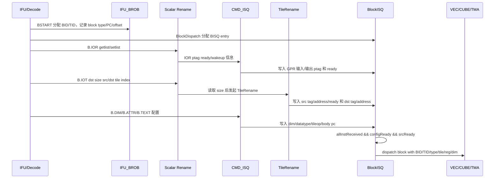
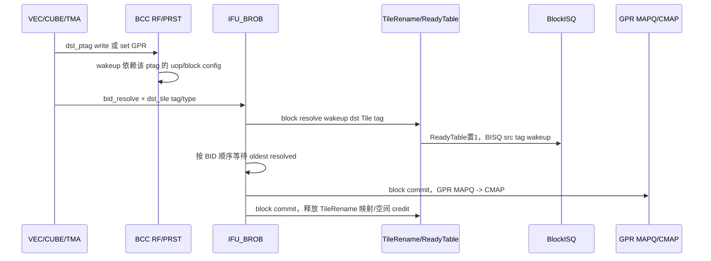
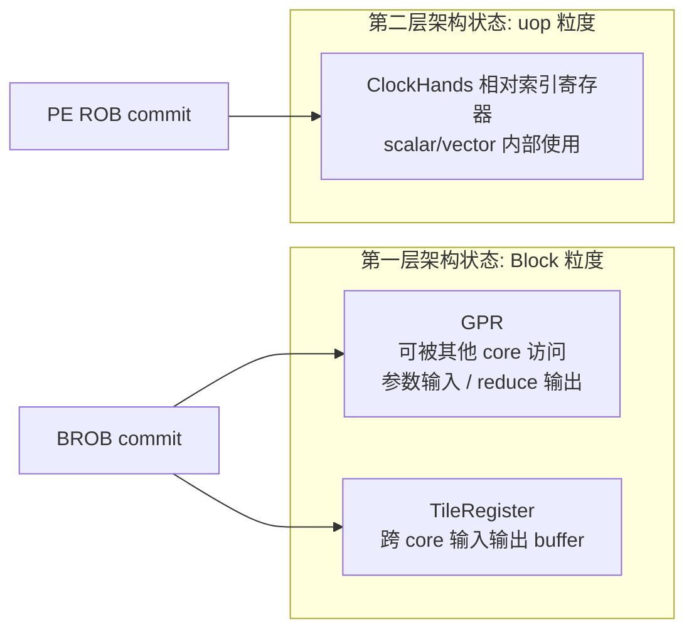

# BCC Architecture Overview

> **Document ID**: JCORE-BCC-AS-000
> **Version**: v0.1
> **Date**: 2026-05-14
> **Status**: Draft
> **Parent**: [JCore_BCC_AS.md](JCore_BCC_AS.md)
> **Topic**: BCC 顶层、块头路径、Tile/GPR 第一层状态、BROB/TileRename/BISQ 主链路

---

## Change Log

| Version | Date | Changes |
|---------|------|---------|
| v0.1 | 2026-05-14 | Initial architecture overview with mermaid diagrams |

---

## 1. 顶层定位

JCore BCC 负责块级控制、块头解析、跨 core 参数传递、TileRegister/GPR 第一层架构状态管理，以及向 Vector/Cube/TMA 等特殊执行单元 dispatch block。

BCC 中除 LSU 外的组件构成 BCC_IOE。BCC_IOE 的新增重点是:

- IFU 新增 BROB，用于接收 scalar_PE、VEC、CUBE、TMA 的 block resolve，维护 block 顺序 commit。
- IFU/PE 需要传递数据块块头微指令，包括 BSTART、B.TEXT、B.IOR、B.IOT、B.DIM、B.IOD。
- PE 新增 CMD_ISQ，用于块头微指令依赖解除和配置写入。
- PE 新增 TileRename，将 B.IOT 的相对 TileReg index 转换为 Tile tag 和物理 base address。
- PE 新增 BlockISQ/BISQ，完成 block 级 Tile/GPR/config 依赖解除，并按类型发给 Vector/Cube/TMA。
- RF 为特殊核 Get data 增加专用读口，为 Vector/TMA 写回增加专用写口。
- BROB 与 PE Rename 协同，将 GPR MAPQ 的提交从 PE ROB 切换到 block commit。

## 2. 顶层框图

DOT source: [diagrams/bcc_top.dot](diagrams/bcc_top.dot)

```mermaid
flowchart TB
  subgraph External["外部交互"]
    RIU["RIU<br/>CXB / msgbuf"]
    TH["TH_CTRL<br/>线程资源管理"]
    PMU["PMU_CTRL<br/>PMU事件汇聚"]
    INT["INT<br/>异常中断上报"]
    REG["REG_SLV<br/>寄存器访问"]
    L2["L2 Cache<br/>I/D miss"]
  end

  subgraph BCC["JCore BCC"]
    subgraph IFU["IFU"]
      FETCH["Fetch / Pred<br/>uBTB F1 / MainPred F4"]
      HBB["HBB<br/>Header Branch Buffer"]
      CT["IFU_CT<br/>C0/C1/C2"]
      IB["IBCT_INST_BUF<br/>STD + CT + Header"]
      BROB["IFU_BROB<br/>BID/TID / resolve / commit"]
    end

    subgraph PE["Scalar PE / BCC_IOE"]
      D1["D1/D2 Decode<br/>thread RR / header decode"]
      REN["Rename<br/>GPR MAPQ / ClockHands MAPQ"]
      CMD["CMD_ISQ<br/>2 write / 2 pick"]
      TR["TileRename<br/>T/U/M/N map + ReadyTable"]
      BISQ["BlockISQ<br/>Vector / Cube / TMA"]
      ROB["PE_ROB<br/>uop commit / flush"]
      RF["RF<br/>PRF/UTRF + special core ports"]
      BN["BN/EXE<br/>B.TEXT TPC / B.DIM +imm"]
    end

    LSU["LSU<br/>TBD in BCC AS"]
  end

  subgraph Cores["特殊核"]
    VEC["Vector Core"]
    CUBE["Cube Core"]
    TMA["TMA<br/>Tile Memory Access"]
  end

  REG --> BCC
  RIU <--> BCC
  TH <--> BCC
  PMU <-- BCC
  INT <-- BCC
  L2 <--> IFU
  L2 <--> LSU

  FETCH --> HBB
  FETCH --> CT
  CT --> IB
  HBB --> IB
  IB --> D1
  D1 --> REN
  REN --> CMD
  REN --> TR
  CMD --> BISQ
  TR --> BISQ
  BISQ --> VEC
  BISQ --> CUBE
  BISQ --> TMA
  VEC --> BROB
  CUBE --> BROB
  TMA --> BROB
  BROB --> TR
  BROB --> REN
  ROB --> FETCH
  BROB --> FETCH
```

## 3. 块头到 dispatch 的主路径

DOT source: [diagrams/block_header_dispatch.dot](diagrams/block_header_dispatch.dot)
WaveDrom timing source: [diagrams/block_header_pipeline.wavedrom.json](diagrams/block_header_pipeline.wavedrom.json)



## 4. 执行完成到提交的主路径

DOT source: [diagrams/brob_resolve_commit.dot](diagrams/brob_resolve_commit.dot)
WaveDrom timing source: [diagrams/resolve_commit_timing.wavedrom.json](diagrams/resolve_commit_timing.wavedrom.json)



## 5. 第一层与第二层架构状态



规则:

- GPR 是第一层架构状态，提交和释放由 BROB 的 block commit 管控。
- TileRegister 是第一层架构状态，dst Tile resolve 时可唤醒消费者，资源释放仍由 block commit 管控。
- 相对索引寄存器是第二层架构状态，仍由 PE ROB 的微指令 commit 管控。
- 因此 GPR MAPQ 与 ClockHands MAPQ 需要拆成两套。

## 6. 特殊核接口总览

| 接口 | 方向 | 说明 |
| --- | --- | --- |
| Dispatch | BCC -> VEC/CUBE/TMA | 推送 datatype、tileop、tile_src、tile_dst、reg_src_ptag、reg_dst_ptag，credit 流控 |
| Core req / Get src data | VEC/CUBE/TMA -> BCC RF | 根据 get_src_ptag 读取 RF，固定 latency，不被反压，需要 3 路独立读口 |
| Dst ptag write | VEC/TMA 等 -> BCC | 写回 dst ptag，并 wakeup 依赖 ptag 的指令 |
| Dst Tile resolve | VEC/CUBE/TMA -> BROB/TileRename | block resolve 时唤醒依赖 dst Tile tag 的 BISQ entry |
| BID resolve | VEC/CUBE/TMA -> BROB | 标记 block 执行完成，供 BROB 顺序 commit |
| BCC flush | BROB/PE_ROB -> VEC/CUBE/TMA | 清理特殊核内投机 block/uop 状态 |

## 7. 顺序与乱序边界

| 对象 | 是否允许乱序 | 原因 |
| --- | --- | --- |
| Vector block | 允许 | TileRegister 依赖在 BISQ 处显式表达并解除 |
| Cube block | 允许，但同一 ACC chain 内需按规则顺序 | Tile 依赖显式；Cube 只有一个计算单元，ACC chain 只区分逻辑依赖链 |
| TMA block | 不允许乱序下发 | 内部 memory 地址依赖未在 block 指令显式表达，store 不可回退，STQ/LID/SID 滑窗要求保序 |
| GPR MAPQ commit | 不允许乱序 | 第一层架构状态，BROB 按 BID 提交 |
| Tile resource release | 不允许乱序 | resolve 只负责 wakeup，release 必须等 block commit |

## 8. 性能与面积方向

原始材料保留了若干系统级目标:

- BCC 需要从系统性能视角提供调度能力，例如消除长尾效应。
- 需要支撑 SMT QoS 能力。
- 在满足需求下，BCC 面积需要极限压缩。
- 需要列出 BCC 核参数，作为面积裁剪输入。
- 需要评估 BCC 乱序能力裁剪与面积收益。
- 需要建模特殊核 issue block 能力，以及打满 SMT 的能力。
- 需要将 GET data 时延纳入建模。
