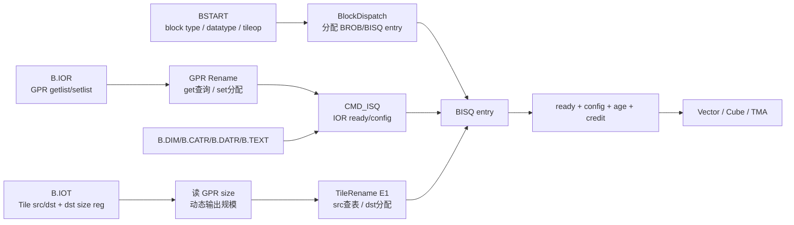
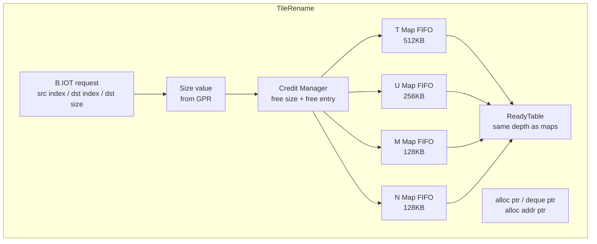
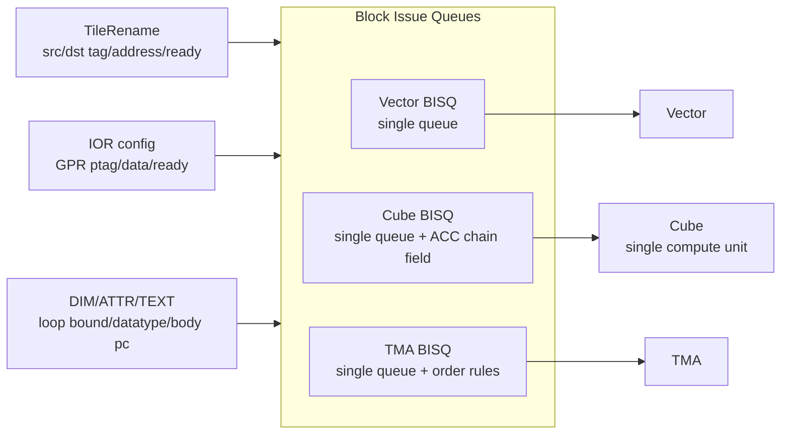
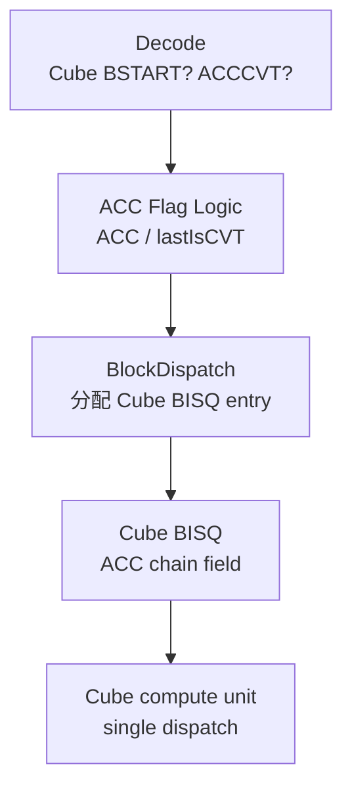
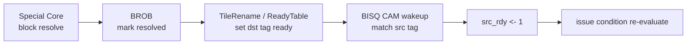

# BCC TileRename / BlockRename / BlockISQ

> **Document ID**: JCORE-BCC-AS-001A
> **Version**: v0.2
> **Date**: 2026-05-14
> **Status**: Draft
> **Parent**: [JCore_BCC_AS.md](JCore_BCC_AS.md)
> **Keywords**: B.IOR, B.IOT, TileRename, Tile tag, ReadyTable, BISQ, Cube ACC Flag, TMA 顺序发射

---

## Change Log

| Version | Date | Changes |
|---------|------|---------|
| v0.1 | 2026-05-14 | Initial split from source notes |
| v0.2 | 2026-05-14 | Expanded into AS-style structure with flow diagrams, entry fields, issue rules and CA checklist |

---

## 1. 概述

JCore 将 buffer 当作寄存器管理，称为 Tile Register。BCC 的标量 GPR 寄存器也可以被其他 core 访问，用于 block 参数输入或 reduce 输出。

多个 core 之间的输入输出由两类资源承载:

- TileRegister
- GPR

这两类资源构成第一层架构状态，由 IOE 中的 BlockRename、BlockISQ、BlockROB 负责分配、索引、依赖解除和释放。

下游执行核收到 block 时需要以下信息:

| 信息 | 用途 |
| --- | --- |
| block body PC + offset | 指示块体指令从哪里取 |
| LB0/LB1/LB2 | 决定迭代次数、循环上限或数据维度 |
| GPR 参数 ptag | block 输入/输出 GPR 形参 |
| TileReg src 起始地址 | 下游读取 TileRegister 输入 |
| TileReg dst 起始地址 | 下游写回 TileRegister 输出 |
| Tile tag / type / ready | BISQ 内部和后续 block 之间做 Tile 依赖解除 |
| BID/TID/type | BROB 顺序提交和特殊核回报 |

## 2. 块头与 TileRename/BISQ 主流程

DOT source: [diagrams/block_header_dispatch.dot](diagrams/block_header_dispatch.dot)
WaveDrom timing source: [diagrams/block_header_pipeline.wavedrom.json](diagrams/block_header_pipeline.wavedrom.json)



流水位置:

| 流水级 | 主要动作 |
| --- | --- |
| Decode / BlockDispatch | 解码 BSTART，分配 BROB/BISQ entry，记录 BID/TID/type/PC 等 |
| Rename | B.IOR 对 getlist/setlist 做 GPR rename |
| E1 | B.IOT 完成 TileReg rename，查询 src、分配 dst |
| E2 | TileOP dispatch，写入 BISQ；ReadyTable 查询得到 src ready 初值 |
| Issue | BISQ 根据 src ready、configReady、allInstReceived、age、credit 发射 |

## 3. B.IOR: GPR 参数重命名

B.IOR 以微指令格式给出，最多三个源操作数和一个目的操作数。IOR 中的输入参数可以由重复的架构寄存器表达。

示例关系:

```text
arg0 -> a1
arg1 -> s1
arg2 -> a2
arg3 -> a1
arg4 -> x1
```

含义:

- `arg0` 和 `arg3` 可以同时来自 `a1`。
- BCC 需要保留形参序，不可因为架构寄存器重复就合并掉形参槽位。
- Vector block 使用 Uniform register 接受来自 BCC 的 GPR 值。
- 在 vector block 块头执行前，vector 展开 get，将 GPR 值读至 Uniform register。

B.IOR rename 动作:

1. getlist: 查询 GPR 当前映射到的物理寄存器 ptag。
2. setlist: 为输出 GPR 分配新的物理寄存器 ptag。
3. 将 reg_src_ptag、reg_dst_ptag 写入对应 BISQ entry。
4. 对尚未 ready 的 ptag，等待 PRST/RF wakeup。
5. 对其他 core 在途读，维护 read counter / resolve counter，支撑 SAFE/LTPR 释放判断。

CMD_ISQ 与 B.IOR:

- `cmd_isq_pipx` 处理 B.IOR。
- B.IOR src ready 后直接写入记录的 BlockISQ entry index。
- 该 pipe 不需要读口。
- 多条 B.IOR 为保持 IOR0、IOR1、IOR2 顺序，在写 CMD_ISQ 时也写 BlockISQ。
- CMD_ISQ 对 IOR 的 pick 主要用于 BISQ `wake_up_num` 或 config counter 判断。

## 4. B.IOT: Tile 输入输出描述

B.IOT 描述 TileOP 的输入 TileRegister、输出 TileRegister，以及输出 TileRegister 的 size。输出 size 可以由立即数或寄存器动态表示。

处理流程:

1. BCC 从 GPR 中读出 dst TileReg 需要分配的空间大小。
2. B.IOT 按顺序进入 TileRename。
3. TileRename 查询 src TileReg 映射表，得到 src tag、src 起始地址、ready 初值。
4. TileRename 根据 dst size 为 dst TileReg 分配映射表项和连续 TileRegister 空间。
5. TileRename 将 src/dst tag、地址、ready 写入 BISQ。
6. 后续由 BlockISQ 完成 Tile 输入输出的依赖解除。

顺序要求:

- 不同 TileOP 按顺序进行重命名。
- 多条 B.IOT 必须顺序 pick，并对应顺序写入 BlockISQ。
- TileRename 因映射表项不足或剩余空间 credit 不足时，反压 CMD_ISQ/前级。

软件语义:

- 软件仍需要内存语义。
- 寄存器不足时软件应做 spill。
- 需要额外 TileRegister 空间时，软件应显式指示所需额外空间。
- 例如 TMUL 需要 7KB TileRegister，其中 4KB 可用于最终输出，3KB 可用于 TileOP 执行时的 spill 和读回。

## 5. TileRename 微架构

DOT source: [diagrams/tilerename_bisq.dot](diagrams/tilerename_bisq.dot)
CMD_ISQ / TileRename backpressure timing source: [diagrams/cmd_isq_tilerename_timing.wavedrom.json](diagrams/cmd_isq_tilerename_timing.wavedrom.json)

TileRename 使用 Clock Hands 管理 TileReg 空间和映射关系。TileReg 分为 T/U/M/N 四个 hand。



空间划分:

| Tile type | 地址高位编码 | 空间 |
| --- | --- | --- |
| T | `00` | 512 KB |
| U | `01` | 256 KB |
| M | `10` | 128 KB |
| N | `11` | 128 KB |

映射表项:

| 字段 | 含义 |
| --- | --- |
| `valid` | 表项是否有效 |
| `offset` | 起始 offset |
| `size` | 占用空间，size=1 代表 128B |
| `pipe` | 可将分配空间仲裁到特定 pipe，初版暂不考虑 |
| `tid/bid` | 可选，用于 flush/release 定位，具体实现待定 |

ReadyTable:

- entry 与 TileRename 映射表 entry 一一对应。
- 映射表 entry index 作为 Tile tag / Ttag。
- dst TileReg 分配后 ready 初值为 0。
- block resolve 时，BROB/TileRename 将 dst tag ready 置 1。
- BISQ 中等待该 tag 的 src ready 同步被 wakeup。

## 6. Tile tag 依赖解除示例

原始 Tile 操作:

```text
MAMULB T#1, U#1 -> T
```

TileRename 后在 BISQ 中存储:

```text
MAMULB Ttag12, Utag29 -> Ttag13
```

含义:

- `Ttag12` 是 src T#1 映射表 entry index。
- `Utag29` 是 src U#1 映射表 entry index。
- `Ttag13` 是 dst T 的新映射表 entry index。
- ReadyTable 维护 tag12/tag29/tag13 的 ready。
- 当生产 tag12/tag29 的 block resolve 后，BISQ 中对应 src ready 被置 1。
- 当前 block 执行完成并 resolve 后，tag13 ready 被置 1，唤醒后续消费者。

## 7. 地址格式与空间分配

地址共 21 位:

```text
addr[20:19] = Reg Type
  T: 00
  U: 01
  M: 10
  N: 11

addr[18:0] = allocate pointer / offset
```

分配规则:

- BCC 对 Tile 做重命名时，根据 dst size 连续分配一块空间。
- 映射表记录 offset 和 size。
- src Tile 重命名时，从映射表读取起始地址。
- 分配和释放时维护 TileReg size credit。
- 当所需 size 大于剩余 size 时，TileRename stall。
- 当 dst TileReg 映射表项不足时，TileRename stall。
- 分配地址空间在各 partition 区域中可卷绕。
- 当前 CA 暂时按 TileRename 内部不卷绕实现；后续若开启卷绕，Vector 内地址计算需同步修改。

空间跨 pipe 分配示例:

```text
给 T 寄存器从 offset=0 开始分配 size=9:

0: pipe0[2047:0]
1: pipe1[2047:0]
2: pipe2[2047:0]
3: pipe3[2047:0]
4: pipe4[2047:0]
5: pipe5[2047:0]
6: pipe6[2047:0]
7: pipe7[2047:0]
8: pipe0[4095:2048]
```

## 8. BlockISQ / BIQ 总览

BIQ 中包括三类 Issue Queue:

| Queue | 下游 PE | 接收 block |
| --- | --- | --- |
| Vector BISQ | Vector Core | VCALL 类型块 |
| Cube BISQ | Cube Core | Cube 计算块 |
| TMA BISQ | TMA | TLOAD/TSTORE/TCOPY/MCALL 类型块 |



通用发射条件:

1. Tile Src ready: 所有 src TileReg 已经就绪。
2. allInstReceived: 该 block 的 bstart、b.iot、b.ior、b.dim、b.attr 等配置微指令已全部解码/接收。
3. configReady: 配置项已写入 BISQ。配置指令解码时 counter +1，从 CMD_ISQ 写入 BISQ 时 counter -1。
4. IOR / GPR ready: GPR 输入 ptag ready 或输入数据已配置完成。
5. Downstream credit: 下游执行 PE 可接收请求。

发射方式:

- 在 ready 前提下，按 Age Matrix 先入先出发射。
- 当下游 PE 可接收时，每个 BIQ 每拍最多发射一条指令。
- 发射信息包括 BID、TID、type、Tile Reg src0/1/2/3 tag、TileReg 地址、src ready、dst 地址、DIM 等。
- 执行核完成后返回 response 和相关 resolve 信息。

Flush/Replay:

- BIQ 支持 flush。
- BIQ 接收 BROB 的 flush 请求，清除无效投机 TileOP。
- 下游 PE 向 BROB 返回 TileOP resolve 标记时，同时根据 TileReg ID/tag wakeup BISQ 中等待的 TileReg src。

## 9. 为什么 TMA 需要顺序下发

Vector 和 Cube block 可以乱序发射，因为它们的 memory 依赖，即 TileRegister 依赖，已经在 BIQ 处消解。块与块之间不会存在隐式 LD-ST violation。

TMA 访存单元不允许乱序下发，原因:

- TMA 内部 memory 访存指令之间的地址依赖没有在指令中显式表达。
- 不同 block 之间可能存在隐含 LD-ST 依赖。
- 硬件无法在不同 block 间乱序提交或释放非最老 block 的最老微指令。
- 若要支持乱序，需要保留所有未提交指令用于识别 LD-ST violation，硬件代价大。
- Memory 更改后无法回退，因此 store 写 memory 也需要保序执行。
- 指令还需要保序解析，否则 STQ 滑窗无法正确维护，可能导致死锁。
- 该约束同样适用于 LID。
- PE 需要顺序下发 block，以正确标识 SID。

## 10. BISQ entry 中 Tile 字段

| 字段 | 含义 |
| --- | --- |
| `dst_vld` | 该 block 是否有 dst TileReg |
| `dst_hand` | dst 写 T/U/M/N 哪个 hand |
| `dst_tag` | dst TileReg tag，对应 TileRename 映射表 index |
| `dst_addr` | dst TileReg 起始地址 |
| `src0_vld` | src0 TileReg 是否有效 |
| `src0_hand` | src0 属于 T/U/M/N 哪个 hand |
| `src0_tag` | src0 TileReg tag |
| `src0_addr` | src0 TileReg 起始地址 |
| `src0_rdy` | src0 TileReg 是否 ready |
| `src1_vld` | src1 TileReg 是否有效 |
| `src1_hand` | src1 属于 T/U/M/N 哪个 hand |
| `src1_tag` | src1 TileReg tag |
| `src1_addr` | src1 TileReg 起始地址 |
| `src1_rdy` | src1 TileReg 是否 ready |
| `src2_vld` | src2 TileReg 是否有效 |
| `src2_hand` | src2 属于 T/U/M/N 哪个 hand |
| `src2_tag` | src2 TileReg tag |
| `src2_addr` | src2 TileReg 起始地址 |
| `src2_rdy` | src2 TileReg 是否 ready |
| `src3_vld` | src3 TileReg 是否有效 |
| `src3_hand` | src3 属于 T/U/M/N 哪个 hand |
| `src3_tag` | src3 TileReg tag |
| `src3_addr` | src3 TileReg 起始地址 |
| `src3_rdy` | src3 TileReg 是否 ready |

E2 处查询 ReadyTable 获取 src ready 初值。如果 E2 时 src 尚未 ready，则在 BISQ 中等待 wakeup。

## 11. Cube BISQ

Cube 只有一个计算单元，不存在多个物理计算 pipe。ACC Flag / ACC chain 只用于区分逻辑依赖链: 不同乘累加链的 Cube TileOP 可携带不同 ACC chain 标识，以便在单一 Cube dispatch/compute 资源上维护各自的链内顺序和 credit。



BlockDispatch 规则:

1. Decode 解出两个信号:
   - 是否是 Cube block 的 bstart。
   - 是否是 ACCCVT。
2. 如果是 Cube block 的 BSTART:
   - 根据 `lastIsCVT` 选择 ACC Flag 或 ACC Flag 取反。
   - `lastIsCVT == 1`: 选择 `!ACC Flag`。
   - `lastIsCVT == 0`: 选择 `ACC Flag`。
   - 如果 BSTART 是 ACCCVT 的 BSTART，将 `lastIsCVT` 置 1，否则清 0，下拍可见。
   - 如果 `lastIsCVT == 1`，将 ACC Flag 取反。
3. 如果是 Cube block 的其他块头指令:
   - 如果同拍前面有相同 block 的 BSTART，获取该 BSTART 的 ACC Flag。
   - 例如 `BSTART / B.DIM / B.DIM / B.IOT` 同拍，且当前 `ACC Flag == 1 && lastIsCVT == 1`，则 BSTART 获取的 Block ACC Flag 为 `!ACC Flag == 0`，后续 B.DIM/B.IOT 也应获取 0。
   - 如果同拍前面没有 BSTART，直接获取 ACC Flag 当前值。
4. 同拍不会出现两个 Cube BSTART，因为取指位宽为 4，块头大于四条。

Cube 发射条件:

1. Tile src ready。
2. allInstReceived。
3. configReady。
4. 同一 ACC chain 内 TileOP 顺序发射。
5. Cube 只有一个 dispatch/compute slot，因此所有 ACC chain 共享 Cube 发射带宽。
6. 维护 Cube 前端每个逻辑乘累加链的 req buffer credit，发射时该 ACC chain 对应 credit > 0。目前每个逻辑链各 8 深。

## 12. Vector BISQ

Vector BISQ 是单 queue，采用基本 BISQ 结构。

接收:

- VCALL 类型 block。

发射条件:

1. Tile src ready。
2. allInstReceived。
3. configReady。
4. 下游 Vector 可接收。

Vector block 允许乱序发射。原因是 Vector 的所有 memory 依赖都已经用 Tile tag 显式表达，并在 BISQ 处解除。

## 13. TMA BISQ

TMA BISQ 是单 queue，采用基本 BISQ 结构。entry 域段中包含 B.IOR 的输入 data。

接收:

- TLOAD
- TSTORE
- TCOPY
- MCALL

发射条件:

1. Tile src ready。
2. allInstReceived。
3. configReady。
4. TLOAD/TSTORE 需要位于滑窗范围内:
   - `ld_id < youngest_ld_id`
   - 或 `st_id < youngest_st_id`
5. TCOPY 需要 `credit > 0`。
6. MCALL 顺序发射。
7. VCALL/MCALL 模式切换时，MCALL 必须为最老 block 才能发射。

注意:

- TMA 不仅看 Tile ready，还必须维护内存顺序语义。
- 对于 TLOAD/TSTORE，滑窗维护决定是否可以下发。
- 对于 MCALL，存在模式切换和最老块约束。

## 14. Config counter / configReady

configReady 以 config counter 承载:

```text
配置微指令 decode/进入队列时: counter + 1
配置微指令从 CMD_ISQ 写入 BISQ 时: counter - 1
counter == 0 且 data type / GPR / DIM 等已写入: configReady = 1
```

包括:

- BSTART 写入 data type、tileop、block type。
- B.IOR 在寄存器就绪时写入 ready 和 ptag。
- B.IOT 写入 Tile src/dst tag/address/ready。
- B.DIM 写入 dimension。
- B.CATR 写入 block 控制属性，B.DATR 写入 block 数据属性。
- B.TEXT 写入块体 PC。

configReady 等价于 data type 已写入、GPR 输入已就绪、Dimension 信息已配置等多个条件的组合。

## 15. Wakeup 通路



Tile wakeup:

- 下游 PE 返回 block resolve。
- BROB 根据 BID 找到 dst tile tag/type/tid。
- TileRename/ReadyTable 将对应 tag ready 置 1。
- BISQ 对 src tag 做匹配，命中后 src ready 置 1。

GPR wakeup:

- 特殊核写 dst ptag。
- PRST/RF wakeup 依赖该 ptag 的指令。
- B.IOR 配置若依赖该 ptag，也需要在 CMD_ISQ/BISQ 中更新 ready。

## 16. Stall 与反压

TileRename stall 来源:

- dst TileReg 映射表项不足。
- 对应 T/U/M/N hand 剩余空间 credit 不足。
- B.IOT 必须顺序 rename，head 阻塞会反压后续 B.IOT。
- TileRename head flop 反压 `cmd_isq_pipy`。

BISQ stall 来源:

- BISQ entry 不足。
- block 配置未收齐。
- src Tile 未 ready。
- GPR 输入未 ready。
- 下游 credit 不足。
- TMA 顺序或滑窗条件不满足。
- Cube 对应乘累加链 req buffer credit 不足。

## 17. CA 实现要点

TileRename:

- 分 T/U/M/N 四个 FIFO/hand。
- 内部实现剩余物理资源 credit 维护。
- 维护 alloc ptr、deque ptr、alloc addr ptr。
- 映射表记录 valid、offset、size、pipe 等字段。
- ReadyTable 与映射表 entry 对齐。
- Tile tag 使用映射表 index。
- 实现 TileRename 后指令格式和 wakeup 通路。
- 实现地址高两位类型编码和低 19 位 offset/allocate pointer。
- 当前先按内部不卷绕实现。
- 后续如支持卷绕，Vector 内地址计算必须同步改动。

B.IOR:

- 支持形参重命名。
- 支持重复 GPR 输入参数。
- setlist 分配新 ptag。
- getlist 查询当前 ptag。
- 与 GPR read counter / resolve counter / SAFE 释放判断对齐。

BISQ:

- Vector/Cube/AGU 三类 BISQ。
- 统一 allInstReceived、configReady、Tile ready、GPR ready 判断。
- Vector/Cube 支持乱序 issue。
- TMA 顺序 issue。
- Cube 实现 ACC Flag / lastIsCVT / ACCCVT pipe 选择逻辑。
- AGU 实现 TLOAD/TSTORE 滑窗、TCOPY credit、MCALL 最老块约束。
- Flush/Replay 清除无效投机 TileOP。
