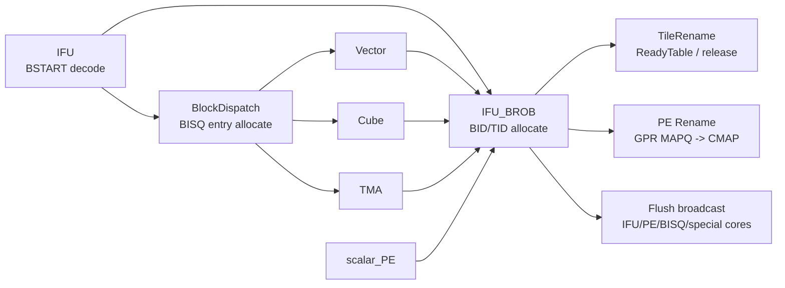
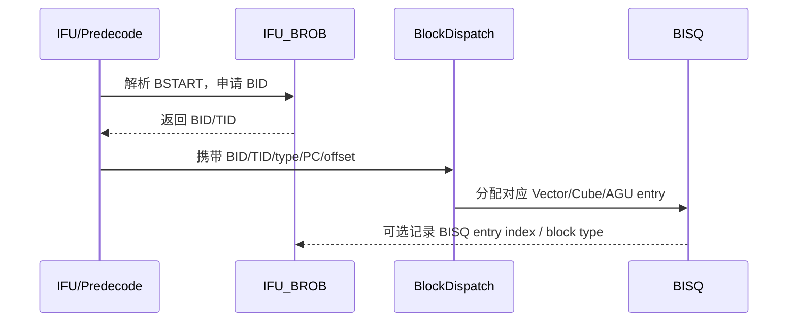
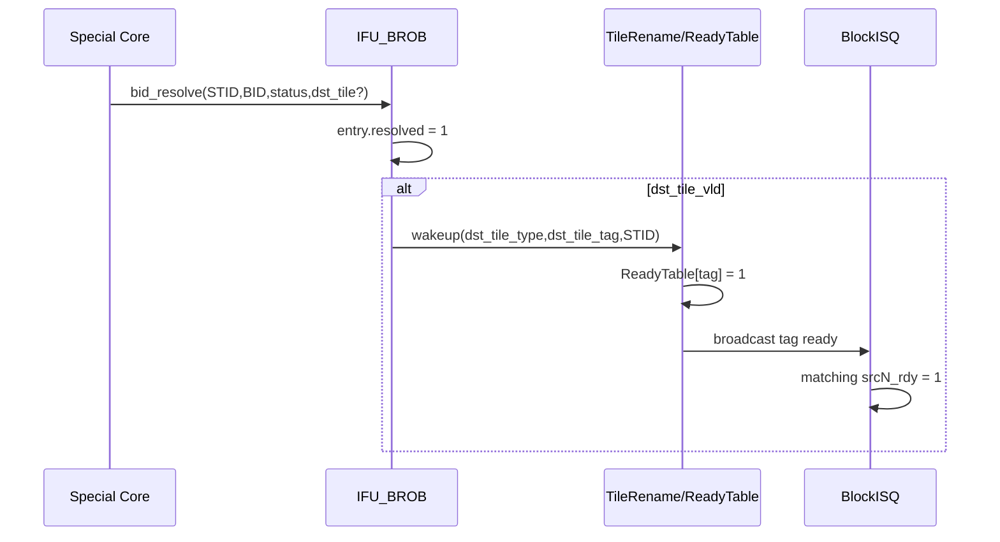
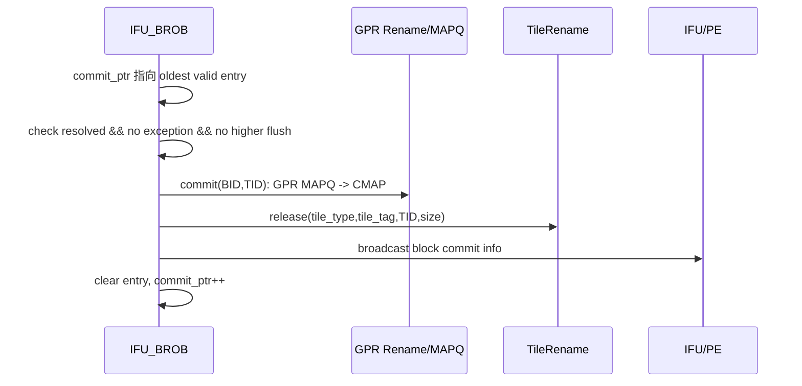
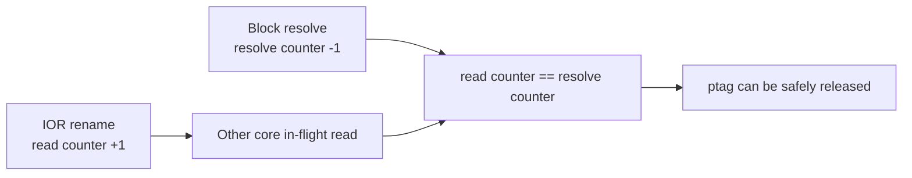
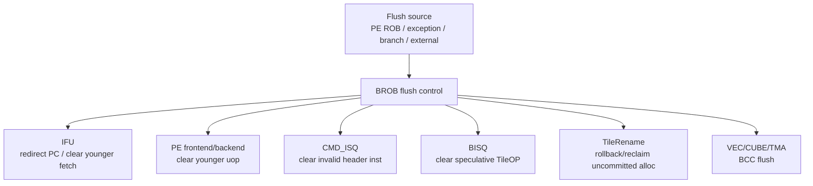

# BCC BROB

> **Document ID**: JCORE-BCC-AS-002
> **Version**: v0.2
> **Date**: 2026-05-14
> **Status**: Draft
> **Parent**: [JCore_BCC_AS.md](JCore_BCC_AS.md)
> **Keywords**: IFU_BROB, BID, TID, block resolve, block commit, GPR CMAP, Tile wakeup, Tile release

> **Canonical identity rule:** each STID owns an independent BROB ring;
> `BROB_ENTRIES=256` by default and
> `BID_W=ceil(log2(BROB_ENTRIES))` (default 8). Shared interfaces carry
> `(STID,BID)` and determine age from that ring's head/tail/wrap state, never
> from unsigned BID magnitude.

---

## Change Log

| Version | Date | Changes |
|---------|------|---------|
| v0.1 | 2026-05-14 | Initial split from source notes |
| v0.2 | 2026-05-14 | Expanded BROB lifecycle, resolve/commit timing, MAPQ/CMAP and recovery sections |

---

## 1. 定位

IFU_BROB 是 BCC 中负责 block 顺序提交的结构。它在 IFU 分配 BID 时记录 BID/TID，接收来自 scalar_PE、VEC、CUBE、TMA 的 resolve 信息，并通过 commit pointer 维护 block 的顺序 commit。

BROB 管控第一层架构状态:

- GPR: block commit 时通知 scalar PE，将 GPR MAPQ 中对应 BID 的 entry 搬移到 CMAP，并触发 global ptag 状态更新。
- TileRegister: block resolve 时 wakeup dst Tile tag；block commit 时释放 TileRename 映射表项和 TileReg 空间 credit。

相对索引寄存器属于第二层架构状态，仍由 PE ROB 的微指令 commit 管理。

## 2. BROB 在系统中的位置

DOT source: [diagrams/brob_resolve_commit.dot](diagrams/brob_resolve_commit.dot)
WaveDrom timing source: [diagrams/resolve_commit_timing.wavedrom.json](diagrams/resolve_commit_timing.wavedrom.json)

## 3. 基本职责

BROB 负责:

1. 分配和维护 BID。
2. 记录 BID 所属 TID。
3. 记录 block type、PC/offset、下游目标核等信息。
4. 记录 block 的 dst Tile tag/type，用于 resolve wakeup 和 commit release。
5. 接收 scalar_PE、VEC、CUBE、TMA 的 block resolve。
6. 每个 STID 按 BROB live-ring head/age 顺序 commit block。
7. 在 block commit 时驱动 GPR MAPQ -> CMAP。
8. 在 block commit 时驱动 TileRename 释放资源。
9. 在 flush/replay 时广播到特殊核、BIQ/BISQ、TileRename、PE front/backend。

## 4. Entry 字段建议

具体位宽需与 RTL/性能模型定稿。根据原始材料，BROB entry 至少需要以下信息:

| 字段 | 含义 |
| --- | --- |
| `valid` | entry 有效 |
| `stid` | 独立 BROB ring / 线程上下文 |
| `bid` | `BID_W`-bit BROB entry index |
| `block_type` | scalar / vector / cube / agu / mtc 等 |
| `body_pc` | 块体起始 PC，来自 B.TEXT/BSTART 相关信息 |
| `offset` | 块体 offset 或跳转 offset |
| `resolved` | 下游执行核已返回 block resolve |
| `exception` | block 是否携带异常或需要 flush |
| `flush_vld` | 该 entry 是否触发/处于 flush 处理 |
| `dst_tile_vld` | 是否有 dst TileReg |
| `dst_tile_type` | T/U/M/N |
| `dst_tile_tag` | TileRename 映射表 tag |
| `dst_tile_size` | dst TileReg size，可用于 release credit |
| `gpr_mapq_base` | 对应 GPR MAPQ 范围起点，或由 BID 间接索引 |
| `gpr_mapq_count` | 对应 GPR MAPQ entry 数 |
| `ior_read_count_delta` | IOR 读计数相关信息，若集中在 MAPQ/rename 可不放 BROB |

## 5. 分配流程

分配时机:

- IFU 解析到 block 起始信息时分配 BID。
- BlockDispatch 在 Rename 附近为 block 分配 BISQ entry。
- 后续 B.IOR/B.IOT/B.DIM/B.TEXT 携带 BID 或 BISQ entry index，对同一个 BISQ entry 补配置。

## 6. Resolve 流程

关键语义:

- TileReg 的消费者只需要等待生产 block resolve，不需要等待生产 block commit。
- resolve 是数据可用点，commit 是架构状态提交和资源释放点。
- BROB 在 resolve 时不能释放 TileRename entry，否则 younger block 依赖恢复或 flush 精确性会被破坏。

## 7. Commit 流程

commit 条件:

1. commit pointer 指向 entry valid。
2. entry 已 resolved。
3. entry 不存在未处理异常。
4. 不存在优先级更高的 flush。
5. 满足 block 顺序提交规则。

commit 后动作:

- scalar PE 根据 BID 将 GPR MAPQ entry 搬移到 CMAP。
- TileRename 释放对应 Tile type/tag/tid 的映射表项和空间 credit。
- BROB entry 出队或清 valid。
- commit 信息可广播给 scalar PE 和相关 DFX/PMU 逻辑。

## 8. Resolve 与 Commit 的时间点差异

| 资源 | 数据可用/wakeup 时间点 | 架构提交/释放时间点 | 原因 |
| --- | --- | --- | --- |
| GPR dst ptag | 特殊核写 dst ptag 后 wakeup | BROB block commit 时 MAPQ -> CMAP | GPR 是第一层架构状态，需要 block 顺序提交 |
| TileReg dst tag | block resolve 时 ReadyTable 置 ready | BROB block commit 时释放 TileRename 资源 | Tile 数据可被后续 block 使用，但资源回收必须保持精确状态 |
| ClockHands 相对寄存器 | uop resolve/wakeup | PE ROB 微指令 commit | 第二层架构状态，不由 BROB 管控 |

## 9. GPR MAPQ / CMAP 提交关系

JCore BCC 中:

- GPR 作为第一层架构状态，在 block commit 时释放资源。
- 相对索引寄存器作为第二层架构状态，在微指令 commit 时释放资源。

因此 PE_rename 需要拆分 MAPQ:

| MAPQ | 管控者 | 提交粒度 | 内容 |
| --- | --- | --- | --- |
| GPR MAPQ | BROB | block commit | B.IOR setlist / block 输出 GPR |
| ClockHands MAPQ | PE ROB | uop commit | 相对索引寄存器映射 |

与 KV500 的差异:

- KV500 架构状态多，SMT8 约 192 个架构寄存器，投机深度浅，约 50 个。
- JCore 架构状态相对少，SMT4 约 96 个架构寄存器，但投机 block 深度更深，估计约 100-200。
- 只针对 CMAP 做释放可能效果较差。
- 对投机状态寄存器做释放需要更改 MAPQ，面积/收益待评估。

## 10. SAFE / LTPR / read counter

LTPR 属于 option 特性，需要结合性能仿真结果决策。原始材料中保留以下约束:

- SAFE 状态不仅要满足原本 insafe 条件，还要考虑其他 core 的在途读。
- 如果某 ptag 被其他 block 通过 IOR 读取，则该 ptag 不能过早释放。
- ptag 的 read counter 在 IOR rename 时 +1。
- 如果寄存器值在 SRAM 上，需要在 IOR rename 时搬入。
- block resolve 时，该 block 对应寄存器的 resolve counter -1。
- 当 read counter == resolve counter 时，该寄存器才进入可安全释放状态。

需要进一步明确:

- read counter 和 resolve counter 存放位置: BROB、GPR MAPQ、PRST，还是单独表。
- 计数粒度: ptag、BID、TID，还是 IOR slot。
- block flush 时 counter 如何恢复。

## 11. Flush / Replay

BROB 需要参与和广播 flush:

flush 影响:

- 清理无效投机 TileOP。
- 清理 CMD_ISQ 中对应 younger block 的块头配置。
- 清理 BISQ 中 younger block entry。
- 通知特殊核按 `flush_stid` 和该 BROB ring 的 kill mask 丢弃在途状态，
  不使用 BID 数值“之后”关系。
- 配合 scalar PE 恢复 GPR MAPQ/CMAP 状态。
- 配合 TileRename 回收被 flush block 分配但未 commit 的 TileReg 映射和空间。

待定点:

- flush 粒度是 block、ROB group，还是更细粒度。
- TileRename 回滚结构是 checkpoint、walk 回收，还是按 BID 标记回收。
- BROB 与 PE ROB 同拍 flush/commit 优先级。
- block resolve 与 flush 同拍冲突仲裁。
- 特殊核内部已发出但未完成 memory side effect 的处理边界。

## 12. 与特殊核接口

| 接口 | 方向 | BROB 相关行为 |
| --- | --- | --- |
| Dispatch | BCC -> core | 发射时携带 BID/TID/type 等，供后续 resolve |
| Get src data | core -> BCC RF | GPR 参数读取不直接进入 BROB，但影响 read counter/SAFE |
| Dst ptag write | core -> BCC | 写回 GPR ptag 并 wakeup，commit 仍等 BROB |
| Dst Tile resolve | core -> BROB/TileRename | BROB 标记 resolve 并 wakeup Tile tag |
| BID resolve | core -> BROB | block resolved，参与顺序 commit |
| BCC flush | BROB -> core | 清理投机 block |

## 13. BROB 与 PMU/DFX

原始材料提到需要新增资源的 DFX/PMU 提取，建议 BROB 至少提供:

- BROB full / almost full stall。
- block resolve latency。
- block commit latency。
- resolve-to-commit 等待时间。
- Tile resource stall 归因。
- GPR MAPQ commit stall 归因。
- Vector/Cube/TMA 各类 block in-flight 数。
- flush 次数、flush 来源、flush 清理 block 数。
- 特殊核 dispatch credit stall。
- GET data 时延统计。

## 14. CA 实现要点

- IFU_BROB 分配 BID 时记录 BID/TID。
- BROB 接收 scalar_PE、VEC、CUBE、TMA 的 resolve。
- BROB commit pointer 维护 block 顺序提交。
- block resolve 时触发 dst Tile tag wakeup。
- block commit 时触发 TileRename 资源释放。
- block commit 时驱动 scalar_PE GPR MAPQ -> CMAP。
- BROB flush 需覆盖 BIQ/BISQ、TileRename、特殊核在途请求和 GPR 投机状态。
- GPR MAPQ 与 ClockHands MAPQ 拆分。
- LTPR/SAFE/read counter 作为 option，需要结合性能仿真和面积评估。
