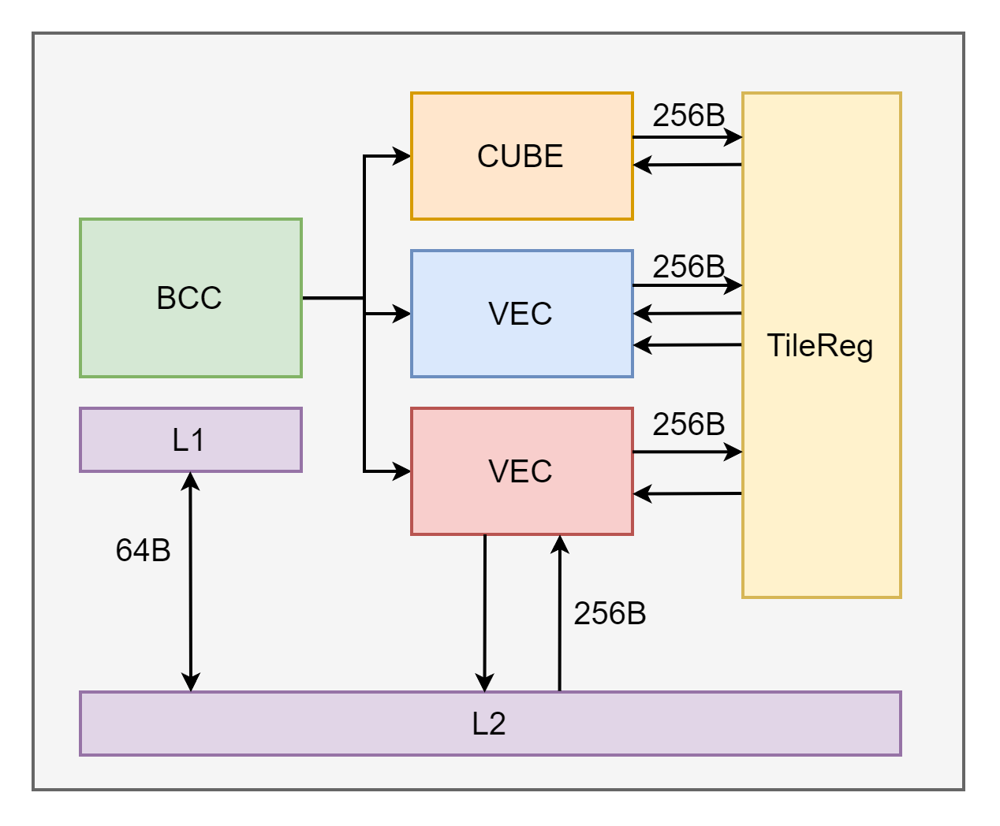
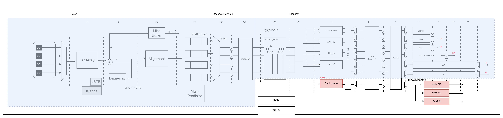
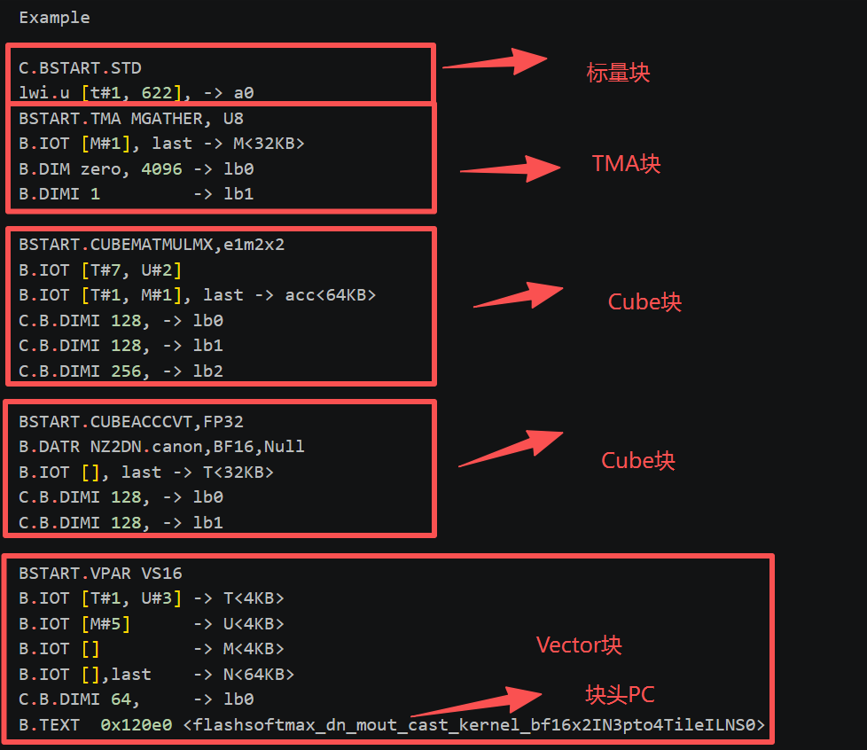
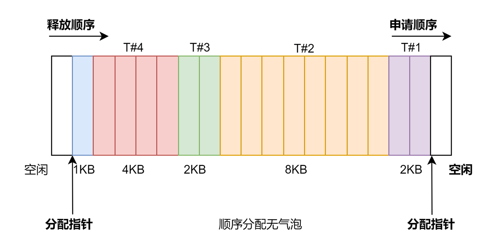
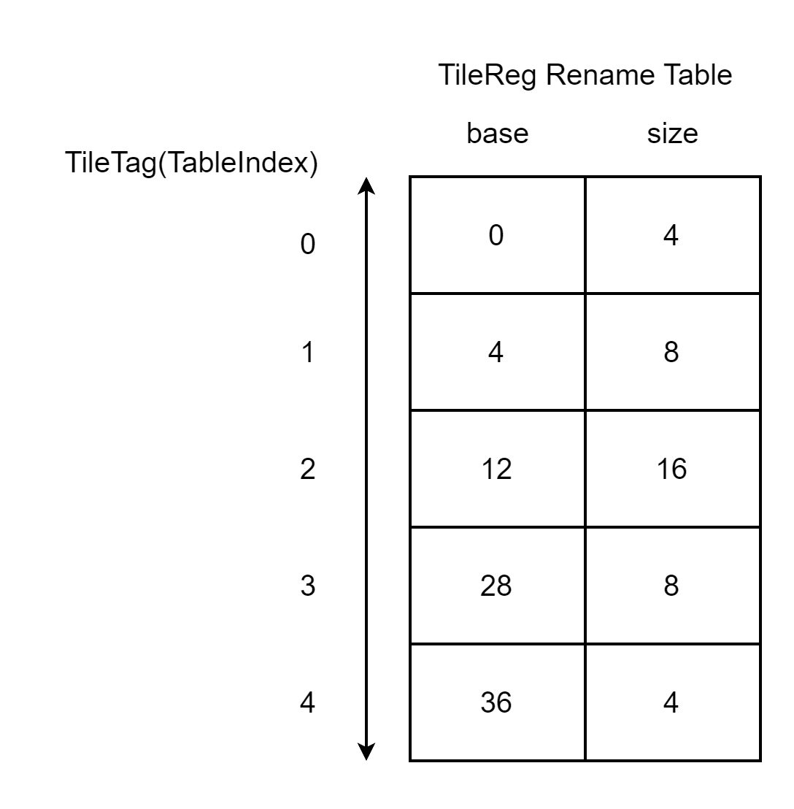
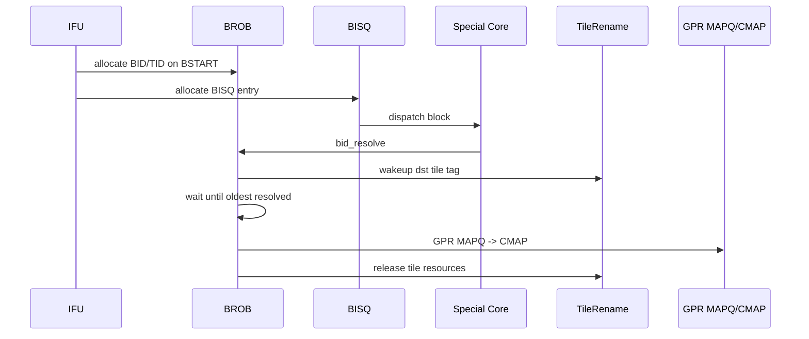

# Janus BCC SMT OoO Pipeline Architecture Specification

> **Document ID**: JCORE-BCC-AS-001
> **Version**: v0.1-pipeline
> **Date**: 2026-06-08
> **Status**: Draft
> **Change Point**: Focus on the BCC SMT/OoO pipeline and scalar execution path
> **Source**: Forked from the existing BCC architecture notes and narrowed to Chapters 1-8
> **Dependencies**: TMU-Core interface specification, Vector Core AS, Vector OOO AS, Vector TileLSU AS

> **Canonical-stage crosswalk:** This draft preserves historical/local stage
> labels in Chapter 8 for provenance; they are not the LinxCore pipeline
> contract. Apply `pipeline-stage-catalog.md`: F0 is thread/PC control;
> F1-F3 are cache request, return/ECC, and instruction assembly; historical
> F4 plus F5/CT/pred_buf/INST_BUF behavior converges into canonical F4/IB;
> historical D0/R0/R1/D2/I0/E0/W0/C0 labels map by function into canonical
> D1-D3, S1-S3, P/I/E/W, and R0-R4. Canonical CMT/FLS publish at R2 and restart
> state publishes at R4. Do not use this draft to create a serial F4 -> F5/IB
> architectural pipeline.
> Historical `BID/TID` on a shared block path means canonical `(STID,BID)`;
> PE/engine-local TID is a separate subordinate qualifier.

---

## Change Log

| Version | Date | Changes |
|---------|------|---------|
| v0.1 | 2026-05-14 | Initial split notes under BCC directory |
| v0.2 | 2026-05-14 | Reorganized into DavinciOO-AS style: metadata, motivation, parameters, structure, lifecycle, pipeline, interfaces, recovery, open questions |
| v0.3 | 2026-05-14 | Added NPU-GPU fusion context, Vector Core architecture, Tile Register / Unified Buffer appendix, and DOT/WaveDrom sources |
| v0.4 | 2026-05-14 | Corrected Cube to a single compute unit with logical ACC chains; replaced the old memory-transfer unit naming with TMA |
| v0.5 | 2026-06-08 | Moved TileLSU/Vector OOO/Core ownership to the Vector directory; clarified that BCC does not own TileLSU internal ordering state |
| v0.6 | 2026-06-08 | Consolidated BCC overview, TileRename/BISQ, BROB, OoO, fusion, TileReg/UB and open issues into this document |
| v0.1-pipeline | 2026-06-08 | Retained Chapters 1-8 and expanded every BCC pipeline stage, including the complete scalar compute and scalar LSU path |

---

## 1. Background & Motivation

### 1.1 CPU-NPU 融合核

Linx JCore是一款融合架构设计，旨在通过单一硬件平台同时支持NPU与CPU业务需求。该架构基于LinxISA指令集构建，采用灵犀指令集的层次化设计范式，通过将NPU/CPU任务的分发与执行过程解耦，实现系统架构的简化与高效性。其核心设计特点如下：

1. 分层执行架构
  架构采用"主核+专用核"的分层执行模式，通过主核统一调度多个专用核协同工作。主核负责执行第一层指令集（即"块头"），包含基础控制流运算、指令依赖解析及任务调度功能，同时其还兼备执行第二层指令集（即“块体”）的Scalar运算能力，该主核被称为Block Control Core（BCC）。
2. 专用核功能划分
  专用核负责执行第二层指令集（即"块体"），根据任务类型划分为三种专用计算单元：
    Cube Core ：负责矩阵运算
    Tile Memory Access ：负责数据搬运，以及与外部内存的交互
    Vector Core ：负责向量运算
3. 以Tile Register为数据交互中心的类CPU架构
  该架构通过层次化指令集设计，实现了计算任务的高效分解与并行处理，既保持了硬件设计的简洁性，又充分发挥了NPU与GFU的异构计算优势。

### 1.2 为什么要做Block乱序

大模型核心算子已经不是单纯 GEMM 问题，而是 matrix、vector、memory 多个异构单元之间的流水调度问题。FlashAttention-3 是一个很典型的例子：它通过异步 WGMMA/TMA、warp specialization，以及 matmul 和 softmax 的交叠，把 H100 上的 attention 利用率显著拉高。这个过程本质上是在软件里手写一个 task-level scheduler，程序员需要显式插 set/wait/barrier 来管理 QK、softmax、PV、load/store 之间的依赖。

David上也有同样的问题，这一系列的异步调度操作，都依赖程序员手动管理set-wait flag，手动管理UB空间。

但这种方式对程序员和编译器要求很高，而且对动态 shape、不同序列长度、KV cache、mask、硬件资源比例变化都很敏感。如果把这部分能力下沉到 NPU 核内部：把 matrix、vector、DMA、store 都抽象成 tile-level task，通过 TileRename/Block Issue Queue/OOO 机制自动判断依赖是否满足，自动发射 ready task。这样硬件可以在 softmax 执行时发射下一个 QK，在 matrix 等数据时调度 vector 或 DMA，从而自动填满异构流水。

所以这个 OoO 不是传统 CPU 指令级 OoO，而是面向 AI kernel 的 task-level dataflow OoO。它的价值是降低手排流水复杂度，提高 matrix/vector/memory 的综合利用率，并让 NPU 对 FlashAttention、融合算子、动态 shape 推理这类 workload 更友好。

LinxISA提供了Block----AI kernel的task的编程抽象，架构天然适合这种任务级乱序调度。


### 1.3 Why BCC Needs Block-Level State Management

JCore 将 buffer 当作寄存器管理，称为 **Tile Register**。同时，BCC 的标量 GPR 可以被其他 core 访问，用作特殊核的参数输入或 reduce 输出。因此，在多个 core 之间流动的第一层架构状态不再只有传统 GPR，而是:

- **GPR**: 负责 scalar 参数、特殊核输入参数、reduce 输出。
- **TileRegister**: 负责 block 之间的大块数据输入输出。

这两类状态跨越 scalar PE、Vector Core、Cube Core 和 TMA 访存单元。如果只依赖普通微指令 ROB 或局部 IQ，很难同时解决:

1. TileRegister 空间分配与释放。
2. TileReg 相对索引到物理地址的转换。
3. 特殊核之间的 block 级 RAW 依赖。
4. GPR 参数在 BCC 与特殊核之间的传递和释放。
5. block resolve 与 block commit 的时间点分离。
6. flush 时 Tile/GPR 投机状态的统一恢复。

因此 BCC 需要三类 block-level 结构:

- **BlockRename / TileRename**: 对 B.IOT/B.IOR 描述的 Tile/GPR 资源做重命名。
- **BlockISQ(BISQ)**: 对 block 级配置和 Tile/GPR 依赖做解除，并向特殊核发射 block。
- **BROB**: 以 BID/TID 为索引，维护 block resolve 和顺序 commit。

### 1.4 Why This Is Not a Flat ROB Problem

TileOP 的数据依赖以 block 为单位表达，而非普通 scalar uop 的单寄存器依赖。对 Vector/Cube/TMA 来说，BCC 发射的是带 Tile/GPR 参数的 block，而不是每条块体微指令。因此:

- TileReg dst resolve 后即可 wakeup 后续 TileReg src。
- TileReg 空间 release 必须等 block commit。
- GPR MAPQ 的提交也应按 block commit，而不是按 scalar PE 微指令 commit。
- TMA 访存单元内部存在隐式 memory 依赖，必须在 block 发射侧保序。

BROB 提供 block 顺序提交点；TileRename 提供 TileRegister 空间和 tag 映射；BISQ 提供 block 级 issue 和 wakeup。

### 1.5 Design Goals

| Goal | Target |
|------|--------|
| TileReg rename | B.IOT src/dst index -> Tile tag + base address + ready |
| TileReg allocation | 根据 dst size 连续分配 TileRegister 空间，维护 T/U/M/N credit |
| TileReg dependency | 使用 TileRename 映射表 index 作为 Tile tag，在 BISQ 中解依赖 |
| GPR parameter passing | B.IOR getlist/setlist 做 GPR ptag 查询/分配，支持重复形参 |
| Block issue | Vector/Cube/TMA 分类型 BISQ，按 ready/config/age/credit 发射 |
| Block commit | BROB 按 live-ring head/age 顺序 commit，驱动 GPR MAPQ -> CMAP 和 TileRename release；禁止用 BID 数值大小判断年龄 |
| Special core integration | 支持 dispatch、get src data、dst ptag write、dst tile resolve、bid resolve、flush |
| Recovery | flush 覆盖 IFU、PE、CMD_ISQ、BISQ、TileRename、特殊核在途状态 |
| Area discipline | BCC 在满足性能需求下需要极限压缩，乱序能力可裁剪 |

---

## 2. Key Parameters

### 2.1 BCC Top Parameters

| Parameter | Value / Current Assumption | Notes |
|-----------|----------------------------|-------|
| SMT mode | SMT4/SMT8 | SMT4/SMT8可选 (GFU6188/GFU6189已有实现) |
| Decode width | 4 inst/cycle | 一拍Decode4条指令 |
| CMD_ISQ | 2 write / 2 pick | 专用于 B.IOR/B.IOT/B.DIM 等特殊核块头微指令(FIFO) |
| TileRename hands | T/U/M/N | 四类 FIFO/hand |
| TileReg total example | 1 MB | T/U/M/N = 512KB/256KB/128KB/128KB |
| TileReg allocation unit | 128 B | `size=1` 代表 128B |
| Tile address width | 21 b | 高 2 b 为 type，低 19 b 为 offset/alloc ptr |
| Tile type encoding | T=00, U=01, M=10, N=11 | 地址高 2 位 |
| Vector BISQ | single queue | 接收 VCALL |
| Cube BISQ | single queue | 只有一个 Cube 计算单元；ACC chain 仅区分逻辑依赖链 |
| TMA BISQ | single queue | 接收 TLOAD/TSTORE/TCOPY/MCALL |
| Cube req buffer credit | 8 per MAC chain | 当前每个乘累加链各 8 深 |
| RF special read ports | 3 independent read ports | CUBE/VEC/TMA Get data 固定 latency，不被反压 |
| RF special write ports | VEC/TMA independent write ports | 用于特殊核写 RF |

### 2.2 First-Level Architectural State

| State | Owner | Commit Point | Wakeup Point | Release Point |
|-------|-------|--------------|--------------|---------------|
| GPR | BCC / scalar PE | BROB block commit | dst ptag write | GPR MAPQ -> CMAP / SAFE release |
| TileRegister | TileRename / BROB | BROB block commit | block resolve -> ReadyTable | block commit -> TileRename release |
| ClockHands relative regs | PE Rename / PE ROB | PE ROB uop commit | uop writeback | PE ROB commit |

---

## 3. Architecture Overview

### 3.1 NPU-GPU Fusion Context

JCore 是 NPU/GFU 融合架构，采用“主核 + 专用核”的分层执行模式。BCC 作为 Block Control Core，执行第一层指令集，即块头，同时具备执行块体 scalar 运算的能力。Vector/Cube/TMA 等专用执行单元执行第二层指令集，即块体或 TileOp。其中 Cube 只有一个计算单元，ACC chain 只是逻辑依赖链区分；访存由专用 TMA 访存单元承担。



### 3.2 BCC Architecture Overview



---

## 4. Block Header ISA / Micro-Instruction Interface

### 4.1 Header Instruction Classes

| Header | Function |
|--------|----------|
| BSTART | 指示 block 执行体、tileop、datatype、block type；触发 BROB/BISQ 分配 |
| B.TEXT | 对 VCALL/MCALL 给出块体指针；BN 完成 TPC 计算 |
| B.IOR | 指示特殊块 GPR 类型入参和出参 |
| B.IOT | 指示 TileReg 类型入参和出参，以及输出 TileReg size |
| B.DIM | 指示 loop bound / 数据维度信息；BN 完成 `+imm` 运算 |
| B.IOD | TBD |
| BSTOP | 作为 End-of-Block 指示；可作为 NOP 进入 PE 后端，也支持 EOB_NOP 消除 |

### 4.2 Downstream Block Dispatch Payload

当某个 core 接到自己要执行的 block 时，需要:

| Payload | Source | Notes |
|---------|--------|-------|
| BID/TID | BROB / IFU | resolve/commit/flush 索引 |
| block type / datatype / tileop | BSTART | 发射给对应特殊核 |
| block body PC + offset | BSTART/B.TEXT/HBB | 块体指令取指位置 |
| LB0/LB1/LB2 | B.DIM | 循环次数/维度 |
| reg_src_ptag | B.IOR getlist | GPR 输入参数 |
| reg_dst_ptag | B.IOR setlist | GPR 输出参数 |
| Tile src tag/address/ready | B.IOT + TileRename | Tile 输入 |
| Tile dst tag/address | B.IOT + TileRename | Tile 输出 |
| configReady | CMD_ISQ/BISQ | 配置项写入完成 |

### 4.3 Assembly Code Example



如上所示，上述指令均在CPU前端执行，多条指令组合成一个块，前端对不同类型的块进行调度。 其中TMA/Cube无取指单元，硬件状态机控制内部执行；Vector有独立取指单元，BCC将块头PC发给Vector Core，Vector Core自行取指。

---

## 5. TileRename

### 5.1 B.IOR Rename

TMA/Vector/Cube可以直接访问BCC中的GPR值，Vector可以直接写BCC中的GPR。

B.IOR 以微指令格式给出，最多三个源操作数和一个目的操作数。输入参数可重复引用同一个架构寄存器。例如:

```text
B.IOR a1, s2, a2 -> []
B.IOR a1, x2     -> []

arg0 -> a1
arg1 -> s1
arg2 -> a2
arg3 -> a1
arg4 -> x1
```

规则:

1. BCC 在 scalar rename 流水级对 B.IOR `[getlist, setlist]` 做重命名。
2. getlist 查询 GPR 当前映射到的物理寄存器 ptag。
3. setlist 分配新的物理寄存器 ptag。
4. Vector block 使用 Uniform register 接收来自 BCC 的 GPR 值。
5. vector block 块头执行前，Vector 展开 get，将 GPR 值读至 Uniform register。
6. 多条 B.IOR 需要在 BlockISQ 中保持 IOR0/IOR1/IOR2 顺序。
7. IOR rename 时 ptag read counter +1；block resolve 后对应 resolve counter -1；read counter == resolve counter 时才可 SAFE release。

### 5.2 B.IOT Rename

B.IOT 描述 TileOP 的输入输出 TileRegister，以及输出 TileRegister 的 size。该 size 可以由寄存器表达（动态Shape需求）。

处理流程:

1. BCC 先从 GPR 读出 dst TileReg 所需 size。
2. B.IOT 顺序进入 TileRename。
3. TileRename 查询 src TileReg 映射表，得到 src tag、base address、ready 初值。
4. TileRename 根据 dst size 为 dst TileReg 分配映射表 entry 和连续空间。
5. E1 完成 TileReg rename。
6. E2 完成 TileOP dispatch，后续由 BlockISQ 解除 Tile 输入依赖。

软件需要继续维护内存语义:

- 寄存器不足时，软件应做 spill。
- 需要额外内存空间时，软件应指示所需额外空间。
- 例如 TMUL 需要 7KB TileRegister，其中 4KB 可能用于最终输出，3KB 可能用于 TileOP 执行时 spill 和读回。

### 5.3 TileRename Structures



TileReg 空间按 T/U/M/N hand 分区，每个 hand 使用独立的 allocation pointer、release pointer、RenameTable 和 credit。不同 block 的可变 size 分配在各自 hand 内顺序推进。

使用相对索引进行无气泡的分配。

原理：

架构上将多个多个寄存器当成队列使用，指令只会写队列队头，不会索引超索引距离的寄存器，因此队尾寄存器会自然释放；能保证分配顺序和释放顺序一致，能保证可变size TileReg分配无气泡。 （传统绝对索引使用方式，释放顺序非顺序）

**RenameTable**



BCC给dstTileTag分配空间时，使用RenameTable的Index作为TileTag完成解依赖（而非地址），将分配的地址发给对应的PE用于访问TileReg。

Map entry:

```text
TileMapEntry {
  valid: 1
  offset: base offset within hand partition
  size: allocation size, unit = 128 B
}
```

Address format:

```text
addr[20:19] = Reg Type
  T: 00
  U: 01
  M: 10
  N: 11

addr[18:0] = allocate pointer / offset
```

### 5.4 Tag-Based Dependency Example

```text
Original TileOP:
  MAMULB T#1, U#1 -> T

After TileRename in BISQ:
  MAMULB Ttag12, Utag29 -> Ttag13
```

ReadyTable 维护 tag12/tag29/tag13 的 ready。Block resolve 时产生对应 ready 信号，将 ReadyTable 与 BISQ 中匹配 tag 的 ready 位置 1。

---

## 6. BlockISQ / BISQ

### 6.1 BIQ Topology

| BISQ | Downstream | Accepted Blocks |
|------|------------|-----------------|
| Vector BISQ | Vector Core | VCALL |
| Cube BISQ | Cube Core | Cube compute blocks；单一 Cube 计算单元，ACC chain 仅作逻辑依赖链字段 |
| TMA BISQ | TMA | TLOAD, TSTORE, TCOPY, MCALL |

### 6.2 Common Issue Conditions

```text
can_issue =
  all_tile_src_ready &&
  allInstReceived &&
  configReady &&
  gpr_input_ready &&
  downstream_credit_available &&
  type_specific_order_rules
```

其中:

- `allInstReceived`: bstart、b.iot、b.ior、b.dim、b.attr 等配置指令全部解码/接收。
- `configReady`: config counter 归零；data type、GPR、DIM 等配置已写入。
- `Tile src ready`: ReadyTable 初值或 wakeup 后为 ready。
- `gpr_input_ready`: B.IOR 输入 ptag ready 或输入 data 已配置。

发射方式:

- Ready 前提下，按 Age Matrix 先入先出发射。
- 下游 PE 可接收时，每个 BIQ 每拍最多发射一条指令。
- 执行核完成后返回 response / resolve / dst ptag write。

### 6.3 BISQ Entry Tile Fields

```text
BISQTileFields {
  dst_vld, dst_hand, dst_tag, dst_addr
  src0_vld, src0_hand, src0_tag, src0_addr, src0_rdy
  src1_vld, src1_hand, src1_tag, src1_addr, src1_rdy
  src2_vld, src2_hand, src2_tag, src2_addr, src2_rdy
  src3_vld, src3_hand, src3_tag, src3_addr, src3_rdy
}
```

### 6.4 Cube BISQ Rules

Cube 只有一个计算单元。ACC chain 不是物理 Cube 单元或物理 pipe 的划分，而是逻辑依赖链的区分。Decode/BlockDispatch 阶段仍可为 Cube block 标记 ACC Flag / ACC chain，用于保持不同乘累加链上的数据依赖和顺序约束，但所有 Cube block 最终共享同一个 Cube dispatch port 和同一个 Cube compute unit。

ACC Flag 规则:

1. Decode 解出 `is_cube_bstart` 和 `is_ACCCVT`。
2. 如果是 Cube BSTART:
   - `lastIsCVT == 1`: block ACC Flag = `!ACC Flag`。
   - `lastIsCVT == 0`: block ACC Flag = `ACC Flag`。
   - 如果 BSTART 是 ACCCVT，则 `lastIsCVT` 置 1，否则清 0。
   - 如果 `lastIsCVT == 1`，ACC Flag 翻转。
3. 如果是 Cube 其他块头:
   - 同拍前面有相同 block 的 BSTART，则继承该 BSTART 的 ACC Flag。
   - 同拍前面无 BSTART，则使用 ACC Flag 当前值。
4. 同拍不会出现两个 Cube BSTART，因为取指位宽为 4，块头大于四条。

Cube 发射条件:

- Tile src ready。
- allInstReceived。
- configReady。
- 同一 ACC chain 内 TileOP 顺序发射。
- Cube compute unit dispatch credit 可用。
- 对应逻辑乘累加链 req buffer credit > 0，目前每条逻辑链 8 深。

### 6.5 Vector BISQ Rules

Vector BISQ 是单 queue，接收 VCALL 类型 block。

发射条件:

- Tile src ready。
- allInstReceived。
- configReady。
- Vector downstream credit available。

Vector block 可乱序发射，因为所有 memory 依赖都已经以 TileRegister 依赖形式在 BISQ 处显式解除。

### 6.6 TMA BISQ Rules

TMA BISQ 是单 queue，entry 中包含 B.IOR 输入 data。

发射条件:

- Tile src ready。
- allInstReceived。
- configReady。
- TLOAD/TSTORE 位于滑窗范围内: `ld_id < youngest_ld_id` 或 `st_id < youngest_st_id`。
- TCOPY 需要 `credit > 0`。
- MCALL 顺序发射。
- VCALL/MCALL 模式切换时，MCALL 必须为最老 block 才能发射。

TMA 访存单元必须顺序下发。原因是内部 memory 指令地址依赖未在 block 指令显式表达，块间可能存在隐含 LD-ST 依赖；store 对 memory 的更改不可回退；STQ/LID/SID 滑窗维护需要顺序解析，否则可能死锁。

---

## 7. BROB

### 7.1 BROB Purpose

IFU_BROB 在分配 BID 时记录 BID/TID，接收 scalar_PE、VEC、CUBE、TMA 的 resolve 信息，通过 commit pointer 维护 block 顺序 commit。

BROB 的两个关键时间点:

- **block resolve**: 数据生产完成，dst Tile tag ready，可 wakeup 后续 BISQ。
- **block commit**: block 成为最老且 resolved，GPR MAPQ -> CMAP，TileRename release。

### 7.2 BROB Entry State

```text
BROBEntry {
  valid: 1
  tid: TID_W
  bid: BID_W  // complete BROB slot identity; wrap/age state is separate
  block_type: BLOCKTYPE_W
  body_pc: PC_W
  offset: OFFSET_W
  resolved: 1
  exception: 1
  dst_tile_vld: 1
  dst_tile_type: 2
  dst_tile_tag: TILE_TAG_W
  dst_tile_size: TILE_SIZE_W
  gpr_mapq_base: MAPQ_PTR_W
  gpr_mapq_count: MAPQ_COUNT_W
}
```

### 7.3 Lifecycle

DOT source: [diagrams/brob_resolve_commit.dot](diagrams/brob_resolve_commit.dot)
WaveDrom timing source: [diagrams/resolve_commit_timing.wavedrom.json](diagrams/resolve_commit_timing.wavedrom.json)

```text
FREE -> ALLOC -> DISPATCHED -> RESOLVED -> COMMIT -> FREE
```



### 7.4 GPR CMAP Commit Rule

GPR 是第一层架构状态，在 block commit 时释放资源。相对索引寄存器是第二层架构状态，在微指令 commit 时释放资源。

因此:

- GPR MAPQ 由 BROB 管控提交。
- ClockHands MAPQ 由 PE ROB 管控提交。

LTPR/SAFE 需考虑其他 core 在途读:

- IOR rename 时 read counter +1。
- block resolve 时 resolve counter -1。
- `read counter == resolve counter` 时寄存器才可安全释放。

### 7.5 Flush and Recovery

BROB flush 需要覆盖:

- IFU redirect 和 younger fetch 清理。
- PE front/back 清理 younger uop。
- CMD_ISQ 清除无效块头配置。
- BISQ 清除无效投机 TileOP。
- TileRename 回收未 commit 的 Tile allocation。
- 特殊核接收 BCC flush 并清理在途 block。
- scalar PE 恢复 GPR MAPQ/CMAP。

---

## 8. BCC SMT/OoO Pipeline Detailed Design

### 8.1 Pipeline Scope and Design Principles

BCC 不是只负责下发 Cube/Vector/TMA 的控制核。它同时是一颗支持 SMT4/SMT8、4-wide Decode 和乱序执行的标量处理器，必须完整执行控制流、地址计算、循环控制、条件判断、标量整数运算、标量 Load/Store 以及块头配置指令。

BCC 后端包含两条并行但相互协同的执行域:

1. **Scalar OoO domain**: 普通 scalar uop 经 AB/AM/LS issue queue 发射，在 BCC 内完成 RF read、bypass、ALU/branch/LSU execute、writeback 和 PE ROB commit。
2. **Block scheduling domain**: BSTART/B.IOR/B.IOT/B.DIM/B.TEXT 等块控制指令经 BROB、CMD_ISQ、TileRename 和 BISQ 形成 block payload，再向 Cube/Vector/TMA 发射。

两条执行域共享前端、GPR rename、物理寄存器状态、flush 网络和部分写回端口，但使用不同的完成与提交边界:

| State / Operation | Execute or Resolve | Architectural Commit |
| --- | --- | --- |
| Scalar uop | BCC scalar execution pipe writeback | PE ROB in-order commit |
| ClockHands relative register | Scalar uop writeback | PE ROB commit |
| GPR used as block input/output | BCC or special-core ptag writeback | BROB block commit |
| TileRegister destination | Cube/Vector/TMA block resolve | BROB block commit and TileRename release |
| Block dispatch | BISQ issue | No architectural commit at dispatch |

本章使用逻辑流水级描述职责。CA 实现可以根据频率目标合并或拆分流水级，但不得改变依赖检查、side effect 和精确异常边界。

### 8.2 End-to-End Pipeline

| Logical Stage | Main Structure | Work Performed | Primary Output |
| --- | --- | --- | --- |
| F0 | Thread scheduler / redirect mux | 选择可取指线程，仲裁 reset、flush、commit restart 和预测 PC | fetch TID and PC |
| F1-F3 | uBTB, iTLB, L1 I-cache | 快速预测、地址翻译、I-cache 访问和 miss 管理 | fetch bytes and prediction |
| F4 | Predecode / main predictor | 识别 16/32/48-bit 边界、块边界和主预测结果 | aligned instruction bundle |
| F5/CT | CT, INST_BUF, IBCT_INST_BUF | 展开模板指令，缓存普通指令和块头指令 | per-thread instruction entries |
| D0 | Thread dequeue | 从可运行线程选择最多 4 条指令，保持单线程内顺序 | decode bundle |
| D1 | Decode | 产生 opcode、src/dst、立即数、uop-break、执行类别和块控制属性 | decoded instructions |
| R0 | Rename / allocate | GPR/ClockHands rename，分配 PE ROB、MAPQ、BROB/BISQ 资源 | physical tags and IDs |
| R1 | Dependency / dispatch preparation | 查询 ready、生成 DPD、读取 B.IOT size、形成 dispatch route | dispatch-ready uops |
| D2 | Dispatch | 向 AB/AM/LS0/LS1/CMD_ISQ 分发并扣减 credit | issue-queue entries |
| I0 | Wakeup / select | 根据 src ready、age、TID、公平性和执行端口选择 uop | selected uops |
| I1 | RF read | 读取 PRF/UTRF，合并 immediate/PC，捕获 late wakeup | operands |
| E0 | Operand / bypass | 选择 RF 或 bypass 数据，完成条件检查和早期地址生成 | execution operands |
| E1-En | Execute | ALU、branch、multiply、scalar LSU、BN 或 block-config 操作 | result / exception / resolve |
| W0 | Writeback / wakeup | 写物理寄存器和状态表，广播 ptag wakeup | completed ROB entry |
| C0 | PE ROB commit | 按线程顺序提交 scalar uop，更新精确状态和释放微指令资源 | committed scalar state |
| BC | BROB commit | 按 BROB live-ring head/age 顺序提交 block，更新 GPR CMAP 并释放 TileReg | committed block state |

### 8.3 F0: SMT Thread Selection and Redirect

F0 从 SMT4/SMT8 的线程集合中选择下一条 fetch stream。线程只有满足以下条件时才参与仲裁:

- 线程处于 active 状态，且没有等待未处理的 redirect。
- 对应 INST_BUF/IBCT_INST_BUF 有足够空间。
- 不处于 CT 独占或 CT backpressure 状态。
- 未被前端 flush、异常处理或低功耗状态屏蔽。

PC 来源按优先级选择:

1. 外部 reset/异常/flush PC。
2. PE ROB branch replay 或 exception recovery PC。
3. BROB/BWE commit 后的 block restart PC。
4. 主预测器 F4 产生的 next PC。
5. uBTB F1 快速预测 next PC。
6. 软件配置的初始 PC。

同一线程存在 redirect 时，旧路径 fetch request 和尚未进入 rename 的指令必须失效。线程调度建议采用 RR 为基础，并叠加 starvation counter；不能因为某线程持续命中 I-cache 就长期压制其他线程。

### 8.4 F1-F4: Address Translation, I-Cache and Predecode

F1-F4 完成取指地址翻译、cache 访问、预测和指令边界识别:

- L1 I-cache 使用 iTLB 地址翻译，替代旧指令段表方案。
- uBTB 提供早期 target，主预测器在 F4 覆盖早期预测。
- I-cache miss 只阻塞对应线程；其他 ready thread 应继续取指。
- Predecode 支持 16/32/48-bit 指令，以 16-bit parcel 为最小存储和对齐单位。
- 识别 BSTART、块头配置、块体指令和 EOB，产生 block boundary metadata。
- 同一 fetch bundle 内若块体末指令与下一块 BSTART 相邻，可把 EOB 标记折叠到末指令并消除 EOB_NOP。
- 连续 Fall STD block 可按配置合并，但必须保留可恢复的原始 block 边界和 BID 分配语义。

F4 输出进入 per-thread `pred_buf` 或 INST_BUF。预测错误在后端确认后，通过 redirect generation 回到 F0。

### 8.5 F5/CT: Template Expansion and Instruction Buffering

CT 根据模板块指令和输入参数产生模板块块体，以减少 code size。CT 位于 IFU 后端，逻辑上包含:

| Stage | Function |
| --- | --- |
| C0 | 将 `pred_buf` 中的 CT 指令写入 CT_BUF，记录 TID、TPC 和模板参数 |
| C1 | `CT_FSM_GEN` 在 ready FSM 间 RR 仲裁，选择一个线程/模板 |
| C2 | FSM 产生指令；仅在 IBCT_INST_BUF 空位满足一次生成需求时推进状态 |

控制信号:

- `ct_pre_done`: 允许对应线程重新进入早期 fetch 调度。
- `ct_done`: 表示模板展开完成，允许 F4 将该线程后续指令送入 buffer。

INST_BUF/IBCT_INST_BUF 必须保存 TID、TPC、预测信息、指令长度、block boundary 和有效位。出队 bundle 最多 4 条指令，可附带最多 2 条块头配置指令，其中最多 1 条 BSTART。任何 partial dequeue 都必须保持线程内程序顺序。

### 8.6 D0-D1: Thread Dequeue and Decode

D0 从各线程 IBCT_INST_BUF 中选择一个可译码线程。基础策略为 RR，选择后从该线程顺序取出最多 4 条指令。首版不建议在同一个 decode bundle 内混合多个 TID，以降低 rename map、ROB allocation 和 flush mask 的复杂度。

D1 对每条指令产生:

- `tid/tpc/inst_len/bid_context`。
- scalar src/dst architectural register 和 immediate。
- GPR、ClockHands、Tile alias 等寄存器类别。
- AB、AM、LS0/LS1、CMD_ISQ、BN 等执行类别。
- branch、load、store、exception、serialize、EOB 等属性。
- BSTART/B.IOR/B.IOT/B.DIM/B.TEXT 的 block-control 字段。
- uop-break 数量以及每个 uop 的 src/dst/side-effect 属性。

Decode 必须显式区分三类指令:

| Class | Examples | Destination |
| --- | --- | --- |
| Scalar compute/control | ALU、MUL、branch、SETC、ADDPC | Scalar OoO queues |
| Scalar memory | LD、ST、atomic/prefetch 类 | LS0/LS1 and scalar LSU |
| Block control | BSTART、B.IOR、B.IOT、B.DIM、B.TEXT | BROB/BISQ allocation and CMD_ISQ/BN |

D1 只生成语义，不产生不可撤销 side effect。非法编码、权限错误和静态异常随 uop 进入 PE ROB，在提交点精确处理。

### 8.7 R0: Rename and Resource Allocation

R0 按原程序顺序处理一个 decode bundle，并完成以下工作:

1. 为所有 scalar uop 分配 PE ROB entry。
2. 对 scalar src 查询 speculative map，得到 physical tag 和 ready 状态。
3. 对 scalar dst 分配新 ptag，将旧映射记录到 MAPQ/ROB 以支持 commit 和 rollback。
4. 分离 GPR MAPQ 与 ClockHands MAPQ:
   - ClockHands 由 PE ROB commit。
   - 跨 core 可见 GPR 由 BROB block commit 驱动 CMAP 更新。
5. BSTART 分配 BID/BROB entry，并为对应类型的 BISQ 预留 entry。
6. B.IOR getlist 查询 GPR ptag，setlist 分配目标 ptag，并绑定当前 BID。
7. B.IOT 绑定当前 BID，保留 Tile alias 和 size src，后续进入 TileRename。
8. 为拆分 uop 分配共享或关联 ROB 标识，保证异常和提交仍对应一条架构指令。

Rename bundle 内必须支持前递: 较年轻指令读取同 bundle 较老指令写入的架构寄存器时，应看到新分配 ptag。

R0 stall 条件包括:

- PE ROB、MAPQ、physical register freelist 或目标 ISQ credit 不足。
- BSTART 所需 BROB/BISQ entry 不足。
- B.IOR setlist 所需 GPR ptag 不足。
- 同 bundle 的 serializing 指令要求截断。

任何一项资源不足时，不能只 rename 半条指令；允许按最老前缀接受 bundle，但必须统一更新 dequeue count 和 map checkpoint。

### 8.8 R1-D2: Ready Lookup, Uop Break and Dispatch

R1 查询 PRST/UTRST 和执行端口状态，为每个 source 形成:

- physical tag。
- ready bit。
- producer pipe / DPD。
- operand type: RF、immediate、TPC、zero 或 block payload。

Uop break 在 dispatch 前完成。典型拆分:

| Instruction | Uops |
| --- | --- |
| ST / ST.A | STA + STD |
| LB.A / PRF.A.L2 | LDA + ALU |
| SC.D / SC.W | STA + STD + LDA-resolve |
| DSB | STA-resolve + DSB-resolve |
| LD / PRF.L2 | LDA-resolve |
| CSEL | 多 src operand collection uop |

D2 根据指令类别写入目标队列:

| Queue | Main Operations | Notes |
| --- | --- | --- |
| AB ISQ | branch、SETC、基础 ALU、部分 STA | 偏控制和简单整数运算 |
| AM ISQ | MUL、ADDPC、MSGBUF、复杂 ALU、部分 STA | 偏算术和消息操作 |
| LS0/LS1 ISQ | LDA、STD、scalar load/store uop | 按端口空闲度和年龄分流 |
| CMD_ISQ | B.IOR、B.IOT、B.DIM | 2 write / 2 pick |
| BN pipe input | B.TEXT、需要专用 TPC/维度计算的 block uop | 可由 CMD 路径或独立入口驱动 |

ALU/STA 和 LDA/STD 可在等价队列间负载均衡，但同一条被拆分指令的 ordering token 必须保留。未进入 CMD_ISQ 的 scalar 指令不得消耗 CMD_ISQ credit。

### 8.9 I0: Scalar Wakeup, Select and SMT Arbitration

AB、AM、LS0、LS1 是 scalar OoO 执行的核心，不得被视为块调度的附属路径。每个 entry 至少保存:

- valid、TID、ROB index、uop index 和 age。
- src ptag、ready、operand type 和 producer pipe。
- dst ptag、execution class、immediate 和 TPC metadata。
- exception/serialize/memory-ordering 属性。

I0 每周期执行 wakeup merge 和 select:

1. 接收上一周期 writeback、load return、special-core GPR write 和 replay wakeup。
2. 更新 entry 的 src ready。
3. 过滤被 flush、replay、port conflict 或 serialize 条件阻塞的 entry。
4. 在 ready entry 中优先选择较老 uop。
5. 在多个 TID 间加入 RR 或 age-based fairness，防止单线程占满执行端口。

仅靠“全局最老优先”可能让长延迟线程持续占用 issue bandwidth；仅靠 RR 又可能推迟关键依赖链。建议采用“ready-oldest within thread + thread fairness”的两级仲裁。

### 8.10 I1-E0: Scalar Register Read and Bypass

I1 根据 issue 结果读取 RF:

- PRF 基础规格参考 8R6W，另为 LTPR/SAFE 管理预留 1R1W。
- UTRF 参考 6R5W。
- CUBE、Vector、TMA 的 Get-data 各使用独立固定延迟读口，不能挤占 scalar issue 已承诺的读口。
- Vector/TMA 写回使用独立写口或有明确优先级的仲裁，不能造成 scalar writeback 无界阻塞。

E0 对每个 operand 选择:

1. 同周期或前一周期 execution bypass。
2. load-return bypass。
3. special-core GPR writeback bypass。
4. RF read data。
5. immediate/TPC/zero 等非 RF operand。

若 issue 后发生 late cancel，例如 load replay、producer flush 或端口冲突，consumer 不能进入产生 side effect 的执行级。该 uop回到 not-ready/replay 状态，等待下一次有效 wakeup。

### 8.11 E1-En: Scalar Compute Pipes

Scalar compute 至少包含 AB 和 AM 两组执行能力。

**AB pipe**:

- integer add/sub、logic、shift、compare、SETC。
- branch condition 和 target 校验。
- 简单 address generation 或 STA。
- branch mispredict、target mismatch 和控制流异常生成 redirect。

**AM pipe**:

- integer multiply 和可能的多周期算术。
- ADDPC、MSGBUF 和较复杂 ALU。
- 与 AB 等价的部分 ALU/STA，用于负载均衡。

执行级必须输出:

- result data 和 dst ptag。
- ROB completion。
- branch resolve / redirect。
- exception cause 和 faulting TPC。
- 对多周期单元的 busy/credit。

多周期单元可以允许不同 TID interleave，但同一物理执行单元必须有明确的 result tag 和 kill 条件。2-cycle ALU、MUL latency 和 throughput 尚未定稿时，应作为参数而不是固化在 ISA 语义中。

### 8.12 Scalar LSU Pipeline

Scalar LSU 与 Vector TileLSU、TMA 是三个不同层级:

- **Scalar LSU**: 执行 BCC 自身的 scalar load/store，服务控制流、地址和标量数据。
- **Vector TileLSU**: 位于 Vector Core 内部，处理 Vector uop 的 TileReg 访问排序。
- **TMA**: 独立 block execution unit，负责 TileReg 与外部 memory 之间的数据搬运。

Scalar LSU 的逻辑流水:

| Stage | Work |
| --- | --- |
| LS-I | 从 LS0/LS1 选择 LDA/STA/STD uop，检查 source ready 和 ordering token |
| LS-R | 读取 base/index/store-data ptag，接收 bypass |
| AG | 计算 virtual address、size、mask 和 alignment |
| TLB/DC | 执行地址翻译、权限检查和 D-cache/tag 访问 |
| MEM | load data align/extend，或将 store address/data 写入投机 store structure |
| LS-WB | load 写回 dst ptag；store 标记 address/data ready |
| LS-C | 在 PE ROB 允许的精确点提交 store side effect |

Scalar store 不得在其所属指令可被 flush 时对不可恢复状态产生 side effect。STA 和 STD 可以乱序生成，但 store 对外可见顺序由 scalar memory-ordering structure 和 PE ROB commit 共同约束。

Load miss、TLB miss、bank conflict 和 memory-order violation 只 replay 相关 uop/线程，不应冻结其他 SMT thread。Load wakeup 需要处理 cancel window；现有 CMD_ISQ 使用延迟 3 拍确认 wakeup 的策略，也必须与 scalar load cancel 时序一致。

### 8.13 BN and Block-Configuration Execute

BN 是 BCC 内部执行单元，不等同于 BISQ:

- B.TEXT: 根据 base TPC、offset 或 immediate 计算 special-core block body TPC。
- B.DIM: 完成维度参数的 `base + imm` 或格式化。
- 必要时对 block payload 字段做轻量整数计算。

BN 读取 scalar/GPR operand 时遵循普通 ptag ready 和 bypass 规则；计算结果写入当前 BID 对应 BISQ entry。BN 完成只表示配置字段 ready，不表示 block 已经执行或 resolve。

### 8.14 CMD_ISQ

CMD_ISQ 是块配置指令的专用 OoO/FIFO 混合队列，规格为 2 write / 2 pick:

| Pipe | Handles | Work |
| --- | --- | --- |
| `cmd_isq_pipx` | B.IOR | 等待 GPR src ptag ready，将 get/set ptag 和参数写入当前 BISQ entry |
| `cmd_isq_pipy` | B.IOT、B.DIM | 读取 size/维度 operand，驱动 TileRename 或 BN；受 TileRename head flop 反压 |

约束:

- B.IOT 必须按当前 block 内程序顺序 pick，避免 Tile alias/size 与 BISQ slot 错配。
- 多条 B.IOR 的 IOR0/IOR1/IOR2 顺序必须保留。
- config 指令进入队列时 `config_counter + 1`，成功写入 BISQ 时 `config_counter - 1`。
- `config_counter == 0` 只是 BISQ issue 条件之一，还必须满足 Tile/GPR ready 和目标 core credit。
- 对可能被 load cancel 影响的 GPR wakeup，CMD_ISQ 延迟确认后再置 ready；期间保留 cancel 能力。

### 8.15 TileRename and BISQ Issue

B.IOT 从 CMD_ISQ 出队后进入 TileRename:

1. 查询 src Tile alias 对应的 tag、base、size 和 ready。
2. 为 dst Tile 分配 T/U/M/N 对应 RenameTable entry。
3. 按 128B allocation unit 分配连续 TileReg 空间。
4. 使用 RenameTable index 作为 Tile dependency tag。
5. 将 src/dst tag、base、size、ready 写入当前 BISQ entry。

TileRename 因 map entry 或空间 credit 不足时，反压 `cmd_isq_pipy`，但不应阻塞无关的 scalar AB/AM/LS 执行。

BISQ issue 条件:

```text
entry_valid
&& config_counter == 0
&& all_gpr_src_ready
&& all_tile_src_ready
&& ordering_constraint_ok
&& target_core_credit > 0
&& !flush_pending
```

Cube、Vector、TMA 使用独立或逻辑独立的选择器。BISQ 只负责 block-level 依赖和目标 core dispatch；专用核内部 uop OoO、TileLSU queue 和 execution scheduling 不由 BCC 管理。

### 8.16 W0: Writeback and Wakeup

Scalar writeback 网络接收:

- AB/AM scalar result。
- Scalar LSU load return。
- BN 需要写 GPR 的结果。
- Vector/TMA 等 special core 的 dst ptag write。

W0 完成:

1. 写 PRF/UTRF。
2. 更新 PRST/UTRST ready。
3. 向 AB/AM/LS/CMD_ISQ 广播 ptag wakeup。
4. 标记对应 PE ROB uop complete。
5. 对 special-core 写回，根据 BID/TID 检查结果是否仍有效。

同周期多源写回超过端口数时，必须在执行前通过 credit 保证，或在 writeback arbiter 中提供可证明无死锁的 backpressure。已经离开不可停顿执行级的结果不能被静默丢弃。

TileReg block resolve 使用独立 ttag/ReadyTable wakeup 网络，不应占用 scalar ptag wakeup 编码。

### 8.17 PE ROB Commit and TPCBUF

PE ROB 管理 scalar uop 的精确完成和按线程顺序提交:

- 检查最老 uop completed、无 exception、无 replay。
- 提交 ClockHands MAPQ 更新并释放旧 ptag。
- 对 scalar store 发出 commit permission。
- 处理 branch mispredict、exception 和 serializing instruction。
- 回收 ROB、ISQ 和临时资源。

TPCBUF 为每条 uop 保存 base TPC + offset。发生异常或 replay 时，根据 faulting ROB entry 恢复精确 TPC。若 offset 越界，则建立新的 base TPC entry。

GPR 若被当前 block 作为跨 core 架构状态使用，不能仅因 producing scalar uop 在 PE ROB commit 就释放旧映射。其 architectural map 更新和 SAFE/LTPR release 仍受 BROB block commit、read counter 和 resolve counter 约束。

### 8.18 BROB Resolve and Commit Coordination

BROB 和 PE ROB 解决不同粒度的问题:

| Structure | Tracks | Completion Source | Commit Effect |
| --- | --- | --- | --- |
| PE ROB | scalar instruction/uop | AB/AM/LS/BN writeback | scalar precise state, store permission, ClockHands commit |
| BROB | block/BID | scalar PE、Cube、Vector、TMA resolve | GPR CMAP update, TileRename release, next block retirement |

Scalar block 的 resolve 条件不能简单等同于“最后一条 scalar uop 已发射”。至少需要:

- block 内所有 scalar uop 已完成。
- 所有异常和 replay 已确定。
- 属于该 block 的 scalar store 已达到定义的完成边界。
- block 输出 GPR ptag 已写回。

BROB 可在 block resolve 时唤醒 dst Tile/GPR consumer，但只有当该 block 位于 commit head 时才能更新架构映射和释放 TileReg/GPR 资源。

### 8.19 Flush and Recovery by Stage

| Stage / Structure | Flush Action |
| --- | --- |
| F0-F5 | 取消错误路径 fetch，清除对应 TID 的 pred_buf/INST_BUF/CT 状态，装载 recovery PC |
| D0-D1 | 丢弃尚未 rename 的错误路径指令 |
| Rename/MAPQ | 恢复 speculative map，回收错误路径 ptag 和分配资源 |
| Scalar ISQ | 按 TID/ROB age 清除 younger uop |
| Scalar LSU | cancel younger load，清除未提交 store 和 translation request |
| CMD_ISQ | 清除错误 BID 的配置指令并恢复 config counter |
| TileRename | 回收未 commit allocation，恢复 hand/map/credit |
| BISQ | 清除错误 BID entry，撤销未接受 dispatch |
| PE ROB | 保留精确边界之前的 uop，建立 scalar recovery point |
| BROB | 清除错误 BID 及 younger block，保持 committed block state |
| Cube/Vector/TMA | 根据 BID/TID 清理尚未产生不可恢复 side effect 的工作 |

Flush source 可能来自 branch、exception、scalar memory replay、外部中断或 block-level failure。控制器必须为同时到达的 flush 定义唯一优先级，并转换成统一的 `tid + rob/bid boundary + recovery_pc`。

### 8.20 Backpressure and Progress Rules

| Stall Source | Directly Stalled Stage | Must Continue When Independent |
| --- | --- | --- |
| I-cache/TLB miss | 对应 TID fetch | 其他 TID fetch 和后端执行 |
| PE ROB/MAPQ full | Rename | 已 dispatch scalar uop 执行和 commit |
| AB/AM full | 对应 scalar dispatch class | LS 和 CMD 路径 |
| LSQ/TLB/D-cache full | Scalar memory dispatch/issue | AB/AM 和 block config |
| CMD_ISQ full | Block config dispatch | 普通 scalar dispatch |
| TileRename no credit | B.IOT/`cmd_isq_pipy` | scalar compute、scalar LSU、其他 ready BISQ |
| BISQ target credit zero | 对应 target block issue | scalar pipeline 和其他 target BISQ |
| RF port conflict | I1 issue selection | 不使用冲突端口的 pipe |
| Writeback port conflict | Upstream execution credit | commit 和无冲突 writeback |

系统必须避免环形等待，例如 BISQ 等待 GPR，而 GPR producer 因 CMD_ISQ full 无法 dispatch。资源预留和 dispatch admission 应保证“最老依赖链”始终存在前进路径。

### 8.21 Representative Pipeline Flows

**Scalar ALU dependency chain**

```text
F0-F5 fetch
  -> D0/D1 decode
  -> R0 rename: r1 -> p17, allocate ROB
  -> D2 dispatch AB
  -> I0 wait/select
  -> I1 RF read
  -> E0 bypass select
  -> E1 ALU
  -> W0 write p17 + wakeup consumer
  -> C0 PE ROB commit
```

**Scalar load-use**

```text
LD:  Decode -> Rename -> LS0 -> AG/TLB/DC -> LS-WB(p21)
                                              |
                                              +-> wakeup
ADD: Decode -> Rename -> AB(wait p21) -> RF/bypass -> ALU -> WB -> commit
```

若 load 被 cancel，ADD 的 wakeup 必须撤销或延迟确认，ADD 不能使用无效 bypass 数据。

**Block dispatch with scalar parameter**

```text
scalar ADD -> p30 writeback
                 |
                 +-> B.IOR ptag wakeup in CMD_ISQ
BSTART -> allocate BID/BROB/BISQ
B.IOT  -> CMD_ISQ -> TileRename -> tile tags/base/ready
B.DIM  -> CMD_ISQ -> BN -> dimension payload
B.IOR  -> CMD_ISQ -> GPR payload(p30)
                 |
                 v
BISQ configReady && srcReady && targetCredit
                 |
                 v
       dispatch Cube/Vector/TMA
                 |
                 v
       resolve -> BROB -> in-order block commit
```

该流程说明标量计算不是块调度之外的辅助功能。Scalar ALU/LSU 可以产生 block 参数、地址、循环边界和控制条件，并通过正常 OoO wakeup 网络驱动 CMD_ISQ/BISQ 前进。

### 8.22 Items Requiring CA Finalization

- F1-F4 的实际 iTLB/I-cache/predictor 周期切分。
- SMT4 与 SMT8 下每周期允许参与 Decode/Rename 的线程数。
- AB/AM/LS0/LS1 的 entry depth、issue width 和共享执行端口关系。
- ALU、MUL、branch、load-hit 的精确 latency 和 bypass tap。
- Scalar LSU 的 load/store queue 深度、memory disambiguation 和 replay 协议。
- PRF/UTRF 实际端口数及 scalar 与 special-core 端口仲裁。
- PE ROB 与 BROB 的 ID 映射、scalar block resolve 检测和双重 flush 优先级。
- GPR SAFE/LTPR 的 read/resolve counter 位置与释放条件。
- CMD_ISQ 延迟 wakeup 的精确周期和 load-cancel window。
- TileRename rollback 使用 checkpoint、walk reclaim 或 BID-tagged reclaim。

---
