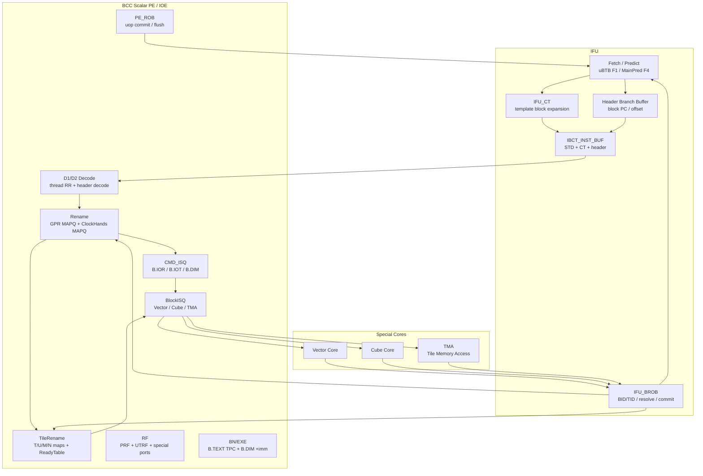
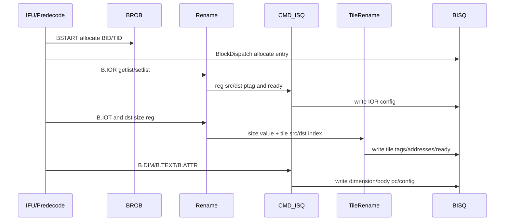
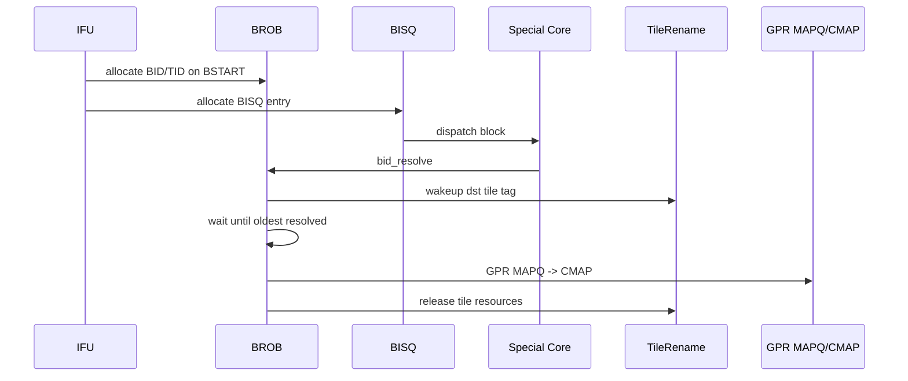

# JCore BCC Architecture Specification — BROB / BlockRename / BlockISQ

> **Document ID**: JCORE-BCC-AS-001
> **Version**: v0.4
> **Date**: 2026-05-14
> **Status**: Draft
> **Target**: `E:\Workarea\design_documents\BCC`
> **Change Point**: Add BCC TileRename, BlockISQ, BROB and BCC OoO integration notes
> **Format Reference**: `E:\Workarea\DavinciOO\Davinci_BlockROB_v1.md`, `E:\Workarea\DavinciOO\Davinci_BCC_ScalarPipeline_v1.md`
> **Dependencies**: TMU-Core interface specification, JCore BCC AS, Vector-OOO AS, Tile-side LSU AS

> **Canonical-stage crosswalk:** This draft retains historical F4/F5/CT and
> other local pipeline labels as source evidence only. The normative LinxCore
> mapping is `F0 -> F1 -> F2 -> F3 -> F4/IB -> D1`; F4 and IB are one final
> fetch stage, while CT/template handling is an owner within that boundary,
> not a serial F5 architectural stage. Backend behavior maps by function to
> canonical D1-D3, S1-S3, P/I/E/W, and R0-R4, with CMT/FLS at R2 and restart
> state at R4. See `pipeline-stage-catalog.md`.
> Historical `BID/TID` on a shared block path means canonical `(STID,BID)`;
> PE/engine-local TID is a separate subordinate qualifier.

---

## Change Log

| Version | Date | Changes |
|---------|------|---------|
| v0.1 | 2026-05-14 | Initial split notes under BCC directory |
| v0.2 | 2026-05-14 | Reorganized into DavinciOO-AS style: metadata, motivation, parameters, structure, lifecycle, pipeline, interfaces, recovery, open questions |
| v0.3 | 2026-05-14 | Added NPU-GPU fusion context, Vector Core architecture, Tile Register / Unified Buffer appendix, and DOT/WaveDrom sources |
| v0.4 | 2026-05-14 | Corrected Cube to a single compute unit with logical ACC chains; replaced the old memory-transfer unit naming with TMA |

---

## 1. Motivation

### 1.1 Why BCC Needs Block-Level State Management

JCore 将 buffer 当作寄存器管理，称为 **Tile Register**。同时，BCC 的标量 GPR 可以被其他 core 访问，用作特殊核的参数输入或 reduce 输出。因此，在多个 core 之间流动的第一层架构状态不再只有传统 GPR，而是:

- **GPR**: 负责 scalar 参数、特殊核输入参数、reduce 输出。
- **TileRegister**: 负责 block 之间的大块数据输入输出。

这两类状态跨越 scalar PE、Vector Core、Cube Core 和 TMA 访存单元。如果只依赖普通微指令 ROB 或局部 IQ，很难同时解决:

1. TileRegister 空间分配与释放。
2. TileReg 相对索引到物理地址的转换。
3. 特殊核之间的 block 级 RAW 依赖。
4. GPR 参数在 BCC 与特殊核之间的传递和释放。
5. block resolve 与 block commit 的时间点分离。
6. flush 时 Tile/GPR 投机状态的统一恢复。

因此 BCC 需要三类 block-level 结构:

- **BlockRename / TileRename**: 对 B.IOT/B.IOR 描述的 Tile/GPR 资源做重命名。
- **BlockISQ / BISQ**: 对 block 级配置和 Tile/GPR 依赖做解除，并向特殊核发射 block。
- **BROB**: 以 BID/TID 为索引，维护 block resolve 和顺序 commit。

### 1.2 Why This Is Not a Flat ROB Problem

TileOP 的数据依赖以 block 为单位表达，而非普通 scalar uop 的单寄存器依赖。对 Vector/Cube/TMA 来说，BCC 发射的是带 Tile/GPR 参数的 block，而不是每条块体微指令。因此:

- TileReg dst resolve 后即可 wakeup 后续 TileReg src。
- TileReg 空间 release 必须等 block commit。
- GPR MAPQ 的提交也应按 block commit，而不是按 scalar PE 微指令 commit。
- TMA 访存单元内部存在隐式 memory 依赖，必须在 block 发射侧保序。

BROB 提供 block 顺序提交点；TileRename 提供 TileRegister 空间和 tag 映射；BISQ 提供 block 级 issue 和 wakeup。

### 1.3 Design Goals

| Goal | Target |
|------|--------|
| TileReg rename | B.IOT src/dst index -> Tile tag + base address + ready |
| TileReg allocation | 根据 dst size 连续分配 TileRegister 空间，维护 T/U/M/N credit |
| TileReg dependency | 使用 TileRename 映射表 index 作为 Tile tag，在 BISQ 中解依赖 |
| GPR parameter passing | B.IOR getlist/setlist 做 GPR ptag 查询/分配，支持重复形参 |
| Block issue | Vector/Cube/TMA 分类型 BISQ，按 ready/config/age/credit 发射 |
| Block commit | BROB 按 live-ring head/age 顺序 commit，驱动 GPR MAPQ -> CMAP 和 TileRename release；禁止用 BID 数值大小判断年龄 |
| Special core integration | 支持 dispatch、get src data、dst ptag write、dst tile resolve、bid resolve、flush |
| Recovery | flush 覆盖 IFU、PE、CMD_ISQ、BISQ、TileRename、特殊核在途状态 |
| Area discipline | BCC 在满足性能需求下需要极限压缩，乱序能力可裁剪 |

### 1.4 Non-Goals / TBD Boundary

当前文档先保留以下待定边界:

- LSU 适配、OS 引入特性、Stash 机制仍为 TBD。
- TileRename 卷绕暂按 CA 不实现记录，后续需与 Vector 地址计算同步定稿。
- LTPR 属于 option 特性，是否实现需要结合性能仿真。
- BROB 默认 256 entries，`BID_W=ceil(log2(BROB_ENTRIES))`（默认 8 bit）；
  wrap/age/flush 使用独立 live-ring 状态，不扩宽 BID。
- 《TMU-Core接口规格.xlsx》的信号位宽需进一步抽取。

---

## 2. Key Parameters

### 2.1 BCC Top Parameters

| Parameter | Value / Current Assumption | Notes |
|-----------|----------------------------|-------|
| SMT mode | SMT4 | 用户材料中 BCC/Vector 多处以 4 线程为基线 |
| Decode width | 4 inst/cycle | IFU/IBCT_INST_BUF/Decode 相关描述均按 4 宽 |
| Header dispatch width | up to 2 header uops/cycle | IBCT_INST_BUF 出队叠加最多 2 条块头微指令，最多 1 条 BSTART |
| CMD_ISQ | 2 write / 2 pick | 专用于 B.IOR/B.IOT/B.DIM 等特殊核块头微指令 |
| TileRename hands | T/U/M/N | 四类 FIFO/hand |
| TileReg total example | 1 MB | T/U/M/N = 512KB/256KB/128KB/128KB |
| TileReg allocation unit | 128 B | `size=1` 代表 128B |
| Tile address width | 21 b | 高 2 b 为 type，低 19 b 为 offset/alloc ptr |
| Tile type encoding | T=00, U=01, M=10, N=11 | 地址高 2 位 |
| Vector BISQ | single queue | 接收 VCALL |
| Cube BISQ | single queue | 只有一个 Cube 计算单元；ACC chain 仅区分逻辑依赖链 |
| TMA BISQ | single queue | 接收 TLOAD/TSTORE/TCOPY/MCALL |
| Cube req buffer credit | 8 per MAC chain | 当前每个乘累加链各 8 深 |
| RF special read ports | 3 independent read ports | CUBE/VEC/TMA Get data 固定 latency，不被反压 |
| RF special write ports | VEC/TMA independent write ports | 用于特殊核写 RF |

### 2.2 First-Level Architectural State

| State | Owner | Commit Point | Wakeup Point | Release Point |
|-------|-------|--------------|--------------|---------------|
| GPR | BCC / scalar PE | BROB block commit | dst ptag write | GPR MAPQ -> CMAP / SAFE release |
| TileRegister | TileRename / BROB | BROB block commit | block resolve -> ReadyTable | block commit -> TileRename release |
| ClockHands relative regs | PE Rename / PE ROB | PE ROB uop commit | uop writeback | PE ROB commit |

---

## 3. Architecture Overview

### 3.1 NPU-GPU Fusion Context

JCore 是 NPU/GFU 融合架构，采用“主核 + 专用核”的分层执行模式。BCC 作为 Block Control Core，执行第一层指令集，即块头，同时具备执行块体 scalar 运算的能力。Vector/Cube/TMA 等专用执行单元执行第二层指令集，即块体或 TileOp。其中 Cube 只有一个计算单元，ACC chain 只是逻辑依赖链区分；访存由专用 TMA 访存单元承担。

详细融合架构、内存层级、指令层级、线程模型与 Master-Slave 接口见 [06_NPU_GPU_Fusion_Architecture.md](06_NPU_GPU_Fusion_Architecture.md)。

DOT sources:

- [diagrams/npu_gpu_fusion_top.dot](diagrams/npu_gpu_fusion_top.dot)
- [diagrams/jcore_memory_hierarchy.dot](diagrams/jcore_memory_hierarchy.dot)
- [diagrams/jcore_instruction_hierarchy.dot](diagrams/jcore_instruction_hierarchy.dot)

### 3.2 Top-Level Block Diagram

DOT source: [diagrams/bcc_top.dot](diagrams/bcc_top.dot)



### 3.3 External Interface Blocks

| Module | Function |
|--------|----------|
| RIU | BCC 与协处理器总线 CXB 的接口；读取 BCC.msgbuf 转换成 CXB 协议发送命令；接收响应写回 BCC.msgbuf 并唤醒线程 |
| TH_CTRL | BCC 内部线程管理；BWE_for_HPOE 时产生线程释放脉冲，将线程资源归还管理单元 |
| PMU_CTRL | 将 BCC PMU 事件数据结构送入 JCore 全局 PMU 采样单元 |
| INT | 将 BCC 异常中断汇聚到 JCore 中断处理单元；当前仅异常中断上报，无任务中断上报 |
| REG_SLV | 下发对 BCC 寄存器的读写访问 |
| VEC/CUBE/TMA | 私有连线交互: dispatch、get/set、dst ptag write、dst Tile resolve、BID resolve、flush |
| L2_cache | L1 I-cache / D-cache miss 访问 |

---

## 4. Block Header ISA / Micro-Instruction Interface

### 4.1 Header Instruction Classes

| Header | Function |
|--------|----------|
| BSTART | 指示 block 执行体、tileop、datatype、block type；触发 BROB/BISQ 分配 |
| B.TEXT | 对 VCALL/MCALL 给出块体指针；BN 完成 TPC 计算 |
| B.IOR | 指示特殊块 GPR 类型入参和出参 |
| B.IOT | 指示 TileReg 类型入参和出参，以及输出 TileReg size |
| B.DIM | 指示 loop bound / 数据维度信息；BN 完成 `+imm` 运算 |
| B.IOD | TBD |
| BSTOP | 作为 End-of-Block 指示；可作为 NOP 进入 PE 后端，也支持 EOB_NOP 消除 |

### 4.2 Downstream Block Dispatch Payload

当某个 core 接到自己要执行的 block 时，需要:

| Payload | Source | Notes |
|---------|--------|-------|
| BID/TID | BROB / IFU | resolve/commit/flush 索引 |
| block type / datatype / tileop | BSTART | 发射给对应特殊核 |
| block body PC + offset | BSTART/B.TEXT/HBB | 块体指令取指位置 |
| LB0/LB1/LB2 | B.DIM | 循环次数/维度 |
| reg_src_ptag | B.IOR getlist | GPR 输入参数 |
| reg_dst_ptag | B.IOR setlist | GPR 输出参数 |
| Tile src tag/address/ready | B.IOT + TileRename | Tile 输入 |
| Tile dst tag/address | B.IOT + TileRename | Tile 输出 |
| configReady | CMD_ISQ/BISQ | 配置项写入完成 |

### 4.3 Header Flow

DOT source: [diagrams/block_header_dispatch.dot](diagrams/block_header_dispatch.dot)
WaveDrom timing source: [diagrams/block_header_pipeline.wavedrom.json](diagrams/block_header_pipeline.wavedrom.json)



---

## 5. TileRename / BlockRename

### 5.1 B.IOR Rename

B.IOR 以微指令格式给出，最多三个源操作数和一个目的操作数。输入参数可重复引用同一个架构寄存器。例如:

```text
arg0 -> a1
arg1 -> s1
arg2 -> a2
arg3 -> a1
arg4 -> x1
```

规则:

1. BCC 在 scalar rename 流水级对 B.IOR `[getlist, setlist]` 做重命名。
2. getlist 查询 GPR 当前映射到的物理寄存器 ptag。
3. setlist 分配新的物理寄存器 ptag。
4. Vector block 使用 Uniform register 接收来自 BCC 的 GPR 值。
5. vector block 块头执行前，Vector 展开 get，将 GPR 值读至 Uniform register。
6. 多条 B.IOR 需要在 BlockISQ 中保持 IOR0/IOR1/IOR2 顺序。
7. IOR rename 时 ptag read counter +1；block resolve 后对应 resolve counter -1；read counter == resolve counter 时才可 SAFE release。

### 5.2 B.IOT Rename

B.IOT 描述 TileOP 的输入输出 TileRegister，以及输出 TileRegister 的 size。该 size 可以由寄存器表达。

处理流程:

1. BCC 先从 GPR 读出 dst TileReg 所需 size。
2. B.IOT 顺序进入 TileRename。
3. TileRename 查询 src TileReg 映射表，得到 src tag、base address、ready 初值。
4. TileRename 根据 dst size 为 dst TileReg 分配映射表 entry 和连续空间。
5. E1 完成 TileReg rename。
6. E2 完成 TileOP dispatch，后续由 BlockISQ 解除 Tile 输入依赖。

软件需要继续维护内存语义:

- 寄存器不足时，软件应做 spill。
- 需要额外内存空间时，软件应指示所需额外空间。
- 例如 TMUL 需要 7KB TileRegister，其中 4KB 可能用于最终输出，3KB 可能用于 TileOP 执行时 spill 和读回。

### 5.3 TileRename Structures

```text
TileRename {
  T_fifo/map: 512 KB partition
  U_fifo/map: 256 KB partition
  M_fifo/map: 128 KB partition
  N_fifo/map: 128 KB partition
  ReadyTable: one ready bit per map entry
  CreditManager: free entry + free size per hand
  Ptrs: alloc ptr / deque ptr / alloc addr ptr
}
```

Map entry:

```text
TileMapEntry {
  valid: 1
  offset: base offset within hand partition
  size: allocation size, unit = 128 B
  pipe: optional placement hint, initial CA may ignore
}
```

Address format:

```text
addr[20:19] = Reg Type
  T: 00
  U: 01
  M: 10
  N: 11

addr[18:0] = allocate pointer / offset
```

### 5.4 Tag-Based Dependency Example

```text
Original TileOP:
  MAMULB T#1, U#1 -> T

After TileRename in BISQ:
  MAMULB Ttag12, Utag29 -> Ttag13
```

ReadyTable 维护 tag12/tag29/tag13 的 ready。Block resolve 时产生对应 ready 信号，将 ReadyTable 与 BISQ 中匹配 tag 的 ready 位置 1。

### 5.5 Allocation and Stall Rules

| Condition | Action |
|-----------|--------|
| dst TileReg mapping entry available and size credit sufficient | allocate entry and address |
| mapping entry insufficient | TileRename stall |
| required size > remaining credit | TileRename stall |
| B.IOT head blocked | subsequent B.IOT blocked due to ordered rename |
| block commit | release TileMapEntry and size credit |
| flush younger block | reclaim uncommitted allocations according to rollback policy |

当前 CA 暂按 TileRename 内部不卷绕实现。后续如果支持 partition 内卷绕，Vector 内地址计算需同步调整。

---

## 6. BlockISQ / BISQ

### 6.1 BIQ Topology

| BISQ | Downstream | Accepted Blocks |
|------|------------|-----------------|
| Vector BISQ | Vector Core | VCALL |
| Cube BISQ | Cube Core | Cube compute blocks；单一 Cube 计算单元，ACC chain 仅作逻辑依赖链字段 |
| TMA BISQ | TMA | TLOAD, TSTORE, TCOPY, MCALL |

### 6.2 Common Issue Conditions

```text
can_issue =
  all_tile_src_ready &&
  allInstReceived &&
  configReady &&
  gpr_input_ready &&
  downstream_credit_available &&
  type_specific_order_rules
```

其中:

- `allInstReceived`: bstart、b.iot、b.ior、b.dim、b.attr 等配置指令全部解码/接收。
- `configReady`: config counter 归零；data type、GPR、DIM 等配置已写入。
- `Tile src ready`: ReadyTable 初值或 wakeup 后为 ready。
- `gpr_input_ready`: B.IOR 输入 ptag ready 或输入 data 已配置。

发射方式:

- Ready 前提下，按 Age Matrix 先入先出发射。
- 下游 PE 可接收时，每个 BIQ 每拍最多发射一条指令。
- 执行核完成后返回 response / resolve / dst ptag write。

### 6.3 BISQ Entry Tile Fields

```text
BISQTileFields {
  dst_vld, dst_hand, dst_tag, dst_addr
  src0_vld, src0_hand, src0_tag, src0_addr, src0_rdy
  src1_vld, src1_hand, src1_tag, src1_addr, src1_rdy
  src2_vld, src2_hand, src2_tag, src2_addr, src2_rdy
  src3_vld, src3_hand, src3_tag, src3_addr, src3_rdy
}
```

### 6.4 Cube BISQ Rules

Cube 只有一个计算单元。ACC chain 不是物理 Cube 单元或物理 pipe 的划分，而是逻辑依赖链的区分。Decode/BlockDispatch 阶段仍可为 Cube block 标记 ACC Flag / ACC chain，用于保持不同乘累加链上的数据依赖和顺序约束，但所有 Cube block 最终共享同一个 Cube dispatch port 和同一个 Cube compute unit。

ACC Flag 规则:

1. Decode 解出 `is_cube_bstart` 和 `is_ACCCVT`。
2. 如果是 Cube BSTART:
   - `lastIsCVT == 1`: block ACC Flag = `!ACC Flag`。
   - `lastIsCVT == 0`: block ACC Flag = `ACC Flag`。
   - 如果 BSTART 是 ACCCVT，则 `lastIsCVT` 置 1，否则清 0。
   - 如果 `lastIsCVT == 1`，ACC Flag 翻转。
3. 如果是 Cube 其他块头:
   - 同拍前面有相同 block 的 BSTART，则继承该 BSTART 的 ACC Flag。
   - 同拍前面无 BSTART，则使用 ACC Flag 当前值。
4. 同拍不会出现两个 Cube BSTART，因为取指位宽为 4，块头大于四条。

Cube 发射条件:

- Tile src ready。
- allInstReceived。
- configReady。
- 同一 ACC chain 内 TileOP 顺序发射。
- Cube compute unit dispatch credit 可用。
- 对应逻辑乘累加链 req buffer credit > 0，目前每条逻辑链 8 深。

### 6.5 Vector BISQ Rules

Vector BISQ 是单 queue，接收 VCALL 类型 block。

发射条件:

- Tile src ready。
- allInstReceived。
- configReady。
- Vector downstream credit available。

Vector block 可乱序发射，因为所有 memory 依赖都已经以 TileRegister 依赖形式在 BISQ 处显式解除。

### 6.6 TMA BISQ Rules

TMA BISQ 是单 queue，entry 中包含 B.IOR 输入 data。

发射条件:

- Tile src ready。
- allInstReceived。
- configReady。
- TLOAD/TSTORE 位于滑窗范围内: `ld_id < youngest_ld_id` 或 `st_id < youngest_st_id`。
- TCOPY 需要 `credit > 0`。
- MCALL 顺序发射。
- VCALL/MCALL 模式切换时，MCALL 必须为最老 block 才能发射。

TMA 访存单元必须顺序下发。原因是内部 memory 指令地址依赖未在 block 指令显式表达，块间可能存在隐含 LD-ST 依赖；store 对 memory 的更改不可回退；STQ/LID/SID 滑窗维护需要顺序解析，否则可能死锁。

---

## 7. BROB

### 7.1 BROB Purpose

IFU_BROB 在分配 BID 时记录 BID/TID，接收 scalar_PE、VEC、CUBE、TMA 的 resolve 信息，通过 commit pointer 维护 block 顺序 commit。

BROB 的两个关键时间点:

- **block resolve**: 数据生产完成，dst Tile tag ready，可 wakeup 后续 BISQ。
- **block commit**: block 成为最老且 resolved，GPR MAPQ -> CMAP，TileRename release。

### 7.2 BROB Entry State

```text
BROBEntry {
  valid: 1
  tid: TID_W
  bid: BID_W  // complete BROB slot identity; wrap/age state is separate
  block_type: BLOCKTYPE_W
  body_pc: PC_W
  offset: OFFSET_W
  resolved: 1
  exception: 1
  dst_tile_vld: 1
  dst_tile_type: 2
  dst_tile_tag: TILE_TAG_W
  dst_tile_size: TILE_SIZE_W
  gpr_mapq_base: MAPQ_PTR_W
  gpr_mapq_count: MAPQ_COUNT_W
}
```

### 7.3 Lifecycle

DOT source: [diagrams/brob_resolve_commit.dot](diagrams/brob_resolve_commit.dot)
WaveDrom timing source: [diagrams/resolve_commit_timing.wavedrom.json](diagrams/resolve_commit_timing.wavedrom.json)

```text
FREE -> ALLOC -> DISPATCHED -> RESOLVED -> COMMIT -> FREE
```



### 7.4 GPR CMAP Commit Rule

GPR 是第一层架构状态，在 block commit 时释放资源。相对索引寄存器是第二层架构状态，在微指令 commit 时释放资源。

因此:

- GPR MAPQ 由 BROB 管控提交。
- ClockHands MAPQ 由 PE ROB 管控提交。

LTPR/SAFE 需考虑其他 core 在途读:

- IOR rename 时 read counter +1。
- block resolve 时 resolve counter -1。
- `read counter == resolve counter` 时寄存器才可安全释放。

### 7.5 Flush and Recovery

BROB flush 需要覆盖:

- IFU redirect 和 younger fetch 清理。
- PE front/back 清理 younger uop。
- CMD_ISQ 清除无效块头配置。
- BISQ 清除无效投机 TileOP。
- TileRename 回收未 commit 的 Tile allocation。
- 特殊核接收 BCC flush 并清理在途 block。
- scalar PE 恢复 GPR MAPQ/CMAP。

---

## 8. BCC OoO Pipeline Integration

### 8.1 IFU

IFU 负责块指令与微指令取指。为复用 INST_BUF，CT 模块迁移到 IFU 后端。

新增/差异:

- L1 I-cache 替换，需要支持带 TLB 的 I-cache，替代指令段表机制。
- BSTART、B.TEXT、B.IOR、B.IOT、B.DIM 需要经 INST_BUF 传给 PE。
- IBCT_INST_BUF 微指令出队可叠加最多 2 条块头微指令，最多 1 条 BSTART。
- 新增 BROB。
- INST_BUF 支持 16/32/48 bit 三种长度，考虑按 16 bit 粒度存储。
- 支持 EOB_NOP 消除。
- 支持同 fetch bundle 连续 Fall STD block 合并，可由寄存器配置关闭。

线程 PC 来源:

1. 寄存器配置初始 PC。
2. 外部 flush PC。
3. 主预测器 F4 next PC。
4. uBTB F1 next PC。
5. BWE commit 时 block 最后一条指令 PC + size。

优先级: `flush/commit > main predictor > uBTB`。

### 8.2 IFU_CT

CT 根据模板块指令和输入参数产生模板块块体，减少 code size，提升取指效率。

CT 处于 IFU F5 stage，分为 C0/C1/C2:

| Stage | Function |
|-------|----------|
| F4 | IFU 128bit/cycle 译码，结果存入 8 深 pred_buf |
| C0 | pred_buf 中 CT 指令写入 CT_BUF |
| C1 | CT_FSM_GEN RR 调度，选择 FSM |
| C2 | FSM 产生指令，若 IBCT_INST_BUF 空位 > 4，则写入并跳转下一状态 |

控制信号:

- `ct_pre_done`: 告知 IFU F1 demask，对应线程可提前参与调度。
- `ct_done`: 告知 IFU F4 该线程指令可调出到 CT/IBCT_INST_BUF。

### 8.3 PE_D1 / PE_Rename / PE_DISP

PE_D1:

- 按线程接收 IBCT_INST_BUF 输出，最多 4 inst/cycle。
- D1_MUX_THREAD 对 4 线程 RR 调度。
- Decode Unit 产生指令控制和数据信息。
- 接收 PE 后端整体和线程级反压。

PE_Rename:

- GPR MAPQ 和 ClockHands MAPQ 拆分。
- B.IOR getlist/setlist 做 GPR rename。
- B.IOT 需要先读 size，再进入 TileRename。

PE_DISP:

- Load/Store 指令进入 LSU DISP。
- 数据块块头微指令进入 PAR_BLOCK DISP / CMD_ISQ。
- 其余指令进入 ALU DISP。
- 新增 CMD_ISQ credit 管理，不进入 CMD_ISQ 的指令不消耗 credit。

### 8.4 CMD_ISQ

CMD_ISQ 是 2 写 2 pick，专门处理 B.DIM、B.IOR、B.IOT。

| Pipe | Handles | Notes |
|------|---------|-------|
| cmd_isq_pipx | B.IOR | src ready 后直接写入记录的 BlockISQ entry；不需要读口 |
| cmd_isq_pipy | B.IOT, B.DIM | 受 TileRename headflop 反压；B.IOT 顺序 pick；需要 1 个读口 |

CMD_ISQ 收到 wakeup 后打 3 拍，无 cancel 后再真正做 src reg wakeup，以简化 load_cancel 处理。

### 8.5 PE_ROB / TPCBUF / RF / BN

PE_ROB:

- 负责普通微指令乱序执行后的顺序 commit。
- 投机错误时产生 flush，广播给 IFU、PE front/back。
- 与 KV500 暂无主要差异，但需与 BROB flush 协同。

TPCBUF:

- 每条微指令携带 TPC。
- 保存 base TPC 和 offset。
- flush 时用 base + offset 恢复 PC。

RF:

- PRF 与 UTRF 两套实体。
- PRF 参考 8R6W，LTPR 需 1R1W。
- UTRF 参考 6R5W。
- 为 CUBE/VEC/TMA Get data 各开一路独立读口。
- 为 VEC/TMA 写 RF 各开一路独立写口。

BN:

- 完成 B.TEXT 的 TPC 计算。
- 完成 B.DIM 的 `+imm` 运算。

---

## 9. Special Core Interfaces

| Interface | Direction | Description |
|-----------|-----------|-------------|
| Dispatch | BCC -> VEC/CUBE/TMA | 推送 datatype、tileop、tile_src、tile_dst、reg_src_ptag、reg_dst_ptag，credit 流控 |
| Core req / get src data | VEC/CUBE/TMA -> BCC RF | 根据 get_src_ptag 读 RF，固定 latency，不反压 |
| Dst ptag write | VEC/TMA/etc -> BCC | 写 dst ptag，并 wakeup 依赖 ptag 的指令 |
| Dst Tile resolve | VEC/CUBE/TMA -> BCC | 写 dst TileReg / block resolve，并 wakeup 依赖 TileReg 的 block |
| BID resolve | VEC/CUBE/TMA -> BROB | 用于 BROB 顺序 commit |
| BCC flush | BCC -> VEC/CUBE/TMA | 特殊核清理无效投机状态 |

---

## 10. Tile-Side LSU Dependency Summary

Tile 侧 LSU 的详细整理见 [04_Tile_Side_LSU.md](04_Tile_Side_LSU.md)。与 BCC 直接相关的要点:

- Vector SMT4，每个执行流称为 logic_group。
- 原始方案维护 rid、ldid、stid；2025/10/14 例会确定第一阶段暂不支持 nuke_flush。
- 不支持 nuke_flush 意味着 load 不能投机，但仍可乱序。
- ISQ 或 LSU 需要保证 load non_spec 时才能发出。
- store 仍通过 STQ 顺序维护；STQ 是 store 数据 buffer，也是保序和发射单元。
- TMA BISQ 中 TLOAD/TSTORE 需要遵守滑窗范围。
- VAB 用于 gather/scatter 地址和数据组装，gather/scatter 对 ISQ pick 有特殊约束。

---

## 11. Vector Core and Vector-OOO Dependency Summary

Vector-OOO 的详细整理见 [05_Vector_OOO_Appendix.md](05_Vector_OOO_Appendix.md)。与 BCC block dispatch 直接相关的要点:

- Vector Decode D1/D2 支持 4 inst/cycle，但受 ISQ 写口和资源限制。
- Vector Rename 管理 VRF、RF、Uniform Register。
- Uniform Register 存储来自 BCC 的 GPR 输入，与 RF 共用物理资源。
- 每个存活 block 有一套 Uniform register。
- Reduce 到 RO 寄存器时存在隐藏输入，rename 需要 first_aloc 标识。
- Predicate 寄存器有 block BID/grp_id 有效性管理。
- Block Dispatch 时为避免 FP64 双寄存器死锁，需要保证只有两个执行流可接受 FP64 指令。

Vector Core 架构、Block Dispatch、Loop Ctrl、Group Buffer/GROB、VIFU、ISQ、TBuffer、Vector Tile Access 见 [07_Vector_Core_Architecture.md](07_Vector_Core_Architecture.md)。

其中与 BCC 直接相关的新增要点:

- BCC BISQ 解除 Tile Register block 间依赖后，Vector 可认为输入 Tile ready。
- Vector Get Global Register 仍需依赖 BCC GPR wakeup，不能只依赖 BISQ Tile ready。
- Vector block resolve 需要等 TBuffer Modified 数据全部 writeback 到 Tile Register。
- Group ROB 对 BID 计数归零后向上游 BCC 发 block commit/resolve 请求。
- BCC block dispatch 可触发 Vector TBuffer prefetch，但预取量和优先级待定。

---

## 12. Tile Register / Unified Buffer Dependency Summary

Tile Register / Unified Buffer 的详细整理见 [08_Tile_Register_Unified_Buffer.md](08_Tile_Register_Unified_Buffer.md)。

关键点:

- Tile Register 是 Cube/Vector/TMA 之间的主要数据交互中心。
- 原始材料中同时存在 1MB TileReg 与 256KB Unified Buffer 两种容量口径，需后续统一。
- Unified Buffer 由 SRAM bank 组成，原始描述为 16 个 `256 x 512` 单口 SRAM。
- 多端口访问可能产生 bank conflict，Tile Reg 向 PE 提供 cancel/retry。
- BCC TileRename 完成 block 级 TileReg 分配，块内不能再分配新的 BCC 级 TileReg。
- Parallel block 的 group 间可乱序写不同地址；Vector block 的 group 间写同一 TileReg 需保序。

---

## 13. PMU / DFX / Modeling Items

需要新增或建模的事件:

- BROB full / commit stall / resolve-to-commit latency。
- TileRename entry full / size credit stall。
- BISQ full / configReady stall / Tile src not ready stall。
- Vector/Cube/TMA dispatch credit stall。
- Cube req buffer credit stall。
- AGU TLOAD/TSTORE window stall。
- TCOPY credit stall。
- MCALL oldest-block stall。
- GPR SAFE/LTPR release stall。
- GET data latency。
- block flush count、flush source、flushed block count。
- 打满 SMT 的能力。
- BCC 调度对系统长尾效应的影响。
- BCC 乱序能力裁剪对应面积收益。

---

## 14. Diagram Sources

| Diagram | Type | Source |
|---------|------|--------|
| BCC top architecture | DOT | [diagrams/bcc_top.dot](diagrams/bcc_top.dot) |
| Block header dispatch flow | DOT | [diagrams/block_header_dispatch.dot](diagrams/block_header_dispatch.dot) |
| TileRename and BISQ dependency resolution | DOT | [diagrams/tilerename_bisq.dot](diagrams/tilerename_bisq.dot) |
| BROB resolve and commit flow | DOT | [diagrams/brob_resolve_commit.dot](diagrams/brob_resolve_commit.dot) |
| Block header rename/dispatch timing | WaveDrom | [diagrams/block_header_pipeline.wavedrom.json](diagrams/block_header_pipeline.wavedrom.json) |
| BROB resolve vs commit timing | WaveDrom | [diagrams/resolve_commit_timing.wavedrom.json](diagrams/resolve_commit_timing.wavedrom.json) |
| CMD_ISQ / TileRename backpressure timing | WaveDrom | [diagrams/cmd_isq_tilerename_timing.wavedrom.json](diagrams/cmd_isq_tilerename_timing.wavedrom.json) |
| NPU-GPU fusion top | DOT | [diagrams/npu_gpu_fusion_top.dot](diagrams/npu_gpu_fusion_top.dot) |
| JCore memory hierarchy | DOT | [diagrams/jcore_memory_hierarchy.dot](diagrams/jcore_memory_hierarchy.dot) |
| JCore instruction hierarchy | DOT | [diagrams/jcore_instruction_hierarchy.dot](diagrams/jcore_instruction_hierarchy.dot) |
| Vector Core top | DOT | [diagrams/vector_core_top.dot](diagrams/vector_core_top.dot) |
| Vector TBuffer flow | DOT | [diagrams/vector_tbuffer_flow.dot](diagrams/vector_tbuffer_flow.dot) |
| Tile Register / Unified Buffer | DOT | [diagrams/tile_register_unified_buffer.dot](diagrams/tile_register_unified_buffer.dot) |
| Vector IFU pipeline | WaveDrom | [diagrams/vector_ifu_pipeline.wavedrom.json](diagrams/vector_ifu_pipeline.wavedrom.json) |

Render examples:

```powershell
dot -Tsvg E:\Workarea\design_documents\BCC\diagrams\bcc_top.dot -o E:\Workarea\design_documents\BCC\diagrams\bcc_top.svg
dot -Tpng E:\Workarea\design_documents\BCC\diagrams\tilerename_bisq.dot -o E:\Workarea\design_documents\BCC\diagrams\tilerename_bisq.png
```

---

## 15. Hardware Cost / Area Direction

原始需求强调:

- BCC 在满足需求下，面积需要极限压缩。
- 需要列写 BCC 核参数，作为裁剪面积输入。
- 需要评估 BCC 乱序能力裁剪的面积收益。

建议后续面积表按 DavinciOO AS 格式展开:

| Block | State | Main Cost Driver | Notes |
|-------|-------|------------------|-------|
| BROB | 256 default entries x entry width | BID/TID/type/resolve/Tile/GPR metadata | `BID_W=ceil(log2(BROB_ENTRIES))`; wrap/age separate |
| TileRename maps | T/U/M/N map entries | offset/size/valid/ready | entry depth TBD |
| ReadyTable | one bit per TileMap entry | wakeup CAM/broadcast | must align with map depth |
| BISQ | per queue entries | Tile fields + GPR config + DIM + age | Vector/Cube/TMA separate |
| CMD_ISQ | 2W2P queue | B.IOR/B.IOT/B.DIM config | B.IOT ordered pick |
| RF special ports | 3R + 2W special | fixed-latency get/set | area/timing critical |

---

## 16. CA Implementation Checklist

1. TileRename 分 T/U/M/N 四个 FIFO/hand。
2. 维护 TileRename 剩余物理资源 credit。
3. 维护 alloc ptr、deque ptr、alloc addr ptr。
4. 实现 dispatch 流水级 ReadyTable 对齐。
5. 定义 TileRename 后指令格式和 wakeup 通路。
6. 实现 TileRename 地址分配和卷绕策略；当前先按内部不卷绕。
7. Vector 内地址计算需与 TileRename 地址格式同步。
8. 实现 B.IOR 形参重命名，支持重复 GPR。
9. 新增 CMD_ISQ，处理 B.IOR/B.IOT/B.DIM。
10. B.IOT 顺序 pick 并写入 BISQ。
11. B.IOR 写 CMD_ISQ 同时写 BISQ，保持 IOR 顺序。
12. 实现 Vector/Cube/TMA 三类 BISQ。
13. 实现 Cube ACC Flag / lastIsCVT / ACCCVT 逻辑。
14. 实现 AGU TLOAD/TSTORE 滑窗、TCOPY credit、MCALL 顺序发射。
15. BROB block resolve 唤醒 dst Tile tag。
16. BROB block commit 释放 TileRename 资源。
17. BROB block commit 驱动 GPR MAPQ -> CMAP。
18. RF 增加 CUBE/VEC/TMA Get data 独立读口。
19. RF 增加 VEC/TMA 写口。
20. BN 增加 B.TEXT TPC 和 B.DIM +imm。
21. Flush 覆盖 IFU、PE、CMD_ISQ、TileRename、BISQ、特殊核在途状态。

---

## 17. Open Questions

| ID | Question | Priority |
|----|----------|----------|
| OQ-1 | 非默认 BROB depth 的 PPA 取值如何选择？BID width 仍严格由 `ceil(log2(entries))` 派生，wrap/sequence 独立。 | High |
| OQ-2 | TileRename map depth 与 ReadyTable depth 各 hand 是否相同？ | High |
| OQ-3 | TileRename flush rollback 使用 checkpoint、walk 回收还是 BID-tagged reclaim？ | High |
| OQ-4 | TileRename 是否需要支持 partition 内卷绕？若支持，Vector 地址计算如何同步？ | High |
| OQ-5 | GPR read counter / resolve counter 放在哪个结构中？ | High |
| OQ-6 | LTPR 是否进入首版 CA？收益/面积如何评估？ | Medium |
| OQ-7 | TMA 顺序发射与 Tile侧LSU non_spec/st_id 滑窗如何精确对齐？ | High |
| OQ-8 | GET data 固定 latency 的周期数和 RF bypass 方案如何定稿？ | Medium |
| OQ-9 | VCALL/MCALL 模式切换时 MCALL 最老块判断使用 BROB age 还是 AGU BISQ age？ | Medium |
| OQ-10 | BCC flush 与特殊核已产生 memory side effect 的边界如何定义？ | High |

---

## Appendix A: Document Map

| Detail Area | Document |
|-------------|----------|
| Architecture overview | [00_BCC_Architecture.md](00_BCC_Architecture.md) |
| TileRename / BISQ | [01_TileRename_BlockISQ.md](01_TileRename_BlockISQ.md) |
| BROB | [02_BROB.md](02_BROB.md) |
| BCC OoO pipeline | [03_BCC_OOO.md](03_BCC_OOO.md) |
| Tile-side LSU dependency | [04_Tile_Side_LSU.md](04_Tile_Side_LSU.md) |
| Vector-OOO dependency | [05_Vector_OOO_Appendix.md](05_Vector_OOO_Appendix.md) |
| NPU-GPU fusion architecture | [06_NPU_GPU_Fusion_Architecture.md](06_NPU_GPU_Fusion_Architecture.md) |
| Vector Core architecture | [07_Vector_Core_Architecture.md](07_Vector_Core_Architecture.md) |
| Tile Register / Unified Buffer | [08_Tile_Register_Unified_Buffer.md](08_Tile_Register_Unified_Buffer.md) |
| Open issues | [99_Open_Issues.md](99_Open_Issues.md) |
