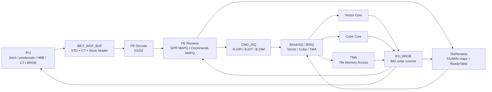

# BCC Design Notes

> 整理日期: 2026-05-14
> 来源: BROB / BlockRename / BlockISQ / JCore BCC AS / TileRename / BCC OoO / Tile侧LSU / Vector-OOO 讨论材料
> 状态: 详细整理稿，图示采用 mermaid 先行表达，原始图中 `a` 占位后续可替换为正式图片

## 文档导航

| 文件 | 内容 |
| --- | --- |
| [JCore_BCC_AS.md](JCore_BCC_AS.md) | 主 AS 文档，按 DavinciOO AS 格式组织: 元信息、Change Log、Motivation、Key Parameters、结构、生命周期、接口、恢复、Open Questions |
| [BCC_AS.md](BCC_AS.md) | 聚焦 BCC SMT/OoO pipeline 的独立规格，收敛标量执行、CMD_ISQ、TileRename、BISQ、BROB 与恢复路径 |
| [00_BCC_Architecture.md](00_BCC_Architecture.md) | BCC 顶层架构图、块头主数据流、状态提交/释放总览 |
| [01_TileRename_BlockISQ.md](01_TileRename_BlockISQ.md) | B.IOR/B.IOT、TileRename、ReadyTable、BlockISQ/BISQ、Cube/Vector/AGU 发射规则 |
| [02_BROB.md](02_BROB.md) | IFU_BROB 职责、BID/TID、block resolve/commit、Tile wakeup/release、GPR CMAP 提交关系 |
| [03_BCC_OOO.md](03_BCC_OOO.md) | JCore BCC 乱序前后端、IFU/CT/PE/Rename/CMD_ISQ/ROB/DISP/RF 与特殊核接口 |
| [04_Tile_Side_LSU.md](04_Tile_Side_LSU.md) | Tile 侧 LSU、LD/ST ID、non-spec、LDQ/STQ/SCB/VAB、gather/scatter 规则 |
| [05_Vector_OOO_Appendix.md](05_Vector_OOO_Appendix.md) | Vector Decode/Rename/ROB 乱序附录，保留与 BCC block dispatch/参数传递相关信息 |
| [06_NPU_GPU_Fusion_Architecture.md](06_NPU_GPU_Fusion_Architecture.md) | NPU-GPU 融合架构、内存/指令层级、线程模型、Master-Slave 接口 |
| [07_Vector_Core_Architecture.md](07_Vector_Core_Architecture.md) | Vector Core 架构、Block Dispatch、Loop Ctrl、Group Buffer/GROB、VIFU、ISQ、TBuffer |
| [08_Tile_Register_Unified_Buffer.md](08_Tile_Register_Unified_Buffer.md) | Tile Register / Unified Buffer、SRAM bank、端口、bank conflict、rename 语义 |
| [99_Open_Issues.md](99_Open_Issues.md) | 原文中 TBD、遗留项、待建模和待定规格集中索引 |

## AS 格式约定

本文档包参考 DavinciOO AS 的组织方式:

- 文件头提供 `Document ID / Version / Date / Status / Target / Change Point / Dependencies`。
- 正文使用 `Change Log`、`Motivation`、`Design Goals`、`Key Parameters`、`Structure`、`Pipeline / Lifecycle`、`Interfaces`、`Recovery`、`Hardware Cost / PMU`、`Open Questions`。
- 结构体用代码块描述，参数和接口用表格描述。
- 架构图/结构图优先提供 Graphviz DOT 源，时序图优先提供 WaveDrom 源。
- 主规格在 [JCore_BCC_AS.md](JCore_BCC_AS.md)，拆分文档保留更细的模块内容，避免信息丢失。
- [BCC_AS.md](BCC_AS.md) 是面向当前 SMT/OoO pipeline 讨论的收敛版入口，适合先读完整流水与恢复路径再回到拆分章节。

## 图源

| 图 | 类型 | 源文件 |
| --- | --- | --- |
| BCC 顶层架构图 | DOT | [diagrams/bcc_top.dot](diagrams/bcc_top.dot) |
| 块头 dispatch 数据流 | DOT | [diagrams/block_header_dispatch.dot](diagrams/block_header_dispatch.dot) |
| TileRename / BISQ 依赖解除 | DOT | [diagrams/tilerename_bisq.dot](diagrams/tilerename_bisq.dot) |
| BROB resolve / commit | DOT | [diagrams/brob_resolve_commit.dot](diagrams/brob_resolve_commit.dot) |
| 块头 rename/dispatch 时序 | WaveDrom | [diagrams/block_header_pipeline.wavedrom.json](diagrams/block_header_pipeline.wavedrom.json) |
| BROB resolve vs commit 时序 | WaveDrom | [diagrams/resolve_commit_timing.wavedrom.json](diagrams/resolve_commit_timing.wavedrom.json) |
| CMD_ISQ / TileRename 反压时序 | WaveDrom | [diagrams/cmd_isq_tilerename_timing.wavedrom.json](diagrams/cmd_isq_tilerename_timing.wavedrom.json) |
| NPU-GPU 融合架构 | DOT | [diagrams/npu_gpu_fusion_top.dot](diagrams/npu_gpu_fusion_top.dot) |
| JCore 内存层级 | DOT | [diagrams/jcore_memory_hierarchy.dot](diagrams/jcore_memory_hierarchy.dot) |
| JCore 指令层级 | DOT | [diagrams/jcore_instruction_hierarchy.dot](diagrams/jcore_instruction_hierarchy.dot) |
| Vector Core 顶层 | DOT | [diagrams/vector_core_top.dot](diagrams/vector_core_top.dot) |
| Vector TBuffer 流程 | DOT | [diagrams/vector_tbuffer_flow.dot](diagrams/vector_tbuffer_flow.dot) |
| Tile Register / UB bank | DOT | [diagrams/tile_register_unified_buffer.dot](diagrams/tile_register_unified_buffer.dot) |
| Vector IFU 时序 | WaveDrom | [diagrams/vector_ifu_pipeline.wavedrom.json](diagrams/vector_ifu_pipeline.wavedrom.json) |

典型渲染命令:

```powershell
dot -Tsvg E:\Workarea\design_documents\BCC\diagrams\bcc_top.dot -o E:\Workarea\design_documents\BCC\diagrams\bcc_top.svg
```

## 总览图



## 覆盖范围

这批材料保留并细化以下主题:

1. TileRename / BlockRename
   - B.IOT 中相对 TileReg 索引到 Tile tag、offset、size、base address 的转换。
   - dst TileReg 按 size 连续分配 TileRegister 空间，资源不足时 stall。
   - T/U/M/N 四类 hand 的映射表、ready table、credit、alloc/deque 指针、地址高位类型编码。
   - 当前 CA 先按 TileRename 内部不卷绕实现，同时记录卷绕后 Vector 地址计算需要同步调整。

2. B.IOR / GPR 参数
   - B.IOR 支持最多三个源和一个目的，输入参数可重复引用同一架构寄存器。
   - BCC scalar rename 对 getlist 查询 ptag，对 setlist 分配 ptag。
   - Vector 使用 Uniform register 接收来自 BCC 的 GPR 值，块头执行前展开 get。
   - IOR rename 影响 GPR read counter / resolve counter / SAFE 释放判断。

3. BlockISQ / BISQ
   - Vector、Cube、TMA 三类 BISQ。
   - 统一发射条件: Tile src ready、allInstReceived、configReady、GPR ready、downstream credit。
   - Vector/Cube 支持乱序发射；TMA 因隐式 memory LD-ST 依赖必须顺序下发。
   - Cube 只有一个计算单元；ACC chain 只是逻辑依赖链区分，ACC Flag、ACCCVT、lastIsCVT 规则用于链路标记和顺序约束。
   - AGU 的 TLOAD/TSTORE 滑窗、TCOPY credit、MCALL 顺序发射、VCALL/MCALL 切换约束保留。

4. BROB / 第一层架构状态
   - BROB 分配 BID，记录 TID，接收 scalar_PE/VEC/CUBE/TMA resolve。
   - block resolve 唤醒 Tile dst tag，block commit 释放 TileRename 资源。
   - GPR MAPQ 由 BROB 提交到 CMAP；ClockHands MAPQ 由 PE ROB 提交。
   - flush/replay 对 IFU、PE、CMD_ISQ、BISQ、TileRename、特殊核的影响集中记录。

5. BCC OoO 前后端
   - IFU、CT、PE_D1、PE_Rename、CMD_ISQ、PE_ROB、TPCBUF、DISP、TileRename、BlockISQ、RF、BN、EXE。
   - BCC 与 RIU/TH_CTRL/PMU_CTRL/INT/REG_SLV/L2/特殊核接口。
   - 特殊核 dispatch、get/set、dst ptag write、dst Tile resolve、bid resolve、flush 通路。

6. Tile 侧 LSU 与 Vector-OOO 附录
   - 保留用户提供的 Tile侧LSU、Vector Decode/Rename/ROB 内容，作为 BCC block 调度和特殊核接口设计的依赖背景。

## 一句话数据流

```text
IFU/Decode 解析块头
  -> BSTART 分配 BROB/BISQ entry，记录 BID/TID/type/PC/offset
  -> B.IOR 在 scalar rename 查询 getlist GPR ptag、分配 setlist GPR ptag
  -> B.IOT 在 TileRename 查询 src Tile tag/address/ready，按 dst size 分配 dst Tile tag/address
  -> B.DIM/B.ATTR/B.TEXT 补齐 loop bound、datatype、tileop、块体 PC 等配置
  -> CMD_ISQ/BISQ 收集配置，config counter 归零后置 configReady
  -> BlockISQ 根据 Tile ready、GPR ready、allInstReceived、age、credit 发射给特殊核
  -> 特殊核 get/set GPR 或执行 TileOP，完成后返回 ptag write / Tile resolve / BID resolve
  -> BROB 按 BID 顺序 commit，驱动 GPR MAPQ -> CMAP，驱动 TileRename release
```

## 术语速查

| 术语 | 含义 |
| --- | --- |
| BCC | Block Control Core，负责块调度、块头解析、GPR/TileReg 第一层架构状态管理 |
| BROB | Block ROB，按 BID 维护 block 顺序提交 |
| BIQ/BISQ | Block Issue Queue，按执行核类型保存待发射 block |
| B.IOR | Block I/O Register 描述，携带 GPR 输入/输出形参 |
| B.IOT | Block I/O Tile 描述，携带 TileReg 输入/输出和 dst size |
| Tile tag / Ttag | TileRename 映射表 entry index，用于 TileReg 依赖解除 |
| ReadyTable | 与 TileRename 映射表一一对应，记录 Tile tag 是否 ready |
| T/U/M/N hand | TileReg 类型/区域，地址高位编码分别为 T/U/M/N |
| configReady | block 配置项全部写入 BISQ 后的发射条件之一 |
| allInstReceived | block 所有配置微指令均已被解码/接收 |
| ACC Flag | Cube block 分 pipe 和乘累加链的标识 |
| VAB | Vector Address Buffer，Tile侧LSU中承载 gather/scatter 地址和数据组装 |
| non_spec_ptr | Vector/Tile侧LSU 中限制 load 非投机发射的提交/非 flush 指针 |

## 待补材料

- 《TMU-Core接口规格.xlsx》中的 Dispatch / Core req / Resolve / Flush 接口字段需要抽取进接口章节。
- BROB depth、BID 位宽、per-thread partition、flush 精确语义需要和 RTL/建模规格对齐。
- TileRename wrap 策略当前按“CA 暂不实现内部卷绕”记录，后续需与 Vector 地址计算一起定稿。
- BCC 乱序能力裁剪、SMT QoS、长尾调度、面积压缩需要结合系统性能建模继续定量。
