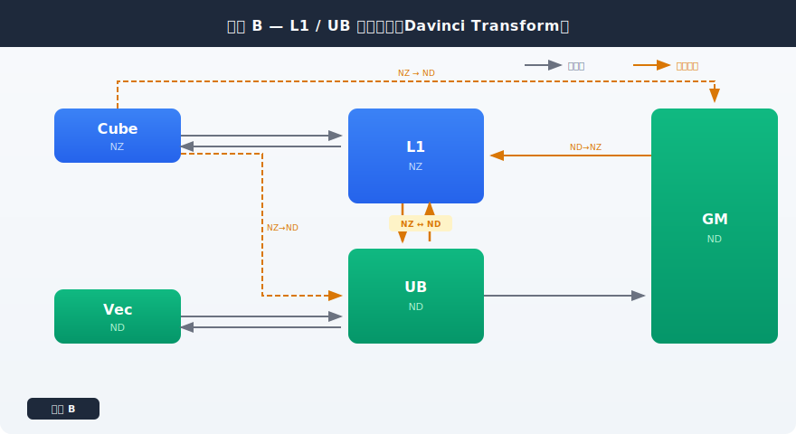
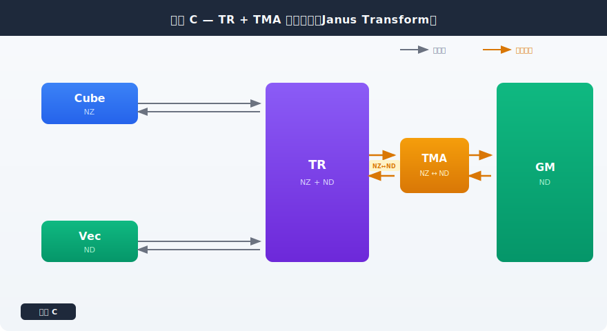
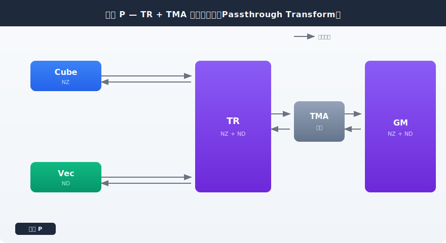
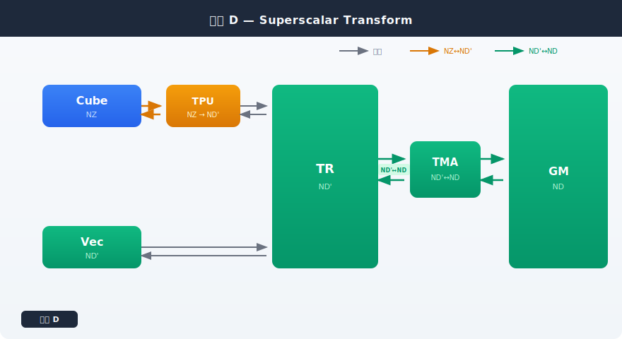

# ND2NZ 架构方案讨论

## 背景

在 LayoutTransform 中，数据按层级存在多种分型格式：

| 标记 | 含义 | 作用域 |
|------|------|--------|
| NZ   | Fractal 内 ND，Fractal 间 DN | Cube 所在域 |
| ND'  | Tile 内 ND | 局部域（方案 D 中 Vec、TR、TMA 所在域） |
| ND   | Tensor 内 ND | 全局域（GM 所在域） |

NZ 与 ND 之间需要相互转换，各方案的核心问题是：**如何高效、一致地完成这些转换**。

---

## 涉及组件一览

| 组件 | 方案 B | 方案 C | 方案 P | 方案 D | 说明 |
|------|--------|--------|--------|--------|------|
| Cube | NZ | NZ | NZ | NZ | 上游数据源（NZ 域） |
| Vec | ND | ND | ND | ND' | 上游数据源 |
| TR | L1(NZ) + UB(ND) | NZ+ND | NZ+ND | ND' | 方案 B 分立为 L1/UB，方案 C/P/D 融合 |
| GM | ND | ND | NZ+ND | ND | 下游汇聚/输出 |

---

## 方案 A

待定。

---

## 方案 B：L1/UB 分立架构（Davinci Transform）

### 连接关系

```
Cube (NZ) ────────► L1 (NZ)
Vec  (ND) ────────► UB (ND)
L1   (NZ) ◄───────► UB (ND)    ← ND ↔ NZ 双向转换
Cube (NZ) ─ ─ ─ ─► UB (ND)    ← NZ → ND 转换
Cube (NZ) ─ ─ ─ ─► GM (ND)    ← NZ → ND 转换
GM   (ND) ────────► L1 (NZ)    ← ND → NZ 转换
UB   (ND) ────────► GM (ND)    ← 同域直传
```

> 实线 = 同域直传，虚线 = 跨域转换

### 特点

- L1 和 UB 各自独立，分别对接上游同域数据源
- L1 ↔ UB 之间需要双向 ND ↔ NZ 转换
- Cube 直接伸出 NZ→ND 转换到 UB 和 GM
- GM → L1 为单向 ND→NZ 转换
- UB → GM 同属 ND 域，无需转换
- **转换逻辑分散**在多条路径上（L1↔UB、Cube→UB、Cube→GM、GM→L1）

### 主要挑战

1. 转换逻辑在多处独立实现，付出多份面积开销。
2. 转换路径均暴露在执行模型，程序员心智负担高，经常需要细粒度管理数据搬移。



---

## 方案 C：TR + TMA 融合架构（Janus Transform）

### 连接关系

```
Cube (NZ) ────────► TR (NZ + ND)
Vec  (ND) ────────► TR (NZ + ND)
TR   (NZ + ND) ◄──► TMA          ← ND ↔ NZ 双向转换
TMA            ◄──► GM (ND)      ← ND ↔ NZ 双向转换
```

### 特点

- L1 和 UB **合二为一**成为 TR，同时持有 NZ 和 ND 两种格式
- Cube (NZ) 和 Vec (ND) 统一接入 TR
- TR 连接独立的 **TMA** 组件，双向交互
- **所有 NZ ↔ ND 转换统一在 TMA 中完成**，TR 自己不负责格式转换
- TMA 连接 GM，GM 持有 ND 格式
- TMA 与 TR、GM 之间均为双向连接
- 转换逻辑单一集中，不存在分散问题

### 主要挑战

1. 借助 TMA 完成 Vec <-> Cube 之间的格式转换时，时延大。
2. 借助 TMA 完成 Vec <-> Cube 之间的格式转换时，抢占 TMA 访存 outstanding 资源。
3. 不借助 TMA 完成 Vec <-> Cube 之间的格式转换时， Vec 存在开销。



---

## 方案 P：TR + TMA 无转换架构（Passthrough Transform）

方案 P 以方案 C 为基础改造：GM 同时持有 NZ 和 ND 两种格式，TMA 去掉 NZ ↔ ND 转换能力，退化为纯数据搬运引擎。

### 连接关系

```
Cube (NZ) ◄───────► TR (NZ + ND)     ← 同域直传
Vec  (ND) ◄───────► TR (NZ + ND)     ← 同域直传
TR   (NZ + ND) ◄──► TMA              ← 同域直传
TMA            ◄──► GM (NZ + ND)     ← 同域直传
```

### 特点

- 基于方案 C，TR 同样由 L1/UB 合二为一，同时持有 NZ 和 ND
- **GM 扩展**为同时持有 NZ 和 ND 两种格式
- **TMA 去掉 NZ ↔ ND 转换能力**，仅做同域数据搬运
- 所有连线均为同域直传（灰色），架构中**不存在格式转换路径**
- 与方案 C 相比：TMA 由"转换 + 搬运"退化为"纯搬运"，GM 由单格式升级为双格式

### 主要挑战

1. Vec（ND）与 Cube（NZ）之间如果存在分型转换需求（ND ↔ NZ），由哪个组件来完成？



---

## 方案 D：Superscalar Transform

### 连接关系

```
Cube (NZ) ────────► TPU (NZ→ND')  ← NZ→ND' 转换
TPU  (ND') ───────► TR  (ND')     ← 同域直传
Vec  (ND') ───────► TR  (ND')     ← 同域直传
TR   (ND') ◄─────► TMA (ND'↔ND)  ← ND'↔ND 转换
TMA  (ND'↔ND) ◄──► GM  (ND)      ← ND'↔ND 转换
```

### 特点

- 与方案 C 结构相似，但引入 ND' 子域概念
- Cube 是唯一的 NZ 域组件，通过专职转换器进入 ND' 域
- Vec、TR、TMA 均工作在 ND'（Tile 内 ND）域
- GM 工作在 ND（Tensor 内 ND）域
- **NZ↔ND' 转换**由 Cube 与 TR 之间的新组件（TPU）承担
- **ND'↔ND 转换**由 TMA 承担，与方案 C 中 TMA 承担 NZ↔ND 转换的角色类似
- 转换逻辑分为两级：NZ→ND'（橙色）和 ND'↔ND（绿色），职责清晰

### 主要挑战

1. 新转换组件（TPU）的命名和实现方式。



---

## 方案对比

| 维度           | 方案 B (L1/UB 分立)                            | 方案 C (TR + TMA)                              | 方案 P (Passthrough)                            | 方案 D (Superscalar)                           |
|----------------|-----------------------------------------------|------------------------------------------------|------------------------------------------------|------------------------------------------------|
| 组件数量       | 5 (Cube, Vec, L1, UB, GM)                     | 5 (Cube, Vec, TR, TMA, GM)                     | 5 (Cube, Vec, TR, TMA, GM)                     | 6 (Cube, TPU, Vec, TR, TMA, GM)                |
| 转换发生位置   | L1↔UB、Cube→UB、Cube→GM、GM→L1                 | 统一在 TMA                                     | 无（架构内不存在格式转换）                       | 两级：TPU（NZ→ND'）+ TMA（ND'↔ND）             |
| 转换一致性     | 需额外保证多处转换一致                          | 单点转换，天然一致                              | 无需保证（无转换）                               | 分级一致，各级单点                              |
| 格式持有       | 各组件只持一种格式                             | TR 同时持 NZ 和 ND，GM 持 ND                   | TR 和 GM 均持 NZ + ND                          | TR 只持 ND'，GM 只持 ND                        |
| NZ/ND 域隔离   | 物理隔离（不同组件）                           | 逻辑隔离（同一组件内共存）                       | 逻辑隔离（TR、GM 内部均共存）                     | 三级域隔离（NZ / ND' / ND）                     |
| 数据路径       | Cube→L1、Vec→UB，加多条跨域转换路径             | Cube→TR、Vec→TR → TMA ↔ GM                    | Cube→TR、Vec→TR → TMA ↔ GM（全同域）           | Cube→TPU→TR、Vec→TR → TMA ↔ GM                |
| TR/TMA 连接    | —                                             | 双向（格式转换）                                | 双向（同域搬运）                                 | 双向（格式转换）                                |
| TMA/GM 连接    | —                                             | 双向（格式转换）                                | 双向（同域搬运）                                 | 双向（格式转换）                                |

---

## SVG 框架图

- [x] **方案 B 架构图**：`Davinci_Transform.svg` — Cube/Vec/L1/UB/GM + 转换箭头
- [x] **方案 C 架构图**：`Janus_Transform.svg` — Cube/Vec/TR/TMA/GM + 转换箭头
- [x] **方案 P 架构图**：`Passthrough_Transform.svg` — Cube/Vec/TR/TMA/GM + 全同域直传
- [x] **方案 D 架构图**：`Superscalar_Transform.svg` — Cube/TPU/Vec/TR/TMA/GM + 两级转换
