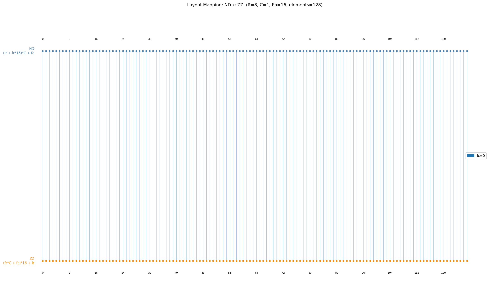
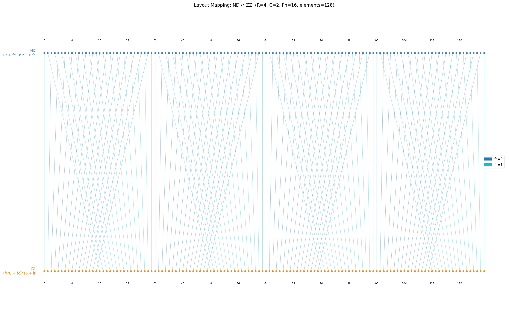
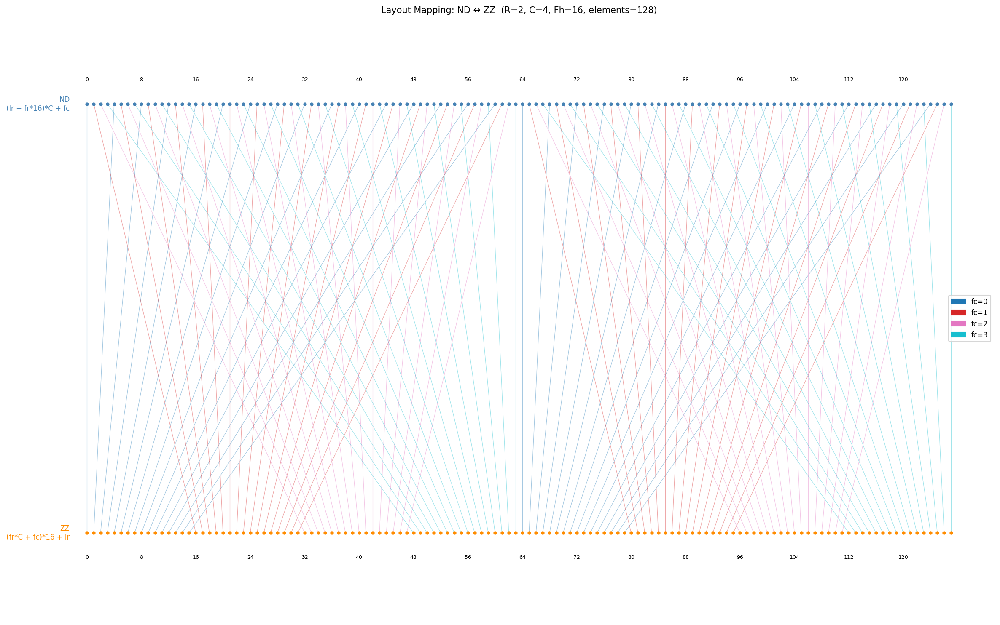
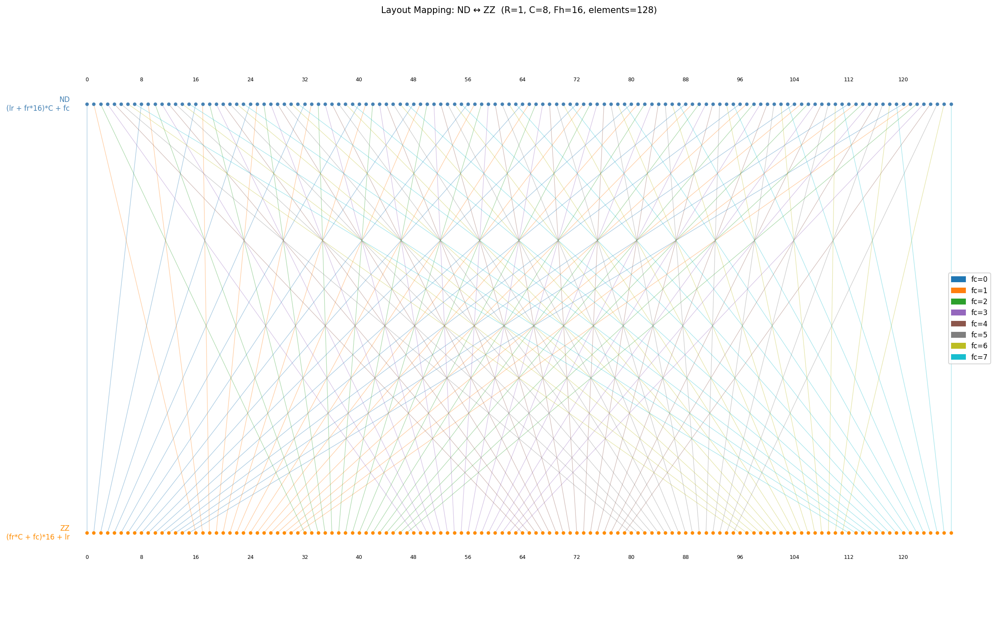
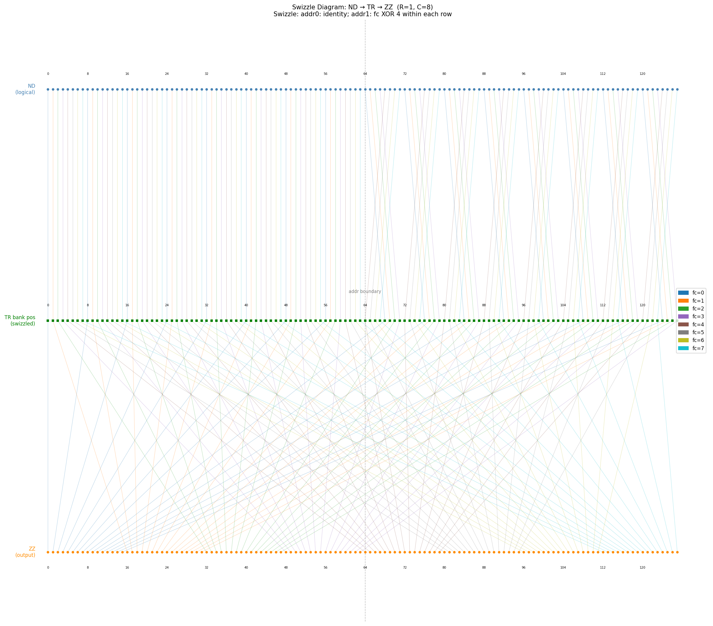

# Tile Permute Unit 架构规格

Cube 执行计算时始终从 Tile Register（TR）获取操作数，并将计算结果写回 TR。Cube 以 16×32B 的矩形数据块为基本单元消费数据，该单元称为分型（Fractal）。TR 以 4KB 为粒度存放数据，因此 Cube 每次消费的数据恰好包含 8 个 Fractal，其排列方式有多种合法组合。TR 中的数据始终以行优先排布（ND）存储。Cube 消费分型时，左矩阵要求 Fractal 内行优先的排布（NZ 或 ZZ），右矩阵要求 Fractal 内列优先的排布（ZN 或 NN）。计算结果始终为 Fractal 内行优先排布。

Tile Permute Unit（TPU）位于 TR 与 Cube 之间，负责上述不同数据排布之间的转换。

---

## 1. 术语与参数

### 1.1 格式定义

| 格式 | 类别 | 含义 | 作用域 |
|------|------|------|--------|
| ND | 行优先排布 | Tile 内行优先，无 stride（连续紧密排布） | TR / TMA 侧 |
| ZZ | 分型排布 | Fractal 内行优先，Fractal 间行优先 | Cube 侧 |
| NZ | 分型排布 | Fractal 内行优先，Fractal 间列优先 | Cube 侧 |
| ZN | 分型排布 | Fractal 内列优先，Fractal 间行优先 | Cube 侧 |
| NN | 分型排布 | Fractal 内列优先，Fractal 间列优先 | Cube 侧 |

### 1.2 Fractal 参数

```
E              元素宽度：1B (INT8) / 2B (FP16) / 4B (FP32)
Fh = 16        Fractal 高度（行数）
Fw = 32B / E   Fractal 宽度（元素数）：INT8=32, FP16=16, FP32=8
               一个 Fractal = Fh × 32B = 16 × 32B = 512B（与 E 无关）

TR 读/写带宽 = 2KB/cycle
```

### 1.3 Tile 参数

```
R              Tile 包含的 Fractal 行数，Tile 高度 = R × Fh = R × 16 行
C              Tile 包含的 Fractal 列数，Tile 行宽 = C × W = C × 32B
               一个 Tile = R × C 个 Fractal = R × C × 512B
```

Fractal 坐标 `(fr, fc)`，`0 ≤ fr < R`，`0 ≤ fc < C`。
Fractal 内行号 `lr`，`0 ≤ lr < 16`。

---

## 2. TR 存储布局示意

以 FP16、R=2、C=2（32×32 元素，4 个 Fractal）为例。

### 2.1 ND 视角

数字为元素在 Tile 内的线性序号。FP16 每行 32 元素 = 2 Fractal 宽。

```
         fc=0 (cols 0..15)      fc=1 (cols 16..31)
        ┌───────────────────┬───────────────────┐
Row  0  │   0   1  ...  15  │  16  17  ...  31  │  ← lr=0
Row  1  │  32  33  ...  47  │  48  49  ...  63  │  ← lr=1
Row  2  │  64  65  ...  79  │  80  81  ...  95  │  ← lr=2
  ...   │       ...         │       ...         │
Row 15  │ 480 481  ... 495  │ 496 497  ... 511  │  ← lr=15
        ├───────────────────┼───────────────────┤  ← fr 边界
Row 16  │ 512 513  ... 527  │ 528 529  ... 543  │  ← lr=0
Row 17  │ 544 545  ... 559  │ 560 561  ... 575  │  ← lr=1
  ...   │       ...         │       ...         │
Row 31  │ 992 993  ...1007  │1008 1009  ...1023 │  ← lr=15
        └───────────────────┴───────────────────┘
```

行优先排布线性公式（单位：元素）：`ND_index = (fr × 16 + lr) × (C × Fw) + fc × Fw + col`

### 2.2 ZZ 视角

同一个 Tile 的 1024 个元素，按 ZZ 线性顺序编号（0..1023）。Fractal 内行优先连续编号，Fractal 间按**行优先**拼接。ZZ 遍历顺序：(0,0) → (0,1) → (1,0) → (1,1)。

数字为 ZZ 线性序号，空间位置与行优先排布视角相同：

```
         fc=0 (cols 0..15)      fc=1 (cols 16..31)
        ┌───────────────────┬───────────────────┐
Row  0  │   0   1  ...  15  │ 256 257  ... 271  │  ← (0,0) lr=0  | (0,1) lr=0
Row  1  │  16  17  ...  31  │ 272 273  ... 287  │  ← (0,0) lr=1  | (0,1) lr=1
Row  2  │  32  33  ...  47  │ 288 289  ... 303  │  ← (0,0) lr=2  | (0,1) lr=2
  ...   │       ...         │       ...         │
Row 15  │ 240 241  ... 255  │ 496 497  ... 511  │  ← (0,0) lr=15 | (0,1) lr=15
        ├───────────────────┼───────────────────┤  ← fr 边界
Row 16  │ 512 513  ... 527  │ 768 769  ... 783  │  ← (1,0) lr=0  | (1,1) lr=0
Row 17  │ 528 529  ... 543  │ 784 785  ... 799  │  ← (1,0) lr=1  | (1,1) lr=1
  ...   │       ...         │       ...         │
Row 31  │ 752 753  ... 767  │1008 1009  ...1023 │  ← (1,0) lr=15 | (1,1) lr=15
        └───────────────────┴───────────────────┘
```

关键性质：
- Fractal 内连续：Fractal(0,0) 的 lr=0 末尾（15）紧接 lr=1 开头（16）
- Fractal 间行优先：Fractal(0,1) 末尾（511）紧接 Fractal(1,0) 开头（512）
- 同一行内跨 fc 不连续：Row 0 左半（0..15）与右半（256..271）相差 256

**ZZ↔行优先排布 元素对应关系**：

| Fractal | lr | ZZ 序号 | 行优先序号 | 行优先含义 |
|---------|-----|---------|-----------|-----------|
| (0,0) | 0 | 0..15 | 0..15 | Row 0, cols 0..15 |
| (0,0) | 1 | 16..31 | 32..47 | Row 1, cols 0..15 |
| ... | ... | ... | ... | ... |
| (0,0) | 15 | 240..255 | 480..495 | Row 15, cols 0..15 |
| (0,1) | 0 | 256..271 | 16..31 | Row 0, cols 16..31 |
| (0,1) | 1 | 272..287 | 48..63 | Row 1, cols 16..31 |
| ... | ... | ... | ... | ... |
| (1,0) | 0 | 512..527 | 512..527 | Row 16, cols 0..15 |
| ... | ... | ... | ... | ... |
| (1,1) | 15 | 1008..1023 | 1008..1023 | Row 31, cols 16..31 |

ZZ 线性公式（单位：元素）：`ZZ_index = (fr × C + fc) × Fh × Fw + lr × Fw + col`

### 2.3 NZ 视角

同一个 Tile 的 1024 个元素，按 NZ 线性顺序编号（0..1023）。Fractal 内行优先连续编号，Fractal 间按**列优先**拼接。NZ 遍历顺序：(0,0) → (1,0) → (0,1) → (1,1)。

数字为 NZ 线性序号，空间位置与行优先排布视角相同：

```
         fc=0 (cols 0..15)      fc=1 (cols 16..31)
        ┌───────────────────┬───────────────────┐
Row  0  │   0   1  ...  15  │ 512 513  ... 527  │  ← (0,0) lr=0  | (0,1) lr=0
Row  1  │  16  17  ...  31  │ 528 529  ... 543  │  ← (0,0) lr=1  | (0,1) lr=1
Row  2  │  32  33  ...  47  │ 544 545  ... 559  │  ← (0,0) lr=2  | (0,1) lr=2
  ...   │       ...         │       ...         │
Row 15  │ 240 241  ... 255  │ 752 753  ... 767  │  ← (0,0) lr=15 | (0,1) lr=15
        ├───────────────────┼───────────────────┤  ← fr 边界
Row 16  │ 256 257  ... 271  │ 768 769  ... 783  │  ← (1,0) lr=0  | (1,1) lr=0
Row 17  │ 272 273  ... 287  │ 784 785  ... 799  │  ← (1,0) lr=1  | (1,1) lr=1
  ...   │       ...         │       ...         │
Row 31  │ 496 497  ... 511  │1008 1009  ...1023 │  ← (1,0) lr=15 | (1,1) lr=15
        └───────────────────┴───────────────────┘
```

关键性质：
- Fractal 内连续：Fractal(0,0) 的 lr=0 末尾（15）紧接 lr=1 开头（16）
- Fractal 间列优先：Fractal(1,0) 末尾（511）紧接 Fractal(0,1) 开头（512）
- 同一行内跨 fc 不连续：Row 0 左半（0..15）与右半（512..527）相差 512

**NZ↔行优先排布 元素对应关系**：

| Fractal | lr | NZ 序号 | 行优先序号 | 行优先含义 |
|---------|-----|---------|-----------|-----------|
| (0,0) | 0 | 0..15 | 0..15 | Row 0, cols 0..15 |
| (0,0) | 1 | 16..31 | 32..47 | Row 1, cols 0..15 |
| ... | ... | ... | ... | ... |
| (0,0) | 15 | 240..255 | 480..495 | Row 15, cols 0..15 |
| (1,0) | 0 | 256..271 | 512..527 | Row 16, cols 0..15 |
| ... | ... | ... | ... | ... |
| (0,1) | 0 | 512..527 | 16..31 | Row 0, cols 16..31 |
| (0,1) | 1 | 528..543 | 48..63 | Row 1, cols 16..31 |
| ... | ... | ... | ... | ... |
| (1,1) | 15 | 1008..1023 | 1008..1023 | Row 31, cols 16..31 |

NZ 线性公式（单位：元素）：`NZ_index = (fc × R + fr) × Fh × Fw + lr × Fw + col`

分型排布→行优先排布转换的本质：将分型排布连续编号的数据，重排为行优先排布连续编号的顺序存入 TR。

### 2.4 4K Tile 内合法分型布局

一个 4K Tile = 4096B = 8 个 Fractal（每个 512B）。不同数据类型的 Fractal 物理形状不同，导致合法的 R×C 组合受限于 Tile 行宽必须 ≥ 32B（一个 TR Bank 行宽）。


合法布局汇总（共 9 种）：

| 数据类型 | Fractal 形状 | 合法布局 | Tile 形状（行×字节宽） |
|---------|-------------|---------|---------------------|
| 16-bit (2B) | 16×32B | R8C1 | 128 × 32B |
| | | R4C2 | 64 × 64B |
| | | R2C4 | 32 × 128B |
| | | R1C8 | 16 × 256B |
| 8-bit (1B) | 16×32B | R4C2 | 64 × 64B |
| | | R2C4 | 32 × 128B |
| | | R1C8 | 16 × 256B |
| 4-bit (0.5B) | 16×32B | R2C4 | 32 × 128B |
| | | R1C8 | 16 × 256B |

**排除规则**：Tile 行宽 = C × 32B 必须 ≥ 32B（始终满足），但 8-bit/4-bit 的转置前 Fractal 形状（32×16B / 64×8B）要求 `C × (转置前列宽) ≥ 32B`，即 8-bit 需 C≥2，4-bit 需 C≥4。

---

## 3. TPU 架构

Tile Permute Unit（TPU）位于 Tile Register（TR）与 Cube 之间，负责分型排布与行优先排布之间的双向转换。


TPU 内部包含：
- **Mux（4:1 置换网络）**：完成行优先排布↔ZZ 分型排布的数据重排。每个 32B 目标元素通过 4:1 mux 从 4 个可能的源位置中选择，选择信号由当前 Tile Shape（R 值）决定。
- **Z2N Network**：执行 ZZ→NN（或 NZ→ZN）的分型内转置
- **4KB Buffer**：缓冲不对齐的转置区域数据（当 2KB 读取跨越两个 64×32B 区域时使用）
- **Original Path**：不需要分型内转置时，数据经 Mux 重排后直接输出
- **Transpose Path**：需要分型内转置时，数据经 Mux 重排后再经 Z2N Network 转置

### 3.1 Cube Inbound Path

TR 以 2KB/cycle 输出行优先排布数据。TPU 的 Mux 根据 R 值将其重排为 ZZ 分型排布，然后根据 Cube 所需格式选择路径：

```
TR(行优先) ──2KB/cy──► Mux(ND→ZZ) ──Original Path──► Cube (ZZ/NZ)
                              └──── Transpose Path ──Z2N Network──► Cube (NN/ZN)
```

- **Original Path**：Cube 需要 ZZ/NZ 时，Mux 完成重排后直接输出
- **Transpose Path**：Cube 需要 NN/ZN 时，Mux 重排后再经 Z2N Network 做分型内转置

### 3.2 Cube Outbound Path

Cube 输出始终为分型排布（ZZ/NZ）。TPU 的 Mux 将其逆向重排为行优先排布后写入 TR。

```
Cube(ZZ/NZ) ──► Mux(ZZ→ND) ──2KB/cy──► TR(行优先)
```

---

## 4. ND2ZZ Mux

Mux 完成行优先排布（ND）与 ZZ 分型排布之间的数据重排。ND↔ZZ 转换本质上是三维数组 `[fr][fc][lr]`（shape `[R, C, 16]`）的轴交换：ZZ 按 `(fr, fc, lr)` 线性化，ND 按 `(fr, lr, fc)` 线性化，两者之间是 `transpose(0, 2, 1)` 操作。

### 4.1 硬件实现

以 32B 为粒度，一个 4K Tile 包含 128 个 32B 元素。Mux 对每个目标位置配置一个 4:1 多路选择器，从 4 个可能的源位置中选取数据。选择信号由当前 Tile Shape（R 值）决定：R∈{1, 2, 4, 8} 对应 4 种置换模式。

### 4.2 各 Tile Shape 的置换映射

以下各图展示 128 个 32B 元素在 ND（左）与 ZZ（右）之间的映射关系。线条颜色区分不同 fc 值。

#### R=8, C=1



R=8, C=1 时仅有一列 Fractal（fc 恒为 0），ND 与 ZZ 排布相同，Mux 为恒等映射。

#### R=4, C=2



交换组大小 = C × 16 = 32 个元素。4 个独立的 32 元素交换组。

#### R=2, C=4



交换组大小 = C × 16 = 64 个元素。2 个独立的 64 元素交换组。

#### R=1, C=8



交换组大小 = C × 16 = 128 个元素。全部 128 个元素参与交换。

R=1 时，ND→ZZ 的置换跨越整个 Tile，无法仅通过 Mux 在单 cycle 的 TR 顺序读取中完成。需要在 TR 写入时预先做 swizzle，使读出数据的顺序适配 Mux 输入。

#### R=1, C=8 的 TR 写入 Swizzle

**目标**：一次 2KB 读取获得 4 个完整 Fractal（16 行 × 32B × 4 = 2KB），且无 bank 冲突。

**方法**：地址 1 写入时，所有 bank 旋转偏移 128B（= 4 个 32B 元素），即 fc → (fc + 4) mod 8。地址 0 不做任何处理。

```
地址 0（无 swizzle）：
  bank 0-3 (fc 0-3)：rows 0-7, fc 0-3
  bank 4-7 (fc 4-7)：rows 0-7, fc 4-7

地址 1（swizzle：所有 bank 旋转 4 位）：
  bank 0-3：存放 fc 4-7 的数据（原 fc 4,5,6,7 旋转到 bank 0,1,2,3）
  bank 4-7：存放 fc 0-3 的数据（原 fc 0,1,2,3 旋转到 bank 4,5,6,7）
```

**Swizzle 公式**：

```
addr = lr / 8                                （0 或 1）
physical_fc = (fc + addr * 4) mod 8          （地址 1 时旋转 4 位）
bank_pos = addr * 64 + lr_in_addr * 8 + physical_fc
```

等价表达：`physical_fc = fc XOR (addr * 4)`，因为对 8 个 bank 旋转 4 位等价于高位取反。

**读取模式**：

每 128B（4 个元素）交替从地址 0 和地址 1 读取。一次 2KB 读取选中的元素位置：

```
读取 Fractal 0-3（完整 16 行）：
  地址 0, bank 0-3：位置 0-3, 8-11, 16-19, 24-27, 32-35, 40-43, 48-51, 56-59
  地址 1, bank 4-7：位置 68-71, 76-79, 84-87, 92-95, 100-103, 108-111, 116-119, 124-127
  → bank 0-3 @ addr0 + bank 4-7 @ addr1，无冲突 ✓

读取 Fractal 4-7（完整 16 行）：
  地址 0, bank 4-7：位置 4-7, 12-15, 20-23, 28-31, 36-39, 44-47, 52-55, 60-63
  地址 1, bank 0-3：位置 64-67, 72-75, 80-83, 88-91, 96-99, 104-107, 112-115, 120-123
  → bank 4-7 @ addr0 + bank 0-3 @ addr1，无冲突 ✓
```



整个 Tile 分两次读出（每次 2KB = 4 完整 Fractal），共 2 cycle。

若不做 swizzle，从同一地址读取 2KB 只能获得 8 个 Fractal 各自的上半部分（rows 0-7）或下半部分（rows 8-15），无法凑出完整 Fractal 供 Mux 消费。

---

## 5. Z2N Transpose Network

Z2N Network 执行分型内的行列转置，将 Fractal 内行优先（Z）转换为 Fractal 内列优先（N）。仅在 Transpose Path 上使用，与 4KB Buffer 配合工作。

### 5.1 转置区域：64 × 32B

转置以 **64 行 × 32B = 2048B** 为固定操作区域。不同元素类型下该区域内的分型排列不同，但总尺寸恒为 2KB。转置后统一为 R4C1 的 4 个 16×32B Fractal。

| 数据类型 | 转置前块形状 | 转置前排列 | 转置后块形状 | 转置后排列 |
|---------|------------|-----------|------------|-----------|
| 16-bit | 16×32B (16r×16c) | R4C1 | 16×32B (16r×16c) | R4C1 |
| 8-bit | 32×16B (32r×16c) | R2C2 | 16×32B (16r×32c) | R4C1 |
| 4-bit | 64×8B (64r×16c) | R1C4 | 16×32B (16r×64c) | R4C1 |


### 5.2 为何无法逐 Fractal 独立转置

| 数据类型 | Fractal 内元素形状 | 转置块形状 | 一个 Fractal 贡献几个转置块 |
|---------|-------------------|-----------|---------------------------|
| 16-bit | 16×16（方阵） | 16×16 | 1（可独立） |
| 8-bit | 16×32 | 32×16 | 2（左半+右半分属不同块） |
| 4-bit | 16×64 | 64×16 | 4（每 16 列分属一个块） |

8-bit 和 4-bit 下，一个 Fractal 的列被拆分到多个转置块中，必须等所有相关数据到齐后才能开始转置。

### 5.3 4KB Buffer 与时序

Z2N Network 处理带宽为 2KB/cycle（一个转置区域/cycle），与上游匹配。

**对齐情况**：Mux 输出的 2KB 恰好构成一个完整转置区域，Z2N Network 直接处理，无需缓冲。

**不对齐情况**：Mux 输出的 2KB 跨越两个转置区域（各取一半），4KB Buffer 缓存前半，等下一 cycle 后半到达后拼接为完整区域再处理。

```
对齐：   Mux 2KB ──► Z2N Network ──► Cube           （1 cycle 延迟）
不对齐： Mux 2KB ──► 4KB Buffer（拼接）──► Z2N ──► Cube  （+1 cycle，稳态仍 1 区域/cy）
```

---

## 6. 待讨论

1. **R=1 的 TR swizzle 方案**：16-bit R1C8 时 Mux 输入需要预处理，TR 写入时的 swizzle 规则待定义。
2. **对齐条件**：什么情况下 Mux 输出恰好对齐一个 64×32B 转置区域？是否可通过 Tile 切分策略保证对齐？
3. **NZ 与 ZZ 的选择**：Cube 左矩阵最终使用 NZ 还是 ZZ？分型间排布差异对 TPU 的影响。
```