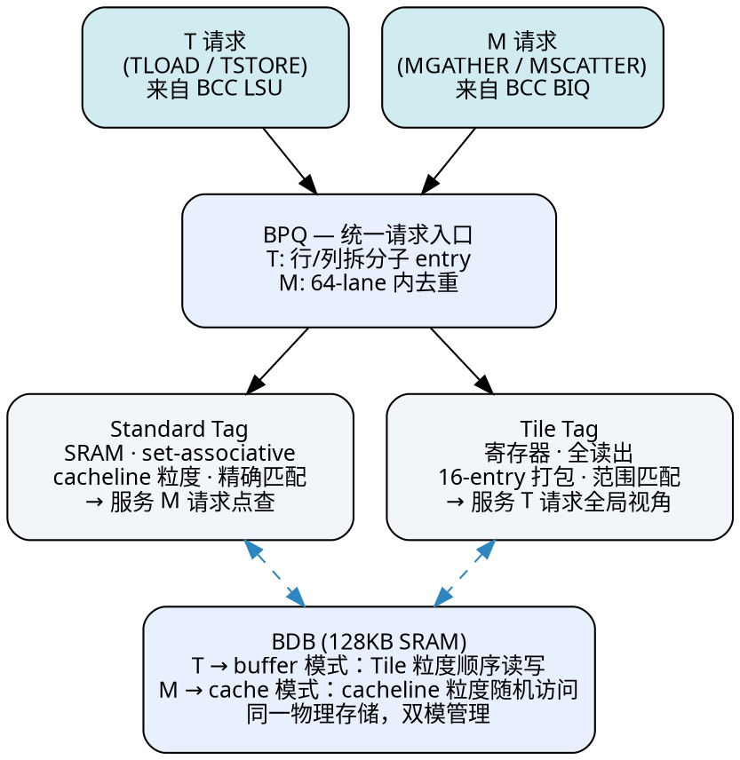

# TMA 设计理念

## 指令背景：TMA 承载的四类访存操作

TMA 接收四条指令，分两类。**TLOAD / TSTORE** 搬运连续内存块，支持布局变换，来自 BCC LSU。**MGATHER / MSCATTER** 按离散地址 gather/scatter，来自 BCC BIQ。前者概括为 **T 请求**，后者概括为 **M 请求**。

| 指令 | 方向 | 访存模式 | 布局变换 |
|------|------|----------|----------|
| TLOAD | Memory → Tile Reg | 连续块 | ND2NZ / ND2ZN / DN2NZ / DN2ZN |
| TSTORE | Tile Reg → Memory | 连续块 | NZ2ND / ZN2ND |
| MGATHER | Memory → Tile Reg | 离散（offset 表） | 无 |
| MSCATTER | Tile Reg → Memory | 离散（offset 表） | 无 |

TLOAD/TSTORE 的布局变换定义了四种源格式。下表以 8×8 元素、分型 4×4 为例：

| 术语 | 排布方式 |
|------|---------|
| **ND** | 行优先。同行元素在内存中连续，行向为内层维度 |
| **DN** | 列优先。同列元素在内存中连续，列向为内层维度 |
| **NZ** | 分型内行优先，分型间列优先 |
| **ZN** | 分型内列优先，分型间行优先 |

### ND2NZ 布局变换

二维网格仅用于可视化——硬件中数据以格子内的数字为一维索引线性存放，数字相邻即内存相邻，网格的行列本身没有硬件意义。同一个数字出现在左右两图的不同位置，意味着该元素在变换后被搬到了不同的存储槽位。右半 NZ 以分型块（四种底色）为组织单位，分型内行优先、分型间列优先。

```dot
digraph ND2NZ {
    rankdir=LR;
    node [shape=plaintext, fontname="sans-serif"];
    splines=false;

    nd [label=<
    <TABLE BORDER="1" CELLBORDER="0" CELLSPACING="0" CELLPADDING="3">
    <TR>
        <TD ><FONT POINT-SIZE="10">0</FONT></TD>
        <TD ><FONT POINT-SIZE="10">1</FONT></TD>
        <TD ><FONT POINT-SIZE="10">2</FONT></TD>
        <TD ><FONT POINT-SIZE="10">3</FONT></TD>
        <TD  SIDES="L"><FONT POINT-SIZE="10">4</FONT></TD>
        <TD ><FONT POINT-SIZE="10">5</FONT></TD>
        <TD ><FONT POINT-SIZE="10">6</FONT></TD>
        <TD ><FONT POINT-SIZE="10">7</FONT></TD>
    </TR>
    <TR>
        <TD ><FONT POINT-SIZE="10">8</FONT></TD>
        <TD ><FONT POINT-SIZE="10">9</FONT></TD>
        <TD ><FONT POINT-SIZE="10">10</FONT></TD>
        <TD ><FONT POINT-SIZE="10">11</FONT></TD>
        <TD  SIDES="L"><FONT POINT-SIZE="10">12</FONT></TD>
        <TD ><FONT POINT-SIZE="10">13</FONT></TD>
        <TD ><FONT POINT-SIZE="10">14</FONT></TD>
        <TD ><FONT POINT-SIZE="10">15</FONT></TD>
    </TR>
    <TR>
        <TD ><FONT POINT-SIZE="10">16</FONT></TD>
        <TD ><FONT POINT-SIZE="10">17</FONT></TD>
        <TD ><FONT POINT-SIZE="10">18</FONT></TD>
        <TD ><FONT POINT-SIZE="10">19</FONT></TD>
        <TD  SIDES="L"><FONT POINT-SIZE="10">20</FONT></TD>
        <TD ><FONT POINT-SIZE="10">21</FONT></TD>
        <TD ><FONT POINT-SIZE="10">22</FONT></TD>
        <TD ><FONT POINT-SIZE="10">23</FONT></TD>
    </TR>
    <TR>
        <TD ><FONT POINT-SIZE="10">24</FONT></TD>
        <TD ><FONT POINT-SIZE="10">25</FONT></TD>
        <TD ><FONT POINT-SIZE="10">26</FONT></TD>
        <TD ><FONT POINT-SIZE="10">27</FONT></TD>
        <TD  SIDES="L"><FONT POINT-SIZE="10">28</FONT></TD>
        <TD ><FONT POINT-SIZE="10">29</FONT></TD>
        <TD ><FONT POINT-SIZE="10">30</FONT></TD>
        <TD ><FONT POINT-SIZE="10">31</FONT></TD>
    </TR>
    <TR>
        <TD ><FONT POINT-SIZE="10">32</FONT></TD>
        <TD ><FONT POINT-SIZE="10">33</FONT></TD>
        <TD ><FONT POINT-SIZE="10">34</FONT></TD>
        <TD ><FONT POINT-SIZE="10">35</FONT></TD>
        <TD  SIDES="L"><FONT POINT-SIZE="10">36</FONT></TD>
        <TD ><FONT POINT-SIZE="10">37</FONT></TD>
        <TD ><FONT POINT-SIZE="10">38</FONT></TD>
        <TD ><FONT POINT-SIZE="10">39</FONT></TD>
    </TR>
    <TR>
        <TD ><FONT POINT-SIZE="10">40</FONT></TD>
        <TD ><FONT POINT-SIZE="10">41</FONT></TD>
        <TD ><FONT POINT-SIZE="10">42</FONT></TD>
        <TD ><FONT POINT-SIZE="10">43</FONT></TD>
        <TD  SIDES="L"><FONT POINT-SIZE="10">44</FONT></TD>
        <TD ><FONT POINT-SIZE="10">45</FONT></TD>
        <TD ><FONT POINT-SIZE="10">46</FONT></TD>
        <TD ><FONT POINT-SIZE="10">47</FONT></TD>
    </TR>
    <TR>
        <TD ><FONT POINT-SIZE="10">48</FONT></TD>
        <TD ><FONT POINT-SIZE="10">49</FONT></TD>
        <TD ><FONT POINT-SIZE="10">50</FONT></TD>
        <TD ><FONT POINT-SIZE="10">51</FONT></TD>
        <TD  SIDES="L"><FONT POINT-SIZE="10">52</FONT></TD>
        <TD ><FONT POINT-SIZE="10">53</FONT></TD>
        <TD ><FONT POINT-SIZE="10">54</FONT></TD>
        <TD ><FONT POINT-SIZE="10">55</FONT></TD>
    </TR>
    <TR>
        <TD ><FONT POINT-SIZE="10">56</FONT></TD>
        <TD ><FONT POINT-SIZE="10">57</FONT></TD>
        <TD ><FONT POINT-SIZE="10">58</FONT></TD>
        <TD ><FONT POINT-SIZE="10">59</FONT></TD>
        <TD  SIDES="L"><FONT POINT-SIZE="10">60</FONT></TD>
        <TD ><FONT POINT-SIZE="10">61</FONT></TD>
        <TD ><FONT POINT-SIZE="10">62</FONT></TD>
        <TD ><FONT POINT-SIZE="10">63</FONT></TD>
    </TR>
    </TABLE>
    >];

    nz_node [label=<
    <TABLE BORDER="1" CELLBORDER="0" CELLSPACING="0" CELLPADDING="3">
    <TR>
        <TD BGCOLOR="#D5F5E3"><FONT POINT-SIZE="10">0</FONT></TD>
        <TD BGCOLOR="#D5F5E3"><FONT POINT-SIZE="10">1</FONT></TD>
        <TD BGCOLOR="#D5F5E3"><FONT POINT-SIZE="10">2</FONT></TD>
        <TD BGCOLOR="#D5F5E3"><FONT POINT-SIZE="10">3</FONT></TD>
        <TD BGCOLOR="#D6EAF8" SIDES="L"><FONT POINT-SIZE="10">32</FONT></TD>
        <TD BGCOLOR="#D6EAF8"><FONT POINT-SIZE="10">33</FONT></TD>
        <TD BGCOLOR="#D6EAF8"><FONT POINT-SIZE="10">34</FONT></TD>
        <TD BGCOLOR="#D6EAF8"><FONT POINT-SIZE="10">35</FONT></TD>
    </TR>
    <TR>
        <TD BGCOLOR="#D5F5E3"><FONT POINT-SIZE="10">4</FONT></TD>
        <TD BGCOLOR="#D5F5E3"><FONT POINT-SIZE="10">5</FONT></TD>
        <TD BGCOLOR="#D5F5E3"><FONT POINT-SIZE="10">6</FONT></TD>
        <TD BGCOLOR="#D5F5E3"><FONT POINT-SIZE="10">7</FONT></TD>
        <TD BGCOLOR="#D6EAF8" SIDES="L"><FONT POINT-SIZE="10">36</FONT></TD>
        <TD BGCOLOR="#D6EAF8"><FONT POINT-SIZE="10">37</FONT></TD>
        <TD BGCOLOR="#D6EAF8"><FONT POINT-SIZE="10">38</FONT></TD>
        <TD BGCOLOR="#D6EAF8"><FONT POINT-SIZE="10">39</FONT></TD>
    </TR>
    <TR>
        <TD BGCOLOR="#D5F5E3"><FONT POINT-SIZE="10">8</FONT></TD>
        <TD BGCOLOR="#D5F5E3"><FONT POINT-SIZE="10">9</FONT></TD>
        <TD BGCOLOR="#D5F5E3"><FONT POINT-SIZE="10">10</FONT></TD>
        <TD BGCOLOR="#D5F5E3"><FONT POINT-SIZE="10">11</FONT></TD>
        <TD BGCOLOR="#D6EAF8" SIDES="L"><FONT POINT-SIZE="10">40</FONT></TD>
        <TD BGCOLOR="#D6EAF8"><FONT POINT-SIZE="10">41</FONT></TD>
        <TD BGCOLOR="#D6EAF8"><FONT POINT-SIZE="10">42</FONT></TD>
        <TD BGCOLOR="#D6EAF8"><FONT POINT-SIZE="10">43</FONT></TD>
    </TR>
    <TR>
        <TD BGCOLOR="#D5F5E3"><FONT POINT-SIZE="10">12</FONT></TD>
        <TD BGCOLOR="#D5F5E3"><FONT POINT-SIZE="10">13</FONT></TD>
        <TD BGCOLOR="#D5F5E3"><FONT POINT-SIZE="10">14</FONT></TD>
        <TD BGCOLOR="#D5F5E3"><FONT POINT-SIZE="10">15</FONT></TD>
        <TD BGCOLOR="#D6EAF8" SIDES="L"><FONT POINT-SIZE="10">44</FONT></TD>
        <TD BGCOLOR="#D6EAF8"><FONT POINT-SIZE="10">45</FONT></TD>
        <TD BGCOLOR="#D6EAF8"><FONT POINT-SIZE="10">46</FONT></TD>
        <TD BGCOLOR="#D6EAF8"><FONT POINT-SIZE="10">47</FONT></TD>
    </TR>
    <TR>
        <TD BGCOLOR="#FADBD8"><FONT POINT-SIZE="10">16</FONT></TD>
        <TD BGCOLOR="#FADBD8"><FONT POINT-SIZE="10">17</FONT></TD>
        <TD BGCOLOR="#FADBD8"><FONT POINT-SIZE="10">18</FONT></TD>
        <TD BGCOLOR="#FADBD8"><FONT POINT-SIZE="10">19</FONT></TD>
        <TD BGCOLOR="#FCF3CF" SIDES="L"><FONT POINT-SIZE="10">48</FONT></TD>
        <TD BGCOLOR="#FCF3CF"><FONT POINT-SIZE="10">49</FONT></TD>
        <TD BGCOLOR="#FCF3CF"><FONT POINT-SIZE="10">50</FONT></TD>
        <TD BGCOLOR="#FCF3CF"><FONT POINT-SIZE="10">51</FONT></TD>
    </TR>
    <TR>
        <TD BGCOLOR="#FADBD8"><FONT POINT-SIZE="10">20</FONT></TD>
        <TD BGCOLOR="#FADBD8"><FONT POINT-SIZE="10">21</FONT></TD>
        <TD BGCOLOR="#FADBD8"><FONT POINT-SIZE="10">22</FONT></TD>
        <TD BGCOLOR="#FADBD8"><FONT POINT-SIZE="10">23</FONT></TD>
        <TD BGCOLOR="#FCF3CF" SIDES="L"><FONT POINT-SIZE="10">52</FONT></TD>
        <TD BGCOLOR="#FCF3CF"><FONT POINT-SIZE="10">53</FONT></TD>
        <TD BGCOLOR="#FCF3CF"><FONT POINT-SIZE="10">54</FONT></TD>
        <TD BGCOLOR="#FCF3CF"><FONT POINT-SIZE="10">55</FONT></TD>
    </TR>
    <TR>
        <TD BGCOLOR="#FADBD8"><FONT POINT-SIZE="10">24</FONT></TD>
        <TD BGCOLOR="#FADBD8"><FONT POINT-SIZE="10">25</FONT></TD>
        <TD BGCOLOR="#FADBD8"><FONT POINT-SIZE="10">26</FONT></TD>
        <TD BGCOLOR="#FADBD8"><FONT POINT-SIZE="10">27</FONT></TD>
        <TD BGCOLOR="#FCF3CF" SIDES="L"><FONT POINT-SIZE="10">56</FONT></TD>
        <TD BGCOLOR="#FCF3CF"><FONT POINT-SIZE="10">57</FONT></TD>
        <TD BGCOLOR="#FCF3CF"><FONT POINT-SIZE="10">58</FONT></TD>
        <TD BGCOLOR="#FCF3CF"><FONT POINT-SIZE="10">59</FONT></TD>
    </TR>
    <TR>
        <TD BGCOLOR="#FADBD8"><FONT POINT-SIZE="10">28</FONT></TD>
        <TD BGCOLOR="#FADBD8"><FONT POINT-SIZE="10">29</FONT></TD>
        <TD BGCOLOR="#FADBD8"><FONT POINT-SIZE="10">30</FONT></TD>
        <TD BGCOLOR="#FADBD8"><FONT POINT-SIZE="10">31</FONT></TD>
        <TD BGCOLOR="#FCF3CF" SIDES="L"><FONT POINT-SIZE="10">60</FONT></TD>
        <TD BGCOLOR="#FCF3CF"><FONT POINT-SIZE="10">61</FONT></TD>
        <TD BGCOLOR="#FCF3CF"><FONT POINT-SIZE="10">62</FONT></TD>
        <TD BGCOLOR="#FCF3CF"><FONT POINT-SIZE="10">63</FONT></TD>
    </TR>
    </TABLE>
    >];

    nd -> nz_node [label="  ND2NZ", fontsize=16, fontcolor="#2E86C1", style="bold"];
    label="ND2NZ 布局变换示意（8×8 元素，分型 4×4）";
    fontsize=13;
    fontcolor="#2C3E50";
}
```

### ND2ZN 布局变换

NZ → ZN 两个变化：(1) 分型间变为行优先——左下和右上分型交换位置；(2) 分型内部变为列优先——NZ 中每列变为 ZN 中每行。

```dot
digraph ND2ZN {
    rankdir=LR;
    node [shape=plaintext, fontname="sans-serif"];
    splines=false;

    nd [label=<
    <TABLE BORDER="1" CELLBORDER="0" CELLSPACING="0" CELLPADDING="3">
    <TR>
        <TD ><FONT POINT-SIZE="10">0</FONT></TD>
        <TD ><FONT POINT-SIZE="10">1</FONT></TD>
        <TD ><FONT POINT-SIZE="10">2</FONT></TD>
        <TD ><FONT POINT-SIZE="10">3</FONT></TD>
        <TD  SIDES="L"><FONT POINT-SIZE="10">4</FONT></TD>
        <TD ><FONT POINT-SIZE="10">5</FONT></TD>
        <TD ><FONT POINT-SIZE="10">6</FONT></TD>
        <TD ><FONT POINT-SIZE="10">7</FONT></TD>
    </TR>
    <TR>
        <TD ><FONT POINT-SIZE="10">8</FONT></TD>
        <TD ><FONT POINT-SIZE="10">9</FONT></TD>
        <TD ><FONT POINT-SIZE="10">10</FONT></TD>
        <TD ><FONT POINT-SIZE="10">11</FONT></TD>
        <TD  SIDES="L"><FONT POINT-SIZE="10">12</FONT></TD>
        <TD ><FONT POINT-SIZE="10">13</FONT></TD>
        <TD ><FONT POINT-SIZE="10">14</FONT></TD>
        <TD ><FONT POINT-SIZE="10">15</FONT></TD>
    </TR>
    <TR>
        <TD ><FONT POINT-SIZE="10">16</FONT></TD>
        <TD ><FONT POINT-SIZE="10">17</FONT></TD>
        <TD ><FONT POINT-SIZE="10">18</FONT></TD>
        <TD ><FONT POINT-SIZE="10">19</FONT></TD>
        <TD  SIDES="L"><FONT POINT-SIZE="10">20</FONT></TD>
        <TD ><FONT POINT-SIZE="10">21</FONT></TD>
        <TD ><FONT POINT-SIZE="10">22</FONT></TD>
        <TD ><FONT POINT-SIZE="10">23</FONT></TD>
    </TR>
    <TR>
        <TD ><FONT POINT-SIZE="10">24</FONT></TD>
        <TD ><FONT POINT-SIZE="10">25</FONT></TD>
        <TD ><FONT POINT-SIZE="10">26</FONT></TD>
        <TD ><FONT POINT-SIZE="10">27</FONT></TD>
        <TD  SIDES="L"><FONT POINT-SIZE="10">28</FONT></TD>
        <TD ><FONT POINT-SIZE="10">29</FONT></TD>
        <TD ><FONT POINT-SIZE="10">30</FONT></TD>
        <TD ><FONT POINT-SIZE="10">31</FONT></TD>
    </TR>
    <TR>
        <TD ><FONT POINT-SIZE="10">32</FONT></TD>
        <TD ><FONT POINT-SIZE="10">33</FONT></TD>
        <TD ><FONT POINT-SIZE="10">34</FONT></TD>
        <TD ><FONT POINT-SIZE="10">35</FONT></TD>
        <TD  SIDES="L"><FONT POINT-SIZE="10">36</FONT></TD>
        <TD ><FONT POINT-SIZE="10">37</FONT></TD>
        <TD ><FONT POINT-SIZE="10">38</FONT></TD>
        <TD ><FONT POINT-SIZE="10">39</FONT></TD>
    </TR>
    <TR>
        <TD ><FONT POINT-SIZE="10">40</FONT></TD>
        <TD ><FONT POINT-SIZE="10">41</FONT></TD>
        <TD ><FONT POINT-SIZE="10">42</FONT></TD>
        <TD ><FONT POINT-SIZE="10">43</FONT></TD>
        <TD  SIDES="L"><FONT POINT-SIZE="10">44</FONT></TD>
        <TD ><FONT POINT-SIZE="10">45</FONT></TD>
        <TD ><FONT POINT-SIZE="10">46</FONT></TD>
        <TD ><FONT POINT-SIZE="10">47</FONT></TD>
    </TR>
    <TR>
        <TD ><FONT POINT-SIZE="10">48</FONT></TD>
        <TD ><FONT POINT-SIZE="10">49</FONT></TD>
        <TD ><FONT POINT-SIZE="10">50</FONT></TD>
        <TD ><FONT POINT-SIZE="10">51</FONT></TD>
        <TD  SIDES="L"><FONT POINT-SIZE="10">52</FONT></TD>
        <TD ><FONT POINT-SIZE="10">53</FONT></TD>
        <TD ><FONT POINT-SIZE="10">54</FONT></TD>
        <TD ><FONT POINT-SIZE="10">55</FONT></TD>
    </TR>
    <TR>
        <TD ><FONT POINT-SIZE="10">56</FONT></TD>
        <TD ><FONT POINT-SIZE="10">57</FONT></TD>
        <TD ><FONT POINT-SIZE="10">58</FONT></TD>
        <TD ><FONT POINT-SIZE="10">59</FONT></TD>
        <TD  SIDES="L"><FONT POINT-SIZE="10">60</FONT></TD>
        <TD ><FONT POINT-SIZE="10">61</FONT></TD>
        <TD ><FONT POINT-SIZE="10">62</FONT></TD>
        <TD ><FONT POINT-SIZE="10">63</FONT></TD>
    </TR>
    </TABLE>
    >];

    zn_node [label=<
    <TABLE BORDER="1" CELLBORDER="0" CELLSPACING="0" CELLPADDING="3">
    <TR>
        <TD BGCOLOR="#D5F5E3"><FONT POINT-SIZE="10">0</FONT></TD>
        <TD BGCOLOR="#D5F5E3"><FONT POINT-SIZE="10">4</FONT></TD>
        <TD BGCOLOR="#D5F5E3"><FONT POINT-SIZE="10">8</FONT></TD>
        <TD BGCOLOR="#D5F5E3"><FONT POINT-SIZE="10">12</FONT></TD>
        <TD BGCOLOR="#FADBD8" SIDES="L"><FONT POINT-SIZE="10">16</FONT></TD>
        <TD BGCOLOR="#FADBD8"><FONT POINT-SIZE="10">20</FONT></TD>
        <TD BGCOLOR="#FADBD8"><FONT POINT-SIZE="10">24</FONT></TD>
        <TD BGCOLOR="#FADBD8"><FONT POINT-SIZE="10">28</FONT></TD>
    </TR>
    <TR>
        <TD BGCOLOR="#D5F5E3"><FONT POINT-SIZE="10">1</FONT></TD>
        <TD BGCOLOR="#D5F5E3"><FONT POINT-SIZE="10">5</FONT></TD>
        <TD BGCOLOR="#D5F5E3"><FONT POINT-SIZE="10">9</FONT></TD>
        <TD BGCOLOR="#D5F5E3"><FONT POINT-SIZE="10">13</FONT></TD>
        <TD BGCOLOR="#FADBD8" SIDES="L"><FONT POINT-SIZE="10">17</FONT></TD>
        <TD BGCOLOR="#FADBD8"><FONT POINT-SIZE="10">21</FONT></TD>
        <TD BGCOLOR="#FADBD8"><FONT POINT-SIZE="10">25</FONT></TD>
        <TD BGCOLOR="#FADBD8"><FONT POINT-SIZE="10">29</FONT></TD>
    </TR>
    <TR>
        <TD BGCOLOR="#D5F5E3"><FONT POINT-SIZE="10">2</FONT></TD>
        <TD BGCOLOR="#D5F5E3"><FONT POINT-SIZE="10">6</FONT></TD>
        <TD BGCOLOR="#D5F5E3"><FONT POINT-SIZE="10">10</FONT></TD>
        <TD BGCOLOR="#D5F5E3"><FONT POINT-SIZE="10">14</FONT></TD>
        <TD BGCOLOR="#FADBD8" SIDES="L"><FONT POINT-SIZE="10">18</FONT></TD>
        <TD BGCOLOR="#FADBD8"><FONT POINT-SIZE="10">22</FONT></TD>
        <TD BGCOLOR="#FADBD8"><FONT POINT-SIZE="10">26</FONT></TD>
        <TD BGCOLOR="#FADBD8"><FONT POINT-SIZE="10">30</FONT></TD>
    </TR>
    <TR>
        <TD BGCOLOR="#D5F5E3"><FONT POINT-SIZE="10">3</FONT></TD>
        <TD BGCOLOR="#D5F5E3"><FONT POINT-SIZE="10">7</FONT></TD>
        <TD BGCOLOR="#D5F5E3"><FONT POINT-SIZE="10">11</FONT></TD>
        <TD BGCOLOR="#D5F5E3"><FONT POINT-SIZE="10">15</FONT></TD>
        <TD BGCOLOR="#FADBD8" SIDES="L"><FONT POINT-SIZE="10">19</FONT></TD>
        <TD BGCOLOR="#FADBD8"><FONT POINT-SIZE="10">23</FONT></TD>
        <TD BGCOLOR="#FADBD8"><FONT POINT-SIZE="10">27</FONT></TD>
        <TD BGCOLOR="#FADBD8"><FONT POINT-SIZE="10">31</FONT></TD>
    </TR>
    <TR>
        <TD BGCOLOR="#D6EAF8"><FONT POINT-SIZE="10">32</FONT></TD>
        <TD BGCOLOR="#D6EAF8"><FONT POINT-SIZE="10">36</FONT></TD>
        <TD BGCOLOR="#D6EAF8"><FONT POINT-SIZE="10">40</FONT></TD>
        <TD BGCOLOR="#D6EAF8"><FONT POINT-SIZE="10">44</FONT></TD>
        <TD BGCOLOR="#FCF3CF" SIDES="L"><FONT POINT-SIZE="10">48</FONT></TD>
        <TD BGCOLOR="#FCF3CF"><FONT POINT-SIZE="10">52</FONT></TD>
        <TD BGCOLOR="#FCF3CF"><FONT POINT-SIZE="10">56</FONT></TD>
        <TD BGCOLOR="#FCF3CF"><FONT POINT-SIZE="10">60</FONT></TD>
    </TR>
    <TR>
        <TD BGCOLOR="#D6EAF8"><FONT POINT-SIZE="10">33</FONT></TD>
        <TD BGCOLOR="#D6EAF8"><FONT POINT-SIZE="10">37</FONT></TD>
        <TD BGCOLOR="#D6EAF8"><FONT POINT-SIZE="10">41</FONT></TD>
        <TD BGCOLOR="#D6EAF8"><FONT POINT-SIZE="10">45</FONT></TD>
        <TD BGCOLOR="#FCF3CF" SIDES="L"><FONT POINT-SIZE="10">49</FONT></TD>
        <TD BGCOLOR="#FCF3CF"><FONT POINT-SIZE="10">53</FONT></TD>
        <TD BGCOLOR="#FCF3CF"><FONT POINT-SIZE="10">57</FONT></TD>
        <TD BGCOLOR="#FCF3CF"><FONT POINT-SIZE="10">61</FONT></TD>
    </TR>
    <TR>
        <TD BGCOLOR="#D6EAF8"><FONT POINT-SIZE="10">34</FONT></TD>
        <TD BGCOLOR="#D6EAF8"><FONT POINT-SIZE="10">38</FONT></TD>
        <TD BGCOLOR="#D6EAF8"><FONT POINT-SIZE="10">42</FONT></TD>
        <TD BGCOLOR="#D6EAF8"><FONT POINT-SIZE="10">46</FONT></TD>
        <TD BGCOLOR="#FCF3CF" SIDES="L"><FONT POINT-SIZE="10">50</FONT></TD>
        <TD BGCOLOR="#FCF3CF"><FONT POINT-SIZE="10">54</FONT></TD>
        <TD BGCOLOR="#FCF3CF"><FONT POINT-SIZE="10">58</FONT></TD>
        <TD BGCOLOR="#FCF3CF"><FONT POINT-SIZE="10">62</FONT></TD>
    </TR>
    <TR>
        <TD BGCOLOR="#D6EAF8"><FONT POINT-SIZE="10">35</FONT></TD>
        <TD BGCOLOR="#D6EAF8"><FONT POINT-SIZE="10">39</FONT></TD>
        <TD BGCOLOR="#D6EAF8"><FONT POINT-SIZE="10">43</FONT></TD>
        <TD BGCOLOR="#D6EAF8"><FONT POINT-SIZE="10">47</FONT></TD>
        <TD BGCOLOR="#FCF3CF" SIDES="L"><FONT POINT-SIZE="10">51</FONT></TD>
        <TD BGCOLOR="#FCF3CF"><FONT POINT-SIZE="10">55</FONT></TD>
        <TD BGCOLOR="#FCF3CF"><FONT POINT-SIZE="10">59</FONT></TD>
        <TD BGCOLOR="#FCF3CF"><FONT POINT-SIZE="10">63</FONT></TD>
    </TR>
    </TABLE>
    >];

    nd -> zn_node [label="  ND2ZN", fontsize=16, fontcolor="#2E86C1", style="bold"];
    label="ND2ZN 布局变换示意（8×8 元素，分型 4×4）";
    fontsize=13;
    fontcolor="#2C3E50";
}
```

---

## Why：矩阵搬运优先

TMA 是 Janus Core 的 **统一 Tile 访存通路**，接收两类请求：来自 BCC LSU 的 **T 请求**（TLOAD/TSTORE，矩阵格式转换搬运），和来自 BCC BIQ 的 **M 请求**（MGATHER/MSCATTER，向量 gather/scatter）。内部以一块 128KB BDB 为数据中枢，一套 Tag Pipe 做命中判定，一套 CAQ/RFB 做命中/缺失分流，南北分别对接 Tile Register Ring 和 Memory SoC。

内积矩阵乘法 C = A × B 中，systolic array 每个 cycle 消耗 256B × 2 的输入数据。左矩阵 A 需要 NZ 格式——分型内行优先、分型间列优先；右矩阵 B 需要 ZN 格式——分型内列优先、分型间行优先。两块矩阵在 Tile Register 中以分型格式（NZ/ZN：内层 32B，外层 16 行）排布，而内存中是标准行优先排布。TLOAD/TSTORE 负责二者之间的格式转换搬运——这是内积矩阵运算的数据生命线。与之相比，gather/scatter 的调用频次和带宽需求在绝大多数 workload 中低一个量级。

这一不对称直接决定了资源策略：

| | T 请求 | M 请求 |
|---|---|---|
| 访问模式 | 连续、批量、可预测 | 随机、cacheline 粒度、不可预测 |
| BDB 使用方式 | buffer：顺序写入、顺序消费 | cache：按需取用、时间局部性 |
| 带宽需求 | 高（多拍连续读） | 低（一拍一个 cacheline） |
| 面积投资定位 | 主要投资方向 | 复用已开辟资源 |

**TMA 的主要面积投资服务 T 请求。M 请求复用 T 请求已开辟的资源。** 这一判断贯穿以下全部设计决策。

---

## Design Choice 1：BDB 双模——同一块 SRAM，buffer 与 cache 并存

T 请求和 M 请求对片上存储的使用方式互不兼容。若各建一块专用 SRAM，面积翻倍。

**方案**：128KB BDB 作为唯一数据存储。T 请求以 Tile 粒度（16 entry，由分型尺寸决定）连续分配和消费——buffer 模式。M 请求以 cacheline 粒度随机访问，通过 Standard Tag 做精确地址匹配，命中则复用，缺失则分配，冲突则逐出——cache 模式。两套 Tag 各自管理各自的空间，通过一致性检查保持互斥。

效果：同一块物理 SRAM，两种经营逻辑并存。T 请求繁忙时 BDB 大部分空间以 buffer 模式高效运转；T 请求空闲时 M 请求可自由使用剩余空间——无需额外 SRAM、无需专用缓存。

---

## Design Choice 2：双 Tag 并存——不同物理介质，不同访问范围

两种请求对 Tag 的查询需求存在根本差异：

| | Standard Tag | Tile Tag |
|---|---|---|
| 物理实现 | SRAM，set-associative | 寄存器，全读出 |
| 可读出范围 | 部分索引（一个 set） | 全部读出（一拍） |
| 匹配方式 | 精确地址匹配 | 二维范围匹配（base addr + stride） |
| 粒度 | 1 cacheline | 16 entry 打包（Tile） |
| 适合的请求类型 | M 请求（点查命中/缺失） | T 请求（需要全局可用性信息） |

T 请求需要一次掌握整个 BDB 的空间占用——哪些 Tile 区域已被分配、哪里有空位——这是范围查询。Standard Tag 的 SRAM 结构做不到一拍全读出。反过来，若把 Tile Tag 的信息量塞进寄存器做全读出，容量不足以管理大量独立的 M cacheline 条目。

**两套 Tag 同时查询，综合判定命中。** 同一笔请求可能两边都不命中、只在一边命中、或两边都命中——由 Tag Pipe 统一仲裁。合并为一套 Tag 的最大障碍不是命中逻辑不同，而是物理实现介质不同。

---

## Design Choice 3：Alloc-on-Miss——省 96KB 返回数据缓冲

BDB 缺失时有两种处理时序：

| | Alloc-on-Fill | Alloc-on-Miss（本方案） |
|---|---|---|
| 分配时机 | 数据从 Memory 返回后 | Tag Pipe 阶段当场决定 |
| 逐出决策 | 数据返回后 | Tag Pipe 阶段同时决定 |
| per-RFB 返回缓冲 | 需要（每个 RFB 256B） | 不需要 |
| 面积代价 | 384 × 256B ≈ 96KB | 0 |
| 有效 BDB 容量 | 全部可用于已就绪数据 | 部分被等待返回的数据占位 |
| Tag 访问次数 | 2 次（分配 + 返回后更新） | 1 次（分配即确定） |

**选择 Alloc-on-Miss 的理由**：省掉 96KB 的 per-RFB 返回数据缓冲器，同时简化数据返回路径——无需在返回时重新访问和修改 Tag。代价是 BDB 中部分空间被尚未就绪的数据占着，有效容量略低于物理容量。这个代价在 T 请求主导的场景下可控——T 请求的空间分配是确定性的（Tile 粒度、已知范围），不像纯 cache 那样依赖运行时逐出策略的动态行为。
