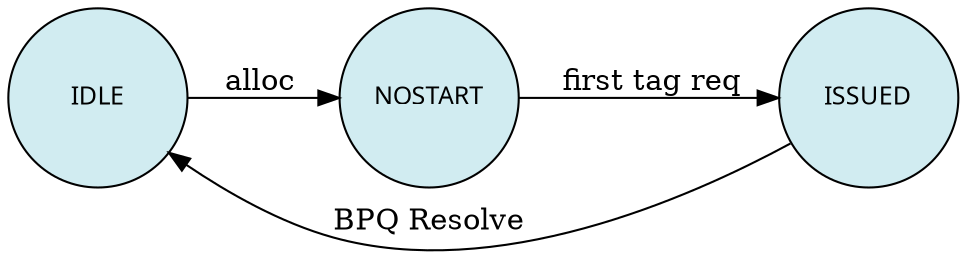

# TMA (Tile Memory Access) 架构文档

## 概述

### BCC 通道与 Memory Model

从指令集层面，Janus Core 存在 **BCC 通道**， **TMA 通道**和**VEC 通道**三种访存通路。

- **BCC标量访存**：标量 PE 发出的 ld、st 微指令
- **Tile 访存**：模板块发出的 TLOAD、TSTORE、MGATHER、MSCATTER 指令
- **VEC SIMT访存**：VEC PE 的 MPAR 块，发出的v.ld.global和v.st.global微指令

BCC 标量访存和 TLOAD、TSTORE 可以在指令流中混合下发，由 BCC LSU 的 **LDQ** 和 **STQ** 统一进行地址重叠检查和程序序保序。Tile 指令经由 BISQ（即 BCC BIQ）发射，标量指令经由标量 PE 的 lda/sta/std 等 ISQ 发射；源寄存器就绪后，均送入 LDQ/STQ。

Memory Model 要求：即使不存在屏障指令，所有访存指令的执行结果与按程序序执行相同。以如下指令流为例：

```
store  addr1
load   addr2
store  base1+size1
load   base3+size3
store  addr3
```

- 若 `addr1` 与 `addr2` 重合，load 须读到 store 之前的内存内容
- 若 `addr2` 与 `base1+size1` 重合，第二个 store 须读到 load 之后的内存内容
- 若 `base3+size3` 与 `addr3` 重合，第二个 load 须读到第二个 store 之后的内存内容

BCC LSU 侧关键组件：

| 组件 | 用途 |
|------|------|
| **LDQ** | 标量访存与 Tile 访存共用 |
| **STQ** | 标量访存与 Tile 访存共用 |
| **LHQ** | 标量访存专用 |
| **SCB** | 标量访存专用 |
| **TSRQ** | Tile 访存专用，存放 Resolve 后、Commit 前的 TSTORE，供后续 load 做地址检查 |

> 只有标量访存的数据进入 L1D；Tile 访存数据不进入 L1D。

### TMA 内部聚焦

以上为 TMA 外部（BCC LSU 侧）流程。本 spec 聚焦 **TMA 内部微架构**。

TMA 作为 BCC LSU 和 VEC 的下游，接收四类请求：**TLOAD、TSTORE、MGATHER、MSCATTER**。其中：

- **TLOAD、TSTORE** 来自 BCC LSU，概括为 **T 请求**
- **MGATHER、MSCATTER** 来自 BCC BIQ，概括为 **M 请求**；其内部处理包含 VGATHER 和 VSCATTER

TMA 内部存在缓存（BDB），以充分利用 M 请求和部分 T 请求的局部性。

### 接口说明

| 信号性质 | 源 → 目标 | 内容 |
|---------|----------|------|
| 请求 | BCC BIQ → TMA | TCVT、TMOV、MGATHER、MSCATTER |
| 请求 | BCC LSU → TMA | TLOAD、TSTORE |
| 响应 | TMA → BCC | Block Resolve 信号 |
| 请求 | VEC → TMA | VGATHER、VSCATTER |
| 响应 | TMA → VEC | 指令完成信息 |
| 请求 | BCC L1D → TMA | Read、Write【TODO】 |
| 数据 | TMA → BCC L1D | L1D 请求的数据【TODO】 |
| 总线 | TMA ↔ Tile Reg (Ring) | Tile Reg 访问 |
| 总线 | TMA ↔ Memory (SoC) | Memory 访问 |

---

## 整体思路


### Bridge Pair Que (BPQ)

作为接收请求的前端组件，对原始请求进行全生命周期管理。

- M 请求和 T 请求分别有一套从原始请求拆分子请求的方案，减轻单个 BPQ entry 进行资源管理的开销
- 即使拆分后，每个 BPQ entry 仍然存放着几十个独立的访存请求：
  - T 请求：典型最小值 **16**
  - M 请求：典型最大值 **64**
- BPQ 提供 entry 间的顺序检查（如 Age Matrix），用于确保读写实施顺序
- 就绪的 BPQ entry 会产生 **Tag Pipe 请求**，来：
  - 检查 Bridge Data Bank (BDB) 是否持有所访问的缓存行
  - 判断是否需要去下游获取
  - 判断是否需要分配 BDB 空间及其他操作

> 微架构优化：可考虑为 T 请求和 M 请求设置各自独立的 BPQ，以消除两种请求类型间的队列争抢，各自针对性地优化拆分和去重逻辑。

### BDB 缓存策略：Alloc-on-Miss

当前方案中，TMA 的 Cache 设计为 **alloc-on-miss**，而非 alloc-on-fill。因此在 Tag Pipe 上会直接决定逐出的对象，而不是等数据从下游返回。

- **Alloc-on-Miss（当前方案）**
  - **分配逻辑**: Tag Pipe 阶段决定逐出对象
  - **优势**: 更简单的分配和替换处理流程，下游值返回时无需重新访问和更改 tag
  - **优势**: 下游返回数据可无阻塞写入 BDB，无需预留 outstanding data buffer
  - **劣势**: 更小的 BDB 动态有效容量（部分容量可能服务于未就绪的数据）

- **Alloc-on-Fill**
  - **分配逻辑**: 等数据返回后再决定
  - **优势**: 无需预留未就绪数据空间
  - **劣势**: 分配和替换处理更复杂

### Tag Array 结构

M 请求和部分 T 请求按 **Cacheline 粒度** 查询和分配 BDB 空间；另一部分 T 请求按 **更大块粒度** 查询和分配。

Tag Pipe 中存在两种 Tag Array：

1. **Standard Tag Array** — 按 entry 粒度映射 BDB 空间
2. **Tile Tag Array** — 按 16 个 entry 打包的粒度映射 BDB 空间

请求在 Tag Pipe 上时，并发地查询这两种 Tag Array 的信息来获知自己的命中状态。

**Tile Tag Array 的作用**：
- 更粗粒度的 BDB 空间管理，T 请求可以以更接近 Buffer 的方式使用 BDB 空间
- 两种请求生命周期重叠时，可以混合管理 BDB 空间，让两种需求混用资源
- M 请求和 T 请求数据的交叉访问变得可能

### 请求路径分流

命中了 BDB 的请求 → **Cache Access Que (CAQ)**，等待仲裁获取 BDB 的读取窗口。
未命中 BDB 的请求 → **Read Fill Buffer (RFB)**，对下游发起读请求。

#### RFB 与 CAQ 的区别

| 维度 | RFB | CAQ |
|------|-----|-----|
| 和 Cacheline 关系 | 总是和 Cacheline 一一对应 | 和 Tag Pipe 请求一一对应，不和一个 BDB slot 一一对应 |
| M 请求 / 部分 T 请求 | 一个 CAQ entry 对应一个 Cacheline 粒度访存，只读 BDB 一次，不产生 RFB 需求 | — |
| 另一部分 T 请求 (BDB 命中) | — | 一个 CAQ entry 按所属 Tile 中包含的 Cacheline 个数产生 BDB 读取请求 |
| 另一部分 T 请求 (BDB 未命中) | — | 先进入 CAQ，由一个 CAQ entry 拆分出足量 RFB entry 后再释放 |

去下游获取数据时，RFB entry 总和 Cacheline 一一对应。但访问 BDB 时，CAQ 和 Tag Pipe 请求一一对应，不和一个 BDB slot 一一对应。

对于未命中产生替换的情况，victim line 为脏时，CAQ 也负责把 victim line 从 BDB 中读出放置在 SWCB 中等待逐出。同理，对于按照 tile 粒度管理 BDB 的 T 请求，其 victim 也可能是一组 BDB line。

### 交换网络与数据通路

**MGATHER** 从 Memory 的缓存行映射到 NWCB 的过程中，设置一个固定延迟周期数，流水线执行，吞吐为 1 的 **64-64 全连接网络**，每个元素 4B。

**MSCATTER** 的 Tile 数据映射到 BDB 中 Memory layout 过程中，也使用了一个相同功能的全相联交换网络。

交换网络的控制信号为：当前 Cacheline 中哪些位置需要写入当前 Buffer 哪些位置。

**TSTORE** 和 **MSCATTER** 最终的数据可以是直接写到 Memory，也可以是写进 BDB。

**BDB 容量**：128B × 1024 = **128KB**。

### 数据返回到 BDB 的仲裁

RFB 从下游返回数据时，数据缓冲在 **Memory Pre Buffer (MPB)** 中。产生 BDB 访问需求的有三方：

1. **MPB** — GM 返回数据写入
2. **CAQ** — 读出 victim / 读出目标缓存行
3. **SRFB**（少数情况）

三者通过仲裁决定当拍谁可以访问 BDB。MPB 达到水线后应获得绝对优先级，避免对 GM 返回数据产生反压。

---

## 假设依赖和约束

- M 请求的单个元素访问**不可以**跨 Cacheline
- 对 Tile Register 侧的写入和读取需求总是 256B 内连续的

---

## M 请求架构方案

### BPQ 请求挑选顺序

当 BPQ 中同时存在来自不同 group 的不同 VGATHER/VSCATTER 请求时，按如下规则挑选可发出的请求：

1. **同 group 互斥**：某个 group 的 VGATHER 存在时，不允许收到同 group 的 VSCATTER。VSCATTER 一定出现在同 group 的 VGATHER 之前。建议实施断言检查。
2. **VSCATTER 顺序**：一个 group 内的 VSCATTER 请求和后续任何请求之间，按收到请求的顺序完成。上一个 VSCATTER 完成前，不开始执行后续其他请求。
3. **跨 group 乱序**：不同 group 间的请求总是可以以任意顺序发出。
4. **同 group VGATHER 乱序**：同一个 group 内的 VGATHER 都可以以任意顺序发出。

为实现上述顺序约束，RTL 实现中 BPQ 需要具备 Age Matrix 能力（32 为宜），用于记录同 group 包含 VSCATTER 的程序流中请求的顺序。

### VGATHER 流程

#### BPQ 请求去重

- **Memory 模式**下，每个 BPQ entry 固定承载 **64** 个请求（对于 MGATHER/MSCATTER，通过拆分和填充达成），称为 **lane**
- 每个 lane 存在 **mask**，可指定对应 lane 无需服务
- 同一个 BPQ entry 内会进行**请求去重**，将 64 个原始请求压缩为 ≤ 64 个不重复缓存行的 Tag Pipe 请求
  - 预期吞吐：一拍产生一个不重复 Tag Pipe 请求（微架构待探索）
  - 不同 BPQ entry 之间**不**去重，有可能产生同地址的两个不同 Tag Pipe 请求，后者容易触发 Cache Hit 获取局部性收益

#### BPQ Lane 级生命周期管理

状态机：



| 状态 | 说明 |
|------|------|
| **IDLE** | 当前 lane 无效（VGATHER/VSCATTER 的 predicate 通过此承载） |
| **NOSTART** | 当前 lane 存在有效数据，但尚未查询 Tag |
| **ISSUED** | 当前 lane 存在有效数据，已发起 Tag 查询，或者去重时为重复缓存行 |

当所有 lane 处于 ISSUED 状态时，该 BPQ entry 不再发起 Tag 查询请求和 GM 请求。

BPQ 由 **WCB** 告知工作完成，可向 VEC PE 发送 done 信号。BPQ 自己不直接做请求完结的判断。

#### Tag 查询和 GM 请求

在资源（CAQ、SRFB、SWCB 等）未耗尽时，BPQ 取 entry 内去重后的、处于 NOSTART 状态的 lane 发起 Tag 查询请求，发出后 lane 状态跳变为 ISSUED。

**查询结果分类**：

| 情形 | 动作 |
|------|------|
| Cache Hit | 进入 CAQ 等待访问 BDB |
| Cache Miss，无 victim | 当场分配 BDB 新 entry，离开 Tag Pipe 后直接进入 **SRFB** |
| Cache Miss，有 victim | 先进入 CAQ 等待访问 BDB（读出 victim），完成后再进入 SRFB 等待访问 GM |
| Cache Miss，缺失未返回 | 离开 Tag Pipe 后**不进 CAQ 也不进 SRFB**，回退 lane 状态到 **NOSTART** |

> 微架构优化：设置黑名单机制，让回退的 lane 短时间内不会重新上流水。

存在 victim 的请求必须在 CAQ 成功访问 BDB（victim 进入 SWCB）后，才能进入 SRFB 对 GM 发出请求。

#### GM 返回值仲裁与写入

GM 返回值需按顺序完成：①赢得 Switch 和 NWCB 的写入权 → ②写入 BDB 作为缓存。

MPB 数据对应的 SRFB 持有 line addr 等控制信息。原先 SRFB 在数据返回后即跳到 IDLE 态释放。为 Memory 模式，SRFB 状态机需在最后增加一组代表数据正在写入 WCB 和 BDB 的状态。

FILL 状态下，SRFB 会匹配原始请求 BPQ entry 中所有相同 line addr 的 lane（详见"驱动交换网络"）。

#### BDB 访问仲裁

| 访问源 | 操作类型 |
|--------|---------|
| MPB（GM 返回值 / VSCATTER 写入数据） | 写入 |
| CAQ（读出 victim / 读出目标缓存行进入交换网络） | 读出 |

**仲裁策略**：
- MPB 优先级**固定高于** CAQ
- MPB 在达到水线后获得**绝对优先级**，避免反压 GM

> 微架构优化：MPB 在抵达水线之前可以不具有绝对优先级，允许 CAQ 在此期间竞争 BDB 访问权，以提升整体吞吐。

#### 驱动交换网络

| 信号 | 规格 |
|------|------|
| 原始数据 | 64 组 × 4B = 256B 总位宽 |
| 控制信号 | 64 组 × 6bit，指示 64 组输出来自哪个输入组 |

该信息在 MPB 或 BDB 赢得网络仲裁时，由对应发起者查询源请求 BPQ entry，通过地址匹配其中同地址车道 src tile offset 信息来提供。

#### BDB Victim 写回

- **SWCB** 在 memory 模式下唯一作用是作为 **victim 写回 buffer**
- victim 的 CAQ 请求赢得 BDB 仲裁后，victim 放到 SWCB 中
- BPQ 的请求需在 **CAQ、SWCB、SRFB** 都有余量时才能发出
- SWCB 除告知还剩多少可用外，和 BPQ 没有其他交互

### VSCATTER 流程

VSCATTER 从 Vector 接受地址和数据时：
- **地址**：和 VGATHER 一样存放在 BPQ 中
- **数据**：存放在 **TS BDB** 中（和 memory 模式下的 data array 不是一体）

BPQ 中的 VSCATTER 请求也需要按缓存行去重：

| 情形 | 流程 |
|------|------|
| Tag 无 victim | 从 TS BDB 读出 → 送入 64-64 交换网络 → 交换完的数据进入 MPB |
| Tag 有 victim | CAQ 先仲裁 victim 的读出 → 再启动交换网络 |

**MPB 深度**：若 MPB 要做到足够浅，其对 BDB 的写需做成绝对优先级，或超过水线后进入绝对优先级。SRFB 的 FILL_WCB 状态不能反压 MPB 对 BDB 的写入，但可反压 BDB 的读出。

### 资源生命周期管理

在 VGATHER 和 VSCATTER 流程中，以下资源涉及分配和回收。缺乏对应资源时会对请求源头产生反压。

#### 资源一览

| 资源 | 全称 | 作用 |
|------|------|------|
| **BPQ** | Bridge Pair Que | 接收 VGATHER/VSCATTER 或从 >64 元素的 MGATHER/MSCATTER 拆分出的子请求 |
| **MPB** | Memory Pre Buffer | 接收 GM 返回值或 VSCATTER 写入数据 |
| **CAQ** | Cache Access Que | 每个 entry 对应一个希望读/写 Tag Pipe 的请求 |
| **SRFB** | South Read Fill Buffer | 每个 entry 对应一个发往 SoC 的读请求（即未返回的 miss） |
| **SWCB** | South Write Coalesce Buffer | 每个 entry 对应一个发往 SoC 的写请求（仅 BDB victim 写回） |
| **NWCB** | North Write Coalesce Buffer | 每个 entry 对应一个发往 Tile Reg 的写请求 |
| **BDB (TS)** | — | VSCATTER 中承接 Data Tile，类似 NWCB |

#### 资源短缺影响

| 资源 | 短缺影响 |
|------|---------|
| **BPQ** | 反压 TMA 外部（BCC BISQ 或 VEC） |
| **其他内部资源** | 阻塞 BPQ 中 Tag Pipe 请求的发出 |
| **NWCB** | 和 BPQ entry 绑定，不足时减少并发 BPQ entry 数 |
| **TS BDB** | VSCATTER 时类似 NWCB |

#### CAQ / SRFB / SWCB 资源管理模式

BPQ 处分别维护可用资源计数器（`CaqAvailCnt`、`SrfbAvailCnt`、`SwcbAvailCnt`）。Tag Pipe 请求发出时**三个计数器都 -1**，但未分配具体 entry。查询完成后再根据结果处理：

| 情形 | 现场分配 | 计数器释放时机 |
|------|---------|---------------|
| **1. VGATHER Tag Hit** | 分配 CAQ entry。SRFB/K SWCB 释放（计数器+1） | CAQ 成功仲裁到 BDB 读取权时 → CaqAvailCnt+1 |
| **2. VGATHER Tag Miss，无 victim** | 分配 SRFB entry。CaqAvailCnt+1、SwcbAvailCnt+1 | GM 数据返回且写入 BDB+交换网络后（MPB 仲裁到 BDB 访问权时）→ SrfbAvailCnt+1 |
| **3. VGATHER Tag Miss，有 victim** | 分配 CAQ entry（读 victim）。CAQ 成功仲裁 → 分配 SRFB + SWCB entry → CaqAvailCnt+1，SrfbAvailCnt+1，SwcbAvailCnt+1 | SRFB 在数据写入后 +1；SWCB 在 GM 响应后 +1 |
| **4. VSCATTER Tag Hit** | 分配 CAQ entry。SRFB/SWCB 释放。CAQ 成功仲裁 BDB 写入权 → 从 TS BDB 读取数据进入 TL BDB → CaqAvailCnt+1 | — |
| **5. VSCATTER Tag Miss，无 victim** | 分配 SRFB entry。CaqAvailCnt+1、SwcbAvailCnt+1 | GM 返回 → SRFB 发起 TS BDB 读请求 → 无时延修改后送 MPB → MPB 仲裁到 TL BDB 访问权 → SrfbAvailCnt+1 |
| **6. VSCATTER Tag Miss，有 victim** | 分配 CAQ entry（读 victim）→ CAQ 成功 → 分配 SRFB+SWCB → CaqAvailCnt+1 | 后续同情形 5+6 |

**总结**：
- 计数器分配和 idx 分配分离：Tag Pipe 请求发出时消耗计数器，实际要用到时再分配 idx
- **CAQ 计数器释放时机**：①离开 Tag Pipe 时；②CAQ 成功仲裁 BDB 访问权时
- **SRFB 计数器释放时机**：①离开 Tag Pipe 时；②GM 读请求响应且完成 TL BDB 写入时
- **SWCB 计数器释放时机**：①离开 Tag Pipe 时；②GM 写请求响应时

#### MPB 的特殊性

MPB 无需在 Tag Pipe 请求发起时就消耗计数器。MPB 有两个进入源：① GM 返回数据（不可阻塞，需预留）；② VSCATTER 写入请求。当活跃 entry 只剩 1 个时，VSCATTER Tag Pipe 请求反压。MPB entry 在获得 BDB 访问权后释放。

---

## T 请求架构方案

### 分型类型

| 类型 | 缩写 | 约束 |
|------|------|------|
| 普通 T 请求 | **NORM** | 不约束有效数据矩阵尺寸和跨步 |
| 大跨步分型转换 T 请求 | **ND2NZ / ND2ZN** | Tile Reg 矩阵边长是分型大小的 2 幂次倍，Stride ≥ 256B |
| 小跨步分型转换 T 请求 | **ND2NZ / ND2ZN** | Tile Reg 矩阵边长是分型大小的 2 幂次倍，Stride < 256B |

**分型定义**：内层维度 32B，外层维度为 16 的矩阵。以 ND（RowMajor）为例：`ColValid` 是内层维度尺寸，`Stride` 是跨步，`RowValid` 是外层维度尺寸。

> TODO：补充 TLOAD、TSTORE 指令定义，以及分型的定义。

### T 请求的 BPQ 拆分

为了高效利用 BPQ 的状态机和计数器资源，对原始尺寸过大的 T 请求进行拆分。

大跨步分型转换 T 请求的单个 BPQ entry 能力上限：

| 分型排布类型 | 行数 | 列大小 |
|-------------|------|--------|
| **NZ**（任意元素大小） | 16 | 256B |
| **ZN**（16bit 元素） | 16 | 256B |
| **ZN**（32bit 元素） | 8 | 256B |
| **ZN**（8bit 元素） | 32 | 256B |

原始 T 请求有两种拆分机制：
- **行拆分**：分型行数 > 1 时需要
- **列拆分**：分型列数 > 8（8 = 256B / 32B）时需要

小跨步分型转换 T 请求的列数最大为 128B，无需列拆分。行拆分规则与大跨步相同。

> 普通 T 请求暂时不设置 BPQ 拆分规则，微架构实践中再考虑。

### 缓存机制

#### 分型转换 TLOAD

分型转换 TLOAD 最小的数据规格是一个分型（16 行 × 32B）。当每行数据小于 256B 时，后续 TLOAD 可能访问同一缓存行的其他部分，体现空间局部性。

分型转换 TLOAD **总以 Tile 粒度**管理 BDB 容量：
- **对齐**时：单个 BDB slot 的粒度与 Cacheline 相同
- **不对齐**时（内层维度尺寸或跨步未对齐到 Cacheline）：仍按 Tile 大小裁切缓存行放入 BDB，局部性仅服务于后续不对齐程度相同的 TLOAD 请求

型状不合适的缓存行之间仍需进行一致性检查，通过无效化等手段管理空间。

> 微架构优化：若分型一行大小已达 256B，则可能没有局部性，应在 BDB 读完后立即释放。

#### 分型转换 TSTORE

当前 TSTORE 都作为 Write no allocate 处理。

> 微架构优化：对于存在空间局部性的 TSTORE ，可以考虑通过缓存拿到节省写带宽的收益。

#### 普通 T 请求

| 条件 | 处理策略 |
|------|---------|
| 内层维度尺寸**或**跨步**不满足** Cacheline 整数倍 | 从原始 BPQ 中每个周期拆分出一个 **MGATHER 格式的子 BPQ entry**，每个 BPQ entry 和 WCB entry 一一对应 |
| 内层维度尺寸**和**跨步**都满足** Cacheline 整数倍 | 不拆分 BPQ，用计数器和状态机记录 Tag Pipe 发出状态，按 Cacheline 粒度发出 Tag Pipe 请求。一个 BPQ 可对应多个 NWCB entry |

无论哪种情况，Tag Pipe 请求产生的缓存分配规则与普通 MGATHER 保持一致，**不按 Tile 粒度管理**。

#### 小跨步分型转换 T 请求

参考普通 T 请求的第一种实现方式。不加说明的情况下，后文的分型转换 T 请求均指大跨步分型转换 T 请求。

### 分型转换 TLOAD 流程

分型转换 TLOAD 发送 Tag Pipe 请求时只申请 **CAQ** 资源，不申请 SRFB、SWCB、NWCB 资源。Tag Pipe 请求离开 Tag Pipe 时总是访问 CAQ 来拆分对 BDB 或下游的访问，此时由 CAQ 申请对应资源。

Tile Tag 中每个 entry 记录的信息以二维矩阵形式保存，包含 **base addr** 和 **stride**。

> 对硬件友善的请求：Stride 和 base addr 都对齐到 Cacheline 大小。

#### 命中处理

**完全命中**：所访问的数据块完全被既存的 Tile Tag 包含。检查方式：
- 外层维度相同、元素数据类型相同
- req base addr + req 内层维度 ≤ tag base addr + tag 内层维度
- req base addr ≥ tag base addr

完全命中后的处理流程：
1. CAQ 多个周期**连续读出**当前请求所需的所有数据到 SWCB
2. 全部读出后 CAQ entry 释放

CAQ 每申请到一个 SWCB entry 再产生一个 BDB 读请求。

#### 缺失处理

**部分命中（部分缺失）**：Tile 之间部分重叠，无法直接利用 older 数据，还需对其无效化或逐出再重新获取。
无论 Tile tag 中是否存在空位，一定挑选与其重叠的 entry 作为 victim。

> 部分命中存在性能 penalty，不鼓励程序员写出这种程序。硬件应通过 PMU 事件或其他机制呈现此类非优化场景。

**完全缺失**：所访问的数据块和寄存的 Tile Tag 没有任何重叠。分配新 Tile Tag 信息时：
- Base addr → 对 Cacheline size **向下**取整
- Stride → 保持不变

1. （如果有 victim ）CAQ 先发起 BDB 读请求读出所有 victim
2. CAQ 分多个周期拆分 Tag Pipe 请求为多个 SRFB 请求，每拆分出一个SRFB请求，计数器+1
3. 全部拆分结束后 CAQ entry 释放，传递 BDB idx 和计数器状态给BPQ
4. 每个 SRFB 完成时，都向 BPQ 发送信号，使其计数器-1
5. BPQ 收到 CAQ 返回信息，且计数器归0时，重新发起 tag pipe 请求读取 BDB ，流程类同命中处理流程。

读取 victim 时，CAQ 每申请到一个 SWCB 再产生一个 BDB 读请求。
发起 SRFB 请求时， CAQ 每申请到一个 SRFB 再产生一个 Cacheline 粒度的 SRFB 请求。当原始 TLOAD 请求不对齐时，一个 BDB entry 可对应多个 SRFB，每个 SRFB 需记录：BDB entry idx、写入 offset、写入 size。

> 数据从下游返回并写入 BDB 时可能存在 bank 冲突。微架构主要致力于避免读出和规则写入的 bank 冲突。

> CAQ 拆分完 SRFB前，可能有 SRFB 已经完成。这时 BPQ 的 RFB 计数器可以出现 < 0 的状态。

缺失处理流程中，每个 SRFB 以 Cacheline 为粒度，需要和 MGATHER 或其他访存方式缓存在 BDB 中的数据进行一致性检查。TLOAD SRFB 在向下游发起请求前，需申请 CAQ 资源并仲裁 tag pipe 入口：
- 查询无相同 cacheline → 释放 CAQ，进入下游读流程
- 查询存在相同 cacheline → 在 standard tag array 中**将其无效化**，通过 CAQ 读取到 MPB，在 SRFB 的管理下重新写到 tile tag 分配的位置

### 分型 TSTORE 流程

分型 TSTORE 所处理的数据经历了分型 TLOAD 的反过程。数据首先从 Tile Reg 中读出，以分型排布存放在 SDB 中，经过分型转换之后，以 Cacheline 粒度，内存排布（行优先）存放在 SWCB 中。
每个 SWCB 在对外写之前，需要和 BDB 中的数据进行一致性检查，对下游发起请求之前，申请 CAQ 资源并仲裁 tag pipe 入口：
- 查询无相同 cacheline → 释放 CAQ，SWCB 进入下游写流程
- 查询有相同 clear cacheline → 在 standard tag array 中将其无效化，SWCB 进入下游写流程
- 查询有相同 dirty cacheline → 在 standard tag array 中将其无效化，通过 CAQ 将其读到同一个 SWCB 中，和新数据拼凑整个缓存行后，SWCB 进入下游写流程