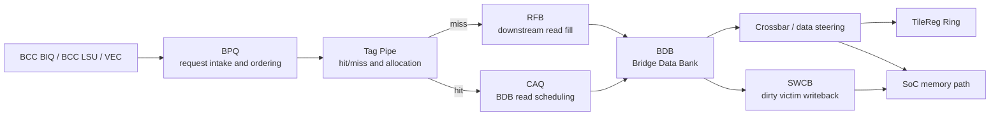
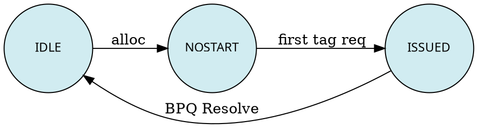

# TMA (Tile Memory Access) Architecture Document

## Overview

### BCC Channel and Memory Model

At the ISA level, Janus Core has three memory access pathways: the **BCC channel**, the **TMA channel**, and the **VEC channel**.

- **BCC scalar access**: ld and st micro-instructions issued by scalar PEs
- **Tile access**: TLOAD, TSTORE, MGATHER, and MSCATTER instructions issued by template blocks
- **VEC SIMT access**: v.ld.global and v.st.global micro-instructions issued by MPAR blocks within VEC PEs

Scalar BCC accesses and TLOAD/TSTORE instructions may be interleaved in the instruction stream. They are unified in BCC LSU's **LDQ** and **STQ** for address overlap checking and program-order preservation. Tile instructions are issued via **BISQ** (i.e., BCC BIQ); scalar instructions are issued via the scalar PE's lda/sta/std ISQs. Once source registers are ready, both are dispatched to LDQ/STQ.

Memory Model requirement: even without barrier instructions, all memory access results behave as if executed in program order. Consider the following instruction stream:

```
store  addr1
load   addr2
store  base1+size1
load   base3+size3
store  addr3
```

- If `addr1` overlaps with `addr2`, the load must observe memory contents before the store
- If `addr2` overlaps with `base1+size1`, the second store must observe memory contents after the load
- If `base3+size3` overlaps with `addr3`, the second load must observe memory contents after the second store

Key components on the BCC LSU side:

| Component | Purpose |
|-----------|---------|
| **LDQ** | Shared by scalar and Tile accesses |
| **STQ** | Shared by scalar and Tile accesses |
| **LHQ** | Scalar-access only |
| **SCB** | Scalar-access only |
| **TSRQ** | Tile-access only; holds TSTORE instructions after Resolve and before Commit, used by later loads for address hazard checking |

> Only scalar access data enters L1D; Tile access data does not enter L1D.

### Internal TMA Focus

The above describes TMA-external (BCC LSU side) flows. This spec focuses on **TMA internal microarchitecture**.

As the downstream recipient from BCC LSU and VEC, TMA handles four request types: **TLOAD, TSTORE, MGATHER, MSCATTER**. Among them:

- **TLOAD and TSTORE** arrive from BCC LSU, collectively referred to as **T requests**
- **MGATHER and MSCATTER** arrive from BCC BIQ, collectively referred to as **M requests**; their internal processing involves VGATHER and VSCATTER

TMA incorporates an internal cache (BDB) to exploit locality in M requests and some T requests.

### Interface Description

| Signal type | Source → Destination | Content |
|-------------|---------------------|---------|
| Request | BCC BIQ → TMA | TCVT, TMOV, MGATHER, MSCATTER |
| Request | BCC LSU → TMA | TLOAD, TSTORE |
| Response | TMA → BCC | Block Resolve signal |
| Request | VEC → TMA | VGATHER, VSCATTER |
| Response | TMA → VEC | Instruction completion info |
| Request | BCC L1D → TMA | Read, Write [TODO] |
| Data | TMA → BCC L1D | Data for L1D request [TODO] |
| Bus | TMA ↔ Tile Reg (Ring) | Tile Reg access |
| Bus | TMA ↔ Memory (SoC) | Memory access |

---

## Overall Approach



The diagram above is an inline summary of the current TMA data path so the spec
remains self-contained until a checked-in SVG source is available.

### Bridge Pair Queue (BPQ)

Acts as the front-end component that receives raw requests and manages their full lifecycle.

- M requests and T requests each have dedicated schemes for decomposing raw requests into sub-requests, reducing per-BPQ-entry resource management overhead
- Even after decomposition, each BPQ entry still holds tens of independent memory requests:
  - T requests: typical minimum **16**
  - M requests: typical maximum **64**
- BPQ provides ordering checks between entries (e.g., Age Matrix) to enforce read/write ordering
- Ready BPQ entries generate **Tag Pipe requests** to:
  - Check whether the Bridge Data Bank (BDB) holds the relevant cacheline
  - Determine whether downstream fetch is needed
  - Decide whether BDB space allocation and other operations are required

> Microarchitecture optimization: consider providing separate BPQs for T requests and M requests, eliminating queue contention between the two types and allowing each to optimize its decomposition and deduplication logic independently.

### BDB Cache Policy: Alloc-on-Miss

In the current design, TMA's cache is **alloc-on-miss**, not alloc-on-fill. Therefore, eviction targets are determined at the Tag Pipe stage rather than waiting for data to return from downstream.

- **Alloc-on-Miss (current approach)**
  - **Allocation logic**: Tag Pipe stage determines the eviction target
  - **Advantage**: simpler allocation and replacement flow; no need to revisit and modify tags when downstream data returns
  - **Advantage**: downstream return data can be written into BDB without blocking; no outstanding data buffer reservation needed
  - **Disadvantage**: smaller effective BDB capacity (some capacity may serve not-yet-ready data)

- **Alloc-on-Fill**
  - **Allocation logic**: decide after data returns
  - **Advantage**: no need to reserve space for not-yet-ready data
  - **Disadvantage**: more complex allocation and replacement handling

### Tag Array Structure

M requests and some T requests query and allocate BDB space at **cacheline granularity**; another subset of T requests query and allocate at **larger-block granularity**.

Two kinds of Tag Array exist in the Tag Pipe:

1. **Standard Tag Array** — maps BDB space at entry granularity
2. **Tile Tag Array** — maps BDB space at 16-entry bundled granularity

Requests on the Tag Pipe concurrently query both Tag Arrays to determine their hit status.

**Purpose of the Tile Tag Array**:
- Coarser-grained BDB space management, allowing T requests to use BDB space in a buffer-like fashion
- When lifetimes of both request types overlap, BDB space can be managed in a mixed manner, letting the two demands share resources
- Enables cross-access between M-request and T-request data

### Request Path Bifurcation

Requests that hit in BDB → **Cache Access Queue (CAQ)**, waiting for arbitration to obtain a BDB read window.
Requests that miss in BDB → **Read Fill Buffer (RFB)**, issuing read requests downstream.

#### Differences between RFB and CAQ

| Dimension | RFB | CAQ |
|-----------|-----|-----|
| Relationship to Cacheline | Always one-to-one with a cacheline | One-to-one with a Tag Pipe request, not one-to-one with a BDB slot |
| M requests / some T requests | One CAQ entry corresponds to one cacheline-granularity access, reads BDB once, no RFB demand | — |
| Other T requests (BDB hit) | — | One CAQ entry issues BDB read requests according to the number of cachelines in its Tile |
| Other T requests (BDB miss) | — | Enters CAQ first; one CAQ entry decomposes into enough RFB entries, then releases |

When fetching data from downstream, RFB entries are always one-to-one with cachelines. But when accessing BDB, CAQ entries are one-to-one with Tag Pipe requests, not one-to-one with a BDB slot.

For miss scenarios that produce a replacement, when the victim line is dirty, CAQ is also responsible for reading the victim line out of BDB and placing it in SWCB to await eviction. Likewise, for T requests that manage BDB at tile granularity, the victim may also be a group of BDB lines.

### Crossbar and Data Path

**MGATHER**: during the mapping from a Memory cacheline to NWCB, a **64-64 fully-connected crossbar** operates with fixed latency cycles in pipelined fashion at throughput 1, with each element being 4B.

**MSCATTER**: during the mapping from Tile data to memory layout in BDB, it uses a fully-associative crossbar with identical functionality.

The crossbar control signal specifies: which positions in the current cacheline need to be written to which positions in the current buffer.

**TSTORE** and **MSCATTER** final data may either be written directly to Memory or written into BDB.

**BDB capacity**: 128B × 1024 = **128 KB**.

### Arbitration for Data Return to BDB

When RFB returns data from downstream, data is buffered in the **Memory Pre Buffer (MPB)**. Three parties require BDB access:

1. **MPB** — writing GM return data
2. **CAQ** — reading victim / reading target cacheline
3. **SRFB** (rare cases)

These three arbitrate to decide who can access BDB on any given cycle. When MPB reaches its watermark, it should receive absolute priority to avoid back-pressuring GM return data.

---

## Assumptions and Constraints

- Individual element accesses within an M request must **not** cross cacheline boundaries
- Reads and writes to the Tile Register side are always within 256B contiguous regions

---

## M-Request Architecture

### BPQ Request Selection Order

When BPQ simultaneously contains VGATHER/VSCATTER requests from different groups, eligible requests are selected according to the following rules:

1. **Same-group mutual exclusion**: when a VGATHER for a group is present, a VSCATTER for that same group is not permitted. VSCATTER always appears before VGATHER in the same group. Assertion checks are recommended.
2. **VSCATTER ordering**: between a VSCATTER request and any subsequent request within a group, completion follows the order requests were received. Subsequent requests do not begin execution until the prior VSCATTER completes.
3. **Cross-group out-of-order**: requests from different groups may always be issued in any order.
4. **Same-group VGATHER out-of-order**: VGATHERs within the same group may all be issued in any order.

To implement the above ordering constraints, the RTL implementation requires BPQ to include an Age Matrix capability (32 is appropriate) to record request ordering within program flows that contain VSCATTER in the same group.

### VGATHER Flow

#### BPQ Request Deduplication

- In **Memory mode**, each BPQ entry carries a fixed **64** requests (achieved through decomposition and padding for MGATHER/MSCATTER), called **lanes**
- Each lane has a **mask** to indicate the corresponding lane needs no service
- Within a single BPQ entry, **request deduplication** is performed, compressing 64 raw requests into ≤ 64 non-duplicate cacheline Tag Pipe requests
  - Expected throughput: one non-duplicate Tag Pipe request per cycle (microarchitecture TBD)
  - No deduplication **across** different BPQ entries; two Tag Pipe requests for the same address may arise, with the later one likely triggering a Cache Hit and reaping locality benefits

#### BPQ Lane-Level Lifecycle Management

State machine:



| State | Description |
|-------|-------------|
| **IDLE** | Current lane invalid (VGATHER/VSCATTER predicate carried here) |
| **NOSTART** | Current lane has valid data but has not yet queried the Tag |
| **ISSUED** | Current lane has valid data and has initiated Tag query, or is a duplicate cacheline after dedup |

When all lanes are in the ISSUED state, that BPQ entry no longer issues Tag Pipe queries or GM requests.

BPQ is informed of work completion by **WCB** and may then send a done signal to the VEC PE. BPQ itself does not directly determine request completion.

#### Tag Query and GM Request

When resources (CAQ, SRFB, SWCB, etc.) are not exhausted, BPQ picks a deduplicated lane within an entry that is in NOSTART state and launches a Tag Pipe query. Upon issuance, the lane transitions to ISSUED.

**Query result classification**:

| Scenario | Action |
|----------|--------|
| Cache Hit | Enter CAQ to await BDB access |
| Cache Miss, no victim | Allocate new BDB entry on the spot; after leaving Tag Pipe, directly enter **SRFB** |
| Cache Miss, with victim | First enter CAQ to await BDB access (read victim); after completion, enter SRFB to await GM access |
| Cache Miss, missing not yet returned | After leaving Tag Pipe, **neither enter CAQ nor SRFB**; revert lane state to **NOSTART** |

> Microarchitecture optimization: implement a blacklist mechanism so reverted lanes will not re-enter the pipeline in the short term.

Requests that have a victim must first succeed in CAQ BDB access (victim enters SWCB) before entering SRFB to issue a request to GM.

#### GM Return Value Arbitration and Write

GM return values must complete in order: ① win Switch and NWCB write rights → ② write into BDB as cache.

The SRFB associated with MPB data holds control information such as line addr. The original SRFB transitions to IDLE after data return. For Memory mode, the SRFB state machine must add a final group of states representing that data is being written to WCB and BDB.

In the FILL state, SRFB matches all lanes with the same line addr in the original request's BPQ entry (see "Driving the Crossbar" for details).

#### BDB Access Arbitration

| Access source | Operation type |
|---------------|----------------|
| MPB (GM return value / VSCATTER write data) | Write |
| CAQ (read victim / read target cacheline into crossbar) | Read |

**Arbitration policy**:
- MPB priority is **fixed higher than** CAQ
- When MPB reaches its watermark, it receives **absolute priority** to avoid back-pressuring GM

> Microarchitecture optimization: MPB need not have absolute priority before reaching its watermark; allowing CAQ to compete for BDB access during this period may improve overall throughput.

#### Driving the Crossbar

| Signal | Specification |
|--------|---------------|
| Raw data | 64 groups × 4B = 256B total width |
| Control signal | 64 groups × 6 bits, indicating which input group each of the 64 outputs comes from |

This information is provided when MPB or BDB wins crossbar arbitration: the corresponding initiator queries the source request's BPQ entry and supplies the src tile offset information by matching addresses of lanes at the same address.

#### BDB Victim Writeback

- **SWCB**'s sole role in memory mode is as the **victim writeback buffer**
- After the victim's CAQ request wins BDB arbitration, the victim is placed into SWCB
- BPQ requests may only be issued when **CAQ, SWCB, and SRFB** all have spare capacity
- Aside from reporting remaining capacity, SWCB has no other interaction with BPQ

### VSCATTER Flow

When VSCATTER receives addresses and data from Vector:
- **Addresses**: stored in BPQ, same as VGATHER
- **Data**: stored in **TS BDB** (separate from the data array used in memory mode)

VSCATTER requests in BPQ also require cacheline-level deduplication:

| Scenario | Flow |
|----------|------|
| Tag, no victim | Read from TS BDB → enter 64-64 crossbar → post-crossbar data enters MPB |
| Tag, with victim | CAQ first arbitrates victim read → then start crossbar |

**MPB depth**: if MPB is to be sufficiently shallow, its writes to BDB must be absolute priority, or enter absolute priority above a watermark. SRFB's FILL_WCB state must not back-pressure MPB writes to BDB, but may back-pressure BDB reads.

### Resource Lifecycle Management

In VGATHER and VSCATTER flows, the following resources involve allocation and deallocation. A shortage of any resource back-pressures the request source.

#### Resource Overview

| Resource | Full Name | Purpose |
|----------|-----------|---------|
| **BPQ** | Bridge Pair Queue | Receives VGATHER/VSCATTER or sub-requests decomposed from >64-element MGATHER/MSCATTER |
| **MPB** | Memory Pre Buffer | Receives GM return values or VSCATTER write data |
| **CAQ** | Cache Access Queue | Each entry corresponds to a request that wishes to read/write the Tag Pipe |
| **SRFB** | South Read Fill Buffer | Each entry corresponds to a read request sent to SoC (i.e., an outstanding miss) |
| **SWCB** | South Write Coalesce Buffer | Each entry corresponds to a write request sent to SoC (BDB victim writeback only) |
| **NWCB** | North Write Coalesce Buffer | Each entry corresponds to a write request sent to Tile Reg |
| **BDB (TS)** | — | Holds Data Tile in VSCATTER, analogous to NWCB |

#### Resource Shortage Impact

| Resource | Impact of shortage |
|----------|-------------------|
| **BPQ** | Back-pressures TMA external (BCC BISQ or VEC) |
| **Other internal resources** | Blocks Tag Pipe requests from being issued from BPQ |
| **NWCB** | Bound to BPQ entry; insufficient count reduces concurrent BPQ entries |
| **TS BDB** | Analogous to NWCB for VSCATTER |

#### CAQ / SRFB / SWCB Resource Management Model

BPQ maintains separate available-resource counters (`CaqAvailCnt`, `SrfbAvailCnt`, `SwcbAvailCnt`). When a Tag Pipe request is issued, **all three counters are decremented by 1**, but no specific entry is allocated yet. After the query completes, handling proceeds based on the result:

| Scenario | On-the-spot allocation | Counter release timing |
|----------|----------------------|------------------------|
| **1. VGATHER Tag Hit** | Allocate CAQ entry. SRFB/SWCB released (counters +1) | When CAQ successfully arbitrates BDB read rights → CaqAvailCnt+1 |
| **2. VGATHER Tag Miss, no victim** | Allocate SRFB entry. CaqAvailCnt+1, SwcbAvailCnt+1 | After GM data returns and is written to BDB+crossbar (when MPB arbitrates BDB access rights) → SrfbAvailCnt+1 |
| **3. VGATHER Tag Miss, with victim** | Allocate CAQ entry (read victim). After CAQ successful arbitration → allocate SRFB + SWCB entry → CaqAvailCnt+1, SrfbAvailCnt+1, SwcbAvailCnt+1 | SRFB +1 after data write; SWCB +1 after GM response |
| **4. VSCATTER Tag Hit** | Allocate CAQ entry. SRFB/SWCB released. CAQ successfully arbitrates BDB write rights → read data from TS BDB into TL BDB → CaqAvailCnt+1 | — |
| **5. VSCATTER Tag Miss, no victim** | Allocate SRFB entry. CaqAvailCnt+1, SwcbAvailCnt+1 | GM return → SRFB initiates TS BDB read → zero-delay modification then send to MPB → MPB arbitrates TL BDB access rights → SrfbAvailCnt+1 |
| **6. VSCATTER Tag Miss, with victim** | Allocate CAQ entry (read victim) → CAQ succeeds → allocate SRFB+SWCB → CaqAvailCnt+1 | Subsequent same as scenarios 5+6 |

**Summary**:
- Counter allocation and idx allocation are decoupled: when a Tag Pipe request is issued, counters are consumed; actual idx allocation happens when needed
- **CAQ counter release timing**: ① when leaving Tag Pipe; ② when CAQ successfully arbitrates BDB access rights
- **SRFB counter release timing**: ① when leaving Tag Pipe; ② when GM read request responds and TL BDB write completes
- **SWCB counter release timing**: ① when leaving Tag Pipe; ② when GM write request responds

#### MPB Special Characteristics

MPB does not need to consume counters when Tag Pipe requests are issued. MPB has two entry sources: ① GM return data (unblockable, must reserve); ② VSCATTER write requests. When only 1 active entry remains, VSCATTER Tag Pipe requests are back-pressured. MPB entries are released after obtaining BDB access rights.

---

## T-Request Architecture

### Fractal Types

| Type | Abbreviation | Constraint |
|------|-------------|------------|
| Normal T request | **NORM** | No constraints on valid data matrix dimensions or stride |
| Large-stride fractal-transform T request | **ND2NZ / ND2ZN** | Tile Reg matrix side length is a power-of-2 multiple of fractal size; Stride ≥ 256B |
| Small-stride fractal-transform T request | **ND2NZ / ND2ZN** | Tile Reg matrix side length is a power-of-2 multiple of fractal size; Stride < 256B |

**Fractal definition**: a matrix with inner dimension 32B and outer dimension 16. Taking ND (RowMajor) as an example: `ColValid` is the inner dimension size, `Stride` is the stride, `RowValid` is the outer dimension size.

> TODO: supplement TLOAD and TSTORE instruction definitions, and fractal definition.

### T-Request BPQ Decomposition

To efficiently utilize BPQ state machine and counter resources, T requests with excessively large original dimensions are decomposed.

Upper bound per BPQ entry for large-stride fractal-transform T requests:

| Fractal layout type | Rows | Column size |
|--------------------|------|-------------|
| **NZ** (any element size) | 16 | 256B |
| **ZN** (16-bit elements) | 16 | 256B |
| **ZN** (32-bit elements) | 8 | 256B |
| **ZN** (8-bit elements) | 32 | 256B |

Two decomposition mechanisms exist for raw T requests:
- **Row decomposition**: needed when fractal row count > 1
- **Column decomposition**: needed when fractal column count > 8 (8 = 256B / 32B)

For small-stride fractal-transform T requests, the maximum column count is 128B, so column decomposition is not needed. Row decomposition rules are the same as for large-stride.

> For normal T requests, BPQ decomposition rules are deferred to microarchitecture practice.

### Cache Mechanism

#### Fractal-Transform TLOAD

The minimum data granularity for fractal-transform TLOAD is one fractal (16 rows × 32B). When each row's data is less than 256B, subsequent TLOADs may access other portions of the same cacheline, exhibiting spatial locality.

Fractal-transform TLOAD **always manages BDB capacity at Tile granularity**:
- **Aligned** case: a single BDB slot's granularity equals that of a cacheline
- **Unaligned** case (inner dimension size or stride not aligned to cacheline): cachelines are still cut to Tile size when placed into BDB; locality only benefits subsequent TLOAD requests with the same degree of misalignment

Consistency checks between cachelines of incompatible shapes are still required, managing space through invalidation and other means.

> Microarchitecture optimization: if a fractal row size already reaches 256B, there may be no locality, and BDB should be released immediately after reading.

#### Fractal-Transform TSTORE

Currently, all TSTOREs are treated as Write-no-allocate.

> Microarchitecture optimization: for TSTOREs with spatial locality, consider caching to save write bandwidth.

#### Normal T Requests

| Condition | Handling strategy |
|-----------|-------------------|
| Inner dimension size **or** stride is **not** an integer multiple of cacheline | Decompose from the raw BPQ one **MGATHER-format sub-BPQ-entry** per cycle; each BPQ entry corresponds one-to-one with a WCB entry |
| Inner dimension size **and** stride are **both** integer multiples of cacheline | Do not decompose BPQ; use counters and state machines to track Tag Pipe issuance status; issue Tag Pipe requests at cacheline granularity. One BPQ may correspond to multiple NWCB entries |

In either case, the cache allocation rules for Tag Pipe requests are the same as for normal MGATHER, **not managed at Tile granularity**.

#### Small-Stride Fractal-Transform T Requests

Follow the first implementation approach for normal T requests. Unless otherwise stated, subsequent references to "fractal-transform T requests" refer to large-stride fractal-transform T requests.

### Fractal-Transform TLOAD Flow

Fractal-transform TLOAD only requests **CAQ** resources when issuing Tag Pipe requests; it does not request SRFB, SWCB, or NWCB resources. When a Tag Pipe request leaves the Tag Pipe, it always accesses CAQ to decompose BDB or downstream access; at this point CAQ requests the corresponding resources.

Information recorded in each Tile Tag entry is stored in two-dimensional matrix form, containing **base addr** and **stride**.

> Hardware-friendly requests: both Stride and base addr are aligned to cacheline size.

#### Hit Handling

**Full hit**: the accessed data block is fully contained by an existing Tile Tag. Checking method:
- Same outer dimension, same element data type
- req base addr + req inner dimension ≤ tag base addr + tag inner dimension
- req base addr ≥ tag base addr

Full hit processing flow:
1. CAQ **continuously reads out** all data required by the current request to SWCB over multiple cycles
2. CAQ entry is released after all reads complete

CAQ generates one BDB read request for each SWCB entry it successfully acquires.

#### Miss Handling

**Partial hit (partial miss)**: Tiles partially overlap; older data cannot be directly used and must be invalidated or evicted before re-fetching.
Regardless of whether free entries exist in the Tile tag, any overlapping entry is always selected as the victim.

> Partial hits incur a performance penalty; programmers are discouraged from writing such patterns. Hardware should surface such non-optimal scenarios via PMU events or other mechanisms.

**Full miss**: the accessed data block has no overlap with any registered Tile Tag. When allocating new Tile Tag info:
- Base addr → **floor** to cacheline size
- Stride → unchanged

1. (If there is a victim) CAQ first initiates BDB read requests to read out all victims
2. CAQ decomposes the Tag Pipe request into multiple SRFB requests over multiple cycles; counter is incremented for each SRFB decomposed
3. After all decomposition completes, CAQ entry is released, passing BDB idx and counter state to BPQ
4. Each time an SRFB completes, it signals BPQ to decrement the counter
5. When BPQ receives CAQ return info and the counter reaches zero, it re-initiates a Tag Pipe request to read BDB; the flow is similar to the hit handling flow

When reading victims, CAQ generates one BDB read request for each SWCB it successfully acquires.
When issuing SRFB requests, CAQ generates one cacheline-granularity SRFB request for each SRFB it successfully acquires. When the raw TLOAD request is unaligned, one BDB entry may correspond to multiple SRFBs; each SRFB must record: BDB entry idx, write offset, write size.

> Bank conflicts may exist when data returns from downstream and is written to BDB. Microarchitecture primarily focuses on avoiding bank conflicts for reads and regular writes.

> Before CAQ finishes decomposing all SRFBs, some SRFBs may have already completed. At this point, BPQ's RFB counter may temporarily go negative (< 0).

During miss handling, each SRFB at cacheline granularity must perform consistency checks against data cached in BDB by MGATHER or other access methods. Before issuing a request downstream, TLOAD SRFB must acquire a CAQ resource and arbitrate for a Tag Pipe entry:
- Query finds no matching cacheline → release CAQ, proceed to downstream read flow
- Query finds a matching cacheline → **invalidate it** in the standard tag array, read it via CAQ into MPB, and under SRFB management rewrite it to the tile-tag-allocated position

### Fractal TSTORE Flow

Fractal TSTORE processes data in the reverse of the fractal TLOAD process. Data is first read from Tile Reg, stored in SDB in fractal layout, then after fractal transformation, stored at cacheline granularity in memory layout (row-major) in SWCB.
Before writing externally, each SWCB must perform consistency checks against data in BDB. Before issuing a request downstream, it acquires a CAQ resource and arbitrates for a Tag Pipe entry:
- Query finds no matching cacheline → release CAQ, SWCB proceeds to downstream write flow
- Query finds a matching clean cacheline → invalidate it in the standard tag array, SWCB proceeds to downstream write flow
- Query finds a matching dirty cacheline → invalidate it in the standard tag array, read it via CAQ into the same SWCB, merge with new data to assemble the full cacheline, then SWCB proceeds to downstream write flow
