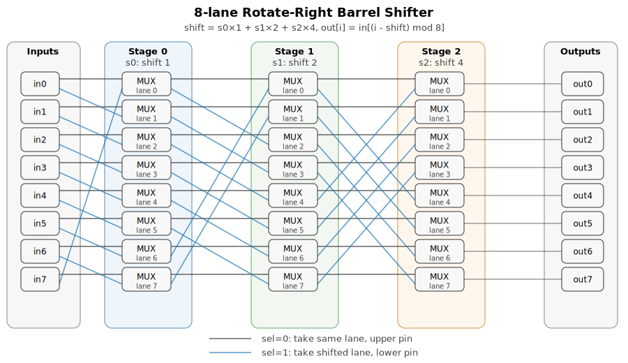
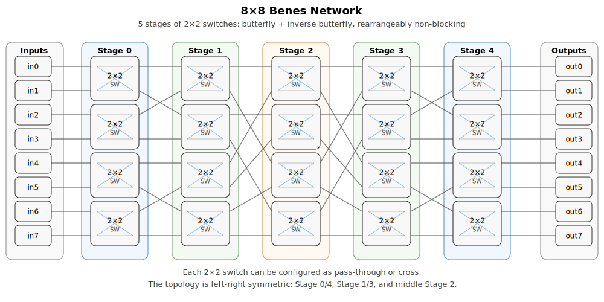

# exchange_net_report

## Introduction

本文对比两种用于 `2^N`-lane 互联的硬件结构：**Benes network** 和 **Rotate barrel shifter**，它们在功能上存在本质差异：

- **Benes network**：由 2×2 switch 按 butterfly + inverse butterfly 拓扑级联而成，可以实现 lane 间元素的**任意置换**——即每个输入可以路由到任意输出，不要求保持相对顺序。
- **Rotate barrel shifter**：由每级共用一个 shift-bit 的 2:1 mux 级联而成，只能将所有 lane 的元素**整体循环移位**一个可变量——不能改变 lane 间的相对顺序。

尽管两者功能不同，但都是空间上互联多 lane 的常用方案，在硬件开销上仍有对比意义。为公平对比，将一个 2×2 switch 近似为两个 2:1 mux。下文推导 stage 数、总 mux 数、控制 bit 数的闭合公式，并列出 16/32/64 lane 的具体数值。

设 lane/input 数量为 L = 2^N，并且认为 Benes network 中每个节点 2×2 switch 的开销约等于 2 个 2:1 mux。

---

## 1. Rotate barrel shifter

### 级数

Rotate stages = N，因为每一级对应一个 shift bit：1, 2, 4, ..., 2^(N-1)。

### mux 数

每一级有 L = 2^N 个 2:1 mux，所以 Rotate mux count = N · 2^N。

### 控制 bit 开销

每一级所有 lane 共用一个控制 bit（即 shift amount 的一位），所以 Rotate control bits = N。

---

## 2. Benes network

### 级数

Benes network 对 2^N 个输入需要 Benes stages = 2N - 1。

### mux 数

每一级有 2^N / 2 = 2^(N-1) 个 2×2 switch，每个 2×2 switch ≈ 2 个 2:1 mux，所以每一级等效 mux 数为 2^(N-1) · 2 = 2^N。总 mux 数：Benes mux count = (2N - 1) · 2^N。

### 控制 bit 开销

每个 2×2 switch 一般需要一个独立控制 bit，所以 Benes control bits = (2N - 1) · 2^(N-1)。

---

## 3. 相比关系

### 级数相比

Benes stages / Rotate stages = (2N - 1) / N = 2 - 1/N。Benes 比 rotate 多 (2N - 1) - N = N - 1 级。

### mux 数相比

Benes mux count / Rotate mux count = [(2N - 1) · 2^N] / [N · 2^N] = (2N - 1) / N = 2 - 1/N。所以 mux 数比例和级数比例一样。Benes 比 rotate 多的 mux 数是 [(2N - 1) - N] · 2^N = (N - 1) · 2^N。

### 控制 bit 相比

Benes control bits / Rotate control bits = [(2N - 1) · 2^(N-1)] / N = (2 - 1/N) · 2^(N-1)。这个比例会随着 lane 数快速增长。

---

## 4. 实际数值对比

### 16 lane（N = 4）

| | Rotate | Benes | 比值 (Benes/Rotate) |
|---:|---:|---:|---:|
| 级数 | 4 | 7 | 1.75× |
| mux 数 | 64 | 112 | 1.75× |
| 控制 bit 数 | 4 | 56 | 14× |

### 32 lane（N = 5）

| | Rotate | Benes | 比值 (Benes/Rotate) |
|---:|---:|---:|---:|
| 级数 | 5 | 9 | 1.8× |
| mux 数 | 160 | 288 | 1.8× |
| 控制 bit 数 | 5 | 144 | 28.8× |

### 64 lane（N = 6）

| | Rotate | Benes | 比值 (Benes/Rotate) |
|---:|---:|---:|---:|
| 级数 | 6 | 11 | 1.833× |
| mux 数 | 384 | 704 | 1.833× |
| 控制 bit 数 | 6 | 352 | 58.667× |

---

## 5. 简短结论

对于 2^N lane：

Rotate：stages = N，mux count = N · 2^N，control bits = N。

Benes：stages = 2N - 1，mux count = (2N - 1) · 2^N，control bits = (2N - 1) · 2^(N-1)。

相比 rotate，Benes 的级数比例 = 2 - 1/N，mux 比例 = 2 - 1/N，控制 bit 比例 = [(2N - 1) · 2^(N-1)] / N。

所以从 mux 数看，Benes 大约是 rotate 的不到 2 倍；但从控制复杂度看，Benes 明显更高。
