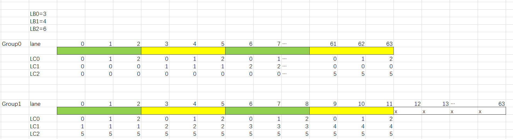
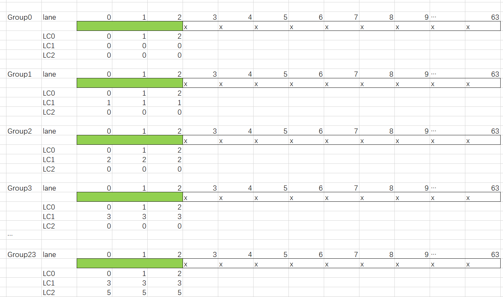
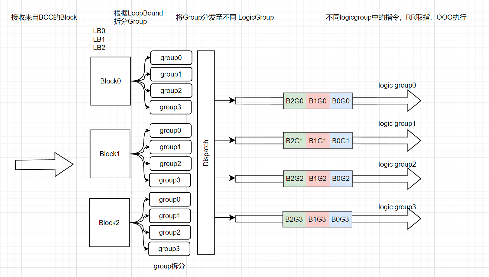
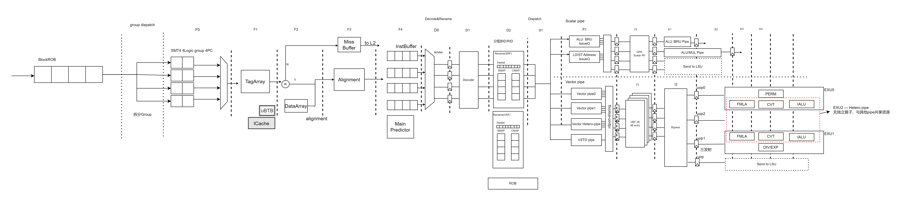

# Janus Vector Core Architecture Specification - Corrected AS

---

## 1. 概述

### 1.1 Vector Core 在 Janus 中的定位

Vector Core 是 Janus AI 执行单元中的**向量执行引擎**，负责执行 SIMT 编程，分group加SIMD的执行模式，兼具标量和向量的计算能力。作为一个乱序处理器，其通过简洁的块指令接口与上下游模块协同，为AI负载提供高性能并行计算支持。它接收来自 BCC（Block Control Core）通过 BISQ 派发的向量块命令，从 TMU TileReg 中读取数据，执行向量计算，并将结果写回 TileReg。

```
BCC ──(块命令)──> Vector Core ──(load/store)──> TMU Ring ──> TileReg
```

其支持的特性如下：

| Feature | Description |
|------|------|
| GROUP-4 | Vector支持四Group模式，Group之间相互独立                     |
| SIMT编程 | Vector支持SIMT执行模式，处理位宽为256B（64lane*32bit），硬件自动完成group拆分，编译器插predicate操作指令处理divergence |
| Scalar Interface | Master Scalar通过Block Instruction Buffer传输任务给Vector |
| OOO Execution | 乱序执行能力 |
| Lane 数量 | 64 |
| 线程模型 | SMT4 + OoO + SIMD |
| 数据格式 | FP64/FP32/FP16/BF16 |
| Vector issue | 每周期最多发射 3 条 2048-bit Vector 计算指令： FMA/IALU/CVT计算带宽为512B/cycle；一拍最多可发射没有算子冲突的三条指令，例如2条FMA，1条CVT |
| Readport Sharing | 通过RF分bank，读口共享策略减少RF读口开销 |

### 1.2 设计目标

- 以 2048-bit SIMD 指令为基本执行粒度（64 个 FP32 lane 锁步执行）。
- 每周期最多发射 3 条 2048-bit Vector 指令，对应 2 条 vector compute pipe 和 1 条 vector store pipe；每条 pipe 对应独立 ISQ。
- 通过 TMU Ring 的 3 个端口（2 load + 1 store）访问 TileReg，对应512B读带宽，256B写带宽。
- 对连续 lane 地址的 `v.lw [ti#0, lc0 << 2] -> vt` 类 load，可由 scalar/Vector TileLSU 路径向 TMU 发起一个 256B 起始地址请求；该类 load 不需要读取 Vector PRF 源操作数。
- 支持多层循环展开（LB0/LB1/LB2），自动将 SIMT 线程拆分为 64-lane group。
- SMT4 不仅用于隐藏 TMU/TileReg 访问延迟，也用于在不同类型算子之间提高执行资源利用率。
- 相对索引寄存器机制用于减少指令编码压力和绝对架构寄存器编号开销；硬件仍通过 SMAP/MAPQ/CMAP 完成 ptag rename 与投机状态恢复。
- 第一层 Block 编程视图通过 `B.IOT` 最多表达 12 个输入 Tile 和 4 个输出 Tile；Vector block 内部使用第二层相对 Tile alias。
- 与 BCC 的块控制流程兼容（BISQ 派发、`bid` 完成回报；BCC/BROB 使用 `bid` 进行完成匹配）。

---

## 2. 块命令接口

### 2.1 块头格式

Vector Core 接收来自 BCC BISQ 派发的向量块命令。块头的抽象形式为：

```
vpar srcA(TA, TileA), srcB(TB, TileB) -> dstA(TO, TileO)
```

具体块头编码示例：

```
Bstart par VCALL
B.IOT   TA, TB -> TO        // 输入输出 TileReg 绑定
B.IOR   GPR0, GPR1 -> GPR2  // 输入输出 GPR 绑定
B.CATR  DR                  // 升维或降维，Dimension Reduction
B.DIM0  64                   // LoopBound0
B.DIM1  64                   // LoopBound1
B.DIM2  1                    // LoopBound2
B.TEXT  (PC)                 // 向量块微指令起始地址
```

当一个 Vector block 需要更多 Tile 绑定时，第一层编程视图可以使用最多 4 条 `B.IOT` 指令表达最多 12 个输入 Tile 和 4 个输出 Tile：

```asm
B.IOT   TA0, TA1, TA2 -> TO0
B.IOT   TA3, TA4, TA5 -> TO1
B.IOT   TA6, TA7, TA8 -> TO2
B.IOT   TA9, TA10, TA11 -> TO3
```

### 2.2 Loop Ctrl

Vector块指令通过三个专用字段编码三层嵌套循环信息（即块的三维大小）：

LB0：第一层循环迭代次数；

LB1：第二层循环迭代次数；

LB2：第三层循环迭代次数；

提供了两种程序员可控Group拆分方式： 多维和降维，使用DR标识。

**在降维模式下，硬件会将软件表达的多层循环展成一维。**

实际上硬件掩码只在最后一个group才会生效，中间所有group的硬件掩码全部按照全有效计算，在Group cnt计算时，给最后一个group增加一个bit用于指示该group是否是最后一个Group。最后一个Group的指令携带该Flag bit，用于I2 stage 完成硬件掩码的生成。

硬件掩码生成策略：

当非最后一个Group时：生成全使能掩码（64'hFFFF_FFFF_FFFF_FFFF）

当是最后一个Group是：根据LB0/1/2及Group Size动态生成对应位宽的使能掩码

举个例子，LB0=5， LB1=4， LB2=4时，（共80个thread），硬件将Block做如下拆分：



拆出两个GROUP，最尾GROUP计算单元有Mask。

**在升维模式，硬件会严格按照软件的LB0拆分GROUP。**



此时计算单元有浪费，但程序员写row_max等group级别操作时，更符合直觉。

### 2.3 执行模型



VectorBlock在核上的执行有多级调度。

1.  BCC 对Block解依赖，将 src Tile ready的Block发至Vector Core，Vector Core最多允许四个Block在其中调度执行；

2.  根据LB0，LB1，LB2 Vector将Block拆出多个Group，Vector前端以group为粒度，将拆出的不同group分发至logic group上； Vector前端根据每个logic group头上的块头pc轮询取指，取出的指令在后端OoO乱序执行，共享算子/Vrf等后端资源。

### 2.4 块头字段说明

| 字段 | 含义 |
|------|------|
| `Bstart par VCALL` | 块起始标记，指示这是一个并行向量调用块 |
| `B.IOT` | I/O Tile 描述符。第一层 Block 编程视图最多使用 4 条 `B.IOT` 绑定 12 个输入 Tile 和 4 个输出 Tile；BCC TileRename 后，Vector 内部以 `ti#N` / `to#N` 本地 alias 索引 BISQ payload 中的物理 TileReg 信息 |
| `B.IOR` | I/O Register 描述符。指定输入/输出 GPR 绑定 |
| `B.DIM0/1/2` | 三层循环维度，分别对应 LB0/LB1/LB2（Loop Bound） |
| `B.TEXT` | 向量块块体微指令流的起始 PC 地址 |

### 2.5 块命令接收接口

| 信号 | 位宽 | 方向 | 含义 |
|------|------|------|------|
| `vec_cmd_valid` | 1 | input | 块命令有效 |
| `vec_cmd_ready` | 1 | output | Vector Core 可接收命令 |
| `vec_cmd_iot` | packed | input | I/O Tile 描述。BISQ 内部组合并打包 BCC TileRename 后的 Tile tag、base address、size、src ready 与 dst 信息，Vector Core 接收的是解码后的块 payload 语义 |
| `vec_cmd_ior` | packed | input | I/O Register 描述。BISQ 内部组合并打包 GPR/Scalar 绑定信息，Vector Core 接收后复制到内部 scalar register file |
| `vec_cmd_dim0` | 16 | input | Loop Bound 0（LB0） |
| `vec_cmd_dim1` | 16 | input | Loop Bound 1（LB1） |
| `vec_cmd_dim2` | 16 | input | Loop Bound 2（LB2） |
| `vec_cmd_pc` | 32 | input | 块体微指令起始 PC |
| `vec_cmd_bid` | 8 | input | Block ID，用于 Vector Core 完成回报以及 BCC/BROB 侧匹配 |

### 2.6 完成回报接口

| 信号 | 位宽 | 方向 | 含义 |
|------|------|------|------|
| `vec_done_valid` | 1 | output | 块执行完成 |
| `vec_done_bid` | 8 | output | 对应的 Block ID；BCC/BROB 使用该 ID 标记块完成 |

---

## 3. SIMT 到 SIMD 的映射

### 3.1 编程模型（SIMT）

程序员以**单线程**视角编写向量块的微指令流，每条指令描述一个 lane（32-bit）的数据操作。Vector 指令统一使用 `v.` 前缀。下面先保留原始通用访存/FMA 示例，再给出 softmax 风格示例。

```asm
v.lw    [ta, lc0 << 2]       -> vt    // 从第 0 个输入 Tile 加载 FP32
v.lw    [tb, lc0 << 2]       -> vt    // 从第 1 个输入 Tile 加载 FP32
v.lw    [tc, lc0 << 2]       -> vt    // 从第 2 个输入 Tile 加载 FP32
v.fmadd vt#1, vt#2, vt#3     -> vt    // FP32 乘加
v.lw    [tc, lc0 << 2]       -> vt    // 加载被除数
v.fdiv  vt#2, vt#1           -> vt    // FP32 除法
v.fcvtfp32fp16 vt#1          -> vt    // FP32 转 FP16
v.sh    vt#1, [to0, lc0 << 1]         // 存储 FP16 到第 0 个输出 Tile
```

上述指令描述了每个thread的行为，硬件执行时将64个thread绑成一个group锁步执行。

其中：
- `vt` 为相对索引寄存器的目的写形式，`vt#N` 表示在 `vt` hand 中相对于当前 allocate pointer 回看 N 个映射表项后得到的源寄存器
- `lc0/lc1/lc2` 为 Loop Counter，对应三层循环的迭代变量
- `ti#N` / `to#N` 为 TileReg 相对 alias，由块头 `B.IOT` 指定；TA/TB/TC/TD/TO 可作为第一层编程视图中的逻辑 Tile 名称，物理访问地址来自 BISQ payload

### 3.2 Loop Counter 语义

三层循环的展开等价于：

```python
for lc2 in range(LB2):
    for lc1 in range(LB1):
        for lc0 in range(LB0):
            # 执行块体微指令流
            # 此时 lc0, lc1, lc2 为当前迭代值
```

总线程数 = `LB0 × LB1 × LB2`。

### 3.3 Group 拆分（SIMT → SIMD）

微架构上，Vector Core 每次执行 64 个 lane 的操作。总线程数被拆分为多个 **Group**，每个 Group 包含 64 个连续线程：

```
Group 数量 = ceil(LB0 × LB1 × LB2 / 64)
```

以 `LB0=128, LB1=2, LB2=1` 为例：
- 总线程数 = 128 × 2 × 1 = 256
- Group 数量 = 256 / 64 = 4
- 块体微指令流被重复取指 4 次，每次执行 64 个 lane

每个 Group 内，64 个 lane 的 `lc0/lc1/lc2` 值由 Group ID 和 lane ID 共同决定：

```
global_thread_id = group_id × 64 + lane_id    (lane_id ∈ [0, 63])
lc0 = global_thread_id % LB0
lc1 = (global_thread_id / LB0) % LB1
lc2 = (global_thread_id / (LB0 × LB1)) % LB2
```

### 3.4 SIMD 执行语义

一条 SIMT 指令在微架构上被合成为一条 2048-bit SIMD 指令：

| SIMT 指令 | SIMD 等效操作 |
|-----------|--------------|
| `v.lw [ti#0, lc0 << 2] -> vt` | 从 TileReg 加载 64 × 32-bit = 2048-bit 数据到向量寄存器 |
| `v.fmadd vt#1, vt#2, vt#3 -> vt` | 64 路并行 FP32 乘加 |
| `v.sh vt#1, [to#0, lc0 << 1]` | 将 64 × 16-bit = 1024-bit 数据写回 TileReg |

---

## 4. 架构状态与上下文模型

### 4.1 Block、Group 与 Logic Group

前三章定义了从 Vector Block 到 Group、再到 64-lane SIMD 指令的映射。微架构中需要明确区分以下三种对象：

| 对象 | 数量上限 | 生命周期 | 主要状态 |
|------|----------|----------|----------|
| Resident Block | 4 | 从接收 BCC block command 到向 BCC 回报 block resolve | BID、B.TEXT PC、LB0/1/2、DR、B.IOT、B.IOR、未完成 Group 数 |
| Group Descriptor | 由 LB 和 DR 决定 | 从 Loop Ctrl 生成到分配给 logic group | BID、group_id、base thread、last-group、硬件 mask 参数 |
| Logic Group Context | 4 | 从接收一个 Group 到该 Group 的指令全部提交 | PC、ROB、rename map、predicate、LC、异常与 flush 状态 |

Resident Block 与 logic group 不是一一对应关系：

- 一个 Block 可以被拆成多个 Group，这些 Group 可以先后或并行占据多个 logic group context。
- 多个 Block 的 Group 也可以同时占据四个 logic group context。
- 同一时刻最多有 4 个 resident Vector Block，也最多有 4 个正在执行的 logic group。
- Logic group context 释放后，可以继续接收同一 Block 的下一个 Group，也可以接收其他 Block 的 Group。

这种模型使 Group-4、SMT4 和“四个 Block 在核内调度”同时成立。SMT4 的调度对象是四个 logic group context，而不是固定绑定的四个软件线程。

### 4.2 状态归属

| 状态 | 归属粒度 | 说明 |
|------|----------|------|
| Block payload | Resident Block | BCC 下发的 Tile/GPR 绑定、LB、DR、B.TEXT、BID |
| Uniform mapping | Resident Block | `arg/RI/RO` 等 Block 级参数；同一 Block 的多个 Group 共享只读输入语义 |
| Vector/Scalar speculative map | Logic Group | `vt/vu/vm/vn`、`t/u` 的投机相对索引映射 |
| Vector/Scalar committed map | Logic Group | Group 内已提交的相对索引状态 |
| Predicate state | Logic Group | 软件 predicate 与硬件 last-group mask 的组合状态 |
| Loop Counter state | Group | 当前 Group 对应的 `lc0/lc1/lc2` 向量或其生成参数 |
| Vector ROB | Logic Group | Group 内指令的完成、异常、non-spec 与顺序提交 |
| Group completion count | Resident Block / Group ROB | 统计该 BID 尚未完成的 Group |
| TileReg ordering state | Vector TileLSU | LDQ/STQ/SCB/VAB、store commit 与 replay |

### 4.3 相对索引寄存器

Vector 指令使用相对索引表达寄存器，但物理执行仍采用 rename：

| 寄存器类 | 架构编码 | 物理资源 | 上下文 |
|----------|----------|----------|--------|
| Vector | `vt/vu/vm/vn`，源为 `vt#N` 等 | 2048-bit Vector PRF | Logic Group |
| Scalar | `t/u`，源为 `t#N/u#N` | Scalar PRF | Logic Group |
| Uniform | `arg/RI/RO` | 可与 Scalar PRF 共用 data array，但映射独立 | Resident Block |
| Predicate | predicate 编号或隐式当前 predicate | Predicate PRF / mask file | Logic Group |
| Tile alias | `ti#N/to#N` | BCC payload 中的 Tile tag/base/size | Resident Block |

`vt#N` 与 `ti#N` 不属于同一层级：

- `vt#N` 经过 Vector Rename 转换为 Vector PRF `ptag`。
- `ti#N` 查询 Block payload，得到 BCC TileRename 已确定的 Tile tag、base address 和 size。
- Tile alias 不进入 Vector PRF rename，也不因 Group commit 而改变。

### 4.4 SCLK、MAPQ 与 CCLK

每个 logic group context 为 Vector hand 和 Scalar hand 维护三层状态：

| 结构 | 作用 |
|------|------|
| SCLK / SMAP | 当前投机映射，Decode/Rename 查询源并写入新目的映射 |
| MAPQ | 按指令顺序记录映射更新，用于 commit 和 flush rollback |
| CCLK / CMAP | 已提交映射，作为精确恢复基线 |

以 Vector hand 为例：

```text
src_ptag = SMAP[logic_group][hand][allocate_ptr - relative_distance]
dst_slot = SMAP[logic_group][hand][allocate_ptr]
allocate_ptr = allocate_ptr + 1
```

要求：

1. 同一 Rename bundle 内必须支持 older-to-younger map bypass。
2. 目的映射只有在对应 ROB 指令 commit 后才能更新 CCLK/CMAP。
3. Flush 时回收被取消指令分配的 ptag，并从 CCLK/CMAP 加保留 MAPQ 恢复 SCLK/SMAP。
4. Logic group 完成后，其 committed map 不需要跨 Group 保留；下一个 Group 从块体入口定义的初始相对索引状态开始。
5. Uniform mapping 按 Block 生命周期释放，不能随单个 Group 完成而释放。

### 4.5 FP64 与多寄存器结果

一个 2048-bit PRF entry 可以承载 64 个 FP32、128 个 FP16 或 256 个 FP8 元素。若仍保持 64 个 FP64 lane，一条 FP64 Vector 指令需要 4096-bit 数据，因此占用一对 Vector PRF entry。

Rename 需要：

- 普通 `ptag` freelist。
- 可保证成对分配的 `pair_ptag` 资源，或等价的双 entry 原子分配机制。
- 在 SMAP/MAPQ/CMAP 中记录 `pair` 属性。
- Dispatch 前原子检查双 entry、ROB、ISQ 和写回资源，避免只分到一半资源。

多寄存器结果的 commit 和 flush 必须以一个架构目的为单位原子处理。

---

## 5. 顶层微架构

### 5.1 微架构Pipeline



上图是本稿的流水线与资源拓扑基线。后续章节对各级的描述均以该图为准，核心约束如下：

- 前端同时维护 4 个 logic group context，每个 context 拥有独立 PC 和 Inst Buffer；F0 从 4 个 PC 中选择取指请求。
- 四个 context 共享 I-cache TagArray、DataArray、uBTB、Main Predictor 和 Miss Buffer。单个 context 的 miss 不阻塞其他可运行 context。
- D0 负责 Inst Buffer 仲裁，D1 负责译码并建立 BID/RID/ROB 归属，D2 分别完成 Scalar RF 和 Vector RF rename。
- S1 将 uop 分发到两类 Scalar IssueQ 和四类 Vector IssueQ；P1 完成 ready select，I1 完成 RF read 和 read-port sharing。
- Vector 侧每周期最多形成 3 条计算 uop，并可由独立 VSTD path 向 TileLSU 发送访存 uop。三发射不表示存在三套完整计算资源。
- 标量侧保留独立的 ALU/BRU、ALU/MUL 和 LD/ST Address 调度路径。标量计算是地址、控制、predicate 和 reduction 的正式执行通道，不是 Vector pipe 的附属功能。
- E1-E4 覆盖单周期、流水化和长延迟运算；具体完成级由功能单元 latency 决定，ROB 通过 RID 接收乱序完成。

### 5.2 模块划分

```text
BCC BISQ
   |
   v
+------------------+     +------------------+
| Block Buffer     | --> | Loop Ctrl /      |
| 4 resident block |     | Group Generator  |
+------------------+     +--------+---------+
                               |
                               v
                    +-----------------------+
                    | Group Buffer /        |
                    | Logic-Group Allocator |
                    +-----------+-----------+
                                |
          +---------------------+---------------------+
          |       4 logic group contexts / SMT4       |
          | PC | IBuf | Rename | ROB | Predicate | LC |
          +---------------------+---------------------+
                                |
                                v
                 +------------------------------+
                 | Shared OoO Backend           |
                 | 4 Vector ISQ + 2 Scalar ISQ  |
                 | VRF/SRF + Bypass + Scheduler |
                 +------+-------------+---------+
                        |             |
                        v             v
                  Vector Execute   Vector TileLSU
                                      |
                                     SCB
                                      |
                           TMU: 2 Load + 1 Store
```

### 5.3 核心模块职责

| 模块 | 职责 |
|------|------|
| Block Buffer | 接收 BCC command，保存最多 4 个 resident block |
| Loop Ctrl | 根据 LB0/1/2 和 DR 生成 Group Descriptor |
| Group Buffer | 缓冲尚未获得 logic group context 的 Group |
| Logic-Group Allocator | 将 ready Group 分配到四个 context，维护 block/group 映射 |
| VIFU | 维护 4 PC，仲裁共享 uBTB、Main Predictor、I-cache Tag/Data Array 和 Miss Buffer，并写入 per-context Inst Buffer |
| Decode/Rename | 在 D0-D2 完成 Inst Buffer 仲裁、译码、BID/RID/ROB 绑定，以及 SRF/VRF 独立 rename |
| Vector Scheduler | 管理 Vector pipe0、pipe1、Hetero-pipe 和 VSTD pipe 四个队列域，最多选择 3 条计算 uop |
| Scalar Scheduler | 管理 ALU/BRU IssueQ 和 LD/ST Address IssueQ，驱动标量执行与 TileLSU 地址路径 |
| Vector RF / Scalar RF | 保存物理寄存器数据；Vector RF 基线为 88 × 2048-bit，并支持 read-port sharing |
| Vector Execute | 两组主要 FMLA/CVT/IALU 资源，以及共享的 Hetero、PERM、DIV/EXP 等路径 |
| Vector TileLSU | 地址生成、LDQ/STQ、memory ordering、gather/scatter、replay |
| SCB | 缓存 TileReg 数据，合并部分写并负责 Modified writeback |
| Vector ROB | Group 内精确完成、异常、non-spec 和顺序提交 |
| Group ROB | 统计 Group/Block 完成，并生成 BCC block resolve |

### 5.4 三发射的定义

前三章给出的“每周期最多发射 3 条 Vector 指令”是计算 uop 的逻辑 issue 上限。Pipeline 中存在四个 Vector 调度域，但它们不是四个对称 slot：

| 调度域 | 主要候选 | 物理资源关系 |
|--------|----------|--------------|
| Vector pipe0 | FMLA、CVT、IALU 等主计算 | 连接第一组主计算资源 |
| Vector pipe1 | FMLA、CVT、IALU、DIV/EXP 等主计算或长延迟运算 | 连接第二组主计算资源 |
| Vector Hetero-pipe | PERM、特殊/异构 uop，以及可路由到主计算资源的 uop | 不复制完整 FMLA/CVT/IALU，通过共享端口使用现有资源 |
| VSTD pipe | Vector store data、load/store 相关 Vector 数据 uop | 向 Vector TileLSU 发送，不计作第三套主计算资源 |

`pipe0/pipe1/Hetero-pipe` 最多共同形成 3 条计算 uop，标记为 `uop0/uop1/uop2`。VSTD 可以在 TileLSU、VRF 读口和 ordering credit 允许时并行发送访存 uop，但它是否与三条计算 uop 同拍成功，仍由 RF read-port、bypass、写回和 TileLSU 端口共同约束。

Hetero-pipe 的存在是为了扩大可调度组合，并不意味着第三套完整 FMLA/CVT/IALU。调度器必须根据实际资源映射做冲突检查，例如三个 FMLA uop 即使都 ready，也不能超过物理 FMLA 接收能力。

### 5.5 Scalar 通道

Vector Core 内部保留两类 scalar issue queue 和两条主要执行路径：

| 路径 | 主要工作 |
|------|----------|
| ALU/BRU IssueQ -> ALU/BRU Pipe | 整数运算、比较、分支/控制、loop 和 predicate 控制 |
| ALU/BRU IssueQ -> ALU/MUL Pipe | 整数乘法及允许的普通 ALU 运算 |
| LD/ST Address IssueQ -> Send to LSU | load/store 地址、stride、边界和访问参数生成 |

标量通道负责：

- 块内地址和步长计算。
- Loop/predicate 辅助计算。
- B.IOR/Uniform 参数读取和变换。
- 连续 Vector load 的起始地址生成。
- reduce 标量结果处理。
- 必要的标量控制指令。

Scalar Pipe 与 Vector Pipe 共享 ROB、全局 wakeup 和部分 bypass/完成仲裁，但拥有独立 IssueQ、Scalar RF rename map 和 Scalar RF read/write 通路。Scalar 指令不能因为 Vector Pipe 饱和而永久饥饿，因为其结果可能位于 Vector load、predicate 或 block 完成的关键路径上。

### 5.6 TileReg 端口

Vector Core 对 TMU 的目标带宽为：

| 端口 | 数量 | 单端口带宽 | 总带宽 |
|------|------|------------|--------|
| Load | 2 | 256B/cycle | 512B/cycle |
| Store | 1 | 256B/cycle | 256B/cycle |

端口是 Vector TileLSU/SCB 的外部数据通路，不直接等同于 Vector issue slot。Load/store 地址 uop 从 LD/ST Address IssueQ 发送到 TileLSU；Store data 从 VSTD pipe 读取 Vector RF，因此同时消耗 VSTD、VRF read port、SCB/TMU store credit。

---

## 6. Block 与 Group 调度

### 6.1 Block 接收

`vec_cmd_valid && vec_cmd_ready` 时，Block Buffer 分配一个 resident block entry。Entry 至少包含：

```text
BlockEntry {
  valid
  bid
  body_pc
  lb0, lb1, lb2
  dr_mode
  datatype
  tile_binding[inputs, outputs]
  uniform_binding
  group_total
  group_generated
  group_completed
  flush_pending
}
```

`vec_cmd_ready` 必须同时考虑：

- 是否存在空闲 Block entry。
- Uniform mapping 和参数存储空间是否充足。
- Group ROB 是否可分配。
- 是否有未处理的全核 flush/stop。

Block 接收不要求立即存在空闲 logic group；Group 可以先进入 Group Buffer。

### 6.2 Group 生成

Loop Ctrl 依据前三章的两种模式生成 Group：

**降维模式**

```text
total_threads = LB0 * LB1 * LB2
group_total = ceil(total_threads / 64)
base_thread_id = group_id * 64
```

只有最后一个 Group 可能需要硬件边界 mask。

**升维模式**

Group 边界严格遵循软件表达的 LB0 行边界。即使某个 Group 未填满 64 个 thread，也不与下一行合并。Group Descriptor 需要携带所在维度坐标和该 Group 的有效元素范围。

每个 Group Descriptor 至少包含：

| 字段 | 含义 |
|------|------|
| `bid` | 所属 Block |
| `group_id` | Block 内 Group 编号 |
| `body_pc` | 块体入口 PC |
| `base_thread_id` 或维度坐标 | LC 生成基线 |
| `last_group` | 是否为 Block 最后一个 Group |
| `active_count/mask_param` | 硬件边界 mask 生成参数 |
| `datatype` | 决定元素粒度、PRF pair 和 mask 解释 |

### 6.3 Logic Group 分配

Group Buffer 在四个 logic group context 中选择空闲项。分配时初始化：

- PC 和 instruction buffer。
- SCLK/SMAP、CCLK/CMAP、allocate/commit pointer。
- ROB head/tail。
- 当前 hardware mask 参数。
- Loop Counter 生成状态。
- BID/group_id 映射。
- Uniform mapping 指针。

同一 Block 的多个 Group 可以并行运行，但必须遵守：

1. Group 间只共享 Block payload 和只读 Uniform 输入。
2. Group-local Vector/Scalar/predicate 状态不能相互可见。
3. 对同一输出 TileReg 的 store 顺序由 TileLSU/Group ROB 约束。
4. Group-level reduction 的合并语义必须由 ISA 明确，不能依赖偶然的完成顺序。

### 6.4 调度公平性

以下仲裁点均需要跨 logic group 公平性：

- VIFU fetch。
- Decode/Rename bundle。
- Vector/Scalar ISQ select。
- PRF bank/read-port。
- TileLSU load/store port。
- Writeback。

建议采用“context 内 oldest-ready + context 间 RR/age”的两级策略。纯全局 oldest 容易让单个高命中 Group 持续占用端口；纯 RR 又可能拉长关键依赖链。

### 6.5 Group 完成

一个 Group 只有满足以下条件后才能向 Group ROB 报告完成：

- 该 Group 的所有指令均已在 Vector ROB 提交。
- 没有待 replay、exception 或 unresolved non-spec uop。
- 属于该 Group 的 store 已达到定义的提交边界。
- Group-local Modified SCB entry 已进入可追踪的 block writeback 集合。
- 需要输出 Scalar/Uniform 结果时，结果已写入对应物理寄存器。

Group 完成后释放 logic group context；Block 仍可保留，直到所有 Group 完成且 Block writeback 条件满足。

---

## 7. 前端与 OoO 流水线

### 7.1 逻辑流水级

| Stage | 主要工作 |
|-------|----------|
| BlockROB / Group Dispatch | 接收 Block、生成 Group，并将 ready Group 放入 4 个 logic group context |
| F0 | 维护 SMT4 的 4 个 logic-group PC，选择本拍取指 context |
| F1 | 锁存所选 context 的 fetch request，并完成 context 间请求仲裁 |
| F2 | 访问 uBTB、I-cache TagArray/DataArray，形成预测和 cache 查询 |
| F3 | tag compare；hit 返回指令，miss 分配 Miss Buffer 并向 L2 请求 |
| F4 | 指令对齐，结合 Main Predictor 更新取指方向，写入对应 context 的 Inst Buffer |
| D0 | 在 4 个 Inst Buffer 间仲裁，选出 decode bundle |
| D1 | Decoder 生成 uop、资源类别和异常信息，绑定 BID，分配 RID/ROB entry |
| D2 | Scalar RF 与 Vector RF 分别 rename；查询 SMAP、更新 freelist/MAPQ |
| S1 | Dispatch 到 ALU/BRU、LD/ST Address、Vector pipe0/1、Hetero 和 VSTD IssueQ |
| P1 | 在各 IssueQ 内做 wakeup/select，并在 context 间执行 age/fairness 仲裁 |
| I1 | 读取 GPR/Scalar RF 和 88-entry × 2048-bit VRF，执行 read-port sharing |
| I2 | 接收 RF 数据与 bypass，合并 hardware mask/predicate，形成执行 uop |
| E1-E4 | ALU/BRU、ALU/MUL、Vector EXU 和 TileLSU 按各自 latency 执行 |
| W1-W2 | forward、writeback、wakeup |
| CM | Vector ROB 顺序提交 |

`F0-F4`、`D0-D2`、`S1-P1-I1` 和 `E1-E4` 是 Pipeline 图定义的命名边界。CA 可以在不改变可见行为的前提下插入物理寄存器或细分长路径，但不得把 D2 rename、I1 RF read 或 non-spec side effect 跨越到不可恢复边界之外。

### 7.2 VIFU

每个 logic group context 维护独立 PC、fetch 状态和 Inst Buffer。四个 context 共享 uBTB、Main Predictor、I-cache TagArray/DataArray 和 Miss Buffer。

VIFU 规则：

- Group 块体从相同 `B.TEXT` 入口开始。
- uBTB 在 F2 提供早期目标预测，Main Predictor 在 F4 提供主预测结果和校正；若首版不实现动态预测，相应表项可关闭，但 stage 接口保留。
- Predicate 指令控制 lane 活跃性，不改变 Group PC。
- 某个 context I-cache miss 时，其他 context 可以继续取指。
- Fetch/Decode 目标宽度为 4 inst/cycle。
- F0/F1 每拍选择一个 context 形成 fetch request；D0 每拍从一个 Inst Buffer 选择 bundle，避免同拍访问多套 rename map。
- Miss Buffer entry 必须携带 context 和 fetch epoch。发生 redirect/flush 后，迟到 response 只能按 epoch 丢弃或重新校验，不能写入错误 Inst Buffer。

### 7.3 Decode

D0 从 per-context Inst Buffer 选择一组顺序指令，并携带 `logic_group/context + fetch_epoch + PC` 进入 D1。D1 为每条指令生成：

```text
DecodedUop {
  logic_group, bid, group_id, pc
  opcode, datatype
  vector_src[3], vector_dst
  scalar_src[], scalar_dst
  predicate_src, predicate_dst
  tile_alias, lc_sel, addr_mode
  is_vector, is_scalar, is_load, is_store
  is_reduce, is_sfu, is_cvt
  non_spec, serialize
}
```

D1 同时完成非法编码、权限和静态资源类别检查，并为被接受的指令分配 RID/ROB entry。D2 负责 uop break 和 rename。拆分后的 uop 共享同一 RID 或架构指令 ID，以保证异常和 commit 原子性。典型拆分包括：

- gather/scatter 拆成地址、请求和合并 uop。
- reduction 拆成 lane reduction 与 scalar writeback uop。
- 复合 convert/store 拆成 convert 和 store-data uop。
- 需要多次物理执行的 FP64 或窄精度 packed 指令。

### 7.4 Rename 与资源分配

Pipeline 在 D2 将 Scalar RF 和 Vector RF rename 分成两条并行但原子提交的路径。两侧各自维护 freelist、SMAP 和 CMAP；Predicate 若采用独立物理文件，也遵循相同恢复协议。Rename 按 bundle 内程序顺序完成：

1. 使用 D1 已绑定的 `BID + logic_group + RID/ROB index` 标识指令。
2. 分别查询 Vector、Scalar、Predicate 源映射。
3. 分别从 VRF/SRF/Predicate freelist 分配目的 ptag。
4. 对 load/store 分配 `ldid/stid` 和 TileLSU queue credit。
5. 写 MAPQ 和 SCLK/SMAP。
6. 记录目标 IssueQ、操作数 bank 和功能单元资源需求。
7. 只有 Vector 与 Scalar 两侧资源都满足时，整个 bundle 才推进到 S1。

Bundle admission 应按 oldest prefix 原子检查：

- ROB/rid。
- Vector/Scalar/Predicate ptag。
- FP64 pair。
- 目标 ISQ 写口和 entry。
- LDQ/STQ/VAB。
- MAPQ。

不得在已更新 map 后才发现下游资源不足。资源检查失败时，应保持未接受指令的 map 和 freelist 不变。

### 7.5 Dispatch

S1 按 Pipeline 图分发到以下队列：

| Queue | 数量 | 指令类型 |
|-------|------|----------|
| ALU/BRU IssueQ | 1 | Scalar ALU、branch/control、loop/predicate 辅助、可路由的 scalar multiply |
| LD/ST Address IssueQ | 1 | 连续 load/store、gather/scatter 的地址与访问参数 |
| Vector pipe0 IssueQ | 1 | 第一主计算候选 |
| Vector pipe1 IssueQ | 1 | 第二主计算及 DIV/EXP 候选 |
| Vector Hetero-pipe IssueQ | 1 | PERM、特殊操作和共享主计算资源的异构候选 |
| VSTD pipe IssueQ | 1 | Vector load/store 数据路径 |

四个 Vector IssueQ 表示四个调度域；计算 issue width 仍为 3。P1 不能仅根据队列是否 ready 发射，还必须解析 Hetero 与 pipe0/pipe1 的共享资源冲突，以及 VSTD 与计算 uop 的 VRF 读口冲突。

### 7.6 Vector ROB

Vector ROB 以 logic group 分区或带 context tag 共享。Entry 至少包含：

| 字段 | 说明 |
|------|------|
| `valid/context/rid` | 生命周期和顺序 |
| `bid/group_id` | Block/Group 归属 |
| `pc/opcode` | 精确异常和 DFX |
| `done/exception/replay` | 完成状态 |
| `dst class/ptag` | 写回与 commit |
| `mapq index` | 相对索引提交 |
| `ldid/stid` | TileLSU 状态 |
| `non_spec` | 不可投机 side effect 边界 |
| `uop_last` | 架构指令完成边界 |

Commit 在每个 logic group 内顺序进行，不要求四个 context 间全局顺序。共享写回、store 和特殊状态通过 arbiter 保持资源一致性。

### 7.7 Flush 与恢复

Flush 粒度包括：

| Flush 类型 | 清理范围 |
|------------|----------|
| Group-local replay | 当前 logic group 中 faulting uop 及之后的指令 |
| Group abort | 整个 logic group |
| Block flush | 对应 BID 的所有 Group、Group Buffer 和 Block entry |
| Global flush | 全部 resident block 和 logic group |

恢复动作：

- VIFU 恢复 PC 或重新从 `B.TEXT` 开始。
- Rename 从 CCLK/CMAP 和保留 MAPQ 恢复 SCLK/SMAP。
- 回收 Vector/Scalar/Predicate ptag。
- ROB/ISQ 清除年轻 entry。
- TileLSU cancel 尚未产生不可恢复 side effect 的请求。
- SCB 丢弃未提交 clean/speculative 状态，保留或按协议处理已对外可见数据。
- Group ROB 修正 outstanding count。

---

## 8. Issue、寄存器读取与执行

### 8.1 Wakeup 与 Select

每个 ISQ entry 保存 src ptag/ready、producer class、context、ROB age、功能单元需求和 mask 属性。Wakeup 来源包括：

- Vector compute writeback。
- Scalar writeback。
- TileLSU load return。
- Uniform/BCC GPR return。
- Predicate writeback。
- Replay re-wakeup。

Select 分两步：

1. 在每个 context 内选 oldest-ready 候选。
2. 在 context 间做 age/fairness 仲裁，并通过资源冲突矩阵选出最终组合。

### 8.2 资源冲突矩阵

P1 对 `pipe0 + pipe1 + Hetero + VSTD` 候选组合同时检查：

- 功能单元是否可接收。
- Vector PRF bank/read port。
- Predicate/Mask read。
- Scalar/Uniform read。
- Writeback slot 预留。
- TileLSU/TMU credit。
- FP64 pair 或多周期占用。

资源矩阵示例：

| 组合 | 结果 |
|------|------|
| pipe0 FMLA + pipe1 FMLA | 两组 FMLA 均可接收且写回时隙可预留时发射 |
| pipe0 FMLA + pipe1 IALU + Hetero PERM | PERM 路径独立且 VRF 读口无冲突时可形成三发射 |
| FMA + IALU + Store | 可发射，若 store-data 读口与计算读口无冲突 |
| 3 × FMLA | Hetero 不复制第三套 FMLA，最多按两组物理 FMLA 的接收能力选择 |
| Hetero CVT + pipe0 CVT | 若两者路由到同一 CVT 资源，只选一条 |
| 2 × Load + Store | 可由 TileLSU 端口并行，但还要满足 SCB/TMU credit 和 VSTD 数据就绪 |

### 8.3 RF Read 与 Read-Port Sharing

Pipeline 给出的 VRF 基线是 `88 entries × 2048-bit`。物理端口数不直接按“3 条指令 × 3 src + VSTD”完全展开，而由 P1/I1 协同完成 read-port sharing：

- PRF 分 bank。
- Decode/Rename 标注 src bank。
- Scheduler 在发射前消除 bank conflict。
- 支持相同 ptag 多消费者的 read broadcast。
- 对 VSTD store-data、FMLA 第三源、CVT 单源采用差异化端口。
- 热数据通过 bypass/reuse 减少 PRF 访问。

P1 在 select 时预检查 bank/port，I1 执行最终仲裁和读取。若一组 ready uop 因 bank conflict 不能同拍读取，应保留最老或关键路径 uop，其余继续留在 IssueQ，而不是发射后取消。Scalar GPR/Scalar RF 使用独立读口，但跨域 broadcast 和地址 uop 仍可能竞争 bypass 或 TileLSU 接口。

### 8.4 Bypass

Bypass 网络至少覆盖：

- Compute -> 下一条 compute。
- Load return -> compute/store。
- Scalar -> address/predicate/vector broadcast。
- Reduce scalar result -> scalar consumer。
- Predicate -> I2 mask merge。

多周期结果携带 `context + rid + dst_ptag`，确保 SMT4 下不会跨 context 错配。

### 8.5 Vector 执行资源

| 资源 | 功能 | 数据宽度 | 延迟/吞吐状态 |
|------|------|----------|---------------|
| 主计算资源组 0/1 | 每组提供 FMLA、CVT、IALU 的可路由执行入口 | 2048-bit | 接收能力和内部共享由资源矩阵描述 |
| FMLA | FP add/mul/fma 及允许的整数乘加 | 2048-bit FP32 基线 | 目标可流水；物理资源基线为两组 |
| IALU | add/sub/logic/shift/compare | 2048-bit | 与同组 FMLA/CVT 共享入口或部分数据通路 |
| CVT | FP64/FP32/FP16/BF16 转换与 pack/unpack | 输入/输出可变 | 分布在主计算资源组，不保证与同组其他操作同拍 |
| DIV/EXP | divide、exp 及其他长延迟特殊函数 | 2048-bit 语义 | 挂接主计算资源组之一，使用 completion queue 乱序返回 |
| Reduce | max/sum 等 lane reduction | 2048-bit 输入、scalar/vector 输出 | Group-local |
| Predicate | compare、mask logic | lane mask | 与 I2 mask merge 协作 |
| PERM | shuffle/merge/format | 2048-bit | 由 Hetero-pipe 优先调度，可与主资源共享读写端口 |

Hetero-pipe 没有一套独立、完整的 FMLA/CVT/IALU；它把特殊 uop 或第三条可并行 uop 路由到已有资源。资源组编号与 Hetero 的最终 crossbar 连接以 RTL 为准，但“共享而非复制”是架构约束。

AS 不应把 bring-up 模型中的统一 4-cycle/6-cycle 当作最终硬件约束。E1-E4 表示执行阶段窗口，每个单元需分别定义 latency、initiation interval、是否可 cancel、可接收队列和写回端口。

### 8.6 Scalar 执行资源

Scalar 后端由两条 IssueQ/执行方向组成：

- `ALU/BRU IssueQ -> ALU/BRU Pipe`：普通整数 ALU、比较、分支/控制。短操作可在 E1 产生结果并在 E2 完成。
- `ALU/BRU IssueQ -> ALU/MUL Pipe`：整数乘法和被路由到该 pipe 的 ALU。乘法可延伸到 E3。
- `LD/ST Address IssueQ -> Send to LSU`：读取 Scalar RF 后生成地址和访问参数，并把 uop 送到 Vector TileLSU；访存完成不由 Scalar Pipe 自身宣告。

支持的标量语义包括：

- Integer ALU、shift、compare。
- 地址基值和 stride 运算。
- LC 派生值。
- Uniform 参数运算。
- reduce scalar 结果。
- Vector broadcast source。

Scalar RF 与 Uniform data array 可以物理共享，但必须使用不同的生命周期和映射 tag。D2 使用独立 SRF freelist/SMAP/CMAP 完成 rename；I1 从 GPR/Scalar RF 读数。Group-local scalar 目的在 Group commit 时释放；Block Uniform 在 Block resolve/flush 后释放。

---

## 9. Vector PRF、Scalar RF 与 Predicate

### 9.1 Vector PRF

| 属性 | 规范 |
|------|------|
| Entry 宽度 | 2048-bit |
| Entry 深度 | 88（Pipeline 基线，可在不改变 ISA 的前提下参数化） |
| 基本 FP32 视图 | 64 × 32-bit |
| 物理分配 | 全局 ptag freelist，在四个 logic group 间共享 |
| 线程隔离 | 通过 context-tagged SMAP/MAPQ/ROB 保证，不固定切分 PRF |
| Bank | 建议 4 bank 或更多，最终由端口/频率分析决定 |
| FP64 | 一对 entry 承载 64 × 64-bit |
| 窄精度 | 一个 entry 内可 packed 更多元素，但 Group 的架构 thread 数仍由前三章定义 |

Pipeline 图以 88 entry 作为当前 PPA 基线。深度仍是微架构参数，但性能模型、端口分析和首版 RTL 应统一使用 88；若改为其他深度，必须重新检查 SMT4 下的 rename stall、Group 驻留能力和 read-port banking。

### 9.2 Scalar RF 与 Uniform

| 类型 | 生命周期 | 可写者 | 典型用途 |
|------|----------|--------|----------|
| Group Scalar | Logic Group | Scalar pipe、reduce、load return | 地址、循环、临时标量 |
| Block Uniform Input | Resident Block | BCC payload/get path | shape、stride、常量参数 |
| Block Uniform Output | Resident Block | Vector scalar/reduce path | 返回 BCC 的 GPR 结果 |

B.IOR 传递的是 ptag/绑定语义还是已读数据，由 BCC-Vector 接口最终定稿。无论采用哪种方式，Vector 内部都需要：

- Block entry 记录参数绑定。
- GPR ready 独立于 Tile ready。
- 参数到达后 wakeup Scalar/Vector consumer。
- 同一 Block 的不同 Group 可以读取同一 Uniform input。
- 输出只允许按 ISA 定义的 Group/Block reduction 规则更新。

### 9.3 Predicate 与 Hardware Mask

最终执行 mask：

```text
effective_mask =
    group_boundary_mask
  & software_predicate_mask
  & exception/replay_enable_mask
```

mask 的物理编码需要覆盖当前 datatype 下的全部架构元素。不得在 CA 中无条件固定为 32 bit；应以 `LANES`、element width 和 packed 方式参数化。

被 mask 的 lane：

- 不产生 Vector/Scalar 架构写回。
- Load 不应产生可观察异常或无效地址 side effect。
- Store 不写 TileReg。
- Reduction 不参与运算。

### 9.4 写回

写回仲裁需要覆盖：

- 两条主 Compute pipe。
- Hetero/PERM/DIV/EXP。
- 两条 Load return。
- Scalar pipe。
- Reduce/Predicate。

Scheduler 必须在 issue 时预留确定延迟写回 slot，或为可变延迟结果提供有 backpressure 的 completion queue。不可停顿功能单元的结果不能在写回端被丢弃。

---

## 10. Vector TileLSU、SCB 与 TMU

### 10.1 统一访存路径

后续文档统一使用以下层次，不再并列使用含义重叠的 VMEM、Tile Access 和 TileLSU：

```text
Vector/Scalar memory uop
          |
          v
Vector TileLSU
  address generation
  LDQ / STQ / VAB
  ordering / replay / non-spec
          |
          v
SCB data array
  hit / miss / merge / evict / writeback
          |
          v
TMU Ring ports
  2 x 256B load
  1 x 256B store
          |
          v
TileReg
```

VMEM 仅作为“Vector memory 指令类别”的名称，不再表示独立于 TileLSU 的第二套硬件。

### 10.2 地址生成

地址输入包括：

- BCC payload 提供的 Tile base/size。
- `ti#N/to#N` alias。
- `lc0/lc1/lc2`。
- Scalar base/stride。
- Vector offset（gather/scatter）。
- datatype 和 lane mask。

连续 FP32 load 的典型地址：

```text
lane_addr[i] = tile_base + (base_thread_id + i) * 4
```

当 64 lane 地址连续且满足对齐时，合并为一个 256B flit 请求。不能仅用 `group_id * 256` 替代通用地址生成，因为升维模式、stride、非 FP32 datatype 和跨 row 场景不一定连续。

### 10.3 Load

连续 load 流程：

1. LD/ST Address IssueQ 选择 uop。
2. TileLSU 检查地址、mask、ordering 和 LDQ/VAB credit。
3. 查询 SCB data array。
4. Hit 时直接返回；miss 时经两个 TMU load port 之一发请求。
5. Response 按 tag 匹配 LDQ/VAB。
6. 完成数据重组、mask 和 PRF writeback。
7. 写回后 wakeup consumer，ROB 标记完成。

两条 load 可同拍发射的条件：

- 两个 load port/SCB bank 均可用。
- LDQ/VAB 有 entry。
- 地址和 Tile binding 合法。
- 不违反更老 store ordering。
- 写回资源可承接未来 response，或 response queue 可 backpressure。

### 10.4 Store

Store 分为 address 和 data 两部分：

- Address 由 LD/ST Address IssueQ 提前生成并发送到 TileLSU。
- Data 由 VSTD pipe 从 Vector RF 读取，并携带 effective mask。
- STQ 等待 address/data 均 ready。
- Store 只有达到 ROB/Group ordering 允许的 non-spec 点后，才能对不可恢复状态产生 side effect。
- 写入 SCB 后可以在 Vector ROB 中完成，但 Block resolve 必须考虑 Modified entry 的最终 writeback。

### 10.5 Memory Ordering

BCC 已在 Block 级解除跨 Block Tile dependency，但 Vector 内部仍需处理：

| 范围 | 责任 |
|------|------|
| 不同 BCC Block 的 Tile RAW/WAW | BCC TileRename/BISQ |
| 同一 Vector Block 内不同 Group | Group ROB + TileLSU |
| 同一 Group 内 load/store | Vector ROB + TileLSU LDQ/STQ/SCB |
| Gather/scatter lane 间冲突 | TileLSU |
| SCB Modified writeback | SCB Writeback Control |

对 Vector 模式，同一 Block 的多个 Group 可能反复访问同一 TileReg，因此 store 对外可见通常需要遵守 Group 顺序。若 ISA/编译器能证明不同 Group 写入互不重叠，可通过 Parallel 属性放宽到 Group 内顺序。

### 10.6 SCB

SCB 是 Vector Core 内部 Tile 数据暂存结构，其目标是：

- 吸收 TileReg/Ring latency。
- 合并窄写和部分 mask store。
- 缓存同一 Block/Group 重复访问。
- 降低 TileReg 端口压力。

Entry 建议字段：

```text
SCBEntry {
  valid, modified
  bid, group_id
  tile_tag, line_addr
  data[2048]
  byte_or_element_mask
  transient_state
}
```

Miss、evict、fill 和 writeback 必须支持 cancel/flush 语义。Modified entry 在被覆盖前先写回；部分写不能破坏未覆盖 byte。

### 10.7 Block Resolve 条件

Vector 向 BCC 回报 `done_bid` 前必须满足：

1. 该 Block 的全部 Group 已完成。
2. 没有未完成的 load、replay 或 exception。
3. 所有架构 store 已达到 non-spec 并完成。
4. 属于该 Block 的 Modified SCB 数据已经写回 TileReg，或接口协议提供与 BCC ReadyTable 等价的可见性保证。
5. B.IOR 输出已写回 BCC 可观察的目标 ptag。

默认采用保守规则：Modified 数据全部写回 TileReg 后才 block resolve。只有在 BCC consumer 能一致 snoop/forward SCB 时，才可放宽。

### 10.8 Gather / Scatter

Gather/scatter 需要：

- 每 lane 地址生成。
- 地址按 Tile line/flit 聚合。
- 同地址 lane 合并规则。
- 请求拆分和 response 回数。
- per-lane fault/mask。
- scatter 冲突顺序。
- replay 和 cancel。

Gather response 只有在所有有效 lane 返回后才完成架构 writeback；scatter 只有所有有效 lane 达到 non-spec 并被接受后才完成。

---

## 11. Loop Counter、Mask 与 Reduction

### 11.1 LC 生成

降维模式可由 `base_thread_id + lane_id` 计算三维 LC：

```text
linear = group_base + lane_id
lc0 = linear % LB0
lc1 = (linear / LB0) % LB1
lc2 = linear / (LB0 * LB1)
```

升维模式需要 Group Descriptor 直接携带行/面坐标，避免 Group 跨越 LB0 边界。

### 11.2 实现选择

不要求为每个 context 永久保存 `64 × 3 × 16-bit` 完整 LC 数组。可选实现：

- Group 分配时预计算并保存完整 LC vector。
- 保存 base/stride，在 I1/I2 生成。
- 对连续场景仅保存 base，并由 lane_id 加法生成。
- 对非常规除模使用小型迭代/常数除法单元。

选择取决于频率、面积和 address/predicate 使用密度。

### 11.3 Mask

Group Descriptor 产生 hardware boundary mask。I2 将其与软件 predicate 合并。Mask 必须随 uop 进入 Execute/TileLSU，并在 replay 时可重建。

非最后 Group 是否全有效由 Group 生成模式决定：

- 降维：除最后 Group 外通常全有效。
- 升维：每个行尾 Group 都可能部分有效。

因此不能在后文简单假设“只有整个 Block 最后一个 Group 才有 mask”；该结论只适用于降维模式。

### 11.4 Reduction

Reduction 需要明确三个层级：

| 层级 | 结果 |
|------|------|
| Lane reduction | 64 lane -> Group scalar/vector |
| Group reduction | 同一 Block 多 Group 的部分结果合并 |
| Block output | 写 Uniform/GPR 或 TileReg |

Group reduction 不得依赖 Group 实际完成顺序。可以采用专用 reduction accumulator、Group ROB 顺序合并或明确的 TileReg 中间结果。

---

## 12. Commit、完成与恢复

### 12.1 三层顺序边界

| 层级 | 结构 | 顺序范围 | 主要动作 |
|------|------|----------|----------|
| Instruction | Vector ROB | 单个 logic group | map commit、exception、store permission |
| Group | Group ROB | 单个 Block 内 Group | 统计完成、store/SCB 顺序 |
| Block | BCC BROB | 全系统 Block 顺序 | Tile/GPR 架构提交和资源释放 |

Vector ROB commit 不等于 Group 完成；Group 完成也不等于 BCC Block commit。

### 12.2 Vector ROB Commit

指令 commit 条件：

- ROB head 对应架构指令所有 uop done。
- 无 exception/replay。
- non-spec side effect 已获许可。
- 目的写回完成。

Commit 动作：

- MAPQ -> CMAP。
- 回收旧 ptag。
- 释放 rid/ldid/stid 等内部资源。
- store 获得进一步对外可见许可。
- EOG 指令触发 Group 完成检查。

### 12.3 Group ROB

Group ROB 每个 Block entry 记录：

- generated Group count。
- active Group count。
- completed Group count。
- oldest store/writeback Group。
- exception/flush。

它负责控制同一 Block 内需要顺序的 store/SCB writeback，并在所有 Group 完成后启动 Block resolve 检查。

### 12.4 Block Resolve

Block resolve 是 Vector 到 BCC 的完成通知，不是 Vector 自己释放 BCC Tile/GPR 架构资源。Vector 发送：

```text
vec_done_valid
vec_done_bid
vec_done_status
```

BCC/BROB 根据 BID 标记 resolved，并在系统 Block 顺序允许时 commit。

### 12.5 Exception 与 Replay

| 事件 | 建议处理 |
|------|----------|
| PRF/ISQ 临时冲突 | 不发射，留在队列 |
| SCB/TMU backpressure | TileLSU stall |
| Load ordering violation | Group-local replay |
| Gather 部分 response | 保留 VAB，等待或选择性 replay |
| 非法指令/地址越界 | Group exception，上报 Block failure |
| BCC flush | 按 BID 清理全部相关 Group |
| TMU 不可恢复错误 | Block abort，并向 BCC 回报状态 |

---

## 13. 接口规范

### 13.1 BCC -> Vector Command

| 字段 | 必需语义 |
|------|----------|
| valid/ready | Block command 握手 |
| BID | BCC/BROB 匹配标识 |
| B.TEXT PC | 块体入口 |
| LB0/LB1/LB2、DR | Group 生成 |
| datatype | lane/PRF/mask 解释 |
| Tile inputs/outputs | tag、base、size、ready/permission |
| GPR inputs/outputs | ptag 或值、ready、返回绑定 |
| block attributes | Vector/Parallel、ordering、reduce 等 |

位宽在 RTL 接口文档中定稿；AS 只固定语义。

### 13.2 Vector -> BCC

| 通道 | 说明 |
|------|------|
| Block resolve | `done_valid/bid/status` |
| GPR writeback | dst ptag、data、BID |
| Credit | Block Buffer 可用 entry |
| Error/DFX | exception、timeout、protocol error |

### 13.3 Vector -> TMU

两个 load port 和一个 store port均使用 valid/ready。请求至少包含：

- operation。
- Tile address。
- tag/transaction ID。
- size/mask。
- store data。
- BID/group/rid 或可恢复的内部索引。

Response 必须返回 tag 和 status。TMU response 可以乱序，但 TileLSU 通过 tag 恢复到正确 context/rid。

### 13.4 Flush

BCC flush 至少携带 BID 和 flush 范围。Vector 收到后：

- 停止为目标 Block 生成新 Group。
- 清除 Group Buffer。
- kill 对应 logic group。
- cancel TileLSU 可取消请求。
- 处理不可取消请求的 response drop。
- 回收 rename/ROB/PRF/SCB 资源。
