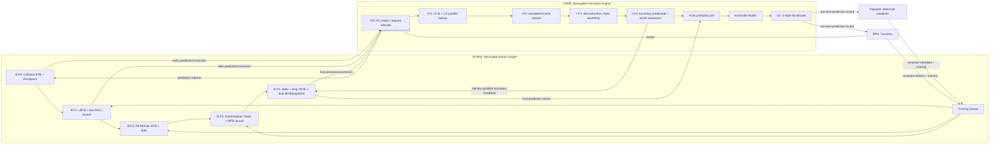

# LinxCore Chisel IFU 微架构设计

- 状态：Architecture Draft
- 日期：2026-07-25
- 适用范围：LinxCore Chisel production IFU
- 目标读者：架构、RTL、性能、验证、编译器和 LinxCoreModel 团队

## 1. 架构决议

IFU 由两个彼此解耦的引擎组成：

1. **I-SIDE（Instruction Side）**：从 PC 发起取指，从 I-cache 取得一个
   cache line，完成指令边界预解码和定长化，将 instruction entry 写入
   Instruction Buffer。
2. **B-SIDE（Branch Side）**：维护跳转预测状态，独立接收预测请求并返回
   prediction，接收执行反馈完成训练。

两个引擎不共享流水寄存器，不用组合 ready/valid 互相阻塞。它们通过带
`stid`、PC、fetch sequence 和 epoch 的 Decoupled 消息交换信息。

I-SIDE 和 B-SIDE 各有五个真实 stage：

- I-SIDE：`I-F0`、`I-F1`、`I-F2`、`I-F3`、`I-F4`；
- B-SIDE：`B-F0`、`B-F1`、`B-F2`、`B-F3`、`B-F4`。

两个五级引擎以自己的 valid/ready、resident payload 和推进条件独立运行。
同编号不代表同周期，不要求 `I-Fn` 与 `B-Fn` 锁步，也不允许跨引擎共享
stage register。Model BFU F0–F4 的预测行为和时序关系映射到 B-SIDE
`B-F0..B-F4`；BHC、ITLB 和 L1I 始终归 I-SIDE。

**Instruction Buffer 位于 I-F4 之后、D1 之前。它不是 I-F4，也不与 I-F4
合并命名。**

D1 每周期从 Instruction Buffer 读取最多四条指令。每条 entry 的指令数据
已经扩展为 64 bit；从 D1 开始，流水中的 instruction representation 固定为
64 bit。D1 执行完整 opcode、operand、immediate 和 register-alias decode。

## 2. 总体结构



## 3. 术语和边界

| 术语 | 定义 |
|---|---|
| Fetch line | I-SIDE 以一个 PC 为起点请求的 I-cache cache line |
| Instruction entry | 一条已确定长度、已扩展为 64 bit 的指令及其 PC/身份/预解码信息 |
| Predecode | 只识别 `BSTART`/`BSTOP` block boundary；指令长度判定属于 I-F3 assembly |
| Full decode | opcode、operand、destination、immediate、alias、执行类别和资源提示的完整解码 |
| Inner flush | IFU 内部发现取指路径无效后，取消较年轻 IFU work 并回到正确 PC；不清理 OOO/LSU architectural state |
| Restart | 后端 recovery/exception/redirect 驱动的前端重新启动 |
| Prediction | B-SIDE 对给定 fetch PC/历史快照产生的方向、目标和 block 边界建议 |
| Training | 执行或解码反馈对 B-SIDE predictor state 的更新 |

I-SIDE 拥有：

- 每 STID 的 next PC、fetch sequence 和 fetch epoch；
- I-F0 到 I-F4 的所有取指流水状态；
- ITLB、L1I 请求和结果汇合；
- cache-line byte extraction、跨 line 指令拼接；
- 2/4/6/8-byte 指令到 64-bit 的零扩展；
- `BSTART`/`BSTOP` predecode；
- Instruction Buffer 写入。

B-SIDE 拥有：

- BTB family、方向预测、历史和 RAS；
- loop predictor/loop buffer；
- prediction request/response queue；
- speculative history checkpoint；
- prediction arbitration；
- resolved training 和预测器恢复。

Instruction Buffer 是 I-SIDE 与 D1 之间的独立 queue boundary。D1 属于
IFU decode 端，但不属于 I-SIDE 的 I-F0–I-F4 fetch pipeline。

## 4. I-SIDE 流水

### 4.1 I-F0：PC 选择和请求分配

I-F0 是唯一的 fetch-PC 消费和分配 owner。

职责：

- 从 runnable STID 中选择一个线程；
- 在 restart、inner redirect、B-SIDE prediction 和顺序 next PC 之间仲裁；
- 计算 cache-line-aligned request address 和 line 内 byte offset；
- 分配 `fetchSeq` 和当前 `fetchEpoch`；
- 同时向 I-F1 和 B-SIDE prediction request queue 发出请求；
- 在下游无容量时保持请求 payload 稳定。

PC 选择优先级：

1. accepted backend architectural restart；
2. accepted B-F1/B-F2/B-F3/B-F4 correction 或 typed I-SIDE inner redirect；
3. matching B-F3/B-F2/B-F1/B-F0 prediction，按 B-SIDE stage rank；
4. sequential next PC。

I-F0 不直接读取 predictor table，也不直接访问 ITLB/L1I。I-F0 只通过
Decoupled 接口向两个引擎投递带身份的请求。

建议请求类型：

```text
IF0FetchRequest {
  peId
  stid
  pc
  lineVa
  lineOffset
  fetchSeq
  fetchEpoch
  predictionTag
}
```

### 4.2 I-F1：ITLB 和 L1I 并行访问

I-F1 必须在同一周期并行发起：

- ITLB lookup：以 `lineVa` 查询翻译和 execute permission；
- L1I lookup：以 virtual index 读取 tag/data candidate。

不得把 I-cache lookup 放在 ITLB hit 之后串行启动。I-F2 使用 ITLB 返回的
physical tag 对 I-F1 读出的 L1I candidate 做最终命中判断。

I-F1 驻留状态必须携带：

- I-F0 完整 request identity；
- ITLB request tag；
- L1I way/data candidate tag；
- B-SIDE prediction tag；
- line offset。

如果 I-F1 因下游阻塞不能前进，ITLB/L1I 请求和所有身份字段保持稳定，不得
重复分配 fetch sequence。

### 4.3 I-F2：翻译与 cache 结果汇合

I-F2 是 ITLB 和 L1I 并行访问的汇合级。

正常 hit 条件：

```text
itlbHit
&& executePermitted
&& l1iTagMatch(translatedPhysicalTag)
&& request.fetchEpoch == currentEpoch(request.stid)
```

I-F2 分类：

- `Hit`：将完整 cache line 和 fetch context 送 I-F3；
- `ITLBMiss`：生成 I-SIDE inner flush，并启动 page-walk/miss handling；
- `AccessFault`：生成精确 instruction-fetch fault entry；
- `L1IMiss`：分配 I-cache miss transaction，等待 refill；
- `Stale`：epoch 不匹配，静默丢弃；
- `Replay`：端口冲突、结构冲突或 refill race 需要重新发起。

#### ITLB miss 的 inner flush

ITLB miss 必须产生 typed `InnerFlushRequest`。该请求：

- 仅作用于同一 `stid`；
- 使该请求之后的 I-SIDE I-F0–I-F4 work 失效；
- 递增或切换该 STID 的 fetch epoch；
- 清理尚未进入 Instruction Buffer 的较年轻取指结果；
- 不清理 OOO、ROB、rename、LSU 或其他 STID；
- 保留物理 ITLB/page-walk state，使 miss 可以继续完成；
- page-walk 完成后从原始 faulting PC 重新发起。

建议类型：

```text
InnerFlushRequest {
  stid
  cause       // ITlbMiss, FetchReplay, PredictionCorrection
  restartPc
  fetchSeq
  oldEpoch
}
```

所有异步 ITLB/I-cache response 必须携带 transaction identity。仅通过
`waitingResponse` 或无 ID response drain 不能作为 production 方案。

### 4.4 I-F3：cache-line 提取和跨 line 拼接

I-F3 从 I-F2 的 line data 中提取从请求 PC 开始的字节流，并维护每 STID 的
instruction carry。

职责：

- 根据 line offset 提取有效 byte span；
- 识别当前 line 尾部是否包含不完整指令；
- 将上一 line carry 与当前 line 头部拼接；
- 产生若干完整的 2/4/6/8-byte instruction candidates；
- 保证每条 candidate 的 PC 连续且唯一；
- 将完整 instruction candidate 交给 I-F4。

指令长度规则：

| Header | 长度 |
|---|---:|
| bit 0 = 0 且 bits `[3:1] != 111` | 2 bytes |
| bit 0 = 0 且 bits `[3:1] == 111` | 6 bytes |
| bit 0 = 1 且 bits `[3:1] != 111` | 4 bytes |
| bit 0 = 1 且 bits `[3:1] == 111` | 8 bytes |

一个 cache line 可以产生多个连续的四宽 group。I-F3 必须保留当前 line 和
byte cursor，直到所有起始字节位于该 line 内的 instruction candidate 都已被
I-F4 接受；不得在第一个四宽 group 后直接释放 line。第二个 line 只用于补齐
跨 line 的最后一条指令，不能顺带产生起始于第二个 line 的 candidate，避免与
该 line 自己的 fetch transaction 重复。

I-F3 是跨 line instruction assembly 的唯一 owner。I-F4、Instruction Buffer 和
D1 都不得重新拼接 variable-length bytes。I-F3 不识别 block boundary；当 I-F4
接受的 group 含 `BSTOP` 时，通过 `acceptedStop` 反馈终止当前 line 的后续
candidate。最后一个 group fire 的同周期，I-F3 必须允许下一条 line
consume-and-replace。

### 4.5 I-F4：预解码和 64-bit 定长化

I-F4 是 I-SIDE 的第四个 stage。I-F4 不等于 Instruction Buffer。

I-F4 对 I-F3 已完成长度判定和跨 line 拼接的每条 instruction candidate 执行：

1. 接收并保留 I-F3 已确定的 `instLenBytes`；
2. 将指令 bit pattern 零扩展到 64 bit；
3. 只识别 `BSTART` 和 `BSTOP`；
4. 生成 block-boundary sideband；
5. 形成 Instruction Buffer enqueue entry。

I-F4 predecode 明确不执行：

- 通用 opcode decode；
- operand 或 immediate decode；
- register alias 分类；
- load/store 分类；
- FU 或 issue-queue 分类；
- ROB/LSID/resource allocation；
- branch direction/target prediction。

建议 entry：

```text
InstBufferEntry {
  valid
  peId
  stid
  pc
  inst64
  instLenBytes   // 2, 4, 6, 8
  isBstart
  isBstop
  fetchSeq
  fetchEpoch
  predictionRecord {
    predictionTag
    branchPc
    taken
    target
    kind
    provider
    checkpointId
  }
  fetchFault
}
```

`inst64` 只承载原始 instruction bits 的零扩展值。预解码不得重编码 opcode，
不得把 2/4/6-byte 指令转换成另一套 ISA encoding。

## 5. Instruction Buffer

Instruction Buffer 位于：

```text
I-SIDE I-F4 -> Instruction Buffer -> D1 decode
```

它是独立 queue，不属于 I-F4 stage，也不属于 D1 stage。

职责：

- 保存 I-F4 产生的定长 64-bit instruction entries；
- 按 STID 保持程序顺序；
- 为 D1 提供最多四条连续 entry 的 peek/pop 接口；
- 在 D1 阻塞时保持四条输出和 lane mask 稳定；
- 支持同周期多 entry enqueue 和最多四 entry dequeue；
- 对 typed restart/inner flush 只删除匹配 epoch/age 的 transient entries；
- 不修改 instruction bits 或重新执行 predecode。

推荐组织：

- per-STID FIFO bank；
- 全局 D1 STID arbiter；
- 至少四读端口或等价的四 entry head window；
- enqueue/dequeue credit 采用 pre-cycle resident occupancy，避免 ready loop；
- I-F4 enqueue group 只有在目标 bank 有完整容量时才原子接受。

Instruction Buffer entry 一旦写入，`pc`、`inst64`、`instLenBytes`、
boundary、epoch 和完整 effective `predictionRecord` 必须作为 row-owned
state 保存。不得依赖一个全局“当前预测”寄存器为后续 lane 补写预测。

## 6. D1：四宽完整解码

D1 每周期从一个选定 STID 的 Instruction Buffer head 读取最多四条连续
instruction entries：

```text
lane0, lane1, lane2, lane3
```

每条 `inst64` 已经定长为 64 bit。`instLenBytes` 只用于 PC 连续性、trace、
exception 和 block 边界，不再决定下游 payload 宽度。

D1 对每 lane 执行完整解码：

- opcode mask/match；
- compact alias；
- source/destination operand extraction；
- immediate formation；
- GPR/T/U/SGPR/tile/vector alias classification；
- load/store、control-flow、system/service 分类；
- `BSTART`/`BSTOP` predecode 结果校验；
- illegal instruction detection；
- D2 resource-preview 所需的静态属性生成。

D1 输出为一个原子的四 lane group：

```text
D1DecodeGroup {
  stid
  laneValid[4]
  lane[4] {
    pc
    inst64
    instLenBytes
    opcode
    operands
    immediate
    boundary
    fetchSeq
    fetchEpoch
    predictionRecord {
      predictionTag
      branchPc
      taken
      target
      kind
      provider
      checkpointId
    }
    exception
  }
}
```

规则：

- lane 必须是同一 STID 的程序顺序连续前缀；
- 每个 valid lane 都必须携带完整 effective `predictionRecord`；多个 lane
  可以共享不可变 backing storage，但接口语义仍是 per-instruction metadata；
- 不允许跨空洞 compaction；
- group 未被 D2 接受前，全部 payload 保持稳定；
- dequeue 数量等于 accepted group 的有效 lane 数；
- D1 不分配 ROB、physical register、LSID、IQ 或 LSU row；
- D1 之后所有指令通路都使用 64-bit instruction representation。

## 7. B-SIDE 架构

B-SIDE 是独立的五级 branch-prediction engine：`B-F0`、`B-F1`、`B-F2`、
`B-F3`、`B-F4`。其 predictor 布局、数据依赖和 correction 时序以
LinxCoreModel BFU F0–F4 为主要参考，但接口改为显式的 resident
ready/valid pipeline。B-SIDE 不访问 BHC、ITLB 或 L1I；Model BHC 及其
fetch-cache hit/miss/refill 行为只映射到 I-SIDE L1I。

### 7.1 B-F0：L0/Nano-BTB、checkpoint 和最早预测

B-F0 从 Prediction Request Queue 接受 I-F0 请求。请求至少包含
`peId/stid/pc/fetchSeq/fetchEpoch/sequentialPc`。

B-F0：

1. 验证 request epoch；
2. 分配单调 `predictionTag`；
3. 冻结 per-STID GHR、path history 和 RAS pointer；
4. 原子分配 GHRQ/checkpoint row；
5. 查询 L0/Nano-BTB 或 NLP；
6. 若命中，发布最早的 identity-tagged prediction candidate；
7. 将 request、checkpoint 和 candidate 写入 B-F0/B-F1 resident register。

checkpoint 没有容量时 `B-F0.ready=0`，但不得组合拉低 I-SIDE I-F1/I-F2
的 ready。B-F0 prediction 被 I-F0 接受后，必须记录 accepted result，
供 B-F1–B-F4 比较和 correction。

### 7.2 B-F1：uBTB、fast RAS 和大表启动

B-F1：

- 查询 uBTB；
- 对已知 return candidate 查询 fast RAS；
- 启动 PBTB/main BTB 和 BIM；
- 携带 frozen GHR 启动后续 TAGE；
- 携带 path/history 启动 tagged IBTB 的前置索引计算。

B-F1 可发布新的 identity-tagged prediction。若它与已被 I-F0 接受的
B-F0 prediction 不同，B-F1 发布 correction；若较早结果尚未被接受，
B-F1 直接以自己的更高 stage rank 覆盖 pending result。

### 7.3 B-F2：PBTB/main BTB 和 BIM

B-F2 接收：

- PBTB/main BTB 的 direct control-flow type/target；
- BIM 基础方向；
- B-F1 发起的大表 request context。

B-F2 将 BIM direction 与 BTB direct target 合成，并可发布
identity-tagged prediction。B-F2 不能用 BTB target 冒充 indirect target
或 return target。它同时把 GHR、BTB kind、provider metadata 和
checkpoint 送入 B-F3。

### 7.4 B-F3：short/medium TAGE 和 tagged IBTB 启动

B-F3：

- 读取并选择 short/medium-history TAGE provider/alternate；
- 以 PC、path history、GHR 和 control-flow kind 启动 tagged IBTB；
- 将 short/medium TAGE direction 与合法的 BTB direct target 合成；
- 保存 provider table/index/tag/counter/usefulness；
- 可发布 identity-tagged prediction，并纠正已接受的 B-F0/B-F1/B-F2
  结果。

B-F3 不执行最终 loop、long-history TAGE、IBTB 或 RAS 仲裁；这些属于
B-F4。

### 7.5 B-F4：static predictor、long TAGE、final target 和统一仲裁

B-F4 同周期汇合：

- 基于 identity-matched I-F4 boundary metadata 的 static predictor；
- long-history TAGE provider/alternate；
- B-F3 short/medium TAGE 结果；
- final tagged IBTB target/confidence；
- Loop Predictor/Loop Buffer candidate；
- RAS final exact-kind/target check；
- PBTB/main BTB direct target；
- BIM fallback；
- 已接受的所有 earlier-stage prediction。

B-F4：

- 检查 request epoch/checkpoint；
- 执行统一 provider arbitration；
- 产生 final identity-tagged prediction；
- 与 I-F0 已接受的 B-F0/B-F1/B-F2/B-F3 结果按 exact
  `{taken, branchPc, target, kind}` tuple 比较；
- 必要时产生 `PredictionCorrection`；
- 若没有 accepted earlier response，在 final response 被 I-F0 接受时执行
  一次 speculative GHR/RAS/loop update；
- 若 earlier response 已更新 speculative state 且 final 相同，只确认
  checkpoint，不重复更新；
- 若 earlier response 已更新而 final 不同，先从 checkpoint rollback，再
  在 correction 被 I-F0 接受时应用 final update。

所有 B-F0–B-F4 stage 都允许发布 prediction。若顺序路径已经被 I-F0
采用，B-F0 与该路径不同也构成 correction；任何 later-stage prediction
只要 exact identity/epoch/checkpoint 有效，就可以纠正已经接受的 earlier
result。每一级 correction 都比较 exact
`{taken, branchPc, target, kind}` tuple。若被替代的结果已经驱动 I-F0，
B-F0/B-F1/B-F2/B-F3/B-F4 correction 都通过 typed inner flush 返回 I-F0；
B-F4 是最晚、最终的 correction 点。若该 stage 的结果在任何路径被采用前
到达，则它只是首次 steering selection，不需要 flush。

跨 stage prediction rank 固定为：

```text
B-F4 > B-F3 > B-F2 > B-F1 > B-F0 > sequential
```

更晚 stage 只有在 exact identity/epoch/checkpoint 有效时才能覆盖较早
结果。B-F4 同级 target 仲裁中，exact RAS return 与 high-confidence IBTB
indirect target 属于同一最高等级，control-flow kind 决定二者谁合法；
direct target 由 BTB 提供。B-F4 方向 override 保持
`loop > long-TAGE > short-TAGE > BIM > static`；这里的 `short-TAGE`
是 B-F3 已经在 short/medium tables 内选出的 provider class。static
predictor 是最终 fallback；它消费 I-F4 提供的 boundary metadata，但运行和
仲裁均归 B-F4，不得回迁到 I-F4。

backend restart 不属于任何 provider。它是 I-F0 控制仲裁的最高优先级，
高于全部 B-F0–B-F4 correction、全部 B-SIDE stage response 和
sequential PC。

需要 correction 的情况包括：

- taken 不同；
- branch PC 不同；
- target 不同；
- control-flow kind 不同；
- early miss 而 final provider hit；
- early provider 后来被 tag/epoch 检查判定无效。

任一 B-F1/B-F2/B-F3/B-F4 later correction 都产生 typed inner flush，
目标为 corrected target 或 sequential PC；**B-F4 correction 是最后一次
prediction-driven inner flush**。I-F0 接受 correction 后：

1. 切换对应 STID 的 I-SIDE fetch epoch；
2. 从 correction request 之后清除 I-F0–I-F4 transient work；
3. 清除匹配 correction 年龄及其更年轻的错误路径 Instruction Buffer
   entries；
4. 从 corrected PC restart I-F0；
5. 通知 B-SIDE 按 checkpoint 恢复 speculative GHR/RAS/loop state。

B-F4 final response 被接受后，effective prediction 封存为不可变
`predictionRecord`，随 instruction bundle 写入 Instruction Buffer，并在 D1
附着到每个 valid lane。此后不再允许 predictor stage 产生 inner flush：

- direct branch/call 的无需运行时 operand 的 direction/target/kind 在
  Dispatch 校验；
- conditional `setc.*` 的实际 direction 在 BRU E1 校验；
- indirect/return `setc.tgt` 的实际 target 在 BRU E1 校验。

任一 post-B-F4 校验 mismatch 都产生 `BRU flush + recover`，恢复
predictor/rename/block checkpoint，并向 I-F0 发布 architectural restart；
不得重新分类为 inner flush。

### 7.6 B-SIDE ready/valid 和独立推进

每个 `B-F0..B-F4` 都是独立 resident stage：

```text
advance[n] = valid[n] && ready[n+1]
ready[n]   = !valid[n] || ready[n+1]
```

实现可用 skid buffer 打断长 ready 链。任何情况下：

- B-Fn stall 时完整 payload 稳定；
- I-Fn 和 B-Fn 不要求同周期推进；
- I-SIDE miss/refill stall 不冻结无关 B-SIDE STID；
- B-SIDE table conflict 不冻结已经进入 I-F1–I-F4 的取指；
- request/response queue 隔离两个 engine 的组合 ready；
- flush 按 `stid + epoch + predictionTag/checkpoint` 精确失效；
- physical predictor table learned state 不因普通 inner flush 清零。

### 7.7 GHR、GHRQ、RAS 和 epoch

- GHR 是 per-STID speculative state；
- GHRQ 保存 predictionTag、pre-update history、RAS pointer、loop state 和
  fetch epoch；
- speculative update 只在 accepted prediction event 上执行一次；
- correction/restart 从 matching checkpoint 恢复并剪除年轻 GHRQ rows；
- resolved training 使用 checkpoint 保存的 pre-branch history；
- stale epoch response/training 静默丢弃并计数；
- epoch wrap 必须结合 outstanding tag/sequence，不能仅比较低位 epoch。

### 7.8 Training pipeline

Dispatch/BRU/recovery 通过 retained `PredTraining` queue 向 B-SIDE 提交
反馈。
Training entry 至少包含：

- exact `stid/requestPc/branchPc/fetchSeq/fetchEpoch/predictionTag`；
- resolved kind、taken、target 和 block boundary；
- checkpoint history/path/RAS snapshot；
- B-F3 provider、alternate、index/tag/counter/usefulness metadata；
- mispredict class 和 correction/recovery outcome。

训练顺序：

1. exact identity、epoch 和 checkpoint validation；
2. BTB/uBTB/PBTB/IBTB target/type 更新；
3. BIM/TAGE counter、provider、alternate、usefulness 更新；
4. loop trip-count/confidence 更新；
5. RAS classification 修正；
6. 释放 checkpoint/GHRQ row。

training queue backpressure 不能让 BRU feedback 丢失。相同
`predictionTag` 的重复 training 必须幂等丢弃或显式报错。训练写端口与
B-F1/B-F2 读端口冲突时，采用确定的 read-old/write-new 或 bypass 规则并
由 assertion 固定。

### 7.9 Loop Buffer 边界

Loop Buffer 可缓存已确认的小循环 instruction-entry 序列，但它必须通过
I-SIDE 定义的独立 refill/replay 接口向 Instruction Buffer 提供同构 64-bit
entry。它不能直接绕过 D1，也不能访问 BHC/L1I physical state。

### 7.10 superscalarNPU 对比

参考基线：`superscalarNPU origin/main@1fae7d0`。

可复用的设计原则：

- FTQ-style request/prediction 解耦、队列吸收速率差和显式 backpressure；
- per-thread GHR/RAS/predictor speculative state；
- BRQ、prediction checkpoint、resolved training 和 rollback 的基本原则。
- `origin/main@1fae7d0` 的 IFU→OOO 接口已经为 D1 slot 0..3 分别定义
  `predict_taken`/`predict_target`，证明 per-lane prediction carry 是明确的
  接口边界；Linx 在此基础上携带完整 `predictionRecord`，而不只携带
  taken/target。
- 该仓的 OOO→IEX BRU 接口继续携带 prediction metadata，IEX→IFU 在 E1
  发布 target/address mispredict。这支持把数据相关 direction/target 校验留在
  BRU E1；Linx 额外把 operand-independent direct/call 校验前移到 Dispatch。

不能直接移植的部分：

- 其 `B0–B4 + F1–F3` taxonomy 不替代 Linx 的
  `I-F0–I-F4 + B-F0–B-F4` 双流水；
- 无 TLB/PIPT 假设不适用于 Linx；Linx I-F1 必须并行访问 ITLB/L1I；
- 删除 UBTB 或 intra-frontend flush 的选择不适用于 Linx；
- B2/B3 predictor clumping 不替代 Linx 的逐级 resident、跨 stage rank
  和 B-F4 final correction；
- superscalarNPU 的 F3 static/context decode 与当前 LinxCoreModel Model F3
  SP 都不映射到 Linx I-F3；目标 Linx static predictor 明确运行在 B-F4，
  Linx I-F3 只负责 line extraction 和跨 line assembly；
- variable-width Instruction Buffer 不适用于 Linx。Linx I-F4 将
  2/4/6/8-byte 指令扩展为固定 64 bit 后才写 Instruction Buffer，D1 也只读
  64-bit entries。

因此 superscalarNPU 只提供 decoupling、per-thread predictor state 和
checkpoint/BRQ 方法参考。Linx 的冻结契约仍是双 I-F/B-F pipeline、并行
ITLB/L1I、B-F4 final prediction/最后一次 prediction-driven inner flush、
独立 fixed-64-bit Instruction Buffer、四宽 D1 per-lane prediction record，
以及 post-B-F4 的 Dispatch/BRU typed validation。

## 8. I-SIDE 与 B-SIDE 的解耦接口

### 8.1 Prediction request

```text
I-SIDE I-F0 -> B-SIDE B-F0
PredRequest {
  stid
  pc
  fetchSeq
  fetchEpoch
  sequentialPc
}
```

### 8.2 Prediction response

```text
B-SIDE -> I-SIDE
PredResponse {
  stid
  requestPc
  branchPc
  fetchSeq
  fetchEpoch
  predictionTag
  checkpointId
  sourceStage       // B-F0..B-F4
  provider
  taken
  target
  kind
  confidence
  historyCheckpoint
}
```

I-SIDE 只接受 exact identity 匹配且 epoch 当前的 response。迟到 response
静默丢弃并计数。response 进入 I-F0 前必须经过 retained queue；下游
`ready=0` 时 payload 保持稳定。

### 8.3 Training

```text
Dispatch / BRU / recovery -> B-SIDE
PredTraining {
  stid
  requestPc
  branchPc
  predictionTag
  fetchEpoch
  resolvedKind
  resolvedTaken
  resolvedTarget
  resolvedBoundary
  historySnapshot
}
```

训练入口必须有 retained queue。执行端不能因为 predictor table 端口忙而
丢失 resolved training。

### 8.4 Redirect

B-SIDE 可以发布 prediction correction，但所有 PC 修改都由 I-SIDE I-F0
仲裁。B-SIDE 不直接写 I-SIDE pipeline register。

## 9. Flush、epoch 和 stale response

IFU 定义两类控制：

I-F0 的控制优先级固定为：

```text
backend restart
> accepted B-F4/B-F3/B-F2/B-F1/B-F0 correction, by stage rank
> accepted earlier-stage B-SIDE prediction
> sequential PC
```

backend restart 不是 predictor provider，不参与 provider rank。

### 9.1 Inner flush

来源包括：

- ITLB miss；
- fetch replay；
- I-SIDE 检测到 prediction/line-boundary 不一致；
- B-SIDE 较晚但仍可在 IFU 内纠正的 prediction。

作用域只覆盖匹配 STID 的 IFU transient state。B-F4 correction 是最后一个
prediction-driven inner flush；其 final response 被接受并封存
`predictionRecord` 后，任何 mismatch 都进入 OOO 可见的
`BRU flush + recover`。

### 9.2 Post-B-F4 按类型校验

`predictionRecord` 随每条 instruction 从 Instruction Buffer 进入 D1，并继续
传到校验 owner：

| 控制流类型 | 校验位置 | 校验内容 |
| --- | --- | --- |
| direct branch / call | Dispatch | `kind`、必然 taken 属性和静态 direct target |
| conditional `setc.*` | BRU E1 | 使用运行时 operand 计算的实际 direction |
| indirect / return `setc.tgt` | BRU E1 | 使用运行时 operand/RAS 语义计算的实际 target |

校验比较有效记录中的 `{taken, branchPc, target, kind}` 适用字段。任一 mismatch
产生 `BRU flush + recover`，并携带 prediction/checkpoint identity 向 B-SIDE
训练、向 I-F0 发布 restart。

当前 LinxCoreModel 将上述 `setc.*` direction/target 检查集中在 IEX/BRU E1；
Dispatch direct/call early validation 是目标 Chisel 设计的显式改进，不是对
当前 Model 实现位置的描述。

### 9.3 Architectural restart

来自 BRU、exception、interrupt 或 central recovery。它：

- 为目标 STID 安装 restart PC；
- 切换 fetch epoch；
- 清理匹配的 I-F0–I-F4、B-F0–B-F4 和 Instruction Buffer transient rows；
- 通知 B-SIDE 恢复 GHR/GHRQ/RAS speculative state；
- 保留 predictor learned state 和 cache/TLB physical state；
- 通过 age/epoch 丢弃迟到 response。

禁止用无 transaction ID 的“等待一次 response 再 discard”作为 production
stale-response 处理。

## 10. 实施模块划分

### 10.1 I-SIDE

- `ISideF0PcSelect`
- `ISideF1Lookup`
- `ISideITLB`
- `ISideL1I`
- `ISideF2Resolve`
- `ISideFetchMissTable`
- `ISideF3LineAssembler`
- `ISideF4Predecode`
- `InstructionBuffer`
- `D1DecodeGroupGather`
- `D1DecodeStage`

### 10.2 B-SIDE

- `BSidePredictionRequestQueue`
- `BSideBF0NanoPredictCheckpoint`
- `BSideBF1UbtbFastRasLaunch`
- `BSideBF2BtbBim`
- `BSideBF3ShortTageIbtbLaunch`
- `BSideBF4LongTageFinalCorrect`
- `BSideUBTB`
- `BSidePBTB`
- `BSideBTB`
- `BSideIBTB`
- `BSideGHR`
- `BSideGHRQ`
- `BSideBIM`
- `BSideTAGE`
- `BSideRAS`
- `BSideLoopPredictor`
- `BSideLoopBuffer`
- `BSidePredictionArbiter`
- `BSideTrainingQueue`
- `BSidePredictionResponseQueue`
- `BSideCorrectionQueue`

### 10.3 Shared protocol

- `FetchIdentity`
- `PredRequest`
- `PredResponse`
- `PredTraining`
- `InnerFlushRequest`
- `InstBufferEntry`
- `D1DecodeGroup`

## 11. 分阶段实施

### IFU-0：冻结协议和命名

- 冻结 `I-F0..I-F4` 和 `B-F0..B-F4` 两套真实 stage 定义；
- 删除所有把 I-F4 与 Instruction Buffer 合并、或把 packet window 称为
  architectural I-F4 的规范性表述；
- 定义 fetch identity、epoch、inner flush 和 prediction 接口；
- 从 production graph 和规范 stage 命名中排除 test-only packet/window
  components。

### IFU-1：64-bit Instruction Buffer 和四宽 D1

- 将 I-F3/I-F4 输出转换为 `InstBufferEntry`；
- Instruction Buffer 支持 multi-enqueue/four-dequeue；
- D1 原子输出四 lane；
- 从 D1 起禁止 variable-width instruction payload。

### IFU-2：I-SIDE I-F0–I-F4

- 建立五个真实 resident stage；
- I-F1 并行启动 ITLB/L1I；
- I-F2 实现 hit/miss/fault/stale 分类；
- I-F3 实现跨 line carry；
- I-F4 只做 boundary predecode 和 64-bit expansion。

### IFU-3：inner flush 和 miss/refill

- ITLB miss 发出 typed inner flush；
- 建立 page-walk 和 L1I miss transaction；
- 用 exact transaction/epoch 丢弃 stale response；
- 覆盖 miss-under-miss 和不同 STID 并行。

### IFU-4：B-SIDE engine

- 建立 B-F0–B-F4 resident ready/valid pipeline；
- 接入 uBTB/PBTB/BTB、BIM、GHR/GHRQ 和 RAS；
- 接入 TAGE、IBTB、loop predictor/buffer；
- 实现跨 stage rank、B-F4 static/final arbitration、最后一次
  prediction-driven inner flush、per-instruction prediction record 和
  training。

### IFU-5：production promotion

- production top 只实例化 I-SIDE、B-SIDE、Instruction Buffer 和 D1；
- reduced BFU/body-cut 与 trace top 退出 production owner graph；
- generated RTL 证明双引擎异步运行；
- 与 LinxCoreModel 对比 prediction、block boundary 和 committed trace。

## 12. 验证要求

### 12.1 I-SIDE stage

- 每个 `I-F0..I-F4` 都有独立 valid/payload/ready residency assertion；
- stall 时 payload 稳定；
- flush 后旧 epoch 不得写 Instruction Buffer；
- PC、line offset、instruction PC 连续性可追踪。

### 12.2 ITLB/L1I 并行

- 证明同一个 I-F1 request 同周期启动两个 lookup；
- ITLB hit + I-cache hit；
- ITLB hit + I-cache miss；
- ITLB miss + I-cache candidate hit；
- ITLB fault；
- refill 与 restart 同周期；
- stale translation/cache response。

### 12.3 I-F3/I-F4 与 Instruction Buffer

- 2/4/6/8-byte 指令；
- cache-line 尾部的全部跨 line 组合；
- `BSTART`/`BSTOP` 唯一 predecode；
- 非 boundary opcode 不产生其他分类；
- 各长度都正确零扩展到 64 bit；
- 多 enqueue、四 dequeue、wrap、full 和 simultaneous enqueue/dequeue。

### 12.4 D1

- 1/2/3/4 lane 连续前缀；
- stall payload stability；
- group 原子接受；
- full opcode/operand/immediate/alias parity；
- D1 之后所有 instruction field 均为 64 bit。

### 12.5 B-SIDE

- B-F0–B-F4 各级 stall/replace/flush 和 payload stability；
- 每一级均可发布 identity-tagged prediction；
- B-F1/B-F2/B-F3/B-F4 分别纠正已接受 earlier-stage prediction；
- correction exact compare tuple `{taken, branchPc, target, kind}` 的每个
  单字段 mismatch；
- B-F0 L0/Nano-BTB、B-F1 uBTB/fast-RAS、B-F2 PBTB/BTB+BIM、
  B-F3 short/medium-TAGE+IBTB launch、B-F4
  static+long-TAGE+final-provider 归属；
- `B-F4 > B-F3 > B-F2 > B-F1 > B-F0 > sequential` stage rank；
- B-F4 同级 exact RAS/high-confidence IBTB target 选择；
- `loop > long-TAGE > short-TAGE > BIM > static` direction override；
- BTB direct target；
- 各 predictor table hit/miss；
- TAGE provider/alternate；
- BIM fallback；
- GHR speculative update 和 GHRQ recovery；
- RAS push/pop/underflow/overflow；
- indirect target；
- loop trip count；
- B-F1 early prediction 与 B-F4 final prediction 相同；
- B-F1/B-F4 taken、target、kind 不同触发 correction 和 inner flush；
- B-F4 correction 是最后一次 prediction-driven inner flush；
- B-F4 final `predictionRecord` 在 D1 每个 valid lane 上保持一致身份和内容；
- direct/call Dispatch 校验，以及 conditional direction 和 indirect/return
  target 的 BRU E1 校验；
- post-B-F4 mismatch 只产生 `BRU flush + recover`，不产生 inner flush；
- correction 到 I-F0 restart 的 exact PC/epoch/checkpoint；
- backend restart 覆盖全部 provider/correction；
- training queue backpressure；
- duplicate/stale training；
- prediction response 迟到和 epoch stale；
- I-SIDE/B-SIDE 独立 stall，不形成组合环。

## 13. 架构验收清单

- [ ] IFU 明确由 I-SIDE 和 B-SIDE 两个 decoupled engines 组成。
- [ ] I-F0–I-F4 和 B-F0–B-F4 是两套真实且不锁步的五级 pipelines。
- [ ] I-F4 不再与 Instruction Buffer 合并。
- [ ] ITLB 与 L1I 在 I-F1 并行访问。
- [ ] ITLB miss 产生 typed inner flush。
- [ ] I-F3 唯一拥有跨 cache-line instruction assembly。
- [ ] I-F3 完成长度判定与跨 line 拼接；I-F4 predecode 只识别
  `BSTART` 和 `BSTOP`。
- [ ] 2/4/6/8-byte instruction 全部扩展为 64 bit 后写入 Instruction Buffer。
- [ ] Instruction Buffer 是 I-F4 与 D1 之间的独立 queue。
- [ ] D1 每周期读取最多四条 64-bit instruction 并执行 full decode。
- [ ] D1 之后不再传播 variable-width instruction representation。
- [ ] B-SIDE 包含 BTB family、GHR/GHRQ、TAGE、BIM、RAS、IBTB 和 loop units。
- [ ] B-SIDE 实现 B-F0–B-F4 stage rank、B-F4 static/final correction 和
  I-F0 restart。
- [ ] B-F4 provider rank 与 direction override 有独立 assertion 和覆盖率。
- [ ] B-F4 correction 是最后一次 prediction-driven inner flush。
- [ ] B-F4 final `predictionRecord` 随 bundle 进入 IB，并附着到每个 D1
  valid lane。
- [ ] Dispatch 校验 direct/call，BRU E1 校验 conditional direction 与
  indirect/return target；mismatch 产生 `BRU flush + recover`。
- [ ] prediction、training、redirect 接口全部带 exact identity 和 epoch。
- [ ] production graph 只实例化本设计列出的 I-SIDE、B-SIDE、
  Instruction Buffer 和 D1 owners。

## 14. 不在本设计内

- D2/D3 resource reservation 和 rename；
- ROB/BROB allocation、commit 和 recovery arbitration；
- issue、execute、BRU resolution pipeline；
- LSU、DTLB、L1D 和 lower-memory；
- predictor table 的最终容量、组相联度和 replacement 参数。

这些内容分别由 OOO、IEX 和 LSU 设计定义；但它们不得改变本文件冻结的
IFU 边界、五级 I-SIDE、独立 Instruction Buffer、四宽 D1 或 decoupled
B-SIDE 契约。
