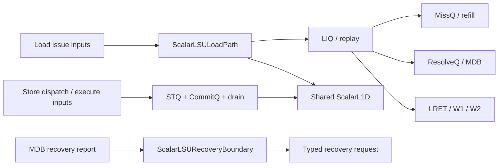
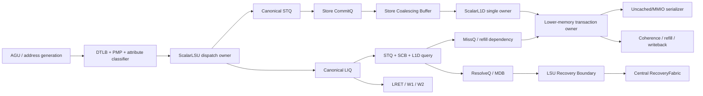

# LinxCore Chisel LSU / Memory System 微架构改进设计

> 状态：设计草案
>
> 日期：2026-07-25
>
> 适用范围：`rtl/LinxCore` Chisel 实现
>
> 上位文档：[LinxCore Chisel 微架构改进设计总纲](linxcore-chisel-microarchitecture-improvement-design.md)
>
> 实现导航：[Chisel 模块索引](module-index.md)

## 1. 目的与边界

本文先描述当前 LinxCore Chisel LSU 的真实实现状态，再定义可分阶段落地的改进方案。目标不是只给出一个理想框图，而是明确：

- 哪些能力已经存在于 canonical `ScalarLSU` 路径；
- 哪些能力只存在于 reduced top、测试 helper 或外部注入路径；
- 哪些状态有重复 owner，必须收敛；
- 每个改进模块的 owner、接口、状态、回压、恢复和验收条件；
- 如何在不破坏现有单元测试的前提下，从 reduced vertical slice 迁移到完整实现。

本文覆盖标量 load/store、L1D、地址翻译和属性分类、下级存储事务、LR/SC、MMIO、cache maintenance 与 fence。Tile/向量存储只定义共享边界，不在本文内展开。

本文以源代码为事实来源，模块说明文档用于辅助理解。当前实现仍处于“canonical 岛 + reduced 顶层闭环 + helper 族”的过渡阶段，不能把单个测试通过等同于完整 memory subsystem 已闭合。

## 2. 当前 Chisel 实现概览

### 2.1 Canonical `ScalarLSU` 岛

当前 [`ScalarLSU.scala`](../../chisel/src/main/scala/linxcore/lsu/ScalarLSU.scala) 已经组合以下主要能力：



这条路径已经形成 load、store、共享 L1D 与 recovery boundary 的 canonical 组合点，但尚未成为完整核顶层唯一真实路径。尤其是：

- frontend/AGU 到 LSU 的完整请求协议尚未闭合；
- store row 到 load E2 查询、SCB 返回和 STQ 返回仍有外部输入痕迹；
- 下级 memory/coherence、DTLB、PMP、MMIO 属性分类尚未形成生产级 owner；
- LR/SC reservation owner 仍主要组合在 reduced 路径；
- load W2 只接到 reduced ROB/GPR 侧的有限闭环。

### 2.2 Load canonical path

[`ScalarLSULoadPath.scala`](../../chisel/src/main/scala/linxcore/lsu/ScalarLSULoadPath.scala) 已经包含 LIQ、load scheduler/replay、MissQ、RefillQ、ResolveQ、MDB、LRET 与 W1/W2 返回路径。主要正向流程可概括为：

```text
allocate → address/source ready → E1 issue → E2 store/L1 query
         → E3 merge/classify → E4 hit/miss/conflict
         → ResolveQ + LRET 或 MissQ/replay → W1 → W2
```

当前实现中已经存在 cross-line phase、源返回、refill wakeup 和 load-return credit 等机制的构件，但多个 helper 仍承担了本应由 canonical LIQ owner 统一负责的状态修改。`LoadInflightStatus.L2Wait` 已声明，但当前未发现清晰、唯一的生产状态转移，应在迁移中删除或赋予严格语义。

### 2.3 Store、SCB 与 reduced vertical slice

canonical `ScalarLSU` 已有 store dispatch、STQ、CommitQ、drain 和 SCB 相关构件。不过 reduced top 还手工组合了：

- reduced store execute/STA bridge；
- reduced store commit/free owner；
- reduced store memory overlay；
- reduced resident forwarding；
- reduced load replay/wakeup 适配器。

这造成“同一个架构 store 在 canonical STQ 和 reduced shadow state 中存在两个 owner”的风险。Decode/Rename/ROB 路径也保留了另一套 STQ 相关状态。现阶段测试可以通过局部 wiring 闭环，但 owner 还没有唯一化。

### 2.4 `ScalarL1D`

[`ScalarL1D.scala`](../../chisel/src/main/scala/linxcore/lsu/ScalarL1D.scala) 当前是寄存器数组式的小型 cache/data array，实现组合 lookup、line/tag/valid/dirty 等基础行为，并被 load/store 路径共享。它适合验证接口和基本命中语义，但还不是最终物理实现：

- 没有完整的 DTLB/PMP/内存属性前置；
- 没有生产级 SRAM bank/port 时序；
- 没有完整 coherence permission、eviction hold、writeback transaction；
- refill、duplicate line 和 dirty resident data 的所有权仍需强化；
- cache maintenance 和外部 invalidation 尚未形成统一命令面。

### 2.5 Recovery 当前分层

当前 LSU recovery 已经拆出三个不同责任面，但系统集成还需完成：

1. [`ScalarLSURecoverySource.scala`](../../chisel/src/main/scala/linxcore/lsu/ScalarLSURecoverySource.scala)：
   从 MDB 已保留的报告中判断是否具备恢复资格，通过 ROB/BROB side
   lookup 把 native BID 解析为独立 BROB pointer/generation，并通过当前
   legacy `FullBidFlushReq` 适配器发布。只有 source 请求被接受时才允许
   MDB dequeue；`FullBid` 只是现有类型名，不定义 widened BID 架构字段。
2. [`ScalarLSURecoveryBoundary.scala`](../../chisel/src/main/scala/linxcore/lsu/ScalarLSURecoveryBoundary.scala)：
   选择报告所属 STID 的 oldest watermark，抑制非法 STID 的 lookup、source 和 release，并把 LSU 局部报告接到 source。
3. 中央 `RecoveryFabric`：
   应负责多个 recovery producer 的仲裁、恢复类别合并、canonical pivot/kill-set 生成和 cleanup fanout。

`ScalarLSURecoverySource` 不是 recovery arbiter，也不应直接清理 LIQ、STQ、MDB 或 cache。MDB queue 是报告保留 owner，Boundary 是上下文边界，RecoveryFabric 才是全核恢复决策与广播 owner。

### 2.6 当前成熟度分层

| 层次 | 当前状态 | 结论 |
|---|---|---|
| canonical leaf | STQ/LIQ/MissQ/ResolveQ/MDB/LRET/L1D 等已存在 | 可复用，不应重写成第二套 |
| canonical composition | `ScalarLSU` / `ScalarLSULoadPath` 已形成主要组合点 | 应扩展为唯一生产 owner |
| reduced composition | reduced top 能运行有限 benchmark | 只能作为迁移脚手架 |
| external/tie-off | cache hit、lower ready、部分 source return 可被固定或外部注入 | 不代表完整实现 |
| physical memory system | DTLB/PMP/coherence/MMIO/maintenance 未闭合 | 是后续核心工作 |

## 3. 不可破坏的设计约束

### 3.1 三个相互独立的身份域

以下三个域必须独立参数化、独立编码、独立比较：

| 域 | 示例参数 | 用途 | 禁止做法 |
|---|---:|---|---|
| 物理容量域 | STQ 16、LIQ 16、MissQ 8 | row/slot 索引、free bitmap、credit | 用 ROB 容量推导 queue index |
| ROB 身份域 | ROB 128、BID/ROB pointer | 分支年龄、commit、flush、精确恢复 | 用 LSID 或 queue slot 替代完整 ROB 身份 |
| 完整 LSID 域 | LSID 32 或 40 | 同一 STID 内 memory program order | 截断到 STQ index 宽度 |

所有接口应使用语义类型，而不是“宽度碰巧相同”的裸 `UInt`。最低验收配置必须包含不等规模，例如 `STQ=16, ROB=8, LSID=40`，以证明三个域没有隐式别名。

### 3.2 Canonical memory identity

建议所有内存操作携带：

```text
MemOpIdentity {
  pe
  stid
  tid
  nativeBid
  nativeGid { valid, wrap, value }
  nativeRid { valid, wrap, value }
  brobPtrGeneration
  lsidFull
  opToken
}
```

物理 queue 引用必须额外携带 slot generation：

```text
QueueLease {
  slotId
  generation
}
```

slot reuse 之后，旧 response 即使 slotId 相同也不能命中新 owner。
`nativeBid` 只保存 `BID_W` slot；BROB wrap/generation 必须位于独立
`brobPtrGeneration` 字段，不能重新拓宽 BID。PC、trace BID/GID/RID 和
低位 `robValue` 只能用于诊断，不能替代上述 mutation key。

### 3.3 `(STID, BID, LSID)` retirement frontier

ResolveQ 的 retired 条件必须使用每个 STID 的累计、全 row、pre-increment frontier：

```text
RetireFrontier[stid] = (brobPtrGeneration, nativeBid, fullLsid)
```

规则如下：

- 只在同一 STID 内比较；
- 只有严格早于 frontier 的 load/store 记录可被移除；
- 等于 frontier 的记录仍需保留，直到该指令的所有 memory fragment 完成；
- 一拍多行 commit 时，frontier 是本拍所有有效 commit row 按 BROB order
  和 all-row pre-increment LSID 累积后的最年轻 accepted point；
- same-BID 只用 `LSIDOrder`；cross-BID 只用 BROB live-window order，
  不使用裸 BID/LSID 无符号大小或局部 index；
- flush 后 frontier 不得倒退到已经复用的物理 row 身份。

### 3.4 TSO 与精确 side effect

- store 必须按同一 STID 的完整 LSID 顺序 drain；
- speculative load 可以越过旧 store，但必须经过 STQ/SCB forwarding 和 conflict recovery；
- cache、MMIO、maintenance 的不可逆 side effect 只能在 commit 授权后产生；
- failed SC 不得插入 STQ；
- cache 的物理有效数据不随普通 speculative recovery 被清空；
- 所有 Decoupled producer 必须保留事件，直到 ready 接受，不允许 pulse 丢失。

### 3.5 Pair 与 cross-line 统一规则

一条 pair 指令包含两个架构 element；每个 element 又可能跨 line，因此最坏需要四个物理 fragment。统一 token 为：

```text
MemFragmentId {
  opToken
  pairLane
  linePhase
}
```

所有 fragment 共享一个架构 ROB/LSID 身份。load 只有全部 fragment 完成后发布一次结果；store 只有全部 fragment 被下游不可逆 owner 接受后才能释放 STQ row。任何队列不得把 fragment index 当成新 LSID。

## 4. 目标 owner 图



目标实现只保留一个 canonical STQ、一个 LIQ 和一个 ScalarL1D owner。reduced helper 可以在迁移期适配接口，但不得继续保存生产状态。

## 5. AGU 到 LSU 接口

### 5.1 当前实现

当前 store address、store data 和 load request 可以从不同 reduced/canonical bridge 进入 LSU。地址、数据、ROB 身份和 LSID 的组合依赖局部 wiring；DTLB/PMP/属性分类尚未成为 LSU 接收前的明确阶段。

### 5.2 主要问题

- STA/STD 合流缺少统一 lease，可能把重用 row 的地址与旧数据拼接；
- VA、PA 和 cache-line address 的语义边界不清；
- pair/cross-line 在多个 helper 内各自展开；
- 请求被 queue 接受后，翻译失败或属性改变可能已产生部分 side effect；
- AGU ready 不能准确表达 STQ/LIQ、翻译和 fragment credit 的联合条件。

### 5.3 目标 owner

`ScalarLSUDispatch` 是 AGU 请求接收、fragment plan 生成和 queue lease 分配的唯一 owner。AGU 只负责地址计算，不拥有 LSU row。

### 5.4 接口和状态

建议输入接口：

```text
AguMemReq {
  identity: MemOpIdentity
  opClass
  virtualAddress
  storeData/storeMask
  pairLane
  elementBytes
  addrPartValid
  dataPartValid
}
```

STA/STD 对同一 store 共享 `StoreLease(slotId,generation)`。`FragmentPlan` 保存 element、line phase、byte mask、VA/PA 和属性，但 PA 只在 translation 成功后有效。

### 5.5 流水、回压和恢复

- D0 接收身份并预留 row；
- D1 地址生成和 split plan；
- D2 翻译、PMP 和属性分类；
- D3 原子提交到 LIQ/STQ。

只有目标 queue、所有必要 fragment credit 和 fault-report credit 同时可用时，D3 才允许 fire。恢复按完整 `(STID,BID)` kill-set 释放未 commit lease；物理 cache 状态不受影响。

### 5.6 迁移步骤

1. 为现有 load/store 输入增加 typed identity 和 generation。
2. 用 adapter 包装 reduced bridge，不立即改变测试激励。
3. 把 split/cross-line 计算移入 `ScalarLSUDispatch`。
4. 接入真实 DTLB/PMP/classifier 后删除 adapter 中的 PA/attribute 注入。

### 5.7 验收标准

- STA/STD 任意先后到达都只更新同一 generation 的 row；
- pair 且两个 element 均跨 line 时，原子预留四个 fragment；
- fault 请求不修改 L1D、MissQ 或 lower transaction；
- backpressure 任意持续周期不丢请求、不重复分配；
- unequal-domain 配置编译并通过随机测试。

## 6. `ScalarLSU` 顶层与 canonical owner 收敛

### 6.1 当前实现

`ScalarLSU` 已组合 canonical store path、load path、共享 L1D 和 recovery boundary，但 top-level 仍同时保留 Decode/Rename 侧 STQ 状态与 reduced store/load overlay。

### 6.2 主要问题

重复 owner 使 flush、free、forwarding 和 commit 可能观察不同状态；外部 E2 store snapshot 也可能与 canonical STQ 当拍更新不同步。

### 6.3 目标 owner

`ScalarLSU` 是所有 scalar memory 状态的唯一组合 owner：

- STQ owner；
- LIQ owner；
- SCB owner；
- ScalarL1D owner；
- Miss/refill transaction owner；
- LR/SC reservation owner；
- LSU recovery producer boundary。

ROB 只保存架构完成和异常状态，不保存第二份 STQ 内容。

### 6.4 接口和状态

顶层接口分为：

- dispatch/execute；
- ROB commit/flush；
- RF/ROB/wakeup completion；
- DTLB/PMP；
- lower memory/coherence；
- central recovery；
- DFX/debug。

所有内部 query 由 canonical owner 直接连线，不再由顶层重新编码 row snapshot。

### 6.5 流水、回压和恢复

顶层不插入无协议的组合 ready 环。每个跨模块边界必须是 Decoupled、credit 或明确的同拍组合 query。恢复只通过 central cleanup contract 进入各 owner。

### 6.6 迁移步骤

1. 先把 reduced shadow state 改成 canonical 状态的只读 observer。
2. 把 load E2 store/SCB query 改成内部直连。
3. 删除 Decode/Rename STQ owner，只保留 lease/token。
4. 将 reduced benchmark 接到 canonical `ScalarLSU`。
5. 删除生产路径上的 tie-off。

### 6.7 验收标准

- elaborated design 中每类 queue 只有一个 state array owner；
- reduced 与 canonical 双写 assertion 先连续通过，再删除 reduced state；
- 所有 load forwarding 数据可追溯到 canonical STQ/SCB/L1D；
- flush 后不存在 shadow row 残留。

## 7. Store dispatch 与 STQ

### 7.1 当前实现

现有 leaf helper 已覆盖 store dispatch queue、dispatch-to-STQ、insert probe、flush prune 和 load-store forwarding。canonical store path 已能接收 store、进入 STQ，并与 commit/drain 路径交互。

### 7.2 主要问题

- physical STQ 与 reduced/DecodeRename 状态重复；
- row 身份可能依赖 slot index，而非 generation-qualified lease；
- 地址和数据分拍写入时缺少统一 mutation owner；
- pair/cross-line capacity 可能按平均需求而非最坏 fragment 预留；
- store probe 必须在 permit 前稳定，否则 load conflict 判断有瞬时空洞。

### 7.3 目标 owner

`StoreQueueOwner` 唯一拥有 STQ row、free bitmap、lease generation、forward CAM view 和 non-flush 状态。

### 7.4 接口和状态

建议 row 状态：

```text
Free
Reserved
WaitAddress
WaitData
Ready
NonFlush
DrainPending
```

row 保存完整 `MemOpIdentity`、BROB pointer、lease generation、fragment plan、byte mask/data、translation/permission 结果、commit/non-flush 标志和 drain 进度。

所有 row mutation 经过单一仲裁器，优先级至少为：

```text
recovery prune > commit/non-flush > drain release > execute fill > allocate
```

### 7.5 流水、回压和恢复

- dispatch 只在 free row 和 worst-case fragment credit 可得时接收；
- address/data 可乱序到达，但只能命中相同 lease generation；
- load probe view 在当前请求获得继续执行 permit 前稳定；
- recovery 只删除 kill-set 内且尚未 non-flush 的 row；
- non-flush row 只能由正常 drain 完成释放。

### 7.6 迁移步骤

1. 给现有 STQ row 加 generation 与 typed full LSID。
2. 引入统一 mutation arbiter 和 probe-stability assertion。
3. 将 reduced overlay 改成 canonical forwarding view adapter。
4. 删除第二份 STQ state。
5. 扩展 pair/cross-line row metadata。

### 7.7 验收标准

- slot 快速释放再分配时，旧 STA/STD/response 不能修改新 row；
- flush 与 execute fill 同拍时遵守唯一优先级；
- load probe 在 permit 当拍看到完整、稳定的所有 older store；
- pair/cross-line store 无部分分配；
- STQ16/ROB8/LSID40 配置无截断。

### 7.8 当前落地状态（I0.9h）

`STQEntryBank` 已实现第一阶段 canonical owner 边界：

- row 同时保存完整 LSID、完整 store ID、精确 ROB/BROB member owner 和独立 lease generation；
- `reserve` 在 STA/STD 执行前分配物理槽，并返回 `(index,generation)` lease；
- `fill` 只按 lease 定点写 row，不再通过模糊 CAM 猜测目标；owner、完整 LSID、完整 store ID、generation 或待填半部任一不匹配即拒绝；
- 槽释放后 generation 保留并在复用时递增，旧 STA/STD 无法写入新 row；
- recovery request 对 reserve、fill、commit 和 free 具有当拍优先级；
- 旧 `insert` 接口暂时作为迁移兼容入口，并暴露其实际 lease；它不再能和 canonical reserve/fill 同拍修改状态。

定向动态测试使用 `STQ=4, ROB=8, LSID=40`，覆盖 reservation、STA/STD 任意分拍、commit/free、同槽复用、旧 generation、错误 member、错误完整 SID/LSID 和 recovery/reserve 冲突。参考模型 `tools/LinxCoreModel/model/mtccore/lsu/store_unit/stq.cpp::STQ::mergeStore` 仅提供“互补半部在 STQ 汇合”的行为证据；Linx Chisel 额外要求 generation-qualified lease，不能沿用模型中只按 BID/LSID 搜索 WAIT row 的宽松身份。

I0.9h 结束时尚未完成的部分包括 OOO reservation 投影、pair 原子多槽预留和保留式 STA/STD；这些前三项由下一节 I0.9i 收敛。exact STQ recovery kill-set、sliding window、commit/drain 与 forwarding view 迁移，以及旧 CAM insert 和重复 STQ state 的删除仍然开放。

### 7.9 OOO reservation 与保留式 STA/STD（I0.9i）

`OooStqReservationProjection` 把已经发布到 IEX 的 store 地址 child 转换成 canonical STQ reservation：

- 只允许 LSU-owned、AGU child0、typed ScalarStore/PairStore；STD child 不得重复分配；
- `RobMemberKey`、`OooMemoryOrderUopAllocation` 和 recipe/requestCount 必须完整一致；
- scalar store 原子申请一个 row，pair store 原子申请两个 row；pair SID/LSID 必须连续且两个 row 共享同一逻辑首 member；
- 物理 AGU/STD child 的 `memberIndex` 保持独立，但共享资源 owner 通过 `memberIndex-childIndex` 归一到逻辑 store 首 member；
- pair credit 不足时，batch 保持不接受，并阻止低优先级 single/legacy allocation 抢占剩余槽。

`OooIexStorePipeline` 分别保留 STA 与 STD E1 transaction。两边可以任意先后到达，在 STQ 回压下保持完整 execute payload 和 lease；仲裁器逐 beat 发送定点 fill，实际地址/数据合流只发生在 `STQEntryBank`。地址按照 normalized memory mode 和 address-source mask 计算，pair beat 地址按 access size 递增；数据由 data-source mask 选择对应 beat。错误 child member、错误 lease/range、错误 recipe/class全部 fail closed。typed recovery 或精确 load-generation cancel 在 fill 前清除匹配 retained owner。

动态 IT 使用 `STQ=4, ROB=8, LSID=40` 串接真实 projection、store pipeline 和 STQ，证明 pair reservation、STA/STD交错 fill、STD先到、连续回压、错误 child、恢复抑制、完整地址和两个独立 data beat。I0.9i结束时仍缺的 exact STQ recovery/free由下一节 I0.9j补齐；lease set 在正式 IEX composition 中的多 store 并发 residency、store issue/commit sliding frontier、load forwarding/visibility以及旧接口删除仍然开放。

### 7.10 ROB-owned exact STQ recovery（I0.9j）

`OooStqRecoveryProjection` 消费与 IQ/IEX 相同的 `OooResidencyRecoveryPlan`，从每个 STQ row 的 `STQExactOwner` 重建完整 `RobMemberKey`，再调用统一 `OooRecoveryMembership.memberKilled`。只有 exact owner 自洽、属于目标 PE/STID、落在 killed suffix 且仍为 speculative WAIT 的 row 才进入 free mask。被杀但已经 Commit 的 row只进入 status-blocked诊断；目标域内 owner字段与 row PE/STID矛盾时整次投影拒绝，不能做部分清理。

`STQEntryBank` 增加 exact recovery mask入口，并在同拍阻止 reserve、fill、commit、free。exact recovery 与旧 FlushBus 同时出现时记录 source conflict并以 exact mask为实际 mutation authority，避免两个独立恢复集合做并集。free count按实际去重 mask更新，lease generation不回退，因此恢复后的槽复用仍拒绝旧 STA/STD。

端到端 IT 现在证明同一 typed recovery 同时杀 retained STD并释放其两个 reservation row；STQ UT覆盖 WAIT/Commit混合 mask以及 exact/legacy source碰撞。尚未完成的是把这一 projection 实例化进正式静态 IEX/LSU composition、将 compatibility rows全部迁移为 exact owner、commit/non-flush sliding frontier以及 forwarding/visibility闭环。

### 7.11 Store issue sliding frontier（I0.9k）

IEX 现在从 canonical IQ 的 AGU/STD scheduling row 直接归约每个 STID 最老的
logical store。full store ID 决定 store 间顺序，full LSID作为独立一致性检查；
两者都不是物理 STQ index。一个 logical store 的 STA/STD child 使用同一
`OooIexStoreOrderState`，所以两边可以并行进入 I1，但任何一边仍 resident 时，
年轻同 STID store 的 STA 和 STD 都不能越过。

该机制比参考 ARM SID window 更严格地限定 owner：相同 serial 必须匹配完整
ROB/BROB logical member、first LSID 和 request count；冲突时目标 STID 的 store
全部 fail closed，其他 STID 和 load/非memory工作不受影响。frontier没有独立
推进寄存器，exact IQ release 或 common recovery 改变 residency 后即刻重算，
因此 cancel/repick 不需要同步第二份状态。

compact scheduling row 另存独立 typed `isStore` 位，不以 order-key valid 反推
类别；因此 resident store 丢失 logical key 时会阻塞并报告 malformed，不会作为
non-store 静默越过。

I0.9k 解决的是 IEX 到 store execute 的顺序入口，还不是完整 LSU 窗口。后续仍需
把 canonical STQ 的真实可接收范围/credit接入 eligibility，定义 full serial
wrap 前的 quiescence，连接 ROB commit/non-flush frontier，完成 CommitQ/SCB drain
与 load-forwarding visibility，并在静态 IEX/LSU 顶层证明这些 owner 共用同一
store lease。

## 8. Store CommitQ 与 drain

### 8.1 当前实现

当前 canonical 路径已有 CommitQ 和 store drain；reduced top 另有 commit/free owner，用于有限闭环。

### 8.2 主要问题

- commit 接收、STQ free 和 SCB 接收可能被不同模块拥有；
- fragment 化 store 何时释放架构 row 的规则不够集中；
- drain 顺序需要显式绑定完整 LSID，而不是 queue slot；
- lower/cache backpressure 下不得提前 free。

### 8.3 目标 owner

`StoreCommitOwner` 接收 ROB commit frontier，生成按程序序的 committed-store token；`StoreDrainOwner` 将 token 展开为 fragment 并原子送入 SCB/MMIO serializer。

### 8.4 接口和状态

CommitQ entry 保存：

```text
identity
stqLease
fragmentCount
nextFragment
memoryClass
exceptionFree
ownsStqRow
```

同一 STID 只允许最旧完整 LSID 的 committed store drain。pair/cross-line 最多四 fragment，但共享一个 completion token。

### 8.5 流水、回压和恢复

- ROB commit 只把 row 转为 non-flush，不直接 free；
- SCB/MMIO ready 低时 CommitQ 稳定保持 fragment；
- 最后一个 fragment 被不可逆下游 owner 接受后，才释放 STQ lease；
- non-flush entry 不接受普通 branch recovery 清理；
- machine reset/architectural abort 使用单独协议。

### 8.6 迁移步骤

1. 将 reduced commit pulse 替换为 canonical commit token。
2. 把 free 条件移到最后 fragment acceptance。
3. 加入 per-STID ordered drain assertion。
4. 删除 reduced commit/free owner。

### 8.7 验收标准

- SCB 连续回压时 STQ 不早释；
- 同一 STID 的 drain LSID 严格递增；
- pair/cross-line 只产生一次架构完成；
- flush 不删除已 commit/non-flush store；
- MMIO store 不经过 cache coalescing。

## 9. Store Coalescing Buffer（SCB）

### 9.1 当前实现

SCB helper 已具备 committed store 聚合、lookup 和部分 miss/response 处理能力。reduced 路径还使用 memory overlay/resident forwarding 模拟其部分语义。

### 9.2 主要问题

- overlay 与 SCB 都可能成为最新 store data 的 owner；
- 正在 lookup/miss/outstanding 的 entry 若继续被 merge，会改变已发事务语义；
- SCB completion 需要区分 cache 接收与 lower `WriteResp`；
- load forwarding 的合并顺序缺少统一定义。

### 9.3 目标 owner

`ScalarStoreCoalescingBuffer` 唯一保存已 commit、尚未完全写入最终可见层级的 cacheable store 数据。

### 9.4 接口和状态

SCB entry 按 physical line coalesce：

```text
Empty
Valid
Lookup
MissWait
WriteWait
Retry
```

entry 保存 line PA、byte mask/data、oldest/newest LSID、permission need、transaction ID 和 generation。只有 `Valid` 且未发事务的 entry 可继续 merge。

load 数据合并顺序固定为：

```text
L1D base → SCB committed bytes → STQ older speculative bytes
```

### 9.5 流水、回压和恢复

- SCB 只接收 non-flush store fragment；
- 同 line merge 只在 entry 尚未进入 Lookup/Miss/WriteWait 时允许；
- miss/upgrade/write 的 transaction 保持到明确 response；
- 普通 recovery 不清 SCB；
- external invalidation 与 SCB 冲突时由 coherence owner 串行化。

### 9.6 迁移步骤

1. 把 reduced overlay 改为 SCB query observer。
2. 为 SCB entry 加 generation-qualified transaction。
3. 接入 L1D permission 和 lower response。
4. 删除 reduced resident forwarding。

### 9.7 验收标准

- 同 line 多 store byte merge 正确，后 store 覆盖前 store；
- outstanding entry 不接受静默 merge；
- load 同拍看到 L1D、SCB、STQ 的确定性合并结果；
- response generation 不匹配时只丢弃旧 response；
- recovery 不破坏 committed store。

## 10. LIQ、scheduler、forwarding 与 replay

### 10.1 当前实现

canonical load path 已有 LIQ、E1–E4 pipeline、STQ/SCB/L1D query、source return、miss/refill replay 和 W2 completion。多个 `LoadInflightRowMutation*`、`LoadReplay*` helper 负责局部状态修改。

### 10.2 主要问题

- LIQ row 可能被 allocation、source return、replay、refill、recovery 多个 helper 直接修改；
- scheduler 与外部 pick/注入边界不清；
- speculative wakeup、E4 hit、miss pending 和 retry generation 的关系需要集中；
- `L2Wait` 状态无清晰 owner；
- external store snapshot 可能与真实 STQ 不一致。

### 10.3 目标 owner

`LoadInflightQueueOwner` 唯一拥有 LIQ row；`LoadScheduler` 只提出候选，`LiqMutationArbiter` 决定当拍 row 变化。forwarding 直接查询 canonical STQ/SCB/L1D。

### 10.4 接口和状态

建议 LIQ 状态：

```text
Free
Allocated
Translate
Ready
Probe
WaitStore
WaitMiss
WaitRefill
WaitReturn
Publish
```

每次发射带 `attemptGeneration`。所有 E2/E4、refill、source-return 响应必须匹配 row lease 和 attempt generation。

### 10.5 流水、回压和恢复

- E1 允许 speculative source wakeup，但不代表 data ready；
- E2 对 STQ/SCB/L1D 做稳定 query；
- E3 完成 byte merge 与属性分类；
- E4 hit 必须原子取得 ResolveQ 和 LRET credit；
- miss 在 MissQ 接受前保持 `missPending`，不能被重复发射；
- refill 只 wake matching generation；
- recovery kill-set 优先于所有普通 mutation；
- 删除 `L2Wait`，或把它严格定义为已由 lower transaction owner 接受、等待 terminal response 的状态。

### 10.6 迁移步骤

1. 引入统一 `LiqMutationArbiter`，先保持 helper 输出不变。
2. 把 source-return、refill、replay 改成 typed event。
3. 将 E2 store/SCB view 改为内部 query。
4. 收敛 scheduler 为 LIQ 内部唯一 issue owner。
5. 删除 sparse external lookup 和 reduced replay slot。

### 10.7 验收标准

- 同 row 多事件同拍按规定优先级只发生一次 mutation；
- retry 后旧 E4/refill 响应不能完成新 attempt；
- E4 hit 在任一 ResolveQ/LRET 无 credit 时不得部分提交；
- forwarding 覆盖 partial-byte、multiple-store、SCB+STQ 叠加；
- recovery 与 refill 同拍不会复活被杀 row。

## 11. MissQ 与 refill

### 11.1 当前实现

load path 已有 MissQ、refill queue、dependent wakeup 和 L1D refill 接口；部分测试可直接注入 refill。

### 11.2 主要问题

- external refill 注入容易绕过真实 transaction owner；
- slot 重用需要 generation 防止旧 response 命中新 miss；
- 同 line coalesce、dependent list 和 orphan response 处理需要统一；
- refill 必须先使 L1D line 可读，再 wake LIQ。

### 11.3 目标 owner

`LoadMissQueueOwner` 唯一管理 MSHR；`LowerMemoryTxnOwner` 唯一分配外部 transaction ID；`RefillInstallOwner` 负责将 terminal response 安装到 L1D。

### 11.4 接口和状态

Miss entry 保存：

```text
slotId + generation
physicalLine
requestedPermission
issued
transactionId
dependentSet[(liqLease,attemptGeneration,fragmentId)]
orphaned
```

refill response 必须同时匹配 transaction generation、line PA 和 permission class。

### 11.5 流水、回压和恢复

- 同 physical line、兼容 permission 的 miss 可以 coalesce；
- 已发 transaction 即使 dependents 全被 flush，也必须 drain terminal response；
- 未发且无 dependent 的 miss 可直接释放；
- refill 顺序为“验证 response → 安装/合并 L1D → 更新 permission → wake dependents”；
- L1D install 回压时 response 必须被保留。

### 11.6 迁移步骤

1. 给 MissQ 和 refill 加 generation。
2. 将测试 refill 入口标记为 test-only adapter。
3. 接入 lower transaction table。
4. 将 wakeup 放到 L1D install acceptance 之后。

### 11.7 验收标准

- 同 line 多 load 只发一个兼容 miss；
- old-generation response 不写 cache、不 wake LIQ；
- orphan issued miss 正常 drain 且不产生架构完成；
- duplicate refill 不覆盖 dirty resident bytes；
- refill backpressure 下无 response 丢失。

## 12. ResolveQ 与 MDB

### 12.1 当前实现

ResolveQ/MDB 已记录 load resolve、store-address conflict 与 recovery report，并通过 LSU recovery boundary 形成 typed recovery producer。

### 12.2 主要问题

- retirement 若只看单 row commit，会错误删除同拍其他 row 之间的记录；
- store address permit 与 MDB probe capacity 必须原子；
- inner-BID replay 与 cross-BID nuke 的分类需要完整身份；
- MDB report 的保留、资格判断和 cleanup 不能混为一个 owner。

### 12.3 目标 owner

`LoadResolveQueueOwner` 保存已执行 load 的 address/identity；`MemoryDependencyBufferOwner` 保留 conflict/wait/recovery report；二者使用统一 `(STID,BID,LSID)` frontier。

### 12.4 接口和状态

Resolve entry 保存完整 identity、PA range、fragment completion、forward
source 和 attempt generation。MDB report 保存 conflict load/store
identity、恢复类别、native-BID 到 BROB pointer/generation 的 lookup 状态
和 report generation。

### 12.5 流水、回压和恢复

- store address 获得执行 permit 前，必须同时取得 MDB probe/report credit；
- 同 BID 的 younger load 可走局部 replay；
- 跨 BID 或需要精确清理的冲突发布 nuke/recovery；
- recovery report 在 source 接受前由 MDB queue 保留；
- ResolveQ retire 使用全 row 累计 pre-increment frontier，只删除严格 older；
- 不允许跨 STID 做 LSID 年龄比较。

### 12.6 迁移步骤

1. 将 frontier 封装成 typed helper。
2. 把 store-address permit 与 MDB admission 合成原子条件。
3. 为 report 增加完整身份和 generation。
4. 增加多 row commit、wraparound 和 unequal-domain 测试。

### 12.7 验收标准

- 一拍多 commit row 时无早删/漏删；
- frontier equal 的 entry 不被删除；
- MDB 满时 store probe 不产生不可撤回 permit；
- 同 BID replay 与跨 BID recovery 分类稳定；
- STID 间完全隔离。

## 13. `ScalarLSURecoverySource`、Boundary 与中央 RecoveryFabric

### 13.1 当前实现

`ScalarLSURecoverySource` 从 MDB retained report 读取候选，检查其相对
oldest BID/RID 的资格，通过 ROB/BROB lookup 取得独立 BROB
pointer/generation，并经当前 legacy `FullBidFlushReq` 适配器发布。只有
`source.valid && sourceReady` 时才释放上游 report。

`ScalarLSURecoveryBoundary` 负责：

- 按 report STID 选择 oldest watermark；
- 对非法 STID 关闭 ROB lookup；
- 对非法 STID 抑制 source publish 和 MDB release；
- 将 LSU 局部 report 接到通用 recovery source。

中央 RecoveryFabric 当前是全核 recovery 收敛的目标位置，需与 branch、exception、LSU 等 producer 统一仲裁。

### 13.2 主要问题

- 若 Source 同时承担 arbitration 或 cleanup，会造成 producer 丢事件和恢复规则分裂；
- 若 Boundary 自己生成全核 kill-set，会复制中央年龄比较；
- MDB dequeue 若与 source valid 而非 handshake 绑定，会在 backpressure 下丢 report；
- lookup 返回若没有与 report generation 绑定，可能提升错误 BID；
- LSU recovery 与其他 recovery producer 同拍时需要唯一胜者及统一 cleanup。

### 13.3 目标 owner

责任严格分离：

| 模块 | 唯一责任 | 明确不负责 |
|---|---|---|
| MDB queue | 保留 conflict report，直到 accepted | 全核仲裁、直接 cleanup |
| `ScalarLSURecoveryBoundary` | STID scope、watermark 选择、非法上下文抑制 | recovery 类别优先级、kill-set |
| `ScalarLSURecoverySource` | eligibility、ROB/BROB side lookup、native BID 到 pointer/generation resolve、稳定 publish | competing-source 仲裁、状态清理 |
| `RecoveryFabric` | source 仲裁、class merge、canonical pivot/kill-set、cleanup fanout | 保存 LSU 私有 report |

### 13.4 接口和状态

Source transaction 应包含：

```text
RecoverySourceReq {
  producer = LSU
  stid
  reportGeneration
  nativeBid
  brobPointerGeneration
  fullLsid
  recoveryClass
  pivotPolicy
}
```

Source 状态至少区分 `Idle`、`LookupPending`、`PublishHeld`。ROB lookup response 必须回带 report generation 或等价 tag。

RecoveryFabric 输出统一：

```text
RecoveryDecision {
  canonicalPivot
  killSet
  redirect
  cleanupEpoch
  winningSource
}
```

### 13.5 流水、回压和恢复

- MDB report 到达后保持稳定；
- Boundary 选定同 STID watermark；
- Source 完成 eligibility 和 full-BID lookup；
- publish 在 `sourceReady` 前保持 payload 稳定；
- RecoveryFabric 接受后，MDB 才能 dequeue；
- cleanup 由 RecoveryFabric 广播，LIQ/STQ/MissQ/LRET 等各自按 owner 规则处理；
- 同拍多个 source 时，未获选 source 继续保留，不得被胜者 cleanup 误删，除非中央 kill-set 明确覆盖其报告。

### 13.6 迁移步骤

1. 保留现有 Source/Boundary 接口行为，补齐 generation tag。
2. 接入中央 RecoveryFabric 的 Decoupled producer port。
3. 将所有 LSU 局部 cleanup 输出替换为中央 decision。
4. 删除任何 source-local queue 清理。
5. 增加 branch、exception、LSU 三源同拍测试。

### 13.7 验收标准

- `sourceReady=0` 任意周期时 report 和 publish payload 稳定；
- 非法 STID 不发 lookup、不发 recovery、不释放 MDB；
- lookup old-generation response 不生成 recovery；
- 多 producer 同拍无事件丢失；
- Source、Boundary 和 Fabric 的 assertions 能证明责任无重叠；
- cleanup 使用 native BID、BROB pointer/generation 和 full LSID，不用
  物理 queue index。

## 14. LRET、W1 与 W2

### 14.1 当前实现

当前 load path 已有 per-pipe LRET queue、W1 validation 和 W2 ROB/RF/wakeup 输出，LRET 深度当前较小，典型配置为每 pipe 2。

### 14.2 主要问题

- E4 hit 若先更新 ResolveQ、后发现 LRET 满，会产生半提交；
- W1 后 recovery/ROB reuse 需要再次精确校验；
- W2 的 ROB complete、RF write、wakeup 必须原子；
- pair/cross-line 只能发布一个 terminal result。

### 14.3 目标 owner

每个 `(STID, pipe)` 有唯一 `LoadReturnQueueOwner`，负责 LRET/W1、exact
validation 和 retained `LoadResultTxn`。统一 `W2AtomicCoordinator`、
RF write/wakeup 归 IEX；exact ROB mutation 归 OOO
`RobCompletionNetwork`。LSU 只在收到同一 transaction 的
`LSU_RETURN_ACK` 后清除 LRET/LIQ 状态。

### 14.4 接口和状态

launch 时精确预留 return credit。LRET entry 保存 full identity、destination、data、exception、fragment aggregate、attempt generation 和 recovery epoch。

### 14.5 流水、回压和恢复

- E4 hit 只有同时获得 ResolveQ admission 与 LRET reservation 才提交；
- W1 做 exact ROB identity/NeedFlush 校验；
- `LoadResultTxn` 在 IEX 接受前保持稳定；IEX W2 只有 RF、wakeup、ROB
  completion 和 `LSU_RETURN_ACK` 全部 mandatory sink ready 才 fire；
- exact lookup 命中且 row 为 `NeedFlush` 时，可以消费 result 并返回
  `LSU_RETURN_ACK`，但不得产生 RF/wakeup/ROB side effect；
- missing 或 ambiguous ROB lookup 必须 hold，不能当 stale 静默丢弃；
  只有被 exact generation 或 accepted recovery kill-set 证明为 stale 的
  response 才能记录 diagnostic 后 drop；
- pair/cross-line 在 aggregate 完成前不进 LRET。

### 14.6 迁移步骤

1. 把 return credit 提前到 launch reservation。
2. 收敛现有 `LoadReplayReturnPipeW2*` helper 到 canonical LRET owner。
3. 将 LSU 输出改成 retained `LoadResultTxn`，接入 IEX
   `W2AtomicCoordinator`，由统一网络连接 ROB/RF/wakeup。
4. 删除 reduced W2 adapters。

### 14.7 验收标准

- 任一 consumer backpressure 时三路输出都不部分 fire；
- flush 与 W2 同拍不会写错 RF；
- ROB slot reuse 后旧 LRET 被 drop；
- pair/cross-line 只完成一次；
- credit 计数永不负数、永不超深度。

## 15. `ScalarL1D`

### 15.1 当前实现

当前 `ScalarL1D` 使用寄存器数组和组合 lookup，支持基本 line/tag/valid/dirty、load lookup 和 store/refill 更新。

### 15.2 主要问题

- 组合 lookup 不代表目标 SRAM latency/port；
- load、SCB、refill、eviction、maintenance 端口竞争尚未显式；
- duplicate refill 可能破坏 dirty resident data；
- eviction victim 在 writeback 完成前需要稳定保存；
- permission 与 coherence transaction 没有完整状态机。

### 15.3 目标 owner

`ScalarL1D` 是 tag/data/metadata 的唯一 owner；内部 `L1DPortArbiter`、`VictimBuffer` 和 `RefillInstallOwner` 分担时序，但不复制 cache line。

### 15.4 接口和状态

目标 line metadata：

```text
Invalid
Readable
Writable
```

另保存 dirty、replacement、ECC/parity、coherence epoch。端口类别包括 load read、SCB write/upgrade、refill install、victim read、maintenance 和 external probe。

### 15.5 流水、回压和恢复

- tag/data 按目标 SRAM 时序至少显式分拍；
- refill 命中已存在 dirty line 时保留 resident dirty bytes，禁止盲覆盖；
- replacement 先锁定 victim，直到 writeback terminal response；
- 普通 speculative recovery 不清 cache；
- maintenance/coherence invalidation 使用独立高优先级但可回压协议；
- load hit 只有 permission 足够时成立。

### 15.6 迁移步骤

1. 先在 reg-array 实现中加入明确 port arbiter 和 metadata state。
2. 增加 victim hold、duplicate refill 合并规则。
3. 用 SRAM wrapper 替换数组，不改变外部协议。
4. 接入 ECC/parity 和 DFX。

### 15.7 验收标准

- load/SCB/refill/maintenance 端口冲突无丢请求；
- dirty victim 在 writeback 完成前保持稳定；
- duplicate refill 不覆盖 dirty resident data；
- recovery 前后 cache 内容不变；
- SRAM latency 改变不影响上层功能协议。

## 16. DTLB、PMP 与 memory classification

### 16.1 当前实现

canonical load/store 路径主要围绕 cacheable physical access 验证；完整 DTLB、PMP、page fault、access fault 和 memory attribute 分类尚未闭合。

### 16.2 主要问题

- VA/PA 混用会造成 forwarding、alias 和权限错误；
- 未知属性若默认 cacheable，会把 MMIO speculative 地送入 L1D/MissQ；
- cross-page/cross-line fragment 的权限可能不同；
- fault 与 queue/cache side effect 的原子性未定义。

### 16.3 目标 owner

`ScalarMemAddressClassifier` 组合 DTLB、PMP/PMA 和 memory map，输出唯一分类：

```text
NormalCacheable
NormalNonCacheable
DeviceMMIO
CacheMaintenance
AtomicLRSC
TileOrUnsupported
Fault
```

### 16.4 接口和状态

每个 fragment 分别保存 VA、PA、page attributes、PMP result、access size、endianness 和 classification。所有 fragment 的 translation/protection 结果在架构 side effect 前汇总。

### 16.5 流水、回压和恢复

- TLB miss 进入独立 translation wait；
- PMP/PMA fail-close：未知分类视为 fault，不默认 cacheable；
- load fault 不分配 MissQ、不读 MMIO；
- store 在 commit 前完成全部 fragment 的 translation/permission preflight；
- recovery 可取消未发 page-walk dependent，但已发 walk response需按 generation drain。

### 16.6 迁移步骤

1. 定义 typed classifier output，先用现有 physical map adapter。
2. 接入 DTLB/page-walk。
3. 接入 PMP/PMA。
4. 删除 cache-ready/hit 属性 tie-off。

### 16.7 验收标准

- page boundary、line boundary 与 pair 组合覆盖；
- 任一 fragment fault 时 load 不产生部分结果；
- MMIO 请求不进入 L1D/MissQ；
- unknown region fail-close；
- stale TLB response 不修改复用 row。

## 17. 下级 memory 与 coherence

### 17.1 当前实现

现有 reduced benchmark 可使用单周期或固定 ready/hit 的内存替身；canonical L1D/MissQ 已有 refill 形态，但生产级 lower transaction/coherence owner 尚未完整闭合。

### 17.2 主要问题

- 请求和 response 缺少全局唯一、generation-qualified transaction；
- refill、upgrade、writeback、uncached 请求的完成语义不同；
- orphan response、retry、NACK 和 out-of-order response 需要明确定义；
- coherence probe 与 SCB/L1D/maintenance 的互斥关系未闭合。

### 17.3 目标 owner

`ScalarLowerMemoryTxnOwner` 管理：

- read acquire/refill；
- write permission upgrade；
- dirty writeback；
- uncached/MMIO read/write；
- coherence probe response。

协议保持中立，可适配 AXI、TileLink 或自定义 NoC，但内部 transaction table 唯一。

### 17.4 接口和状态

transaction entry 保存 ID+generation、physical line/address、class、permission、source owner、source lease、issued、retry count、terminal response 和 orphan 状态。

### 17.5 流水、回压和恢复

- request 在 lower ready 前保持稳定；
- NACK/retry 不生成 terminal completion；
- 已发请求在 source 被 flush 后标记 orphan，仍 drain response；
- refill/writeback/uncached response 分别送回正确 owner；
- coherence probe 与 victim/SCB write 通过 L1D port arbiter 串行；
- response 必须匹配 ID、generation、address class。

### 17.6 迁移步骤

1. 用 transaction adapter 包装现有 refill/test memory。
2. 实现 generation 和 orphan drain。
3. 接入 read refill、writeback、upgrade。
4. 最后接入完整 coherence probe。

### 17.7 验收标准

- arbitrary lower backpressure、乱序 response、retry 下无丢失/重复；
- orphan response 不产生架构 side effect；
- transaction ID reuse 安全；
- dirty eviction 等到 writeback terminal response；
- protocol adapter 不改变 LSU 内部 owner。

## 18. LR/SC

### 18.1 当前实现

[`ScalarLrScReservationOwner.scala`](../../chisel/src/main/scala/linxcore/lsu/ScalarLrScReservationOwner.scala) 已实现 reduced LR/SC reservation owner 的核心构件，但主要在 reduced top 组合，尚未完全纳入 canonical `ScalarLSU`。

### 18.2 主要问题

- reservation 与 canonical STQ/L1D/coherence owner 分离；
- reservation 必须使用 physical line 和完整上下文身份；
- failed SC 不得留下 STQ row；
- successful SC 的“reservation 成功”与“STQ 接收成功”必须原子；
- terminal result 不能是易丢失的组合 pulse。

### 18.3 目标 owner

`ScalarLrScReservationOwner` 迁入 `ScalarLSU`，每 STID 保存一个 reservation：

```text
valid
physical64BLine
contextId
reservationGeneration
lrIdentity
```

### 18.4 接口和状态

LR 成功返回后建立 reservation。SC 同时检查 physical line、context、generation、coherence invalidation epoch 和 canonical STQ admission。

### 18.5 流水、回压和恢复

- `LR.W` 返回必须按 ISA 要求符号扩展；
- failed SC 消费完整输入并返回失败值，不进入 STQ；
- successful SC 只有 reservation valid 且 STQ 原子接收时成立；
- successful SC 随后走普通 store commit/drain；
- 本地冲突 store、coherence invalidation、context change 清 reservation；
- terminal result 寄存并保持到 LRET/W2 接受；
- speculative recovery 依据 LR/SC 的架构年龄处理，不用粗暴全清。

### 18.6 迁移步骤

1. 将 reduced owner 接口改为 typed physical identity。
2. 移入 `ScalarLSU`，连接 DTLB/classifier、STQ 和 coherence invalidation。
3. 删除 reduced LR/SC shadow wiring。
4. 增加多 STID 和 line alias 测试。

### 18.7 验收标准

- LR.W 正确符号扩展；
- failed SC 的 STQ allocation 数为零；
- STQ 满时不能先报告 SC success；
- same-line external invalidation 使 SC 失败；
- different STID/context reservation 不串扰；
- result backpressure 下不丢失。

## 19. Cache maintenance、MMIO 与 ordering

### 19.1 当前实现

当前主要验证普通 cacheable load/store。cache maintenance、MMIO/uncached 和 fence 的完整 serializer 与完成条件尚未形成 canonical 实现。

### 19.2 主要问题

- MMIO 不允许 speculative read、coalesce、cache forwarding 或重复 replay；
- cache maintenance 可能同时操作 tag/data、victim 和 lower transaction；
- fence 的“完成”不能只看 ROB commit；
- SCB 写入 L1D 与真正 lower visibility 的边界需要按操作类型定义。

### 19.3 目标 owner

- `UncachedMmioSerializer`：exactly-once、commit-authorized 的 MMIO/uncached owner；
- `CacheMaintenanceOwner`：cache line/global maintenance 命令 owner；
- `MemoryOrderingOwner`：fence 和强序操作的 admission/completion owner。

### 19.4 接口和状态

MMIO request 保存完整 identity、PA、size、data/mask、transaction generation 和 `issued`。maintenance command 保存作用域、PA/line、writeback/invalidate 类型、progress cursor 和 terminal status。

### 19.5 流水、回压和恢复

- MMIO load 只有到达不可投机点后才能发出；
- MMIO store 只有 commit 后发出，response 前保持状态；
- MMIO 不进入 MissQ、L1D、SCB coalescing；
- fence 完成条件至少检查：older loads resolved、older STQ/CommitQ 已前进到规定边界、SCB/lower outstanding 满足架构可见性要求；
- maintenance 与 older memory op 有序，与 younger op 隔离；
- invalidate/writeback 必须等待 L1D/victim/lower terminal completion；
- 已发 MMIO 不因普通 recovery 重发。

### 19.6 迁移步骤

1. 先实现 memory class 路由和 fail-close。
2. 接入单 outstanding MMIO serializer。
3. 实现 fence scoreboard。
4. 加入 per-line maintenance，再扩展 global maintenance。

### 19.7 验收标准

- MMIO backpressure/retry 下 exactly once；
- MMIO load 不被 speculative 发出；
- fence 不早于 older memory visibility 完成；
- maintenance 与 dirty victim/writeback 正确串行；
- recovery 不重复已发 MMIO。

## 20. Pair 与 cross-line 的统一实现

### 20.1 当前实现

load path已有 cross-line phase 构件，但 load/store、pair 和 MMIO 的 split 规则尚未由一个 owner 统一。

### 20.2 主要问题

多个模块自行 split 会产生不同 fragment count、不同 fault policy 和不同 free/completion 时机。最坏 pair+cross-line 需要四 fragment，若按两个 credit 预留会死锁或半提交。

### 20.3 目标 owner

`MemFragmentPlanner` 是纯组合 leaf；`ScalarLSUDispatch` 拥有 plan 的 admission 和持久化。下游只消费明确的 `MemFragmentId`。

### 20.4 接口和状态

plan 最多四项，每项包含 byte range、line PA、pair lane、line phase、class、fault 和 target owner。架构 aggregate 保存 expected/completed bitmap。

### 20.5 流水、回压和恢复

- admission 前预留最坏实际 fragment 数；
- 所有 fragment 完成 translation/PMP preflight 后，才允许第一项不可逆 store/MMIO side effect；
- load fragment 可独立 miss/replay，但只 aggregate 一次；
- store 最后 fragment 被 SCB/MMIO owner 接受后才 free；
- recovery 按共同 identity 清除全部 speculative fragment。

### 20.6 迁移步骤

1. 抽出已有 cross-line 算法为纯 leaf。
2. load 先改用统一 plan。
3. store/pair 再接入。
4. 删除各 helper 内重复 split 状态。

### 20.7 验收标准

- 覆盖 1、2、3、4 fragment；
- 任一 fragment fault 不产生 load 部分结果；
- store 不发生部分不可逆提交；
- completion/free 均恰好一次；
- fragment response 乱序仍正确 aggregate。

## 21. Leaf helper 族的保留、合并与删除

canonical owner 收敛不等于删除所有 helper。纯组合变换、局部 pipeline 和可独立验证的协议检查应保留；保存生产状态或复制 owner 的 helper 必须合并或删除。

### 21.1 当前具名模块逐项处置

| 当前模块 | 当前职责/问题 | 目标处置 |
|---|---|---|
| `StoreDispatchSTQPath` | queue/bridge/STQ 的迁移组合点 | 瘦身为 typed composition，第二 STQ owner 删除 |
| `STQEntryBank` | canonical STQ row state | 提升为唯一 STQ owner，加入 lease generation 和 banked write |
| `STQCommitQueue` | committed store 顺序 owner | 保留 full LSID/token，不复制 STQ row |
| `STQCommitDrain` | committed fragment drain | 保留 retained split state，最后 fragment 后才 free |
| `STQSCBCommitPath` | STQ 到 SCB 组合 | 保留 canonical composition，全部 credit 原子接受 |
| `SCBCommitIngress` / `SCBCommitBridge` | committed fragment ingress | 保留 batch credit 和 ordered acceptance |
| `SCBRowBank` | SCB resident state | 提升为唯一 SCB owner，加入 transaction generation |
| `SCBEntryState` | SCB state enum | 保留；非法跳转 assertion，迁移只由 owner fire |
| `SCBEgressSelect` / `SCBLookupControl` | lookup candidate/control | 保留 owner 内纯选择和 port control |
| `SCBStateUpdate` | SCB mutation helper | 只由 exact response/owner fire 驱动 |
| `LoadInflightLaunchSelect` | load/replay launch 选择 | 重构为正式 scheduler 的 candidate child |
| `LoadReplayLaunchReadiness` | replay cause/credit policy | 合并到 scheduler，不独立保存状态 |
| `LoadRefillTransport` | miss/refill 双 ingress | 保留 retained transport；L1D install 后才 wake |
| `LoadWaitStoreTimeout` | wait-store timeout | 只生成 typed MDB/replay event，不直接清 LIQ |
| `MDBConflictDetect` | conflict 分类 | 保留 same-BID inner、cross-BID nuke 纯判定 |
| `MDBConflictTransactionControl` | conflict outputs | 合并到 `ScalarLSUMDBPath` 全输出原子 transaction |
| `MDBQueueFanout` | conflict/wait fanout | 保留并要求全部 mandatory credit |
| `MDBSSIT` | dependence predictor | 保留 exact full LSID、weight 和 confidence |
| `MDBStoreProbeReplay` | store probe retention | 保留有限 replay owner，不使用 advisory pulse |
| `ScalarLSUMDBPath` | MDB composition | 提升为唯一 conflict/wait/recovery report owner |
| `ScalarLSULoadReturnQueue` | LRET resident queue | 保留并按 STID/pipe 参数化 |
| `ScalarLSULoadReturnPipeline` | W1/legacy W2 load return | 重构为 exact validation 和 retained `LoadResultTxn`；terminal W2 归 IEX |
| `ResidentStoreForwardStoreSnapshot` | reduced snapshot copy | 用 canonical STQ query + retained response 取代 |

### 21.2 Leaf 家族规则

| helper 族 | 目标处理 | 理由/目标 owner |
|---|---|---|
| `StoreDispatchQueues` | 保留 leaf，状态归 `StoreQueueOwner` | 队列算法可复用，不能成为第二 STQ |
| `StoreDispatchToSTQ` | 保留协议 adapter | 统一 typed lease 后继续使用 |
| `STQInsertProbe` | 保留 | 承担 pre-permit 稳定 probe |
| `STQFlushPrune` | 保留纯函数/leaf | kill-set 由 RecoveryFabric 提供 |
| `LoadStoreForwarding` | 保留 | canonical STQ/SCB/L1D 数据合并 |
| `LoadForwardPipeline` | 保留 pipeline leaf | 时序功能，不拥有 LIQ |
| `LoadReplayWakeup` / `LoadRefillWakeup` | 保留 typed event leaf | mutation 统一进入 LIQ owner |
| `LoadInflightRowMutation*` | 合并到 `LiqMutationArbiter` | 消除多 writer |
| `LoadReplaySourceReturnStoreSnapshot*` | 迁入 `LiqSourceReturnPath` 后删除 snapshot 族 | 改为 native STQ query |
| `LoadReplayReturnPipeW2*` | 合并到 LRET result owner | 输出 retained result；IEX W2 保证 atomic completion |
| MDB/Resolve helper | 保留纯比较和 queue leaf | frontier/retention owner 唯一 |
| SCB merge/query helper | 保留 | 状态只在 canonical SCB |
| `ReducedStoreMemoryOverlay` | 删除生产使用 | SCB/STQ 已是 canonical 数据 owner |
| `ReducedStoreResidentForward` | 删除生产使用 | 改为 L1D+SCB query |
| `ReducedStoreCommitFreeOwner` | 删除 | CommitQ/drain 唯一 owner |
| `ReducedStoreExecResultBridge` / `ReducedStoreStaAddressExecBridge` | 迁移期 adapter，最终删除 | AGU→LSU typed interface 替代 |
| `ReducedLoadReplay*` | 删除生产使用 | canonical LIQ scheduler/replay 替代 |
| `ReducedLiveLoadLiqCapture` | 删除 | LIQ owner 直接 capture |
| `ReducedLoadWaitReplaySlot` | 删除 | LIQ state/attempt generation 替代 |
| `ResidentStoreReplayWakeup` adapter | 删除 | SCB/L1D native response |
| sparse `LoadLookupArbiter` | 删除或仅测试使用 | canonical port arbiter 替代 |
| probe、fault injection、external refill harness | 仅 test scope 保留 | 不参与生产 owner |

删除顺序必须遵循“先 observer、再单写、最后删 shadow state”，不能在 canonical coverage 未建立前一次性移除 reduced 闭环。

## 22. 分阶段迁移计划

### 阶段 A：身份与断言先行

- 引入 typed full LSID、full BID、queue lease generation；
- 加入三域不等价配置；
- 为 STQ/LIQ/MissQ/LRET 增加 stale-response assertion；
- 不改变对外功能。

出口条件：现有测试通过，新增 unequal-domain 与 slot-reuse 测试通过。

### 阶段 B：canonical owner 单写

- 收敛 STQ/LIQ mutation；
- reduced shadow state 改为只读 observer；
- 内部直连 STQ/SCB/L1D query；
- 统一 CommitQ/free。

出口条件：elaboration 和结构检查证明每类状态只有一个 writer。

### 阶段 C：recovery 闭合

- ResolveQ/MDB frontier 修正；
- Source/Boundary generation-qualified；
- 接入 central RecoveryFabric；
- cleanup 统一由 fabric decision 驱动。

出口条件：多 recovery producer、backpressure、wraparound 测试通过。

### 阶段 D：真实 cache/miss/lower path

- L1D port arbitration、victim hold、permission；
- MissQ/refill transaction generation；
- lower transaction owner；
- orphan drain、retry、duplicate refill。

出口条件：随机 backpressure、乱序 response、dirty eviction 验证通过。

### 阶段 E：translation、LR/SC、MMIO 与 maintenance

- DTLB/PMP/classifier；
- canonical LR/SC；
- MMIO serializer、fence scoreboard；
- cache maintenance。

出口条件：异常、强序、exactly-once 与 coherence invalidation 测试通过。

### 阶段 F：删除 reduced 生产路径

- benchmark 顶层切到 canonical `ScalarLSU`；
- 删除 reduced overlay/replay/commit owner；
- 保留必要 test harness；
- 更新模块索引和实现状态文档。

出口条件：canonical top 覆盖原 reduced benchmark，生产 elaboration 不引用 reduced helper。

## 23. 验证与验收矩阵

### 23.1 结构性检查

| 检查 | 证明目标 |
|---|---|
| state writer lint | STQ、LIQ、SCB、L1D、MissQ 各只有一个 owner |
| width/type lint | physical slot、ROB identity、full LSID 不混用 |
| Decoupled stability assertions | valid 且非 ready 时 payload 稳定 |
| generation assertions | stale response 无状态修改 |
| no-production-reduced grep | canonical top 不引用 reduced owner |

### 23.2 定向功能测试

- STA/STD 任意顺序与 slot reuse；
- load partial forwarding：L1D + SCB + 多个 STQ store；
- same-BID replay 与 cross-BID recovery；
- ResolveQ 多 commit row frontier；
- E4 ResolveQ/LRET 双 credit 原子性；
- pair、cross-line、pair+cross-line；
- duplicate refill、dirty victim、orphan miss；
- LR.W、failed SC、successful SC、external invalidation；
- MMIO exactly once、fence、cache maintenance；
- branch/exception/LSU recovery 同拍仲裁。

### 23.3 随机与形式不变量

最低不变量：

```text
allocated(queue) <= physicalCapacity
noTwoLiveRowsShare(slotId,generation)
stqDrainLsid is monotonically increasing per STID
acceptedLoadResult occurs at most once per opToken
acceptedStoreFragment occurs exactly fragmentCount times
recoveryReport is retained until accepted
noKilledAttemptWritesRF
noFailedScAllocatesSTQ
noMmioTransactionIsIssuedTwice
```

随机测试必须扰动：

- 每一级 ready；
- refill/write response 次序；
- source return 次序；
- flush 时机；
- slot reuse；
- BID/LSID wraparound；
- STID；
- pair/line/page boundary。

### 23.4 DFX 与可观测性

建议至少提供：

- 各 queue occupancy/high-watermark；
- load hit、forward、miss、replay、nuke 原因计数；
- store drain/SCB merge/stall 原因；
- recovery source pending/accepted/blocked 周期；
- lower transaction retry/orphan；
- MMIO/fence/maintenance latency；
- stale response drop 计数。

DFX 只能观察，不得成为状态推进条件。

## 24. 仍需架构确认的开放项

以下问题不应由局部 Chisel helper 自行决定：

1. pair store 跨 page 且第二 fragment fault 时的 ISA 精确异常规则；
2. fence 对 SCB“已写入 L1D”和“已对下级可见”的具体完成边界；
3. cache maintenance 指令的作用域、权限与异常模型；
4. coherence 协议和 lower interconnect 的最终选择；
5. multi-STID 下 reservation、ordering 和共享 L1D 的隔离策略；
6. non-cacheable normal memory 与 device memory 的乱序差异；
7. DTLB/page-walk 与全核 recovery 的共享 owner；
8. ECC corrected/uncorrectable error 的恢复类别和上报路径。

在这些问题确认前，接口应保留 typed policy 字段并 fail-close，不应把临时假设固化为 silent behavior。

## 25. 完成定义

LSU 改进不能以“已有 `ScalarLSU` 类”或“reduced benchmark 能跑”为完成。只有同时满足以下条件，才可认为 memory subsystem 的 canonical 化完成：

- AGU、DTLB/PMP/classifier、LSU、L1D 和 lower memory 形成真实闭环；
- STQ、LIQ、SCB、MissQ、L1D 各有唯一 owner；
- physical capacity、ROB identity、full LSID 三域在类型和测试中独立；
- recovery report 不丢失，Source/Boundary/Fabric 职责无重叠；
- `(STID,BID,LSID)` frontier、TSO drain、pair/cross-line 全部通过边界测试；
- LR/SC、MMIO、fence、cache maintenance 具有精确且可回压的 terminal completion；
- reduced production shadow state 已删除；
- lint、typecheck、单元、集成、随机 backpressure 和关键形式不变量全部通过；
- 文档、模块索引、DFX 与实际 wiring 一致。
