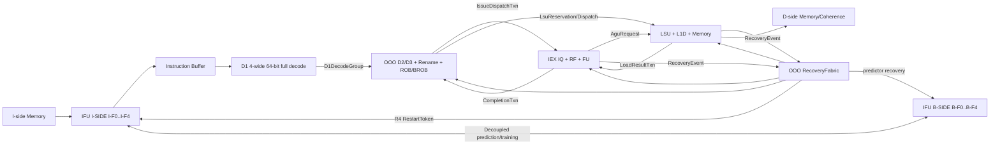

# LinxCore Chisel 微架构改进设计总纲

- 状态：Draft，供架构评审
- 日期：2026-07-25
- 目标读者：LinxCore 架构、RTL、性能、验证、编译器和模型团队

## 1. 文档结构

LinxCore Chisel 微架构改进方案拆成四份可独立评审、可独立实施的设计：

| 方案 | 负责范围 | 详细文档 |
|---|---|---|
| IFU | decoupled I-F0–I-F4 / B-F0–B-F4、独立 Instruction Buffer、四宽 D1、branch prediction | [IFU 改进设计](linxcore-chisel-ifu-improvement-design.md) |
| OOO | D2/D3、rename、ROB/BROB、commit、recovery、Template reservation/fill | [OOO 改进设计](linxcore-chisel-ooo-improvement-design.md) |
| IEX | issue/read/confirm、RF、FU、system/service、writeback/completion | [IEX 改进设计](linxcore-chisel-iex-improvement-design.md) |
| LSU | load/store ordering、queues、replay、L1D、translation、lower memory | [LSU 改进设计](linxcore-chisel-lsu-improvement-design.md) |

四份详细文档统一采用以下模块模板：

1. 当前 Chisel 实现。
2. 主要问题和 production 阻塞项。
3. 目标职责和唯一 owner。
4. 接口、identity 和内部状态修改。
5. 流水、回压、恢复和异常。
6. 从 reduced/canonical WIP 到目标实现的迁移步骤。
7. 可执行的验收标准。

本总纲不重复模块内部设计，只冻结跨域边界、共同契约、实施依赖和整体
完成定义。当前模块导航见
[Chisel Module Index](module-index.md)。

## 2. 基线与证据边界

| 仓库 | revision |
|---|---|
| `rtl/LinxCore` | `2d25c32cb17e5a6561d232291f70e225a663a9a8`，dirty |
| LinxISA superproject | `726d1ba704b850b69bb16339cd1f9590e8dc65bd` |
| `tools/LinxCoreModel` | `2a1cf81e47060141e5305be5e49079a8fadc8e42` |
| `emulator/qemu` | `b4df5c31d06eaee04b602b4b6fd8b6f2c2592b4c` |

当前 Chisel 实现仍是以下三类能力的组合：

- canonical 模块岛，例如 `ROBEntryBank`、BROB 模块族、`ScalarLSU` 和
  `ScalarL1D`；
- reduced vertical slice，例如
  `LinxCoreFrontendFetchRfAluTraceTop` 和 reduced issue/execute/service/
  memory helper；
- benchmark/platform wrapper，例如
  `LinxCoreBenchmarkAutonomousTop` 的 sparse memory、semihost 和 finisher。

文件存在、局部单测通过、被 wrapper 实例化或 natural benchmark 到达
finisher，都不能单独证明 production owner 已闭合。模块 promotion 必须
同时具有：

1. 唯一 owner 和 production 接线。
2. exact identity 和 stale-response 防护。
3. backpressure、wrap、recovery 和非等容量验证。
4. generated RTL 或邻接 owner 组合验证。
5. top-visible 非零 activation evidence。
6. 适用时的 QEMU/LinxCoreModel 对比。

## 3. 四域边界

### 3.1 IFU

IFU 由两个 decoupled engines 组成：

- I-SIDE 拥有每 STID PC、fetch identity、I-F0–I-F4 五个真实 stage、I-F1
  并行 ITLB/L1I lookup、I-F2 translation/cache resolve、I-F3 line
  assembly、I-F4 boundary predecode 和 64-bit expansion；
- B-SIDE 拥有独立且不与 I-SIDE 锁步的 B-F0–B-F4 五级 pipeline，以及
  BTB/uBTB/PBTB/IBTB、GHR/GHRQ、TAGE、BIM、RAS、loop
  predictor/buffer、provider rank、B-F4 static/final correction 和 resolved
  training。

Instruction Buffer 是 I-F4 之后、D1 之前的独立 queue boundary。I-F4
不表示 Instruction Buffer。D1 每周期从 Instruction Buffer
读取最多四条 64-bit instruction，每个 valid lane 携带完整 B-F4
prediction record，并完成 opcode/operand/immediate/alias full decode。从
D1 开始，所有 instruction representation 固定为 64 bit。

ITLB miss 由 I-SIDE 产生 typed inner flush。B-F4 correction 是最后一个
prediction-driven inner flush；B-F4 final record 封存后，Dispatch 校验
direct/call，BRU E1 校验 conditional direction、exact-full-BID static target
一致性和 indirect/return target，
mismatch 使用 BRU flush/recover。B-SIDE 与 I-SIDE 只通过带 `stid`、fetch
sequence、epoch 和 prediction tag 的 Decoupled
request/response/training/redirect 接口交互。
condition SETC 只校验 `Cond` record；`setc.tgt` 校验 `Ind/ICall/Ret`，并把
cold `Fall` record 作为 `Ind` correction。`Direct/Call` record 上的
target-setting uop 不得重复触发 BRU recovery。

I-F4 只在 `BSTOP` 命中 resident `BSTART` context 时终止 control stream；
standalone `BSTOP` 不得删除同一 cacheline 的后续 instructions。D1 对 group
尾 `ACRC` 使用跨 group fixed-64-bit lookahead。SETC mismatch 的 backend
recovery 等待 exact full-BID block 完成，以 youngest RID 保留整个 same-block
tail；条件 FRET 按 full-BID 消费 SETC condition 和 target，caller target 不得
污染后续 callee-return fallback。

production IFU composition 固定为四个 wrapper：`LinxCoreIfu`、
`IfuLineMemoryBridge`、`D1InstructionDecodeStage` 和
`IfuBackendFeedbackBridge`。`IfuWindowLineFillAdapter` 只属于 benchmark
memory harness，不是 production 架构边界。

IFU 不分配 ROB、物理寄存器、LSID、IQ 或 LSU row。IFU 向 OOO 发送
`D1DecodeGroup`，并在整组 handshake 成功前保持全部 lane 稳定。

### 3.2 OOO

OOO 从 accepted `D1DecodeGroup` 开始，到 IEX/LSU 的 reservation-backed
dispatch 和 accepted ROB commit/deallocation 结束。OOO 拥有：

- D1/D2 transport 和 D2 resource preview；
- D3 最大连续 lane prefix 的原子 reservation；
- GPR 与 T/U rename/checkpoint；
- ROB、BROB、marker lifecycle、commit 和 deallocation；
- completion ingress retention；
- central recovery capture/resolve/prepare/commit/ack；
- Template D3 reservation、`ReservedUnfilled` 和 row fill。

OOO 可以申请 IEX/LSU credit 和持有 token，但不能复制 IQ、RF、FU、
LIQ、STQ、SCB、MDB 或 cache resident state。

### 3.3 IEX

IEX 从 reservation-backed issue dispatch 或 retained LSU result 开始，到
统一 W2 writeback/completion transaction 被相邻 owner 接受结束。IEX
拥有：

- S1/S2 ingress、S3 IQ residency、P1/I1/I2；
- physical GPR data、ready/version 和读写端口；
- ALU、BRU、AGU dispatch envelope、divider、FPU 和 SP；
- CSR/system/trap/interrupt 以及 ISA-defined service；
- 包括 load return 在内的 retained writeback/completion arbitration；
- Template child 的正常执行。

IQ row release 只表示 storage ownership 已转移，不能表示 ROB complete、
RF write、wakeup 或外部副作用已经发生。

### 3.4 LSU

LSU 从 AGU/address-class request 和 D3 reservation token 开始，到
retained `LoadResultTxn` 被 IEX W2 接受、store visibility、memory
response 或 typed recovery event 结束。
LSU 拥有：

- store dispatch、STQ、CommitQ、drain 和 SCB；
- LIQ、scheduler、forwarding、replay、MissQ、refill、ResolveQ 和 MDB；
- LRET/W1 和 load-result retention；W2/RF/wakeup 归 IEX；
- `ScalarL1D`、DTLB、PMP、memory classification；
- lower-memory/coherence、LR/SC、cache maintenance 和 MMIO ordering。

LSU 不直接修改 ROB、RF、GPR rename、frontend PC 或 BROB；它只发布
exact retained load/store result、recovery event 和 ordered memory
transaction。

## 4. Production owner graph



最终只有一个 `LinxCoreProductionTop`。现有 `LinxCoreTop` 在迁移完成后
承担该职责；迁移期名字不能永久形成第二个 production top。顶层只连接
platform、domain owner、interrupt/debug 和 trace，不实现队列、age
比较、状态机、复杂仲裁或 side-effect shortcut。

## 5. 共同身份和顺序契约

### 5.1 Native identity

- `BID` 是每 STID 的 BROB slot，宽度严格为
  `BID_W = ceil(log2(BROB_ENTRIES))`。
- BROB wrap/generation/full pointer 是独立字段，不能塞入 BID。
- native GID/RID 是 ROB-ring 的 valid/wrap/value identity。
- `LSID` 是每 STID 的 full memory-order serial，默认至少 32 bit。
- LID/SID 是 LIQ/STQ 物理 slot 加 generation，只用于物理路由。
- `block_uid` 只用于 DFX，不参与硬件 age、路由或 recovery lookup。

共享 block identity 是 `(STID, BID)`；STID 和 generation 都不打包进
BID。

### 5.2 Exact completion

所有 completion 至少携带：

```text
PE + STID + TID
+ native BID
+ native GID
+ native RID
+ independent BROB generation/full pointer
+ producer/transaction epoch
```

LSU completion 另外携带 full LSID、LID generation、destination
provenance 和 pair/subrequest 信息。只按 `robValue`、低位 slot 或 trace
投影完成的接口必须删除。

### 5.3 Age

- same-BID memory age 只使用 `LSIDOrder`。
- cross-BID age 只使用 BROB live-window order。
- same-STID ROB age 使用 wrap-qualified native RID。
- 不同 STID 不能比较 RID、BID 或 LSID；公平性由显式 arbiter 提供。
- serial 半环歧义或 authority 缺失时 fail closed。

## 6. 原子 handshake 和状态转移

所有 ready/valid payload 在 `valid && !ready` 时保持稳定。owner 只能在
自己的 `fire` 上改变状态，禁止通过 top-local observation 或 combinational
shortcut 产生 side effect。

D3 使用最大连续 lane prefix：

1. preview lane 0 到 lane N 的所有 mandatory credit。
2. 选择从 lane 0 开始可共同满足的最大 `k`。
3. 一个 reservation transaction 原子接受 `[0, k)`。
4. suffix `[k, decodeWidth)` 保持稳定并重试。
5. accepted prefix 的 ROB/BROB/rename/IQ/LSU token 和 identity 同一
   fire mutation；禁止跳 lane 或部分 owner 先行修改。

IEX/LSU 的 terminal side effect 使用相同原则：ROB completion、RF write、
wakeup、load-row clear 或 service response 只有在所有 mandatory sink
同时接受时才发生。

Commit `35d2f9c5` 固化了 completion backpressure 规则并通过 48/48 +
build：retainer ingress ready 只能来自 registered resident occupancy，
不能组合依赖 downstream completion-ready、ROB accepted 或同周期 dequeue
产生的容量。terminal completion、RF writeback、wakeup、redirect 和 release
side effect 仍只从最终 `completeFire` 边界触发。

## 7. Recovery 契约

每个 producer 先把完整 typed event 保存在有限 retained queue。中央
`RecoveryFabric` 只解析一次 canonical `(STID, BROB full pointer)`，并把
同一个 resolved transaction 发给所有 owner。

流程固定为：

```text
capture -> canonical resolve -> prepare/all-owner ready
        -> atomic commit -> all-owner ack -> R4 restart
```

BROB restore 按 class 区分：

- `MISS_PRED_FLUSH` 的输入是 first-killed block，执行 inclusive truncate。
- nuke、inner 和 fast flush 保留 pivot，tail 指向 `successor(pivot)`。
- suffix recovery 不移动 commit head。

canonical lookup 零匹配、多匹配、generation mismatch 或 mandatory owner
未准备好时，所有 owner 零 mutation。任何模块不得独立重算 kill interval、
predecessor 或 restart target。

Template recovery 额外遵守：

- `ReservedUnfilled` token/credit 由 Template lease ledger 取消。
- 已 filled row 属于正常 ROB/rename/IQ/LSU owner，只走正常 typed
  recovery。
- CTU 不得 blanket-cancel filled row 或反向撤销正常 owner 已接受的
  side effect。
- fatal teardown 使用独立 quiesce/ack 协议。

## 8. 公共参数基线

接口保持参数化，第一版 production closure 使用：

| 参数 | 第一版目标 |
|---|---:|
| Fetch/decode/rename width | 4 |
| Scalar dispatch/issue/execute width | 2 |
| Commit width | 4 |
| Physical scalar IQ | 4 banks，32 entries total |
| 每 IQ enqueue ports | 2 |
| Architectural/physical GPR | 24 / 128 |
| GPR MapQ depth | 256 |
| GPR read/write ports | 6 / 4 |
| BROB entries per STID | 256 |
| STQ/LIQ/SCB | 16 / 32 / 16 |
| L1D | 64 sets × 4 ways × 64 B line |

下列参数相互独立：所有 pipeline width；ROB/BROB/IQ/LIQ/STQ/SCB/MissQ/
RefillQ/LRET capacity；GPR/MapQ/RF ports；STID/PE/TID；BID/RID/LSID/
LID/SID width；cache set/way/line/bank/latency。

至少保留一个非等容量验证配置，例如 8-entry ROB、16-entry STQ 和
40-bit LSID，证明物理容量、ROB identity 和 memory order 没有互相派生。

## 9. 跨域接口

| 接口 | Producer | Consumer | 核心契约 |
|---|---|---|---|
| `D1DecodeGroup` | IFU | OOO | lane 顺序固定，整组 stable，未知 opcode 精确 trap |
| `D3ReservationTxn` | OOO | OOO/IEX/LSU | 最大连续 prefix，multi-owner 原子 token |
| `IssueDispatchTxn` | OOO | IEX | exact identity、operand qtag/version、recovery context |
| `AguRequest` | IEX | LSU | VA、size/mask、ordering class、full instruction identity |
| `CompletionTxn` | IEX | OOO | retained exact-key terminal transaction |
| `LoadResultTxn` | LSU | IEX W2 | retained full identity/LSID/result；accept 后返回 `LSU_RETURN_ACK` |
| `RecoveryEvent` | IEX/LSU | OOO recovery | typed、retained、带 class/provenance；IFU fault 只走 D1 fault row |
| `RecoveryResolvedTxn` | OOO recovery | 四域 | 单次 canonical resolve、prepare/commit/ack |
| `RestartToken` | OOO recovery | IFU I-F0，并同步恢复 B-F0–B-F4 speculative state | 只在 R4 accepted 时改变 PC |
| `CommitTxn` | OOO | trace/platform | accepted architectural retirement |

## 10. 分阶段实施依赖

### Phase 0：冻结共同契约

- 统一 `LinxCoreConfig`、identity bundle、completion 和 recovery payload。
- 冻结四域接口和每个 current module 的 disposition。
- 建立 source-file-to-domain 覆盖检查。

### Phase 1：OOO correctness spine

- exact completion；
- canonical BID/full pointer；
- ROB/BROB/central recovery 原子 cleanup；
- production top 骨架；
- 双 STID identity correctness。

### Phase 2：IFU、D3 和 IEX 基础流水

- decoupled I-F0–I-F4 / B-F0–B-F4、独立 Instruction Buffer；
- width-wide D1 和最大连续 prefix D3；
- GPR/T/U rename；
- S1-S3、P1/I1/I2、RF 和基础 ALU/BRU；
- system/service 正式 owner；
- marker-row 默认路径。

### Phase 3：Canonical LSU

- 合并 STQ owner；
- 接入 LIQ/forwarding/MDB/MissQ/refill/LRET；
- production top 使用共享 `ScalarL1D`；
- 删除 sparse/reduced memory mutation。

### Phase 4：Memory platform

- ITLB/I-cache、DTLB/PMP/classification；
- banked SRAM L1D；
- lower-memory/coherence、MMIO、LR/SC、maintenance；
- 删除临时 direct-boot normal-cacheable waiver。

### Phase 5：Template 和完整 FU

- Template 真实 multi-owner reservation/fill；
- `ReservedUnfilled`、normal child execution 和 fatal quiesce；
- divider/FPU/system 长延迟路径完整化。

### Phase 6：扩展、性能和清理

- 从双 STID correctness 扩展到目标 STID/PE；
- arbitration/QoS、timing、area、power 优化；
- production 零 `Reduced*` owner、零 shadow state、零 top-local mutation。

每个 phase 的模块内工作和 focused gate 以四份详细文档为准。

## 11. Trace、性能和验证

`CommitTrace` 只描述 accepted architectural retirement；`LinxTrace v2`
描述内部 owner transaction。LinxTrace 最小字段包括：

- schema/event kind/stage/fire/stall/drop；
- PE/STID/TID、native BID/GID/RID、BROB generation、block UID；
- source/target owner、transaction epoch、provenance；
- recovery class/pivot/killed/retained/prepare/ack；
- template descriptor/form/ordinal/token/domain/lease state；
- memory lane/subrequest/full LSID/LID/SID generation；
- fatal/quiesce/teardown。

性能计数器只从 owner `fire` 或真实状态迁移派生。计数器可以证明路径被
激活，不能单独证明行为正确。

整体验证从低到高为：

1. module unit。
2. adjacent owner composition。
3. generated RTL、wrap/backpressure/recovery。
4. bounded QEMU/DUT 或 LinxCoreModel compare。
5. natural workload 加 nonzero activation。
6. production closure 和 nightly gates。

## 12. 整体完成定义

- [ ] Production 只有一个 top 和一套 owner graph。
- [ ] 四份详细设计的模块验收清单全部关闭。
- [ ] BID、BROB pointer、GID/RID、LSID、LID/SID 域完全分离。
- [ ] 所有 completion/response/recovery 使用 exact identity。
- [ ] canonical recovery miss 时四域零 mutation。
- [ ] IFU 使用不锁步的 decoupled I-F0–I-F4 / B-F0–B-F4；
      Instruction Buffer 独立位于 I-F4 与 D1 之间。
- [ ] OOO 不再单 lane，ROB/BROB/rename/commit/recovery 闭环。
- [ ] IEX 的 IQ release、W2 completion 和副作用严格分离。
- [ ] `ScalarLSU` 是唯一 STQ/LIQ/L1D owner。
- [ ] CSR、interrupt、trap、service、MMIO 有精确 owner。
- [ ] Template 使用真实 reservation/fill，filled row 走正常 owner。
- [ ] Production 零 `Reduced*` 状态 owner、shadow table 和 harness mutation。
- [ ] 性能结论包含 owner activation 和可复现 manifest。

## 13. 架构评审入口

建议按以下顺序评审：

1. 本总纲的四域边界、identity、atomic handshake 和 recovery。
2. [OOO 改进设计](linxcore-chisel-ooo-improvement-design.md)。
3. [IFU 改进设计](linxcore-chisel-ifu-improvement-design.md)。
4. [IEX 改进设计](linxcore-chisel-iex-improvement-design.md)。
5. [LSU 改进设计](linxcore-chisel-lsu-improvement-design.md)。

评审通过后，以四份详细文档中的 phase packet 和验收标准建立实现任务，
不得继续向 reduced trace top 添加新的 production owner。
