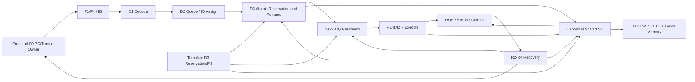

# LinxCore Chisel 微架构改进设计

- 状态：Draft
- 日期：2026-07-24
- 目标读者：LinxCore 架构、RTL、性能、验证和编译器团队

## 1. 文档目的

本文给出 LinxCore 当前 Chisel 实现的统一改进方案。它回答以下问题：

1. 当前每个主要模块处于什么成熟度。
2. 每个模块应保留、重构、接入、替换还是删除。
3. 模块之间的 owner、接口、流水级和恢复关系应如何调整。
4. 如何从当前多个 reduced/canonical 集成岛迁移到唯一 production top。
5. 每一阶段使用什么证据判定完成。

本文覆盖 production 相关模块、独立原型以及 reduced helper 家族。源码
文件清单以 [`module-index.md`](module-index.md) 和当前
`chisel/src/main/scala/linxcore` 为准。每个状态模块在第 16 节有独立处置；
`*Probe`、测试夹具、bundle 和只含组合谓词的 leaf helper 按明确的家族
规则处置，不能借“helper”名义继续成为隐含状态 owner。

本文不是当前实现已完成能力的声明。当前工作树包含大量未提交 WIP，
因此文中的“当前状态”以源码实际实例化关系为准，而不是以文件存在、
单元测试通过或历史模块索引为准。

## 2. 基线与证据边界

编写本文时的版本基线如下：

| 仓库 | revision |
|---|---|
| `rtl/LinxCore` | `a57cc43d86155e19101d02070347ee3ac0cbd4f7`，dirty |
| LinxISA superproject | `3b50632a780f2a15e011442d73e66a557337801d` |
| `tools/LinxCoreModel` | `2a1cf81e47060141e5305be5e49079a8fadc8e42` |
| `emulator/qemu` | `a7c5cf0dc1b31a0f538473fd0c2413baa81edf9f` |

当前证据分为三层：

- R676 committed 基线：canonical `ScalarL1D` 模块和专用探针已经存在，
  但当时 CoreMark reduced top 没有实例化 canonical `ScalarL1D`。
- 当前 WIP natural benchmark：CoreMark 和 Dhrystone 已能通过
  `LinxCoreBenchmarkAutonomousTop` 到达 finisher，但该顶层仍使用
  单周期 sparse-memory lookup 和 reduced memory path。
- Template D3、完整 marker-row、部分 recovery producer、完整 FP 和
  production memory system仍是独立原型、opt-in wrapper 或未闭环模块。

当前实现的主要源码入口：

| 领域 | 当前入口 |
|---|---|
| Canonical LSU island | [`LinxCoreTop`](../../chisel/src/main/scala/linxcore/top/LinxCoreTop.scala)、[`ScalarLSU`](../../chisel/src/main/scala/linxcore/lsu/ScalarLSU.scala) |
| Reduced vertical path | [`LinxCoreFrontendFetchRfAluTraceTop`](../../chisel/src/main/scala/linxcore/top/LinxCoreFrontendFetchRfAluTraceTop.scala) |
| Natural benchmark wrapper | [`LinxCoreBenchmarkAutonomousTop`](../../chisel/src/main/scala/linxcore/top/LinxCoreBenchmarkAutonomousTop.scala) |
| Backend composition | [`DecodeRenameROBPath`](../../chisel/src/main/scala/linxcore/backend/DecodeRenameROBPath.scala) |
| ROB/BROB | [`ROBEntryBank`](../../chisel/src/main/scala/linxcore/rob/ROBEntryBank.scala)、[`BROB`](../../chisel/src/main/scala/linxcore/bctrl/BROB.scala) |
| Template D3 prototypes | [`TemplateD3ReservationAllocator`](../../chisel/src/main/scala/linxcore/backend/TemplateD3ReservationAllocator.scala)、[`TemplateD3RowFill`](../../chisel/src/main/scala/linxcore/bctrl/TemplateD3RowFill.scala) |

因此，本文不把以下证据升级为 production closure：

- 模块单元测试通过；
- 模块在顶层被实例化但输入绑常量；
- QEMU trace replay；
- reduced sparse-memory benchmark 通过；
- standalone Template D3 probe 通过。

当前 WIP 的直接运行证据是
[CoreMark natural manifest](../../generated/r1135-hl-imm24-coremark-terminal/report/natural_manifest.json)
和
[Dhrystone natural manifest](../../generated/r1132-dual-credit-dhrystone-canonical-sp/report/natural_manifest.json)。
这两个 report 目录没有 `revision_manifest.json`，因此它们只能证明对应
runner 记录的终止结果和 UART hash，不能证明上述 revision 的精确闭包。

## 3. 总体设计决策

### 3.1 唯一 production owner graph

最终只能存在一个 production 顶层和一套状态 owner。目标层次如下：



目标 production top 暂命名为 `LinxCoreProductionTop`。现有
`LinxCoreTop` 在迁移完成后应承担这个名字对应的职责；新名字仅用于
迁移期区分，不能永久形成第四个顶层。

### 3.2 Owner 唯一性

以下状态只能有一个 production owner：

| 状态 | 唯一 owner |
|---|---|
| Fetch PC、checkpoint、restart token | Frontend F0 |
| Speculative/committed GPR map、free list | GPR rename owner |
| T/U local map、relation CMAP | T/U bank owner |
| ROB row、commit/dealloc pointer | `ROBEntryBank` |
| 每 STID 的 block ring、BID age | `BrobOrderState`/BROB owner |
| STQ row | canonical `ScalarLSU` store path |
| LIQ row | canonical `ScalarLSULoadPath` |
| L1D tag/data/permission/dirty/replacement | `ScalarL1D` |
| Physical GPR data和非投机 ready | `ScalarGPRFile` |
| Recovery request retention和选择 | `RecoveryFabric` |
| Template reservation token/lease | Template D3 reservation owner |

任何 reduced overlay、shadow table 或 harness-side mutation 都不得成为第二
个 production owner。

### 3.3 身份域分离

必须物理区分以下身份：

- `BID`：每 STID 的 BROB slot，宽度严格为
  `BID_W = ceil(log2(BROB_ENTRIES))`。
- BROB pointer：内部 `{wrap, bid}` 或更强的 generation-qualified pointer。
- `RID`：ROB slot 加 wrap/generation。
- `LSID`：每 STID 的完整 memory-order serial，默认至少 32 bit。
- `LID/SID`：LIQ/STQ 物理 slot 加 generation，只用于物理路由。
- `block_uid`：仅用于 DFX，不参与硬件 age 或路由。

共享 block identity 是 `(STID, BID)`。STID 不打包进 BID，generation
也不打包进 BID。

所有 completion 必须携带 exact completion key：

```text
CompletionKey =
  PE + STID + TID
  + native BID + native GID + native RID
  + independent BROB full pointer/generation
```

这里的 native BID 是带 valid 的 `BID_W` slot；native GID/RID 是
ROB-ring 域的 valid/wrap/value 身份，都不是 commit trace 的 32-bit
模型投影。BROB full pointer/generation 是独立 sideband，不能打包进
BID。LSU completion 还必须携带 full LSID 和 load destination
provenance。
只按物理 `robValue` 或低位 slot 完成的接口应删除。

### 3.4 Recovery 原子性

每个 recovery producer 先把完整 typed event 保存在有限队列中。中央
recovery 只解析一次 canonical `(STID, BROB full pointer)`，然后把同一个
resolved pivot/kill set 发给 ROB、BROB、rename、IQ、LSU 和 frontend。

不同 recovery class 的 BROB tail 语义必须在 resolved transaction 中
显式编码：

- `MISS_PRED_FLUSH` 输入就是 first-killed block，执行 inclusive truncate。
- nuke、inner 和 fast flush 保留 pivot block，tail 恢复到
  `successor(pivot)`。
- suffix recovery 不移动 commit head。
- 所有 owner 消费同一个 resolved ring context，不能分别重算 inclusive
  或 successor 语义。

若 live-window lookup 为零匹配或多匹配，所有状态 owner 都不得变更。
禁止出现 ROB 已 prune、BROB/rename 因 canonical miss 未 prune 的 split
cleanup。

### 3.5 参数独立性

以下参数相互独立，不得通过默认值相等推导：

- fetch/decode/rename/dispatch/issue/execute/commit width；
- ROB、BROB、IQ、LIQ、STQ、SCB、MissQ、RefillQ、LRET capacity；
- GPR 数量、MapQ 深度、RF 读写端口；
- STID、PE、TID 数量；
- BID、RID、LSID、LID、SID 宽度；
- L1D set、way、line size、bank 和访问 latency。

### 3.6 第一版 production 配置

第一版 production closure 使用下表作为实现基线。接口仍保持参数化；
表中数值不是把未来扩展写死，而是防止出现“接口宽 4、实际永远单发”的
名实不符。

| 参数 | 第一版目标 |
|---|---:|
| Fetch/decode/rename width | 4 |
| Scalar dispatch/issue/execute width | 2 |
| Commit width | 4 |
| Physical scalar IQ | 4 banks，32 entries total |
| 每个 physical IQ enqueue ports | 2 |
| Architectural/physical GPR | 24 / 128 |
| GPR MapQ depth | 256 |
| GPR read/write ports | 6 / 4 |
| Default BROB entries per STID | 256 |
| STQ/LIQ/SCB | 16 / 32 / 16，后续按性能测量调整 |
| L1D | 64 sets × 4 ways × 64 B line，bank/latency 参数化 |

选择两发射作为第一版，是为了先闭合 RF 端口、IQ arbitration、
writeback/completion 和 recovery，再依据 workload stall taxonomy 决定是否
扩成四发射。四宽 decode/rename 允许 frontend 和 D3 在资源可用时吸收
dense group，并通过 dec-ren/IQ 平滑后端带宽。

### 3.7 Vector、tile 和外部 engine 边界

第一版 closure 的执行核心是 scalar core，不在本文中实现完整 vector/tile
执行流水、tile cache 或 coherence engine。但 production 接口必须从第一天
保留 typed dispatch class、native identity、D3 reservation domain、
recovery 和 completion envelope：

1. 已接入的 vector/tile 指令送到显式 external-engine port。
2. external-engine command 使用架构 `(STID, BID)`；slot reuse 由独立
   transaction epoch 防护，不允许拓宽 BID。
3. 未接入的指令精确 trap/fail closed，不能落入 scalar 或 memory fallback。
4. engine response 必须 retained，并经 exact identity、ROB residency 和
   W2/commit 原子检查。
5. 本文不引入其他 ISA 的向量、异常或内存语义；Linx ISA contract 是唯一
   架构依据。

## 4. 顶层和公共接口改进

### 4.1 `CoreParams`、`InterfaceParams`、`ScalarBackendParams`

当前问题：

- 参数定义分散，默认 ROB、width、GPR/MapQ 参数不完全一致。
- 顶层构造参数继续复制一部分配置。
- 一些 reduced helper 依赖“容量刚好相等”。

改进方法：

1. 建立唯一的层次化 `LinxCoreConfig`：
   `frontend/backend/rob/bctrl/lsu/cache/template/trace`。
2. `CoreParams` 保留为兼容入口，但只负责构造 `LinxCoreConfig`，不再
   独立保存第二套默认值。
3. `InterfaceParams` 改成由统一配置派生的纯接口 shape，不拥有容量策略。
4. `ScalarBackendParams` 并入 `backend` 子配置。
5. 每个 module constructor 只接收所属子配置和必要的相邻接口 shape。
6. 增加非等容量 elaboration：例如 ROB 8、STQ 16、LIQ 12、LSID 40。

验收标准：

- 搜索不到相同参数的多处硬编码默认值。
- 非等容量配置可 elaboration 并通过 owner 单测。
- 所有宽度错误在 elaboration 时失败，而不是运行时截断。

### 4.2 `InterfaceBundles` 和 identity bundles

改进方法：

1. 把 `DecodedUop`、`RenamedUop` 中的身份字段拆成命名 bundle：
   `ThreadScope`、`BlockIdentity`、`RobIdentity`、`MemoryIdentity`。
2. 删除把 64-bit `blockBid` 同时当 BID 和 generation transport 的用法。
3. 为 completion、recovery、store/load row 定义 exact identity。
4. 将 pair load 的两个 destination 表示为参数化 destination vector，
   不继续添加 `firstDst/secondDst` 专用旁路。
5. 所有 ready/valid 接口规定 payload 在 `valid && !ready` 时保持稳定。
6. 给 Template D3 bundle 加接口版本号和 domain mask 静态检查。

验收标准：

- BID 字段宽度全部等于 `BID_W`。
- full pointer 只能出现在独立且带 valid 的字段。
- stale generation completion/recovery directed test 必须被拒绝。

### 4.3 `LinxCoreTop`

当前 `LinxCoreTop` 是 canonical LSU 加 `ReducedCommitROB` 的组合壳。

改进方法：

1. 以它为最终 production top 的迁移落点。
2. 接入 canonical frontend、D1-D3、ROB/BROB、rename、IQ、execute、
   recovery、ScalarLSU 和 commit/trace。
3. 删除外供 ROB alloc/complete surrogate。
4. 只保留平台接口：fetch/memory/coherence、interrupt、reset/debug、
   trace 和配置。
5. 顶层不实现排队、age 比较、状态机或复杂仲裁；这些逻辑必须归属子 owner。

验收标准：

- production top 内没有 `Reduced*` 状态 owner。
- 自然 benchmark 从该顶层运行。
- 顶层无 always-hit cache、always-ready lower memory 绑常量。

### 4.4 Trace tops 和 benchmark top

| 模块 | 改进方法 |
|---|---|
| `LinxCoreFrontendTraceTop` | 降级为 D1-D3 定向验证 wrapper，不再作为集成里程碑 |
| `LinxCoreFrontendFetchTraceTop` | 降级为 fetch/IB 验证 wrapper |
| `LinxCoreFrontendAluTraceTop` | 保留为 execute 单元 fixture，禁止生产实例化 |
| `LinxCoreFrontendRfAluTraceTop` | 保留为 RF/IQ 局部回归，停止增加新功能 |
| `LinxCoreFrontendFetchRfAluTraceTop` | 拆分；production 逻辑迁入 owner，剩余部分改成 `LinxCoreProductionTop` 的 trace wrapper |
| Marker/reduced-store/replay-LIQ wrapper | 迁移期间作为 feature gate 回归；对应功能进入 production 后删除 wrapper |
| `LinxCoreBenchmarkAutonomousTop` | 改为 production top 加平台 memory model/finisher；使用 decoupled memory response，不直接观察 commit row 改内存；删除 `commitWidth == 1` 限制，由 ordered MMIO/store serializer 保证副作用顺序 |

`LinxCoreFrontendFetchRfAluTraceTop` 已接近 JVM constructor method-size
限制。禁止继续在该文件加入新的 owner、状态或成批 diagnostics。迁移时按
frontend、backend、memory、service、trace 五个自然边界抽出 composite
module。

## 5. Frontend 改进

### 5.1 `FrontendFetchPacketSource`

当前是一请求、一个 resident packet 的折叠 fetch source。

改进方法：

1. 拆成 F0 PC/thread owner、F1 request、F2 response、F3 align、
   F4/IB publish 五个明确阶段。
2. F0 接收唯一的 R4 restart token；同周期 resolve 不能直接改 PC。
3. request 添加 transaction ID/checkpoint，允许参数化多个 outstanding。
4. redirect 后旧 response 必须按 transaction/checkpoint 丢弃，而不是
   依赖一个全局 discard bit。
5. 每 STID 独立保存 PC、checkpoint 和 outstanding queue。

验收标准：

- response reorder、redirect 与 stale response directed tests。
- 两个 STID 使用相同 PC/BID 不互相影响。
- R2→R3→R4→F0 restart 时序可从 trace 观察。

### 5.2 `FrontendInstructionBuffer` / `FrontendDecodeIngress`

改进方法：

1. 将 `FrontendInstructionBuffer` 提升为 canonical F4/IB owner。
2. 每 entry 保存 fetch checkpoint、packet UID、PC、字节有效性和
   predecode 元数据。
3. `FrontendDecodeIngress` 只负责 IB 到 D1 的 elastic transport，
   不执行 opcode decode。
4. 支持同周期 dequeue/enqueue，full-state ready 以预周期状态为基准，
   redirect 按 checkpoint 精确 prune。
5. 当前未实例化路径必须接入 production top。

验收标准：

- IB backpressure、flush、wrap 和多 STID 测试。
- frontend 不再绕过 IB 直接把 response 送入 decode。

### 5.3 `F4DecodeWindow`

该名字是迁移遗留；当前模块实际是 D1 window slicer，不是架构 F4。

改进方法：

1. 重命名为 `D1DecodeWindowSlice`，保留旧名兼容 wrapper 一个迁移周期。
2. 保持 2/4/6/8-byte 顺序、non-compacting 切片语义。
3. 输入改为 IB entry，输出只包含 slot byte/PC/length/UID/checkpoint。
4. opcode、operand、macro 和 block 语义继续由 D1 decode owner 负责。
5. 兼容 wrapper 的 production 实例清零后删除。

### 5.4 `F4DenseSlotQueue`

当前把多 slot packet 串行成每周期一行，是主要吞吐瓶颈。

改进方法：

1. 替换为参数化 D1 lane compactor 和 width-aware elastic queue。
2. 对一个 packet 中的 slot 保持原始顺序和 slot UID。
3. 每周期最多向 D2 推送 `decodeWidth` 行，并支持下游逐 lane ready。
4. memory ID 使用 lane prefix scan 保证同周期 slot0→slotN 顺序。
5. 原串行 queue 只保留为 `decodeWidth=1` 的测试配置。

验收标准：

- 一个四 slot packet 可在一个周期进入 D2。
- 任意 ready mask 下不丢失、不重复、不乱序。

### 5.5 `FrontendDecodeStage`、`FrontendOperandDecode`、`FrontendRegAliasClassify`

改进方法：

1. `FrontendDecodeStage` 保持 generated opcode catalog 的唯一 owner。
2. 继续执行 most-specific-mask 选择，不添加 top-local opcode case。
3. `FrontendOperandDecode` 扩展完整 P/T/U/SGPR/tile/vector、shift、
   PCR、macro operand shape，但不分配物理资源。
4. `FrontendRegAliasClassify` 保持架构 tag 到 operand/destination class
   的唯一映射。
5. 输出改为 width-wide D1 uop vector，并包含 block、memory、template、
   branch kind 和 checkpoint context。

验收标准：

- 生成表与 pyCircuit opcode metadata parity。
- 所有合法 opcode 都有明确 dispatch class；未知 opcode 产生精确 trap，
  不进入 reduced fallback。

### 5.6 Reduced BFU/body-cut helper 家族

涉及 `ReducedBfuBodyCutArm`、`Predictor`、`GeometryPredictionLatch`、
`LocalBodyWindow`、`ResolvedBodyEnd*`、`PendingRuntime*` 等模块。

改进方法：

1. 收敛为 `FrontendBoundaryPredictor` 和 `BoundaryResolutionUpdate`
   两个 owner。
2. 静态 geometry 只作为 prediction，不得直接授权 runtime body cut。
3. 训练只能来自 accepted resolved body-end。
4. checkpoint、STID、block epoch 与 target owner 一起保存。
5. `Oracle`、`Candidate` 和只用于比较的模块迁入 verification source tree，
   production 不实例化。

验收标准：

- conditional fallthrough、taken、loop re-entry 和 stale epoch 测试。
- frontend body cut 与 backend marker/BROB lifecycle 使用同一 block context。

### 5.7 I-cache、ITLB 和 fetch memory transaction

当前 `FrontendFetchPacketSource` 把 request/response 折叠在本地，尚未形成
production I-side memory owner。改进方法：

1. 新增 `FrontendITLB`、`FrontendICache` 和
   `FrontendFetchMissTxnTable`，分别拥有 translation、cache state 和
   outstanding miss/refill transaction。
2. fetch request key 包含 PE/STID、fetch checkpoint、virtual PC 和独立
   transaction epoch；物理 cache transaction 还包含 line address。
3. redirect/recovery 只取消尚未产生架构可见状态的 dependent；已经发出的
   lower-memory request作为 orphan retained 到 response 排空。
4. response 必须同时匹配 transaction epoch、checkpoint、line 和 STID；
   stale response 只能计数和丢弃。
5. execute permission、page/access fault 随 IB entry 进入 D1，并作为精确
   fault row 进入 ROB；不得在 top 或 benchmark wrapper 中吞掉。
6. I-cache refill/invalidate 与 D-cache coherence 使用同一 platform
   transaction contract，但状态 owner 和 arbitration 独立。

验收标准：

- ITLB miss、page fault、I-cache miss/refill、redirect-orphan response。
- 两个 STID 同 PC 和同 cache line 不发生 checkpoint/transaction alias。
- production fetch 不再依赖 always-hit 或组合 sparse-memory lookup。

## 6. Decode、Rename 和 D3 改进

### 6.1 `DecodeRenameROBPath`

当前模块集成度高但职责过多，而且每周期只选择一个 decode slot。

改进方法：

1. 拆成四个模块：
   `D1D2Transport`、`D2ResourcePreview`、`D3ReservationBroker`、
   `D3RenameAndDispatch`。
2. 保留 enqueue-time ROB reservation 语义：先预约，再进入
   `dec_ren_q`，rename 后 exact RID patch。
3. admission 改为 width-wide，并采用“最大连续 lane prefix”规则：
   broker 先 preview 所有 domain，选择从 lane 0 开始可共同满足的最大
   `k`；一个 reservation transaction 原子接受 lane `[0, k)`，suffix
   `[k, decodeWidth)` 保持不变并重试。禁止跳 lane 接受。
4. accepted prefix 的 ROB/BROB/rename/IQ/LSU credit 和 identity 在同一个
   fire mutation；fire 前不得预扣，fire 后不需要跨 owner rollback。
   all-row LSID snapshot/prefix-sum 只对 accepted prefix 计算。
5. marker、scalar、template 使用同一个 D3 broker，不再有 marker-only
   或 template shadow allocator。
6. 把 store dispatch、T/U retire、marker lifecycle 和 recovery 逻辑移回
   各自 owner。

验收标准：

- 最大连续 lane prefix 原子接受；suffix 稳定重试，身份和 LSID 不重复。
- recovery 与 allocation 同周期时所有 child owner 的 mutation 一致。
- 主模块不再包含跨五个以上子系统的状态机。

### 6.2 `DecodeRenameQueue`

改进方法：

1. 改为 lane-compacting elastic queue，payload 保存 reservation token。
2. row 入队前必须已获得 ROB/BROB reservation。
3. queue 只保存 D2/D3 transport 状态，不拥有 rename 或 resource credit。
4. precise recovery 按 checkpoint/full identity compact surviving rows。

### 6.3 `DecodeLoadStoreIdAssign`

改进方法：

1. 每 STID 独立维护 full LSID serial。
2. width-wide accepted lane 用 prefix-sum 分配，slot 顺序定义同周期 age。
3. 每一个 row 先获得 all-row LSID snapshot；只有 memory row 增加计数。
4. BID-only suffix recovery 不要求 LSID；需要精确 store/load prune 的
   non-BID recovery 必须携带 owner 发布的 full-LSID authority，不能从
   RID 重建。
5. same-BID memory age 只使用 `LSIDOrder`；cross-BID age 只使用 BROB
   order。禁止对 LSID 或 BID 做无符号大小比较。
6. full-LSID authority 缺失或 serial 半环比较歧义时 fail closed，并阻塞
   mutation。
7. LID/SID 由 LIQ/STQ 实际接受时分配，不能由 decode 伪造物理 index。

### 6.4 `ScalarDecodeRenameBridge`

改进方法：

1. 保持 scalar P rename 的纯 adapter，不再承担 ROB 或 T/U 状态。
2. 输入输出改为 vector lane。
3. 支持 0/1/2 个 GPR destination 的通用 destination vector。
4. unsupported operand class 必须显式拒绝，并由 D3 router 送到正确 owner。

### 6.5 `GPRReservationTracker`

当前 tracker 是队列侧 credit shadow，不是真实 free-list owner。

改进方法：

1. 删除独立 shadow count。
2. D3 broker 直接向 `GPRRenameCheckpoint` 请求 reservation token。
3. token 记录 phys tag 和 MapQ row，rename fill 时消费，cancel 时释放。
4. 0/1/2 destination 必须一次成功或一次失败。

### 6.6 `GPRRenameCheckpoint`

改进方法：

1. 每 STID 独立 SMAP、CMAP、MapQ、free list 和 checkpoint bank。
2. checkpoint key 使用 canonical BID slot 加 owner generation。
3. 删除 `flush.bid - 1` 恢复；由 BROB 提供 predecessor pointer。
4. commit、recovery replay 和 256-depth MapQ scan 保持 helper 分层，
   不重新内联成超大组合逻辑。
5. 支持 destination token 预留、fill、cancel、commit 四阶段。
6. checkpoint snapshot 只在明确 block start/last contract 点捕获，
   删除“每 row 刷新 checkpoint”的 reduced 近似。

验收标准：

- wrap、slot reuse、相邻 SETRET、同 block 多次写同 arch reg。
- 24 arch/128 phys/256 MapQ 目标配置通过。
- 两个 STID 同 BID 不 alias。

### 6.7 T/U rename 模块族

模块包括 `TULinkRename`、`ScalarTURenameBridge`、
`TULinkLocalBankArray`、`TULinkRelationCmap`、
`TULinkRetireCommandPath`、`TULinkRecoveryCleanupPath`、
`TULinkFlush*` 和 `TULinkLocalBlockCommitFanout`。

改进方法：

1. `TULinkLocalBankArray` 成为 `[PE][STID][hand]` 的唯一状态 owner。
2. `ScalarTURenameBridge` 只负责 D3 lane routing 和 P/T/U 原子接受。
3. source ready/data 使用 point-to-point qtag，不写入 global P ready table。
4. retire command 保留完整 PE/STID/BID/GID/RID/T/U sequence sidecar。
5. relation CMAP 严格执行 mark、release、CleanCMAP、group clean 顺序。
6. recovery source 选择使用 exact ROB/LSU row；缺失或冲突时整个本地
   rename maintenance 阻塞。
7. 删除 `scalarPeCount == 1` 限制，按配置实例化 bank 和 fanout。

验收标准：

- 多 PE、多 STID bank routing。
- block-last mark/release/clean 顺序。
- recovery 不影响非目标 bank。

### 6.8 `StoreSplitPayload`

改进方法：

1. 保持纯组合 payload transform。
2. split STA/STD 共享 full instruction identity 和 SID lease。
3. pair/cache-maintain 继续保持单 instruction identity，并由 LSU 决定
   一个或多个 memory fragment。
4. 不在本模块申请 STQ、计算地址或产生 memory side effect。

## 7. ROB、BROB、Commit 和 Recovery 改进

### 7.1 `DispatchROBAllocator`

改进方法：

1. 改为 width-wide atomic reservation broker 的 ROB/BROB child。
2. 新 block 同时预约 BROB slot、ROB rows、checkpoint 和 block sidecar。
3. 复用 active block 时仍使用 canonical BROB full pointer。
4. public fire、ROB mutation、BROB mutation 和 cursor advance 必须同一事件。
5. recovery 同周期禁止任何部分 owner 先行 mutation。

### 7.2 `ROBEntryBank` / `ROBEntryStatus`

改进方法：

1. 完整启用：
   `Free → ReservedUnfilled/Allocated → Renamed → Issued → Completed →
   Retired → Free`。
2. Template row 在 fill 前保持 `ReservedUnfilled`，不可 issue、commit 或 trace。
3. completion 用 exact RID/full owner key 校验，拒绝 stale slot completion。
4. commit 和 dealloc 保持独立 pointer 和 handshake。
5. commit window 支持 `commitWidth`，marker/block-last 只截断同一窗口，
   不吞掉后续 row。
6. fault、nuke、NeedFlush 成为真实状态，而不是枚举占位。
7. 提供 compact query service，禁止在顶层复制全表扫描。

多 STID 的第一版采用每 `(PE, STID)` 独立 ROB partition，每个 partition
拥有自己的 alloc/commit/dealloc pointer。跨 STID commit 由公平仲裁器
合并成 public commit window。这样，某一 STID 的 suffix recovery 始终
保持连续，不会在共享单 tail ring 中制造任意洞。若未来改为全局共享
ROB，必须先给出支持稀疏 valid row、独立 age 和 pointer recovery 的正式
设计，不能沿用“找到第一个目标 row 后简单 rebase tail”的实现。

验收标准：

- RID wrap/reuse stale completion。
- commit backpressure、dealloc backpressure。
- template unfilled row 不可越过。
- nuke 到 ROB head 才触发 recovery。

### 7.3 `ReducedCommitROB`

改进方法：

- 从 production 删除。
- 只保留在独立 replay/trace 单测。
- 所有原来依赖它的 `LinxCoreTop` completion bridge 迁到 `ROBEntryBank`。
- production 搜索必须为零实例。

### 7.4 BROB 模块族

模块包括 `BrobMetaTracker`、`BrobOrderState`、
`BrobLiveBidResolver`、`BrobStoreRangeState`、
`BrobStoreCountPublisher`、`BrobNonFlushFrontier`。

改进方法：

1. 把当前 64-bit BID key 迁移为 `BID_W` slot 加独立 full pointer。
2. 每 STID 独立 alloc tail、commit head、live count。
3. scalar done、engine done、store count known 都是 persistent metadata。
4. retirement 只能发生在 exact head，跨 STID 使用 fair arbitration。
5. non-flush frontier 发布 exact `(head BID, prefix count)`，不发布无符号
   youngest threshold。
6. store range/count 生产者必须 retained；身份不匹配不得覆盖 row。
7. store range/count 只表示 bookkeeping 和 retirement certainty，不能作为
   speculative load/store 的强 non-flush authorization；后者仍由
   canonical recovery/LSID order 决定。
8. engine protocol 固定使用 `(cmd_stid, cmd_tag) = (STID, BID)`；slot reuse
   防护放在独立 transaction epoch，不能拓宽 `cmd_tag` 或 BID。
9. engine response 必须 retained/backpressured，完整返回
   `trapno`、`TRAPARG0`、BI/target 和 transaction epoch；exact mismatch
   只能丢弃并计数。
10. engine command/response 接入后设置 `needsEngine`，不再永久绑零。

验收标准：

- 256-entry 默认环、wrap、full ring、两个 STID 同 BID。
- younger completed block 不越过 head。
- store count unknown 阻止 retirement。
- stale engine response 不能完成复用后的 slot。

### 7.5 Marker 模块族

模块包括 `BlockMarkerDecodeContext`、`BlockMarkerLifecycle`、
`BlockMarkerRetireSourceSerializer` 和 block scalar-done owner。

改进方法：

1. production 默认启用 marker-row，不再 `skipBlockMarkers=true`。
2. decode-time context 和 retire-time effects 分离。
3. `BSTART` row 属于新 BID；`BSTOP` 属于当前 BID。
4. `BSTART` retire 关闭旧 active BID 并切换到新 BID；`BSTOP` retire
   关闭当前 BID。两者都只能在 marker row 被 accepted commit 时产生
   对应 scalar-done/active-context 事务。
5. active context、target、condition、checkpoint、epoch 全部按 STID 保存。
6. marker redirect 进入中央 recovery/R4 restart，不再是 top-local PC restart。

验收标准：

- call/direct/cond/ret/fall 边界。
- marker dense window、loop re-entry、redirect cleanup。
- 默认 production benchmark 不再过滤 marker commit 来维持功能。

### 7.6 `RecoveryFabric`、`RecoveryBackendControl`、`RecoveryCleanupControl`

改进方法：

1. 每个 BCC/IEX/PE/LSU/template producer 有独立 retained lane。
2. `RecoverySourceArbiter` 对 complete typed event 仲裁，不丢失同时到达事件。
3. `RecoveryClassMerge` 只做 class/provenance merge，不直接变更 owner。
4. `RecoveryBackendControl` 执行一次 canonical BROB/ROB lookup。
5. `RecoveryCleanupControl` 保持 accepted intent，直到所有强制 consumer
   同时 ready；按策略允许独立的非关键 DFX consumer。
6. cleanup payload 直接携带 resolved pointer、kill mask、checkpoint、
   restart target 和 full LSID。
7. cleanup 的 BROB mutation 按 class 执行：`MISS_PRED_FLUSH` 从
   first-killed block inclusive truncate；nuke/inner/fast 保留 pivot，
   tail 指向 `successor(pivot)`；任何 class 都不移动 commit head。
8. R2 发布 CMT/FLS，R3 执行 cleanup，R4 向 F0 发布 restart token。

验收标准：

- canonical miss/ambiguous match 零 mutation。
- 两个 source 同时到达且下游 backpressure。
- unrelated STID/PE/queue row 保留。
- cleanup 和 W1/W2 side effect 同周期冲突测试。

### 7.7 Commit 和 trace

改进方法：

1. `CommitTraceWindow` 只消费 accepted ROB commit，不参与 retirement。
2. `CommitTraceRow` 保留模型 `bid/gid/rid` 与硬件 block identity 的分离。
3. 增加 exact RID、checkpoint、branch kind、recovery provenance、
   target-owner 和 full memory identity 的 DFX sideband；架构 JSON schema
   是否公开由 trace version 决定。
4. invalid fixed-width slot 在适配器层过滤。
5. LinxTrace v2 在 multi-STID 推广时显式使用
   `{stid, block_bid, block_uid}`。

## 8. Issue、RF 和 Execute 改进

### 8.1 `ScalarIssueFabric` / `ReducedScalarIssueQueue`

改进方法：

1. 建立 S1 capture、S2 allocation、S3 resident 三个明确 dispatch/IQ 阶段。
2. 物理 IQ 至少分为 `alu_iq0`、`shared_iq1`，后续接入
   BRU/AGU/STD/CMD 专用队列。
3. 每个 IQ 支持参数化双 enqueue；ALU 动态分配。
4. entry 保存 valid、inflight、operand ready/spec-ready、qtag、
   full identity 和 ordering class。
5. P1 pick 只置 inflight；I1 RF denial 清 inflight；I2 只有确认不可取消
   后才 deallocate。
6. same-STID 使用 wrap-qualified ROB age；不同 STID 使用 round-robin，
   禁止跨 STID 比 RID。
7. control 和 store frontier 是 admission 条件，不是简单优先级。
8. `ReducedScalarIssueQueue` 迁移为 width=1 单测 adapter，production 删除。

验收标准：

- simultaneous bank picks、I1 contention/cancel/retry。
- multiple I2 resident rows。
- same-STID oldest、cross-STID fairness。
- younger redirect 不清除 older accepted E/W。

### 8.2 `ReducedScalarIssuePick` / candidate arbiters

改进方法：

1. 重构为 production `ScalarIssueSelect`，明确 P1/I1/I2 state。
2. RF read 请求按 uop 全部 source 原子授予。
3. oldest-first 读端口仲裁；失败方保留 resident row。
4. qtag/local source 与 P source 使用不同 read/wakeup path。
5. wakeup N 周期只能影响 N+1 pick，禁止组合 wake-to-pick。

### 8.3 `ScalarGPRFile`

改进方法：

1. 成为物理 GPR data 和 non-spec ready 的唯一 owner。
2. 参数化读端口和写端口；读请求按 uop 原子 grant。
3. W2 时 ROB complete、RF write、wakeup 全部 ready 后才原子 mutation。
4. same-tag 多 producer 判为 ownership error；不同 tag 按端口数接受。
5. speculative load wakeup 不设置全局 ready。

验收标准：

- 1/2 写端口配置。
- same-tag、different-tag contention。
- request grant 但 W2 未完成时 RF 不提前变化。

### 8.4 `ReducedScalarAluExecute`

改进方法：

1. 拆成 ALU、BRU、AGU、system/service、macro 五个 FU owner。
2. 公共 execute envelope 保存 exact identity、source provenance 和
   recovery checkpoint。
3. 普通 ALU 保持固定 latency；长延迟运算通过 retained request/response。
4. memory sideband shortcut 全部迁移到 AGU/LSU。
5. branch result 只发布 correction metadata；架构 redirect 由 boundary/
   recovery owner 决定。
6. 完整 opcode 未实现时产生显式 unsupported trap，禁止 harness 代算。

### 8.5 Divider 和 FP

| 模块 | 改进方法 |
|---|---|
| `ReducedScalarDivider` | 提升为 decoupled long-latency FU；请求携带 exact key；支持 kill/response stale rejection；参数化 radix/latency |
| `ReducedScalarFpExecute` | 替换为完整 FPU pipeline；实现 rounding mode、exception flags、NaN/denormal contract 和 RF class；当前小子集仅保留为参考测试 |

验收标准包括 backpressure、recovery kill、slot reuse stale response 和
所有 ISA 精确异常。

### 8.6 SP、template context 和 writeback

| 模块 | 改进方法 |
|---|---|
| `ScalarSpOrderOwner` | 保留为每 STID SP reservation/commit owner；接入 D3 token 和 recovery |
| `ReducedTemplateContextStack` | 迁入正式 template context owner，或在 D3 正常 row 路径覆盖后删除；不得直接执行 RF side effect |
| `ReducedTemplateSnapshotTable` | 与 Template D3 checkpoint/lease 合并，删除第二份 snapshot owner |
| `ReducedScalarWritebackArbiter` / completion arbiters | 改成 retained、fair、多 lane arbiter；低优先级 producer 自身必须 hold；same-row 重复 producer 报错 |

### 8.7 System、CSR、service 和 MMIO

当前 `ReducedServiceRenameSnapshot`、`ReducedServiceRequestOwner` 和
`ReducedServiceRequestPath` 是 benchmark service 通路，不是 production
system 指令实现。改进方法：

1. 新增 `SystemControlUnit`，成为 CSR、privilege、interrupt、precise trap
   和 system instruction 的唯一 owner；trap 只在 ROB precise point 接受，
   并通过中央 recovery/R4 restart 改变控制流。
2. 只有 Linx ISA 明确定义的 service 才进入 `ServiceRequestUnit`。请求必须
   retained，响应经 ROB residency、exact completion 和 W2 原子检查。
3. service identity 包含 PE/STID、带 valid 的 native BID、native
   GID/RID 的 valid/wrap/value，以及独立 request epoch；response 不得用
   slot-only snapshot 匹配。
4. `ReducedServiceRenameSnapshot` 不再复制 rename 状态；source phys tag
   和版本随正常 issue envelope 保存，recovery 由 resident IQ/FU owner
   处理。
5. 未支持的 service/system opcode 产生精确 unsupported trap；未知请求
   fail closed。
6. semihost、UART 和 finisher 是 platform/test adapter，不是 core
   service owner。MMIO 副作用只能来自已经 commit 且通过 ordered
   MMIO/store serializer 的 transaction，禁止直接观察 commit row 改变
   外部状态。
7. interrupt 在 owner 中 retained；选择 precise boundary 后生成 typed
   recovery/trap transaction，不能异步改 PC 或清空局部队列。

验收标准：

- CSR read/modify/write、同步 trap、异步 interrupt 和 backpressure。
- service request/response recovery、slot reuse 和 stale epoch。
- MMIO/UART/finisher 只在 accepted ordered transaction 时发生一次副作用。
- production core 不实例化 `ReducedService*`。

## 9. LSU 和 Memory System 改进

### 9.1 `ScalarLSU`

改进方法：

1. 成为 production 唯一 scalar memory owner。
2. 内部闭合 store dispatch/STQ 与 load forwarding 的 row snapshot。
3. 接入 AGU、load scheduler、store STA/STD、ROB commit/non-flush、
   recovery、RF/W2 和 lower-memory。
4. load/store/miss/refill/SCB 共享一个 `ScalarL1D`。
5. 删除外部手工拼接的 reduced replay/overlay path。

### 9.2 Store dispatch、STQ 和 commit

涉及 `StoreDispatchQueues`、`StoreDispatchToSTQ`、
`StoreDispatchSTQPath`、`STQEntryBank`、`STQCommitQueue`、
`STQCommitDrain`、`STQFlushPrune`、`STQInsertProbe`。

改进方法：

1. 删除 decode/backend 和 `ScalarLSU` 内两套 STQ owner；保留
   `ScalarLSU` 内唯一 `STQEntryBank`。
2. D3 只预约 SID/STQ lease，STA/STD 执行后填充同一 row。
3. split merge key 为
   `(PE, STID, BROB full pointer, full LSID/SID lease)`。
4. STQ data array 实现 banked two-cycle mask/data write；`dataReady` 在
   两者完成后置位。
5. Wait→Commit 使用 exact strong non-flush proof 或 oldest-LSID proof。
6. `STQCommitQueue` 保持 TSO program order 和 full LSID ordering。
7. 跨线 store 由 drain 生成两个 fragment，但仍是一个 instruction/SID。
8. typed recovery 只 prune speculative Wait row，不删除已 non-flush Commit。

验收标准：

- STA/STD 任意先后到达。
- STQ full 时 data-half merge 仍可前进。
- LSID wrap、跨线、pair store、recovery collision。
- store commit 不依赖先看到 ROB commit pulse。

### 9.3 SCB 模块族

涉及 `SCBCommitIngress`、`SCBCommitBridge`、`SCBRowBank`、
`SCBEgressSelect`、`SCBLookupControl`、`SCBStateUpdate`、
`SCBResponseBuffer/Decode/RetryQueue/RetrySelect`。

改进方法：

1. `SCBRowBank` 继续是唯一 SCB row owner。
2. ingress 按物理 line 和 byte mask coalesce，只接受 non-flush store。
3. `S_LOOKUP/S_MISS` 或已发 lower-memory ownership 请求的 row 禁止继续
   合并；同 line 新 fragment 必须分配新的 SCB row，并按 full LSID 顺序 drain。
4. lookup 区分 readable/tag/writable hit。
5. writable hit 更新 L1D 并释放；tag-only hit 发 upgrade；miss 发 write ownership。
6. TxnID 独立于 SCB index generation，response 必须 exact match。
7. raw response、state update、retry enqueue 原子完成。
8. 删除 reduced top 中 dcache hit/ready 全绑 true 的接法。

验收标准：

- response reorder、stale TxnID、retry FIFO、同 line 多 outstanding row。
- WriteResp 才算 store/fence drain 完成。

### 9.4 LIQ、forwarding 和 replay

涉及 `LoadInflightQueue`、`LoadForwardPipeline`、
`LoadStoreForwarding`、`LoadReplayWakeup`、`LoadRefillWakeup`、
row-mutation helpers。

改进方法：

1. `LoadInflightQueue` 成为唯一 LIQ/LHQ row owner。
2. 每 row 保存 exact identity、full LSID、youngest SID snapshot、
   phase-local line/mask、destination 和 miss/replay state。
3. E2 查询、E3 merge、E4 result 保持真实寄存级。
4. load byte merge 顺序固定为：
   `L1D base → SCB committed bytes → STQ speculative older-store bytes`。
5. 每 byte 选择最近的 older store；同 BID 使用 full LSID，
   跨 BID 使用 BROB-qualified age。
6. wait-store、SCB replay、refill 都转换成 native LIQ mutation request，
   经过一个集中 write arbiter。
7. `L2Wait` 若没有真实进入路径则删除；若 lower-memory 需要则定义唯一
   进入/退出条件。
8. 跨线 load 使用一个 architectural identity 和两个 phase，第一 phase
   不发布 ResolveQ/LRET。

验收标准：

- partial forwarding、data-not-ready replay、multiple overlapping store。
- missing/ambiguous LSID fail closed。
- 跨线第一 phase recovery collision。

### 9.5 `LoadMissQueue` 和 `LoadRefillTransport`

改进方法：

1. miss 请求使用 slot+generation+line exact transaction ID。
2. 同 line 可 coalesce，但每 dependent 保存 LIQ generation 和 full identity。
3. recovery 删除 dependent；已发出的 orphan miss 保留到 response 排空。
4. response 只有 exact ID、generation、line 和 read type 同时匹配才生效。
5. miss response 和外部 refill 都进入 retained `LoadRefillTransport`。
6. refill 先被 `ScalarL1D` 接受，再唤醒 LIQ。

### 9.6 `LoadResolveQueue` 和 MDB

涉及 `LoadResolveQueue`、`ScalarLSUMDBPath`、`MDBConflictDetect`、
`MDBSSIT`、`MDBQueueFanout`、`MDBStoreProbeReplay`。

改进方法：

1. ResolveQ 使用 ROB 每个 accepted commit row 的 all-row pre-increment
   LSID sidecar，形成累计 `(STID, BID, LSID)` retirement frontier；只删除
   被该 frontier 严格判定为 older 的记录，不能把“同 LSID”或未知
   cross-BID row 当作已退休。
2. store address acceptance 与 MDB probe credit 原子绑定。
3. conflict record、SSIT update、wait plan、recovery report 使用 retained queue。
4. resolved conflict 选 oldest load；same BID 为 inner flush，cross BID 为 nuke。
5. nuke 只在目标 load 到 ROB head 时触发。
6. predicted store 未解析 full LSID 前不得修改 LIQ。
7. timeout/delete 和 store wakeup 走统一 native mutation arbitration。

验收标准：

- store/ResolveQ same-cycle overlap。
- SSIT record/delete/weight/confidence。
- same/cross BID conflict、nuke 被更老 BRU recovery 清除。

### 9.7 LRET、W1/W2 和 completion

涉及 `ScalarLSULoadReturnQueue`、`ScalarLSULoadReturnPipeline` 和
大量 `LoadReplayReturn*` helper。

改进方法：

1. 保留 canonical LRET queue 和 canonical W1/W2 pipeline。
2. 每 `(STID, return pipe)` 独立 queue 和 reservation credit。
3. E4 hit 向 ResolveQ 和 LRET 原子发布。
4. W2 使用 exact ROB row 再验证；missing row hold，NeedFlush row 无副作用 drop。
5. ROB complete、RF write、wakeup 三者原子 fire。
6. 多 pipe 共享 sink 使用 fair retained arbitration。
7. 将大量 `LoadReplayReturn*Candidate/Permit/Ready/LiveControl` 小模块
   收敛到不超过四个 owner：
   `LretAdmission`、`LretPipeState`、`LretW2AtomicCommit`、
   `LretRecovery`。
8. 原 helper 在 canonical path 覆盖并通过等价测试后删除。

### 9.8 `ScalarL1D`

改进方法：

1. 保持唯一 tag/data/permission/dirty/replacement owner。
2. 从组合 Reg-array 模型迁移到参数化 banked SRAM timing。
3. 定义 load lookup、SCB update、refill、eviction、invalidate 五类端口
   和明确仲裁。
4. refill 优先时必须 hold victim，dirty victim 不得静默丢弃。
5. duplicate refill 保留 resident dirty bytes，只提升 permission。
6. 增加 ECC/parity、scrub、error report。
7. typed speculative recovery 不清 L1D；只有 reset、coherence invalidate
   和 cache-maintenance 可以改变物理 cache state。

### 9.9 Translation、保护、memory classification 和 lower memory

新增或提升的模块：

- `ScalarDTLB`：VA→PA、ASID、page fault、miss queue。
- `ScalarPMP`：权限和 physical protection。
- `MemoryClassifier`：normal/device/MMIO/cache-maintain/LRSC/tile。
- `L1DCoherencePort`：ownership、invalidate、eviction、refill。
- `LowerMemoryTxnTable`：transaction ID、response matching、retry。

改进方法：

1. AGU 后先完成 address、alignment、translation、protection 和
   memory-class classification。
2. device/MMIO 禁止 miss coalesce 和 speculative replay。
3. cacheable normal load/store 进入 canonical LIQ/STQ/L1D。
4. cache-maintenance、tile、atomic 使用独立 owner，不伪装为 normal memory。
5. benchmark memory port 改为 decoupled request/response，可配置 latency、
   backpressure 和 out-of-order response。

### 9.10 LR/SC

`ScalarLrScReservationOwner` 的改进方法：

1. 接入 physical address、STID 和 cache-line generation。
2. LR 成功后建立 reservation；匹配 SC 原子检查并清除。
3. store、coherence invalidate、recovery/context switch 按架构规则清除。
4. SC result 通过正常 W2/ROB completion，不走 harness service。

## 10. Template D3 改进

### 10.1 `TemplateD3ReservationAllocator`

当前是 shadow ROB 原型。

改进方法：

1. 删除 shadow row table。
2. 调用真实 D3 reservation broker，一次预约：
   BROB range、ROB rows、checkpoint、GPR phys、MapQ、IQ、LIQ、LID、
   STQ、SID、LSID、validation、target publish 和 final lease。
3. 每个 token 携带 domain、owner ID、generation 和 cancel/release 方法。
4. 任一 mandatory domain credit 不足则整个 group 不 mutation。
5. response 不能只把 bit0 `ROB_ROW` 标成 present。

第一版必须完整支持下列 row plan：

| Form | Row count | Row order |
|---|---:|---|
| `FENTRY` | `N+3` | `VFORM, SP_SUB, STORE[0..N-1], FINAL` |
| `FEXIT` | `N+3` | `VFORM, SP_ADD, LOAD[0..N-1], FINAL` |
| `FRET_RA` | `N+5` | `VFORM, VTGT, TARGET_PUBLISH, SP_ADD, LOAD[0..N-1], FINAL` |
| `FRET_STK` | `N+6` | `VFORM, VLOAD, VTGT, SP_ADD, RESTORE_R10, TARGET_PUBLISH, LOAD[1..N-1], FINAL` |

### 10.2 `TemplateD3RowFill`

改进方法：

1. token 校验后填充真实 `ReservedUnfilled` ROB row。
2. 同时填充对应 rename/IQ/LIQ/STQ lease，不创建 private execution path。
3. child 按 descriptor order fill，禁止跳过未填 child。
4. fill 完成后的 row 使用正常 issue/LSU/commit。
5. bad fill/timeout 进入 typed template fatal/recovery。

### 10.3 `TemplateRenameSidecarTable`

改进方法：

1. 改为 reservation lease sidecar，按 token 保存 parent、snapshot、
   filled bitmap 和 owner handles。
2. 不保存第二份 speculative map；引用正式 rename checkpoint。
3. recovery/cancel 时驱动 tokenized release，而不是只清本地 valid。
4. template/tile store row 的 authoritative store count 由实际 row plan
   和成功 fill 事件累计，并通过 retained `BrobStoreCountPublisher` 发布；
   CTU 预测值不能直接解锁 block retirement。

### 10.4 `BlockControlTemplateSequencer`

改进方法：

1. 删除直接 RF write、load/store、completion side effect。
2. CTU 只产生 descriptor row fill 和合法的 template control event。
3. 所有 child 都通过正常 D3/IQ/LSU。
4. `ownsStqRow=false` 的 direct store 模式不得进入 production。

### 10.5 `TemplateRecoveryQualification`

改进方法：

1. 接入中央 RecoveryFabric，使用同一个 canonical block/row lookup。
2. `ReservedUnfilled` token/credit 由 Template lease ledger 按
   `killedMask` 取消；已经 filled 的 row 已属于正常
   ROB/rename/IQ/LIQ/STQ owner，只能按 full identity 和
   `killedMask/retainedMask` 执行各自正常 typed recovery。
3. CTU 不得 blanket-cancel filled row，也不得反向撤销已经由正常 owner
   接受的 side effect；fatal teardown 是独立的 quiesce 协议，不伪装成
   speculative recovery。
4. owner teardown 使用 quiesce request/ack；所有 mandatory owner ack 后
   才释放 group generation。
5. stale fill/ack 必须通过 generation 拒绝。

验收标准：

- 多 row 原子 reserve。
- partial fill 后 recovery。
- bad token、duplicate fill、timeout、stale generation。
- template child 和 scalar row 在正常 IQ/LSU 中共同执行。

## 11. Reduced helper 的统一处置

| 家族 | 处置 |
|---|---|
| `ReducedStoreMemoryOverlay` | production 删除；benchmark memory 由正式 memory port 和 L1D/SCB 维护 |
| `ReducedStoreResidentForward` | forwarding 算法并入 canonical adapter 后删除 |
| `ReducedStoreCommitFreeOwner` | commit/free 归 canonical STQ/SCB，删除 |
| `ReducedStoreExecResultBridge` / `StaAddressExecBridge` | 逻辑迁入正式 AGU/STD pipeline，wrapper 仅保留短期回归 |
| `ReducedLoadReplay*` / `LoadReplaySourceReturnStoreSnapshot*` | 合并到 canonical LIQ mutation、source return 和 LRET owner；按家族删除 |
| `ReducedLiveLoadLiqCapture` | 由正式 LIQ allocation 替代 |
| `ReducedTemplate*` | 由 Template D3 正常 row path 替代 |
| `ReducedScalar*` | 算法迁入 production FU/IQ/RF 后，仅保留必要单元测试 reference |
| `*Probe` | 放在 test/verification source；production elaboration 不实例化 |
| `*Oracle` / `*Candidate` diagnostics | 移到 verification，或压缩成 owner 内 assertion/counter |

删除门槛：

1. canonical owner 已接入 production top。
2. 对应 unit、integration、generated RTL 和 QEMU 比较通过。
3. natural benchmark 具有非零 activation evidence。
4. 仓库搜索确认无 production 实例。

## 12. 分阶段实施计划

### Phase 0：冻结契约和状态基线

工作：

- 冻结统一配置、identity bundle、completion key、recovery payload。
- 给当前 production/reduced/test-only module 建立机器可读 disposition。
- 把当前 natural manifests 补齐 git、runner、ELF SHA provenance。

退出条件：

- BID、RID、LSID、LID/SID 的定义无歧义。
- 每个状态 owner 只有一个目标模块。
- 当前 regression baseline 可重复。

### Phase 1：统一 ROB/BROB/Recovery 和 production top 骨架

工作：

- exact completion；
- canonical BID/full pointer；
- RecoveryFabric 原子 cleanup；
- 用 `ROBEntryBank` 替换 production `ReducedCommitROB`；
- 建立 `LinxCoreProductionTop` 骨架；
- 从骨架阶段即支持至少两个 STID 的独立 frontend/ROB/BROB/recovery
  identity domain。

退出条件：

- stale completion/recovery 测试通过。
- production top 已无 reduced ROB。
- allocation/recovery 同周期无 split mutation。
- 两个 STID 同 native BID/RID 的 directed identity test 通过。

### Phase 2：Frontend/D1-D3 和 backend width 化

工作：

- 接入 F0-F4/IB；
- 接入 `FrontendFetchMissTxnTable` 和 decoupled I-side request/response；
- dense slot width-aware transport；
- width-wide D3 reservation/rename；
- S1-S3/P1-I2 banked IQ；
- 正式 RF read/write arbitration；
- 接入 `SystemControlUnit` 和 `ServiceRequestUnit`，把 semihost/UART/
  finisher 移到 committed ordered platform adapter；
- D1-D3、IQ 和 RF 的 STID routing 不依赖单线程常量。

退出条件：

- 至少四 decode lane、两 dispatch/issue lane 配置通过。
- 性能计数证明同周期多 row admission 和多 bank 活动。
- marker-row 成为默认路径。
- 双 STID 同时 backpressure/recovery 的最小集成测试通过。
- fetch 使用 exact transaction/checkpoint 且可 backpressure，不再直接
  组合读取 sparse memory。
- production core 中 `ReducedService*` 零实例；CSR、trap 和 benchmark
  service 均经过正式 owner。

### Phase 3：Canonical ScalarLSU 集成

工作：

- 合并双 STQ owner；
- canonical load forwarding、LIQ、MDB、miss/refill、LRET；
- production top 接入 ScalarL1D；
- 删除 sparse-memory direct load/store mutation。

退出条件：

- natural benchmark 通过 canonical LSU。
- nonzero LIQ/STQ/forward/miss/refill/SCB/L1D activation counters。
- reduced memory overlay 在 production 零实例。
- natural benchmark 不依赖 `ReducedService*` 或 commit-row 直连 finisher。
- Phase 3 natural benchmark 只允许使用冻结的 direct-boot workload，且
  每个访问必须由临时 typed admission/waiver 明确证明为
  normal-cacheable；unknown/unclassified traffic 必须 fail closed，不能
  默认 cacheable。该 waiver 在 Phase 4 完成时删除。

### Phase 4：Memory platform closure

工作：

- ITLB/I-cache、DTLB/PMP/classification；
- banked SRAM L1D；
- lower-memory/coherence/eviction/invalidate；
- MMIO、LR/SC、cache-maintenance。

退出条件：

- 可配置 memory latency/backpressure。
- I-side 和 D-side translation/protection/coherence directed tests。
- dirty eviction、duplicate refill、stale response 测试通过。
- production fetch 经 `FrontendITLB`/`FrontendICache`，不再依赖
  always-hit 或 sparse lookup；Phase 3 typed waiver 全部删除。

### Phase 5：Template D3 production integration

工作：

- 真实 multi-owner reservation token；
- `ReservedUnfilled` ROB；
- normal row fill；
- template fatal quiesce/teardown。

退出条件：

- 不存在 shadow ROB 或 direct-effect template sequencer。
- template workload 经正常 IQ/LSU/ROB 完成。

### Phase 6：多 STID/PE、性能和清理

工作：

- 扩展已在 Phase 1/2 闭合的双 STID correctness 到目标 STID/PE 数量，
  并进行 arbitration、QoS 和性能调优；
- FP/long-latency FU 完整化；
- 删除 reduced/helper/oracle；
- timing、area、power 优化。

退出条件：

- 两个 STID 同 BID 无 alias。
- CoreMark/Dhrystone 达到项目既有 `IPC >= 1.9` 目标，或由架构评审
  记录的新目标。
- full closure gates 和 nightly gates 通过。

## 13. 验证矩阵

| 层级 | 证明内容 | 不足以证明 |
|---|---|---|
| Unit | 本模块状态机、边界、参数化 | 顶层已接入 |
| Owner composition | 相邻 owner 的 atomic handshake | natural workload 活动 |
| Generated RTL | elaboration、Verilator、backpressure、wrap | QEMU 架构等价 |
| QEMU/DUT compare | bounded architectural row 等价 | production memory 已使用 |
| Natural benchmark | 自主取指和长程执行 | 所有模块均被激活 |
| Production closure | canonical top、非零 activation、异常/恢复/压力 | — |

每个模块 promotion 至少需要：

1. 默认配置单测。
2. 一个非默认、非等容量配置。
3. wrap/generation/stale identity 测试。
4. backpressure 稳定性测试。
5. recovery 同周期 mutation suppression。
6. top-visible 非零 activation counter。
7. bounded QEMU/DUT compare。

关键 workload manifest 必须记录：

- superproject、LinxCore、LinxCoreModel、QEMU revision；
- dirty state；
- ELF path 和 SHA-256；
- runner SHA-256；
- emitted RTL/config hash；
- cycle、commit、IPC、terminal reason；
- 每个目标模块的 activation counters。

硬规则：任何 CoreMark、Dhrystone 或后续 FishToucher workload 结论都必须
引用记录了 exact ELF path 和 SHA-256 的 manifest。若 manifest 缺少这两个
字段，或实际 ELF 与冻结路径/SHA 不一致，该 run 只能作为调试日志，不能
作为 workload 性能、正确性或回归结论。

### 13.1 Performance 和 DFX 计数器

所有计数器使用 64-bit，并只从 owner 的 `fire` 或真实状态迁移点派生。
至少提供：

| 领域 | 必需计数器 |
|---|---|
| Frontend | request/response、stale response drop、IB occupancy、decode group width、redirect/restart bubble |
| D3 | reserve request/accept/reject、按 ROB/BROB/GPR/MapQ/IQ/LIQ/STQ 分类的 shortage |
| Rename | lane utilization、phys/MapQ allocation、checkpoint capture/restore |
| Issue/RF | bank pick、I1 cancel/retry、RF port denial、I2 confirm、FU utilization |
| ROB/BROB | alloc/complete/commit/dealloc width、head block stall cause、store-count/engine wait |
| LSU | STQ/LIQ alloc、forward bytes、wait-store、L1 hit/miss、MissQ merge、refill、MDB conflict/nuke、SCB ownership |
| Template | reserve/fill/FINAL、fence cycles、fatal/quiesce latency、domain shortage |
| Recovery | source、canonical miss、prepare stall、kill count、R2→R4 restart latency |
| Commit | 0/1/2/3/4-row cycles、trap、store-serialized cycles、unsupported |

顶层另提供互斥的 no-commit stall taxonomy，使：

```text
commit-active cycles + classified no-commit cycles = total active cycles
```

计数器只证明路径被激活，不能单独证明行为正确。任何 promotion 都必须
同时具备结构检查、trace/manifest 和架构结果。

#### 13.1.1 P1-A frozen FishToucher counter baseline

P1-A 的目标不是实现双发射或扩 commit，而是把当前 natural benchmark 的
性能证据冻结到 manifest 中，形成下一步微架构修改的验收基线。冻结
workload 使用 FishToucher 2026-07-17 r1 direct-boot ELF：

| Workload | ELF | SHA-256 |
|---|---|---|
| CoreMark | `/Users/zhoubot/linx-isa/workloads/generated/fishtoucher-c-workloads-ca3e11b-20260717-r1/benchmarks/coremark/coremark.elf` | `9c734694793da5d3b3765bc45c7acff787a3ca1854ad1780897e1d5b8deb3cff` |
| Dhrystone | `/Users/zhoubot/linx-isa/workloads/generated/fishtoucher-c-workloads-ca3e11b-20260717-r1/benchmarks/dhrystone/dhrystone.elf` | `617bd0985595ccf208dd2130809c1befc1605de1ee9188dbf3cfaf46fd9e9911` |

Frozen ELF SHA 必须与
[`linxcore-coremark-dhrystone-ipc2.md`](linxcore-coremark-dhrystone-ipc2.md)
中的 ledger 一致；SHA drift 直接使 P1-A/P1-B 证据无效。

P1-A natural finisher-pass 结果：

| Workload | Manifest | Terminal | Cycles | Commits | IPC |
|---|---|---|---:|---:|---:|
| CoreMark | [`generated/p1a-fishtoucher-coremark/report/natural_manifest.json`](../../generated/p1a-fishtoucher-coremark/report/natural_manifest.json) | `finisher_pass`, `finisher_code=0x5555` | 9,996 | 1,426 | 0.142657062825 |
| Dhrystone | [`generated/p1a-fishtoucher-dhrystone/report/natural_manifest.json`](../../generated/p1a-fishtoucher-dhrystone/report/natural_manifest.json) | `finisher_pass`, `finisher_code=0x5555` | 7,995 | 1,150 | 0.143839899937 |

Manifest SHA-256:

| Workload | Manifest SHA-256 |
|---|---|
| CoreMark | `7d2e4327cd5ab3b7165a7308ad45b7f6128f8b18f8bdd2615dead77f74c34e24` |
| Dhrystone | `4c8c6d2ffb43238572d9a8a93acf414b97413a47f62995445b8dc5d27b80bf83` |

关键 counter ratios 如下。这些是重叠的 raw activation/stall counters，
不是互斥 no-commit taxonomy。

| Workload | Counter | Count | Ratio |
|---|---|---:|---:|
| CoreMark | commit idle `rows_per_cycle_hist[0]` | 8,570 | 85.73% |
| CoreMark | issue no-fire cycles | 8,569 | 85.72% |
| CoreMark | ROB head status2 not-complete | 6,883 | 68.86% |
| CoreMark | issue `blocked_by_issued` | 6,121 | 61.23% |
| CoreMark | execute busy cycles | 4,006 | 40.08% |
| CoreMark | decode blocked cycles | 3,677 | 36.78% |
| Dhrystone | commit idle `rows_per_cycle_hist[0]` | 6,845 | 85.62% |
| Dhrystone | issue no-fire cycles | 6,844 | 85.60% |
| Dhrystone | ROB head status2 not-complete | 5,388 | 67.39% |
| Dhrystone | issue `blocked_by_issued` | 4,833 | 60.45% |
| Dhrystone | execute busy cycles | 3,201 | 40.04% |
| Dhrystone | decode blocked cycles | 2,710 | 33.90% |

P1-A 结论：当前瓶颈不是 fetch、LSU、service 或 rename backpressure。
下一步应先解除单驻留 issue/execute/completion，再扩 commit。否则先扩
commit 只会增加 retire window 的理论宽度，而 ROB head 仍多数周期等待
single-resident backend row 完成，实测 IPC 不会形成可信提升。

P1-B 验收：

1. 不做无法归因的 width 混合修改；一次只解除一个明确的
   issue/execute/completion 驻留瓶颈。
2. 功能门不退化：冻结 CoreMark 和 Dhrystone 仍必须
   `terminal_status=finisher_pass` 且 `finisher_code=0x5555`。
3. IPC 必须实测提升：同一冻结 ELF、同一 natural runner、同一
   max-cycle policy 下，CoreMark 和 Dhrystone 的 manifest IPC 均高于
   本 P1-A baseline；只改善局部 counter 而 IPC 不提升不得 promotion。
4. counter 证据必须解释变化：P1-B 报告必须列出至少
   `issue_no_fire_cycles`、`issue_blocked_by_issued`、ROB head status hist、
   execute busy/complete 和 commit rows-per-cycle 的 before/after。
5. 如果某条指令、FU 语义或 ISA/QEMU/compiler 对齐问题阻止 P1-B，
   必须反馈具体 opcode、PC、manifest 和最小复现，而不是扩大到双发射
   或 commit width 重构。

#### 13.1.2 P1-B1 completeReady/retainer/continuous safe scalar ALU

P1-B1 的有效改动范围是解除 execute/completion 单驻留负载点，而不是扩
frontend、rename、issue width 或 commit width：

1. `ReducedScalarAluExecute` 使用显式 `completeReady`，W2 completion 未被
   ROB/retire sink 接受时保持 E/W1/W2 payload 和 terminal side effects。
2. retainer ingress 使用 registered resident occupancy 保守回收容量，避免
   通过 downstream ready 或同周期 dequeue-created capacity 形成 ready loop。
3. fixed scalar ALU row 可以在 safety predicate 允许时连续接受；writeback、
   release、redirect 和 completion 只从 `completeFire` 发射。

P1-B1 正确 FishToucher 结果使用第 13.1.1 冻结 ELF 和 SHA。相对于
P1-A，CoreMark 和 Dhrystone 都减少 34 cycles：

| Workload | Manifest | Terminal | Cycles | P1-A cycles | Improvement | Commits | IPC |
|---|---|---|---:|---:|---:|---:|---:|
| CoreMark | [`generated/backpressure-fishtoucher-coremark-reuse-r6/report/natural_manifest.json`](../../generated/backpressure-fishtoucher-coremark-reuse-r6/report/natural_manifest.json) | `finisher_pass`, `finisher_code=0x5555` | 9,962 | 9,996 | +34 cycles | 1,426 | 0.143143946999 |
| Dhrystone | [`generated/backpressure-fishtoucher-dhrystone-reuse-r6/report/natural_manifest.json`](../../generated/backpressure-fishtoucher-dhrystone-reuse-r6/report/natural_manifest.json) | `finisher_pass`, `finisher_code=0x5555` | 7,961 | 7,995 | +34 cycles | 1,150 | 0.144454214295 |

P1-B1 promotion 依据是 same frozen FishToucher ELF、same natural runner 和
same max-cycle policy 下的 end-to-end finisher pass 与 IPC/cycle 改善。单元
测试、错误 ELF 或 shorter-prefix QEMU replay 不得替代该证据。

#### 13.1.3 P1-B2 queue bypass rejection and revert evidence

P1-B2 尝试让 `ReducedScalarIssueQueue` 对已发射的 same-bank older resident
进行 younger-candidate bypass。两轮有效性能测量均为负结果：

| Round | Baseline | Result | Regression |
|---|---|---|---:|
| P1-B2 queue bypass r1 | P1-B1 FishToucher | valid workload run regressed | +147 cycles |
| P1-B2 queue bypass r2 | P1-B1 FishToucher | valid workload run regressed | +143 cycles |

第二轮负结果的 counter 形状说明问题不在 finisher 或 workload 选择，而在
微架构收益假设本身：相对 P1-B1，CoreMark 和 Dhrystone 都出现
`issue.pick_fire -155`、`issue.candidate_cycles -151`，
`issue.blocked_bit_cycles[3] +320`，而 execute/completion throughput 没有
形成可抵消的新增容量。根因是该 bypass 只改变 IQ picker eligibility 和
same-bank resident 诊断路径，没有增加 downstream `completeReady`/retainer
或 execute completion 吞吐；它绕过 head-issued 居民约束后反而降低了可选
candidate/pick 活动，扩大了 blocked 周期。

P1-B2 已完全撤销：

- `ReducedScalarIssueQueue` 恢复为 P1-B2 前的 `selectionMask`/`blocked`
  诊断语义；
- P1-B2 新增的 same-bank bypass spec cases 和 test helpers 已删除；
- `ScalarPipeSafety` 仅保留 execute 所需 `fixedScalarAlu`，删除未使用的
  same-bank/symmetric hazard helpers。

撤销后重新跑正确 FishToucher 新目录，结果 exact 回到 P1-B1：

| Workload | Manifest | Terminal | Cycles | P1-B1 cycles | Delta |
|---|---|---|---:|---:|---:|
| CoreMark | [`generated/revert-bypass-frozen-coremark-9c734694/report/natural_manifest.json`](../../generated/revert-bypass-frozen-coremark-9c734694/report/natural_manifest.json) | `finisher_pass`, `finisher_code=0x5555` | 9,962 | 9,962 | 0 |
| Dhrystone | [`generated/revert-bypass-frozen-dhrystone-617bd098/report/natural_manifest.json`](../../generated/revert-bypass-frozen-dhrystone-617bd098/report/natural_manifest.json) | `finisher_pass`, `finisher_code=0x5555` | 7,961 | 7,961 | 0 |

撤销后关键 counters 也 exact 恢复：CoreMark
`issue.pick_fire=2077`、`candidate_cycles=2092`、
`blocked_bit_cycles=[1142, 734, 320, 6098]`、
`execute.accepted=1424`；Dhrystone `issue.pick_fire=1709`、
`candidate_cycles=1724`、`blocked_bit_cycles=[1027, 619, 297, 4810]`、
`execute.accepted=1148`。

证据边界：探索过程中出现过 `tests` ELF SHA 前缀 `6b8d` 和 CASW-oriented
run。它们不是第 13.1.1 冻结 FishToucher ELF，不能计入 P1-B1/P1-B2
FishToucher 性能结论，也不能用于声明 queue bypass 成功或失败。

#### 13.1.4 P1-B3 registered early scheduler release / tertiary release

P1-B3 的有效目标是降低 fixed scalar ALU row 在 scheduler 中的额外驻留，
但不改变 architectural terminal owner。最终设计边界如下：

1. `ReducedScalarAluExecute` 在 execute accept 时捕获 fixed scalar ALU
   的 `(bid, gid, rid, stid)`，下一拍发布 registered early scheduler
   release。
2. early scheduler release 只释放 issue-row residency；ROB completion、
   RF writeback、wakeup、redirect、unsupported、service、LIQ 和 SC terminal
   side effects 仍由原 W2/terminal owner 发布。
3. `ScalarIssueFabric` / `ReducedScalarIssueQueue` 使用独立 tertiary
   release lane 接收 early scheduler release。primary release 保留给
   ROB/execute terminal，secondary release 保留给 LIQ/service/SC 等可与
   primary 同拍出现的路径，避免同拍占用时丢 release。
4. 同拍 marker redirect 不组合 kill early release。该 release 本身没有
   architectural side effect；次拍 backend flush 清理残留 resident row。

中间失败形状不得复用：

- 不能让 early-release identity 组合依赖 current issue input。current
  issue input 又受 issue readiness 和 release-created capacity 影响，会把
  execute accept、issue release、queue capacity 和 issue valid/ready 接成
  ready loop。
- 不能把 marker redirect kill 组合反馈到 issue release/readiness。redirect
  的架构清理由 backend flush 负责，同拍组合 kill 只会扩大 loop surface。
- 不能复用 secondary release lane。primary terminal completion 与
  secondary LIQ/service/SC completion 可以同拍占用，fixed ALU early release
  必须是独立 tertiary lane。

P1-B3 先通过结构门，再跑正确 FishToucher 双 workload：

| Gate | Result | Evidence |
|---|---|---|
| Chisel build | pass | `bash tools/chisel/build_chisel.sh` |
| LR/SC natural cross-check | pass | [`generated/chisel-lrsc-natural-crosscheck/report/lrsc_natural_crosscheck_manifest.json`](../../generated/chisel-lrsc-natural-crosscheck/report/lrsc_natural_crosscheck_manifest.json), `status=pass`, Chisel natural `cycles=61`, `commits=11`, `finisher_pass=true` |
| CoreMark FishToucher | pass | [`generated/early-tertiary-fishtoucher-coremark-100k-f9b43229/report/natural_manifest.json`](../../generated/early-tertiary-fishtoucher-coremark-100k-f9b43229/report/natural_manifest.json) |
| Dhrystone FishToucher | pass | [`generated/early-tertiary-fishtoucher-dhrystone-100k-f9b43229/report/natural_manifest.json`](../../generated/early-tertiary-fishtoucher-dhrystone-100k-f9b43229/report/natural_manifest.json) |

P1-B3 FishToucher 结果使用第 13.1.1 冻结 ELF 和 SHA，显式 LinxCore
revision `f9b43229297c029d2140b7bf73222ec3ed3770aa`、superproject revision
`46ca78c88db29e99c7a6b32c35b7822aac06ae25`、`max_cycles=100000`：

| Workload | Terminal | Cycles | P1-B1 cycles | Delta | Commits | IPC | `blockedByIssued` | P1-B1 `blockedByIssued` | Delta |
|---|---|---:|---:|---:|---:|---:|---:|---:|---:|
| CoreMark | `finisher_pass`, `finisher_code=0x5555` | 9,921 | 9,962 | -41 | 1,426 | 0.143735510533 | 5,131 | 6,098 | -967 |
| Dhrystone | `finisher_pass`, `finisher_code=0x5555` | 7,920 | 7,961 | -41 | 1,150 | 0.145202020202 | 4,073 | 4,810 | -737 |

Additional counters confirm the change reduces scheduler residency without
fabricating extra architectural work: CoreMark `head_issued_cycles` falls
from 5,828 to 4,985, `candidate_cycles` moves from 2,092 to 2,068, and
`issue_fire` remains 1,427. Dhrystone `head_issued_cycles` falls from 4,563
to 3,950, `candidate_cycles` moves from 1,724 to 1,700, and `issue_fire`
remains 1,151. Decode output stall also drops slightly:
CoreMark 3,651 to 3,621 and Dhrystone 2,684 to 2,654.

This is a scheduler-residency improvement, not width closure. IPC remains
around 0.144 because decode/rename ingress, issue, execute, completion, and
commit are still effectively one-row paths for the benchmark top.

#### 13.1.5 P1-C next: 2-wide decode/rename ingress

The next stage should not start with commit width or speculative dual-issue.
The next bottleneck to remove is decode/rename ingress collapsing dense F4/D1
windows into one admitted row. P1-C should implement a conservative 2-wide
ingress first:

1. preserve two valid decoded scalar slots from the same F4/D1 window into the
   decode/rename queue when block-marker boundaries and stop rows permit it;
2. allocate ROB/BROB, GPR/T/U sidecars, LSID/SID, and store-split intent
   atomically for both rows, or accept neither row when any required resource
   is short;
3. keep row order, BID/GID/RID/STID, block-last, marker context, template
   sidecars, and recovery provenance exact across both lanes;
4. emit counters for 0/1/2-row ingress, resource-short stalls, marker-boundary
   stalls, and per-lane accepted row classes;
5. prove no functional regression on the same build, LR/SC, and FishToucher
   gates before considering wider issue/execute or retire changes.

P1-C is deliberately 2-wide, not 4-wide, so failure attribution stays local to
decode/rename ingress. Once 2-wide ingress is correct and visible in counters,
later stages may independently widen issue/execute and commit.

### 13.2 LinxTrace v2 事件协议

`CommitTrace` 只描述 accepted architectural retirement；`LinxTrace v2`
描述内部 owner transaction，二者不能互相替代。每个 LinxTrace event
使用固定 header 和按 event kind 解释的 payload：

| 字段组 | 必需字段 |
|---|---|
| Header | `schemaVersion`、`eventKind`、`stage`、cycle、`fire/stall/drop` |
| Scope/identity | PE、STID、TID、native BID/GID/RID、BROB generation、`block_uid`、checkpoint |
| Owner/action | source owner、target owner、transaction epoch、provenance、reason |
| Template | descriptor generation、form、row ordinal、domain mask、token、old/new lease state |
| Resource | credit domain、token、old/new occupancy 或 state |
| Recovery | txn ID、class、pivot、first-killed、`killedMask`、`retainedMask`、prepare/ack |
| Fatal | fatal cause、quiesce request/ack、teardown generation |
| Memory | lane/subrequest、full LSID、LID/SID generation、address class、response ID |

最小事件集合包括 frontend request/response/drop、D3 reserve/fill/cancel、
ROB state/complete/commit/dealloc、recovery capture/resolve/commit/ack、
Template reserve/fill/FINAL/fatal，以及 pair/cross-line memory 的每个
lane/subrequest。payload 在 stall 时保持稳定；只有 owner 的真实 fire
或状态迁移产生 event。性能计数器由这些 owner 事件或同一 fire 派生，
不能反过来用计数器重建丢失的事务。

## 14. 架构验收清单

- [ ] Production 只有一个顶层和一个状态 owner graph。
- [ ] Production 搜索不到 `ReducedCommitROB`、memory overlay 或 shadow ROB。
- [ ] BID 全部为 `BID_W`，generation/full pointer 使用独立字段。
- [ ] Completion 使用 exact RID/full owner key。
- [ ] Recovery canonical lookup 失败时所有 owner 零 mutation。
- [ ] Frontend 经过真实 F0-F4/IB，而非单请求折叠 source。
- [ ] Fetch 经过 ITLB/I-cache 和 exact outstanding transaction owner。
- [ ] Decode/rename/dispatch/issue 不再固定一行/周期。
- [ ] Marker-row 为默认 production 路径。
- [ ] GPR 和 T/U rename 支持目标 STID/PE 配置。
- [ ] ROB 状态、commit、dealloc、fault、nuke 全部闭环。
- [ ] Canonical `ScalarLSU` 是唯一 STQ/LIQ owner。
- [ ] Store row 已连接 canonical load forwarding。
- [ ] Natural benchmark 经过 canonical L1D 和 decoupled lower memory。
- [ ] TLB/PMP/memory classification/coherence 接口闭环。
- [ ] CSR、interrupt、trap 和 service 有唯一 production owner。
- [ ] MMIO/UART/finisher 只消费 committed ordered transaction。
- [ ] Template D3 使用真实 multi-owner reservation/fill；unfilled token
      由 Template ledger 取消，filled row 只走正常 typed recovery。
- [ ] Trace 能区分模型 identity、硬件 identity 和 DFX UID。
- [ ] LinxTrace v2 覆盖 Template、recovery、fatal 和 memory subrequest。
- [ ] 所有性能结论有非零 owner activation，而不是仅看 benchmark 终点。

## 15. 推荐的首批实现包

首批改动应按以下顺序执行，避免在 reduced 顶层继续堆叠功能：

1. `CompletionKey` 和 `ROBEntryBank` exact completion。
2. `BID_W`/full pointer 接口迁移及一次性 canonical recovery resolve。
3. 新 production top 骨架，替换 `ReducedCommitROB`。
4. 合并双 STQ owner，并把 canonical store rows 接入 load forwarding。
5. 将 benchmark memory port 改为 decoupled request/response。
6. 接入 canonical ScalarLSU/L1D 并移除 reduced overlay。
7. width-aware D1-D3 和 banked issue。
8. Template D3 真实 reservation/fill。

这个顺序优先修复身份、状态 owner 和 recovery 一致性，再扩展吞吐和功能。
否则 width 化、Template 和 memory system 会继续建立在多 owner 和
slot-only identity 上，后续迁移成本会显著增加。

## 16. 模块处置矩阵

本节把当前 production 相关 Scala module 映射到明确动作。动作含义：

- **保留**：owner 和职责正确，补齐接口或时序。
- **重构**：保留核心行为，但改变 owner 边界或内部结构。
- **接入**：模块能力存在，必须进入 production graph。
- **替换**：由指定 canonical owner 取代。
- **删除**：迁移证据完成后从 synthesizable production source 移除。
- **测试化**：移入 test/verification，仅作为 probe、oracle 或 fixture。

### 16.1 Common、Top 和 Commit

| 模块 | 动作 | 明确改法 |
|---|---|---|
| `CoreParams` | 重构 | 成为唯一 `LinxCoreConfig` 构造入口 |
| `InterfaceBundles` | 重构 | 只保存派生 shape；拆分 scope/block/ROB/memory identity |
| `TULinkBundles` | 重构 | 增加 bank、version、exact row identity |
| `TemplateD3ReservationFillBundles` | 保留/重构 | 接口版本化；token domain、generation、quiesce contract 静态检查 |
| `ScalarSpAccess` | 保留 | 作为正式 SP transaction bundle |
| `CommitIdentity` | 重构 | 明确模型投影与 native exact identity |
| `CommitTraceWindow` | 保留/重构 | 只投影 accepted commit transaction |
| `CommitTraceMonitor` | 重构 | 检查 full RID/generation、pair lane 和 template row-plan |
| `LinxCoreTop` | 替换/提升 | 当前内容改名为 LSU harness；名称最终交给 production top |
| `LinxCoreFrontend*TraceTop` | 测试化 | 只包装 production owner 或定向子图，不拥有状态 |
| `LinxCoreFrontendFetchRfAluTraceTop` | 拆分/测试化 | production 子图迁出，剩余为 trace wrapper |
| Marker/reduced-store/replay-LIQ trace wrappers | 删除/测试化 | 功能进入 production 后删除 profile wrapper |
| `LinxCoreBenchmarkAutonomousTop` | 重构 | 包 production top 和 decoupled memory/MMIO adapter |
| `ScalarLoadCompletionROBBridge` | 替换 | 并入 exact `CompletionNetwork` |
| `ScalarLoadGPRCompletionSink` | 替换 | 并入 W2 atomic commit 和 `WritebackNetwork` |

### 16.2 Frontend

| 模块 | 动作 | 明确改法 |
|---|---|---|
| `FrontendFetchPacketSource` | 拆分 | F0 control、F1 request、F2 response、F3 align、F4/IB publish |
| `FrontendInstructionBuffer` | 接入/提升 | 成为 canonical per-STID F4/IB resident owner |
| `FrontendDecodeIngress` | 重构 | 只做 F4/IB→D1 elastic transport |
| `F4DecodeWindow` | 重命名/重构 | 改为 D1 continuous-window helper；删除 stage 含义 |
| `F4DenseSlotQueue` | 替换 | width-aware D1 group/elastic queue；串行版本测试化 |
| `FrontendDecodeStage` | 重构 | generated D1 opcode owner，输出 width-wide group |
| `FrontendOpcodeDecodeTable` | 保留/生成 | 作为唯一 opcode catalog；从 ISA/pyCircuit metadata 生成，禁止 top-local case |
| `FrontendOperandDecode` | 重构 | D2 pure operand helper，补齐 operand class |
| `FrontendRegAliasClassify` | 保留 | 保持 reg6 alias 的唯一分类 owner |
| `FrontendITLB` / `FrontendICache` | 新增 | 分别拥有 I-side translation 和 cache state |
| `FrontendFetchMissTxnTable` | 新增 | exact checkpoint/epoch 的 miss/refill/orphan response owner |
| `ReducedBfuStaticGeometryProducer` | 测试化 | 只作为 prediction seed/oracle |
| `ReducedBfuGeometryPredictionLatch` | 合并 | 迁入 `FrontendBoundaryPredictor` |
| `ReducedBfuBodyCutArm/Predictor` | 合并 | 迁入 boundary prediction/clip owner |
| `ReducedBfuLocalBodyWindow` | 合并 | 状态归 per-STID F4/IB predictor |
| `ReducedBfuResolvedBodyEnd*` | 合并 | 形成一个 retained training owner |
| `ReducedBfuPendingRuntime*` / `Oracle` | 测试化 | 不得参与 production control mux |

### 16.3 Backend 和 Rename

| 模块 | 动作 | 明确改法 |
|---|---|---|
| `DecodeRenameROBPath` | 拆分 | D1D2 transport、preview、D3 broker、rename/dispatch |
| `DispatchROBAllocator` | 重构 | width-wide、multi-owner、tokenized reservation/fill |
| `DecodeRenameQueue` | 重构 | 多入多出、row 内携带 reservation token |
| `DecodeLoadStoreIdAssign` | 重构 | per-STID full-LSID prefix allocation |
| `GPRReservationTracker` | 替换 | 由真实 GPR/MapQ owner 返回 reservation token |
| `ReducedRobCompletionArbiter` | 替换 | retained exact-key completion network |
| `ScalarDecodeRenameBridge` | 瘦身 | 只做 P rename 协议适配和 response 合成 |
| `GPRRenameCheckpoint` | 重构 | per-STID SMAP/CMAP/MapQ/free-list、canonical predecessor restore |
| `GPRRenameReplaySurvivorSelect` | 保留 | 作为大 MapQ 的层次化 scan helper |
| `GPRRenameCommitArchSelect` | 保留 | 作为 commit scan helper，禁止重新内联 |
| `ScalarTURenameBridge` | 重构 | D3 P/T/U 原子 adapter，删除单 PE 限制 |
| `TULinkRename` | 重构 | bank 内统一 map/data/ready/version |
| `TULinkLocalBankArray` | 提升 | 成为 `[PE][STID][T/U]` 唯一 owner |
| `TULinkRelationCmap` | 保留/接入 | 严格 mark/release/clean 顺序 |
| `TULinkRetireCommandPath` | 保留/重构 | exact sidecar、retained serializer |
| `TULinkRecoveryCleanupPath` | 接入 | 消费统一 `RecoveryResolvedTxn` |
| `TULinkFlushSequencePublisher/Selector` | 合并 | 合并为 exact source lookup 服务 |
| `TULinkLocalBlockCommitFanout` | 保留/扩展 | 按 selected STID 向所有 PE/hand 原子 fanout |
| `StoreSplitPayload` | 保留 | 纯 payload transform，不申请物理资源 |

### 16.4 ROB、BCTRL 和 Recovery

| 模块 | 动作 | 明确改法 |
|---|---|---|
| `ROBID` | 保留/强化 | 明确 valid/wrap/value，所有 mutation 比较 valid |
| `ROBEntryStatus` | 接入完整状态 | 增加/启用 ReservedUnfilled、Issued、Fault、NeedFlush |
| `ROBEntryBank` | 重构 | exact completion、per-STID partition、ready/valid commit/dealloc |
| `ROBFlushPrune` | 重构 | 只消费 canonical resolved kill interval |
| `ROBFullBidLookup` | 重构/接入 | 成为一次 canonical resolve 的 ROB query child |
| `ROBRowStatusLookup` | 保留 | compact exact query，不授权 mutation |
| `ROBRowCommitTraceLookup` | 保留/重构 | 只从 resident exact row 生成 commit payload |
| `ROBRecoveryWatermark` / `RecoveryWatermarkJoin` | 接入 | 发布每 STID ROB/full-LSID frontiers |
| `ReducedCommitROB` | 删除/测试化 | production 零实例 |
| `BrobMetaTracker` | 重构 | 使用 BID slot + independent full pointer/generation |
| `BrobRobAllocationAdmission` | 合并 | 并入 D3/`DispatchROBAllocator` 的统一原子 admission |
| `BrobOrderState` | 保留/重构 | per-STID head/tail/live count、fair retirement |
| `BrobLiveBidResolver` | 提升 | 统一 canonical block resolve |
| `BrobNonFlushFrontier` | 保留/接入 | 发布 exact head/prefix，不发布 unsigned threshold |
| `BrobStoreRangeState` | 保留/接入 | full LSID/store range 与 block identity 绑定 |
| `BrobStoreCountPublisher` | 保留/接入 | retained scalar/engine/template count source |
| `BIDRingOrder` | 测试化/删除 | production age 统一使用 BROB owner context |
| `BlockMarkerDecodeContext` | 接入 | production 默认 marker-row 的 decode-time owner |
| `BlockMarkerLifecycle` | 重构 | per-STID retire-time scalar-done/redirect owner |
| `BlockMarkerRetireSourceSerializer` | 保留 | 宽 commit window 的 retained serializer |
| `RecoveryProducerQueue` | 保留/接入 | 每 producer family 独立 retained lane |
| `BccRecoverySource` | 接入 | 接真实 BCC trigger，保留 provenance |
| `Iex*RecoverySource` | 接入 | 接真实 IEX slow/stall trigger |
| `PeMismatchRecoverySource` | 接入 | 接真实 PE mismatch trigger |
| `ScalarRedirectRecoverySource` | 接入 | 接 BRU/FRET exact correction metadata |
| `ScalarLSURecoverySource` | 接入 | 接 canonical LSU violation/nuke |
| `RecoverySourceArbiter` | 保留/重构 | typed event 公平仲裁 |
| `RecoveryClassMerge` | 保留 | 只合并 class/provenance，不 mutation |
| `RecoveryEligibilityControl` | 合并 | 并入 central prepare/commit policy |
| `RecoveryFabric` | 提升 | capture→resolve→prepare→commit→ack |
| `RecoveryBackendControl` | 重构 | 一次 canonical lookup，所有 owner 同一 fire |
| `RecoveryCleanupControl` | 重构 | retained resolved txn 和 all-owner ack |
| `FlushControl` / `FlushOlderSelector` | 重构/收敛 | 只消费 typed `RecoveryResolvedTxn`；保留纯谓词，删除 legacy mutation path |
| `RecoveryProvenance` | 保留/强化 | 稳定 source/event provenance，不参与 identity 或 age |
| `RecoveryNonLsuProducerBank` | 接入 | 连接真实 BCC/IEX/PE lanes，逐 lane retained，禁止 tie-off |
| `RecoveryProducers` | 保留/拆分 | typed producer bundle 保留；每个真实 producer 的 retention 归对应 lane |
| `LSIDOrder` | 保留/唯一化 | 只做 same-BID serial age；半环歧义 fail closed，cross-BID 查 BROB |
| `FullBidRecoveryBridge` / `RingFullBidRecoveryBridge` | 迁移后删除 | canonical BID/full pointer 接口稳定后移除 widened transport |

### 16.5 Issue、Execute 和 RF

| 模块 | 动作 | 明确改法 |
|---|---|---|
| `ScalarIssueFabric` | 重构 | 4-bank/32-entry、2 issue、S1-S3/P1-I2 |
| `ReducedScalarIssueQueue` | 替换/测试化 | production 使用 banked resident IQ |
| `ReducedScalarIssuePick` | 替换 | `ScalarIssueSelect` + `ReadConfirm` |
| `ScalarIssueCandidateArbiter` | 保留/扩展 | per-STID oldest、cross-STID RR、多 lane |
| `ScalarIssueExternalControlFence` | 合并 | 变成 issue admission frontier |
| `ScalarGPRFile` | 重构 | banked multiport data + versioned scoreboard |
| `ScalarSpOrderOwner` | 保留/重构 | 多 resident SP transactions、exact recovery |
| `ReducedScalarAluExecute` | 拆分 | ALU、BRU、AGU、service、macro FU |
| `ReducedScalarDivider` | 提升 | decoupled long-latency FU、kill/stale reject |
| `ReducedScalarFpExecute` | 替换 | 完整 FP pipeline；当前 subset 测试化 |
| `ReducedScalarWritebackArbiter` | 替换 | retained fair `WritebackNetwork` |
| `ReducedTemplateContextStack` | 替换 | normal Template D3 child rows |
| `ReducedTemplateSnapshotTable` | 合并/删除 | snapshot handle 归 Template sidecar/checkpoint |
| `ScalarGPRIssueWakeupProbe` / `ScalarIssueFabricProbe` | 测试化 | 只用于 activation/verification |

### 16.6 System、CSR 和 Service

| 模块 | 动作 | 明确改法 |
|---|---|---|
| `SystemControlUnit` | 新增 | 唯一 CSR/privilege/interrupt/precise-trap owner |
| `ServiceRequestUnit` | 新增 | 只承载 ISA-defined service；retained exact request/response 和 W2 completion |
| `ReducedServiceRenameSnapshot` | 删除/测试化 | source tag/version 进入正常 issue envelope，不复制 rename snapshot |
| `ReducedServiceRequestOwner` | 替换 | 由 `ServiceRequestUnit` 和 exact transaction epoch 取代 |
| `ReducedServiceRequestPath` | 测试化/删除 | benchmark adapter 迁到 platform test；production 零实例 |
| Semihost/UART/finisher adapter | 平台化 | 只消费 committed ordered MMIO/service transaction |

### 16.7 LSU

| 模块或家族 | 动作 | 明确改法 |
|---|---|---|
| `ScalarLSU` | 提升/接入 | production 唯一 scalar memory owner |
| `StoreDispatchQueues` | 重构 | 只做 STA/STD transport，不拥有 STQ |
| `StoreDispatchToSTQ` | 重构 | 使用 STQ token 和 exact fill |
| `StoreDispatchSTQPath` | 拆分 | dispatch transport 保留，第二 STQ owner 删除 |
| `STQEntryBank` | 保留/重构 | 唯一 STQ、generation、banked mask/data write |
| `STQInsertProbe` | 合并/测试化 | predicate 归 STQ owner，probe 只验证 |
| `STQFlushPrune` | 重构 | full identity、只 prune speculative row |
| `STQCommitQueue` | 保留/重构 | full LSID/TSO order，保存 token 不复制 row |
| `STQCommitDrain` | 保留/重构 | retained cross-line fragments、最后 fragment free |
| `STQSCBCommitPath` | 保留/接入 | canonical store composition |
| `SCBCommitIngress/Bridge` | 保留/重构 | batch credit、ordered fragment acceptance |
| `SCBRowBank` | 保留/重构 | 唯一 SCB owner、txn generation、禁止 outstanding merge |
| `SCBEntryState` | 保留/收紧 | 状态迁移只由 SCB owner fire 驱动，非法跳转 assertion |
| `SCBEgressSelect/LookupControl/StateUpdate` | 保留/接入 | writable/tag/miss 和 ownership 状态机 |
| `SCBResponse*` | 保留/重构 | exact response、FIFO、retry 原子事务 |
| `ScalarLSULoadPath` | 提升/接入 | canonical LIQ→LRET 完整路径 |
| `LoadInflightQueue` | 保留/重构 | 唯一 LIQ owner、attempt generation、cross-line phase |
| `LoadInflightLaunchSelect` | 重构 | 形成正式 load scheduler |
| `LoadReplayLaunchReadiness` | 合并 | 进入正式 load scheduler 的 replay cause/credit policy |
| `LoadReplayBaseDataAlign` / `LoadReplayDestination` | 保留/合并 | 作为 LRET 纯 transform；不保存 row 或授权 side effect |
| `LoadReplayMdbLookupWaitPlan` / `LoadReplayResolvedRowHitRecord` | 合并 | 进入 MDB retained transaction payload |
| `LoadReplayRowMutationSourceMux` / `LoadReplayWakeMatchDiagnostics` | 合并/测试化 | mutation 归 LIQ arbiter；diagnostics 归 assertion/trace |
| `LoadForwardPipeline` | 保留 | E2/E3/E4 时序化 |
| `LoadStoreForwarding` | 保留/重构 | SCB+STQ、per-byte nearest older/full LSID |
| `ResidentStoreForwardStoreSnapshot` / `ResidentStoreReplayWakeup` | 合并 | 由 canonical STQ query 和 LIQ mutation owner 取代本地 snapshot |
| `LoadReplayWakeup` / `LoadRefillWakeup` | 保留/接入 | 统一 native LIQ mutation |
| `LoadInflightRowMutation*` | 合并 | 收敛为一个 LIQ write-arbitration owner |
| `LoadMissQueue` | 保留/重构 | MSHR generation、coalesced dependents、orphan drain |
| `LoadRefillTransport` | 保留/接入 | retained dual-ingress，L1D install 后 wake |
| `LoadResolveQueue` | 保留/重构 | 累计 `(STID,BID,LSID)` frontier；BROB+LSID 严格 older 才退休 |
| `MDBConflictDetect` | 保留/重构 | same-BID inner、cross-BID nuke |
| `MDBConflictTransactionControl` | 合并 | 进入 `ScalarLSUMDBPath` 的全输出原子 transaction owner |
| `MDBSSIT` | 保留 | weight/confidence 和 exact full-LSID |
| `MDBQueueFanout` | 保留/重构 | 全输出 credit 原子化 |
| `MDBStoreProbeReplay` | 保留/接入 | 有限 retained store probe |
| `LoadWaitStoreTimeout` | 保留/重构 | timeout 只生成 typed MDB/replay event，不直接清 LIQ |
| `ScalarLSUMDBPath` | 提升 | 统一 conflict/wait/recovery owner |
| `ScalarLSULoadReturnQueue` | 保留/参数化 | 每 STID/pipe queue+reservation |
| `ScalarLSULoadReturnPipeline` | 保留/重构 | exact ROB validation、W2 atomic side effects |
| `LoadReplayReturn*` helper 家族 | 合并/删除 | 收敛为 admission/pipe/W2/recovery 四个 owner |
| `LoadReplaySourceReturnStoreSnapshot*` 家族 | 合并/删除 | canonical STQ query + LIQ mutation 取代 |
| `ReducedLoadReplay*` / `ReducedLiveLoadLiqCapture` | 删除 | canonical LIQ/LRET 激活后移除 |
| `ReducedLoadWaitReplaySlot` | 删除/测试化 | 等价场景迁到 canonical LIQ/MDB owner test |
| `ReducedStoreMemoryOverlay` | 删除 | SCB/L1D/lower memory 取代 |
| `ReducedStoreResidentForward` | 删除 | canonical STQ forwarding 取代 |
| `ReducedStoreCommitFreeOwner` | 删除 | canonical CommitQ/SCB free 取代 |
| `ReducedStoreExec*` / `ReducedStoreStaAddressExecBridge` / `StaAddressExecBridge` | 合并 | 正式 AGU/STD pipeline |
| `ScalarL1D` | 保留/重构 | banked SRAM、ECC、coherence/invalidate/eviction |
| `ScalarLSURecoveryBoundary` | 重构/接入 | 接 central recovery prepare/commit |
| `ScalarLrScReservationOwner` | 接入 | physical line、STID、generation 和 coherence clear |
| `LoadLookupArbiter` | 替换 | production 由 AGU/TLB/L1D scheduler 仲裁 |
| 所有 `*Probe` | 测试化 | production elaboration 零实例 |

### 16.8 Template D3

| 模块 | 动作 | 明确改法 |
|---|---|---|
| `TemplateD3ReservationAllocator` | 替换内部 owner | 调用真实 D3 broker，删除 shadow ROB |
| `TemplateD3RowFill` | 重构/接入 | 原子填真实 ROB/rename/IQ/LIQ/STQ |
| `TemplateRenameSidecarTable` | 重构 | descriptor-generation lease table，不复制 SMAP |
| `BlockControlTemplateSequencer` | 替换 | 只生成 row plan/fill，删除直接 RF/LSU/SP/redirect |
| `TemplateRecoveryQualification` | 接入 | unfilled token 由 ledger cancel；filled row 走正常 owner typed recovery |
| Template fatal controller | 新增 | retained fatal、all-owner quiesce/ack、teardown |

### 16.9 Leaf module 和工具文件的强制家族规则

| 文件/模块模式 | 明确改法 |
|---|---|
| `*Bundles`、payload、entry enum | 只定义 typed interface/state；不得拥有寄存器、age 或 mutation policy |
| `Emit*` | 只作为 elaboration/tooling entry；目标 config 从统一 `LinxCoreConfig` 构造 |
| `*Probe` | 移入 test/verification；production elaboration 零实例 |
| `LinxCoreFrontend*TraceTop` | 只包装 production owner；不得复制 PC、ROB、rename、LSU 或 service 状态 |
| `*Candidate`、`*Permit`、`*Ready`、`*Select` | 保持纯组合或在所属 owner 内合并；不得单独 retention |
| `*Oracle`、`*Diagnostics`、`*Proof` | 移入 verification 或改成 assertion/LinxTrace event |
| `LoadInflightRowMutation*` | 合并为一个 canonical LIQ write-arbitration owner |
| `LoadReplayReturn*` | 收敛到 `LretAdmission`、`LretPipeState`、`LretW2AtomicCommit`、`LretRecovery` |
| `LoadReplaySourceReturnStoreSnapshot*` | 用 canonical STQ query、retained response 和 LIQ mutation 取代 |
| `SCBResponse*` | 收敛为 exact response decode、retained retry queue 和 state update 三个 owner |
| `ReducedBfu*` | prediction/training 状态并入两个 frontend boundary owner；oracle/test 迁出 production |
| 其他 `Reduced*` | canonical owner 激活并有等价证据后删除；不能永久挂在 production mux 上 |

上述模式与第 16.1—16.8 节的精确条目共同覆盖当前 main-source 文件：
精确条目优先于家族规则；若一个新文件同时不匹配精确条目和家族规则，
代码评审必须拒绝其进入 production，直到本文补充 owner、迁移和退出条件。

该矩阵是模块实施包的最低覆盖清单。新增模块必须先在这里声明目标 owner、
替代对象和退出条件，避免再次形成“文件存在但没有 production 接线”的
平行实现。
