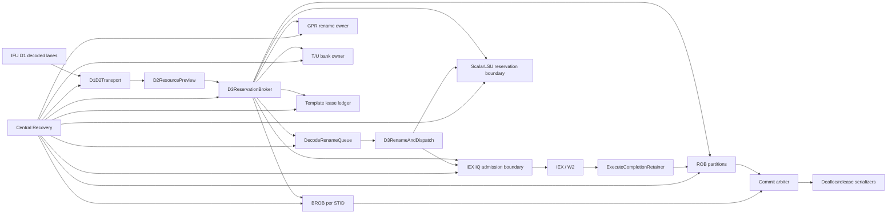

# LinxCore Chisel OOO 微架构改进设计

> 最新执行状态和 handoff 见
> [Integrated Development Flow](integrated-development-flow.md)。
> 当前模块边界由 OOO 自己完成 D1 full decode 和普通 multi-uop
> break，D2 计算 virtual RID/group 与全部资源需求，D3/S1 发布 physical
> grouped ROB 并完成 RENU/dispatch；BSTART/BSTOP 优先融合为 uop 的
> `start/stop` 位。外置 CTU 在 IFU-to-OOO ingress 展开模板。本文的 D3
> Template reservation/fill 和 one-row-per-RID 章节保留为旧方案分析与迁移期
> 对拍依据，不再作为最新 production placement 决策。

## 1. 文档目的

本文定义 LinxCore Chisel 后端乱序控制域的改进方案，覆盖：

- D1/D2 transport、D2 resource preview、D3 atomic reservation；
- scalar GPR 与 T/U rename；
- ROB、BROB、marker lifecycle；
- execute completion ingress retention；
- commit、deallocation；
- central recovery；
- Template D3 reservation/fill；
- 跨 STID、跨 PE 的 admission、commit 和 recovery arbitration；
- OOO 与 IFU、IEX、ScalarLSU 的责任边界。

本文是可独立评审的详细设计，不以“总纲中已给出结论”为前提。每个主要
模块均说明当前实现、问题、目标 owner、接口和状态、原子性与恢复、迁移
步骤和验收标准。

本文不把以下模块误写成 OOO 状态 owner：

- P1/I1/I2 及其 issue/pick/read-confirm 时序；
- RF 数据、ready/version 和端口仲裁；
- ALU、BRU、AGU、divider、FP、template FU 的计算与 W2 副作用；
- LIQ、STQ、SCB、MDB、MissQ、RefillQ、L1D 等 LSU 内部状态。

OOO 可以预约这些 owner 的 credit、携带它们的 token，并参与统一 recovery
prepare/commit；不能复制或直接修改它们的 resident state。

## 2. 基线与证据边界

本文检查的源码基线为：

| 仓库 | SHA |
|---|---|
| `rtl/LinxCore` | `2d25c32cb17e5a6561d232291f70e225a663a9a8` |
| LinxISA superproject | `726d1ba704b850b69bb16339cd1f9590e8dc65bd` |
| `tools/LinxCoreModel` | `2a1cf81e47060141e5305be5e49079a8fadc8e42` |
| `emulator/qemu` | `b4df5c31d06eaee04b602b4b6fd8b6f2c2592b4c` |

检查时工作树已有未提交改动，尤其包括 ROB、BROB、rename、recovery 和
Template D3 文件。因此本文把“源码当前可见行为”和“目标 production
行为”分开描述；未接入 production top 的原型不能算作已实现能力。

主要证据：

- 总体约束：
  [`linxcore-chisel-microarchitecture-improvement-design.md`](linxcore-chisel-microarchitecture-improvement-design.md)
- 模块状态：
  [`module-index.md`](module-index.md)
- D3 协议：
  [`TemplateD3ReservationFill.md`](interfaces/TemplateD3ReservationFill.md)
- 现有集成路径：
  [`DecodeRenameROBPath.scala`](../../chisel/src/main/scala/linxcore/backend/DecodeRenameROBPath.scala)
- ROB/BROB：
  [`ROBEntryBank.scala`](../../chisel/src/main/scala/linxcore/rob/ROBEntryBank.scala)、
  [`BROB.scala`](../../chisel/src/main/scala/linxcore/bctrl/BROB.scala)、
  [`BrobOrderState.scala`](../../chisel/src/main/scala/linxcore/bctrl/BrobOrderState.scala)
- Recovery：
  [`RecoveryFabric.scala`](../../chisel/src/main/scala/linxcore/recovery/RecoveryFabric.scala)、
  [`RecoveryBackendControl.scala`](../../chisel/src/main/scala/linxcore/recovery/RecoveryBackendControl.scala)

## 3. 总体目标架构



设计原则：

1. 一个状态只有一个 production owner。
2. preview 不修改状态；reservation fire 是 admission 的唯一原子点。
3. completion、commit、dealloc、recovery 都是 retained ready/valid 事务。
4. native BID/GID/RID 与 trace `(bid,gid,rid)` 明确分域。
5. 所有 recovery consumer 使用同一个 canonical resolved transaction。
6. 第一版使用每 `(PE, STID)` 独立 ROB partition，避免 scoped recovery 在
   共享单尾指针 ROB 中制造洞。
7. 跨 STID/PE arbitration 只选择事务，不接管被选择 bank 的状态。

## 4. 身份、顺序与 token 契约

### 4.1 Native identity

生产接口定义以下彼此独立的身份：

| 身份 | 目标表示 | owner | 用途 |
|---|---|---|---|
| native BID | `{valid, value[BID_W-1:0]}` | BROB | 架构 block tag |
| BROB pointer | `{valid, wrap/generation, bid}` | `BrobOrderState` | live-window、年龄和恢复 |
| native GID | `ROBID(valid, wrap, value)` | group/ROB owner | group identity |
| native RID | `ROBID(valid, wrap, value)` | ROB partition | row identity |
| ROB resident ID | `ROBID(valid, wrap, value)` | ROB partition | 物理 row generation |
| full LSID | 至少 32 bit，每 STID serial | ScalarLSU/ID owner | memory order |
| LID/SID | slot + generation | LIQ/STQ | 物理路由 |
| trace BID/GID/RID | 各 32 bit | commit trace | 模型观测 |

`BID_W = ceil(log2(BROB_ENTRIES))`。默认 256-entry BROB 时 `BID_W=8`。
STID 与 generation 不打包进 BID。

当前 `BID.DefaultWidth=64`、`CommitTraceParams.blockBidWidth=64` 和 widened
`blockBid` transport 是迁移形态，不是目标 BID 语义。目标实现保留
`BID_W` native slot，并把 wrap/generation 放入独立 BROB pointer。

### 4.2 Exact row key

所有会修改 resident row 的请求使用：

```text
ExactRowKey =
  PE + STID + TID
  + native BID + native GID + native RID
  + ROB resident ID
  + BROB pointer/generation
```

LSU completion 额外携带 full LSID、LID/SID generation 和 destination
provenance。PC 可用于诊断，不能替代任何 native identity。

### 4.3 Reservation token

`ReservationToken` 至少包含：

- transaction ID、owner domain、owner bank；
- PE/STID/TID；
- native BID/GID/RID 与 BROB pointer；
- row ordinal；
- token generation；
- consume/cancel/recovery-release 状态。

token 只能恰好一次进入 `fill`、`normal release`、`cancel`、
`recovery kill` 或 `fatal quarantine`。

## 5. D1D2Transport

### 当前实现

`DecodeRenameROBPath` 直接查看 decode 输出，使用 `PriorityEncoder` 选择
最低编号的一个有效 slot。`DecodeRenameQueue` 是单 push、单 pop FIFO，
只保存 `DecodedUop`。混合 marker/scalar packet 在 marker-skip 配置下会
阻塞，尚无 width-wide transport。

### 问题

- dense packet 每周期最多保留一个 row；
- later slot 的稳定性和重试依赖顶层行为，未形成正式协议；
- queue payload 不保存 reservation token；
- recovery 主要 coarse-clear queue，不能精确 compact survivors。

### 目标职责与 owner

`D1D2Transport` 只拥有 D1 到 D2 的 elastic transport，不拥有 ROB、
rename、IQ 或 LSU credit。它把一个 source packet 的有效 row 按程序顺序
压成连续候选向量，并保持 packet UID/checkpoint/PE/STID/marker sidecar。

### 接口与状态

- 输入：`Decoupled[DecodeLaneWindow]`，最多 `decodeWidth` lane。
- 输出：`Decoupled[D2CandidateGroup]`。
- 输出必须满足 `validMask == ((1 << candidateCount) - 1)`。
- 每个 group 只属于一个 `(PE, STID)`；跨 STID 在 group 之间仲裁。
- 状态仅包含 elastic/skid entries 和 source packet consumption token。

### 原子性与恢复

只有 D2 group 被 D3 接受的 prefix 才能从 transport 移除。suffix 必须在
原位置 compact 后稳定重试。accepted recovery 按 checkpoint 和 exact
identity 清除 killed group/row；不得从 PC 猜测 survivor。

### 迁移步骤

1. 先在现有 decode 输出后加入只读 compactor。
2. 用双 lane D2 group 替换单 `PriorityEncoder` 路径。
3. queue payload 增加 reservation token。
4. 扩到参数化 `decodeWidth`。

### 验收

- 0/1/2/4 lane dense window；
- lane 中有 marker、unsupported、不同长度指令；
- suffix 在 100-cycle backpressure 下 payload 不变；
- recovery 只删除目标 STID/checkpoint；
- 无 row 重复、丢失或重排。

## 6. D2ResourcePreview

### 当前实现

当前 admission readiness 分散在 `DecodeRenameROBPath`、
`GPRReservationTracker`、`DispatchROBAllocator` 和 store dispatch readiness
中。`GPRReservationTracker` 维护 pending physical/MapQ shadow count；
Template D3 另有一套 shadow ROB。

### 问题

- preview 与真实 owner 状态可能漂移；
- 不同 domain 的 ready 在不同组合层计算；
- shadow count 可能成为第二 owner；
- 缺少 width-wide cumulative demand。

### 目标职责与 owner

`D2ResourcePreview` 是纯组合 demand/credit snapshot 服务。它不扣 credit，
不分配 ID，不保存 token。真实 owner 发布 pre-cycle available credit 和
epoch；preview 计算每个 lane 及其 prefix 的资源需求。

### 接口与状态

输出 `D2Preview`：

- `laneDemand[lane][domain]`；
- `prefixDemand[k][domain]`；
- `prefixStructurallyLegal[k]`；
- owner credit snapshot 与 epoch；
- boundary cap，例如 marker/block-stop 后不能继续接收 later lane。

domain 至少包含 ROB、BROB、checkpoint、GPR phys、MapQ、T/U、IQ、
LIQ、STQ、LID、SID、LSID、template validation/lease。

### 原子性与恢复

preview 结果只用于选择候选 `k`。D3 broker 必须在 fire 前向真实 owner
重新校验 credit/epoch；preview 成功不授权任何 mutation。recovery 活跃时
对应 bank 的 preview 标记不可提交。

### 迁移步骤

1. 把散落的 need 计算汇总为 typed demand bundle。
2. 让真实 owner 输出 credit snapshot，停止增加 shadow 状态。
3. 删除 `GPRReservationTracker` 的 production mutation，保留 probe 对拍。

### 验收

- 各容量故意设置为不相等；
- preview stale 后 broker 拒绝且零 mutation；
- 0/1/2 destination、split store、template 全 domain demand 正确；
- preview 输出中不存在物理 tag 或 row 的未授权分配。

## 7. D3ReservationBroker

### 当前实现

`DispatchROBAllocator` 对一个 scalar row 原子协调一个 ROB row 和必要的
BROB entry。GPR credit、queue push、LSID advance 和 store readiness 在
外层协调。尚无统一多 owner、多 lane reservation transaction。

### 问题

- 单 row admission 不能吸收 dense decode；
- ROB/BROB 原子，不代表 rename/IQ/LSU 也原子；
- recovery 同拍时不同 child 可能观察不同门控；
- active block reuse、new block、marker-only 分配有多条路径。

### 目标职责与 owner

`D3ReservationBroker` 是 OOO admission 的唯一 transaction coordinator。
它不保存子系统 resident row；它收集真实 owner 的 prepare 结果，并在同一
`reserveFire` 向所有 required owner 提交相同 lane mask 和 transaction ID。

### Maximum contiguous lane prefix

对已经 compact 成连续有效向量的 `candidate[0, n)`，broker 选择：

```text
k = max { x | 0 <= x <= n
            and prefix[0, x) structurally legal
            and every mandatory owner can reserve cumulativeDemand(x) }
```

规则：

1. 只接受 `[0, k)`，绝不跳过 lane。
2. `k=0` 时所有 owner 零 mutation。
3. suffix `[k, n)` 原序稳定重试。
4. marker/block-stop 可成为 prefix 最后一行；其后 lane 不进入同一事务。
5. 一个 transaction 只对应一个 `(PE, STID)`。
6. owner credit 只能基于 pre-cycle resident state，不能依赖同拍
   downstream dequeue 形成 ready loop。

### 接口与状态

- `reserveReq: Decoupled[D3ReserveRequest]`
- `ownerPrepareReq/Resp[domain]`
- `reserveResp: Decoupled[D3ReserveDescriptor]`
- `abort/recovery: Decoupled[ReservationInvalidationTxn]`

descriptor 保存 accepted mask、每 lane exact identity、owner token、
checkpoint、BROB pointer 和 generation。

### 原子性与恢复

- prepare 只锁定或证明 credit，不产生外部可见 row。
- `reserveFire` 是所有 owner 创建 reservation 的唯一事件。
- 任一 mandatory owner 拒绝时全部不提交。
- accepted recovery 优先于 reserve/fill；killed token 进入统一
  invalidation transaction。

### 迁移步骤

1. 把现有 ROB/BROB admission 封装成一个 child owner。
2. 接入 GPR/MapQ 和 T/U token。
3. 接入 IQ/LSU capacity token。
4. 先支持 maximum prefix 0/1/2，再参数化到 4。
5. marker 与 template 改走同一 broker。

### 验收

- 每个 mandatory domain 单独制造 shortage；
- 任一 shortage 下所有 owner 的 mutation count 为零；
- 2-lane 中 lane1 shortage 允许 `k=1`，lane0 shortage 强制 `k=0`；
- recovery/reserve 同拍；
- accepted mask、ID、token 在所有 owner 完全相同。

## 8. DecodeRenameQueue

### 当前实现

单入单出 FIFO；push/pop 可同拍；flush 清空全部 row；payload 只有
`DecodedUop`。

### 问题

无法保存多 lane token，无法精确恢复，也无法证明 reservation 与 queue row
一一对应。

### 目标职责与 owner

改为 multi-enqueue、multi-dequeue、lane-compacting elastic queue，只拥有
D2/D3 transport residency。

### 接口与状态

每 row 保存 `DecodedUop + ExactRowKey + ReservationTokenSet + checkpoint`。
enqueue/dequeue mask 必须是连续 prefix。queue 不重新分配身份。

### 原子性与恢复

enqueue 只接受已成功的 D3 descriptor。恢复按 kill mask compact survivor，
同时向 broker/owner ledger 返回 killed token。

### 迁移步骤

先 dual-enqueue/single-dequeue，再 dual-dequeue，最后参数化。旧 coarse
flush 只保留 reset/全局 restart。

### 验收

wrap、同时多入多出、partial prefix、recovery compact、token 数量守恒。

## 9. DecodeLoadStoreIdAssign

### 当前实现

已经按 STID 保存 `nextLsId/nextLoadId/nextStoreId`，但每次只处理一个 row；
memory row accepted 时三个 serial 按类型推进。restore 接口可按 STID 恢复。

### 问题

缺少 width-wide prefix-sum；LID/SID serial 与未来 LIQ/STQ physical identity
边界仍混杂；full LSID authority 尚未贯穿 central recovery。

### 目标职责与 owner

该模块只拥有 per-STID serial snapshot/advance。每个 accepted row 都得到
当前 LSID snapshot，只有 memory row增加 serial。LID/SID 物理 slot 由
ScalarLSU 实际 reservation owner 分配。

### 接口与状态

输入 accepted prefix 与每 lane memory class；输出 lane-order prefix-sum
结果。restore 只接收 central recovery 中 owner-qualified full LSID。

### 原子性与恢复

serial 只在 D3 `reserveFire` 推进；一个 prefix 全部推进或不推进。
same-BID memory age 使用 `LSIDOrder`，cross-BID age 使用 BROB；半环歧义
fail closed。

### 迁移步骤与验收

先实现 dual-lane prefix-sum和两个 STID，再删除从 RID 推导 LSID 的接口。
验收覆盖 memory/non-memory 混合 prefix、跨 STID、wrap、restore authority
缺失和容量不等配置。

## 10. D3RenameAndDispatch

### 当前实现

`ScalarTURenameBridge` 在 queue head 上串接 GPR 与 T/U rename，随后把 row
patch 回 ROB，并向 reduced store path 发送 payload。仍是单 row。

### 问题

reservation 与 fill 分两层但缺少统一 token；rename、ROB patch、IQ/LSU
handoff 不是正式多 owner fill transaction。

### 目标职责与 owner

该模块消费 D3 descriptor，对 accepted prefix 做 P/T/U rename fill，并把
同一 row 发送到正确 dispatch class。它是协议协调器，不拥有 rename map、
IQ row、LIQ/STQ row 或 FU 状态。

### 接口与状态

- 输入：queue head prefix 和 token。
- 输出：GPR/T/U fill、ROB fill、IQ enqueue、ScalarLSU fill、
  external-engine command。
- unsupported class 精确 trap/fail closed，不落入 scalar fallback。
- stalled output 时保持完整 renamed row 与 token。

### 原子性与恢复

每 lane fill 只有在该 lane 所有 destination/dispatch owner ready 时 fire。
同一 lane 的 GPR/T/U map mutation、ROB `ReservedUnfilled→Renamed` 和目标
queue fill 同一事务完成。accepted recovery 先取消 killed token，再允许
survivor fill。

### 迁移步骤与验收

先保持单 lane但改 tokenized fill，再扩到 maximum prefix。验收覆盖
P/T/U 混合 source/destination、0/1/2 GPR destination、stalled IQ/LSU、
recovery/fill 同拍和 stale token。

## 11. GPRRenameCheckpoint

### 当前实现

模块已经按 STID 保存 SMAP、CMAP、MapQ 和 checkpoint，physical free pool
在 STID 间共享。rename 使用 first-free physical tag；commit 对同 BID MapQ
行做有序更新；flush 会恢复 checkpoint/CMAP 并 replay survivor。当前仍有
`flush.bid - 1` 等 reduced 恢复语义，`GPRReservationTracker` 在外部复制
credit 计数。

### 问题

- real phys tag/MapQ row 未在 D3 reservation 时锁定；
- checkpoint key 与 widened BID pointer 混用；
- external shadow credit 可与 free list 漂移；
- width-wide 0/1/2 destination 尚未闭合。

### 目标职责与 owner

该模块是 SMAP、CMAP、MapQ、checkpoint 和 shared physical free list 的
唯一 owner。它直接返回 reservation token，不允许独立 shadow tracker
决定可用性。

### 接口与状态

- `reserveDest(count, stid)`：原子返回 phys-tag/MapQ handles；
- `fillRename(token, sources, destinations)`；
- `commitBlock(stid, nativeBid, brobPointer)`；
- `recover(RecoveryResolvedTxn)`；
- `cancel(token)`。

checkpoint 使用 `(STID, native BID, BROB generation)`，predecessor 由
BROB resolver 提供，不执行 `bid - 1`。

### 原子性与恢复

0/1/2 destination 一次成功或失败。恢复先选择 checkpoint，再按 exact
resolved boundary prune MapQ，并按年龄重放 survivor。任何 physical tag
只有在 SMAP、CMAP、所有 MapQ 和 live reservation token 均不引用时才能
free。

### 迁移步骤

1. 增加 token API，与旧 rename API 对拍。
2. broker 改用真实 token。
3. 删除 production `GPRReservationTracker`。
4. 接 canonical predecessor 和双 destination。

### 验收

24 arch/128 phys/256 MapQ；两个 STID 同 BID；同 block 多次写同 arch；
pair destination；checkpoint wrap/reuse；recovery 后 free-list 引用闭包。

## 12. T/U rename 模块族

### 当前实现

`ScalarTURenameBridge` 已把 P rename 与
`TULinkLocalBankArray[PE][STID]` 组合，并保存 row-owned `tSeq/uSeq`。
`TULinkRelationCmap`、`TULinkRetireCommandPath` 和 recovery source
selector 已实现 mark/release/clean 的 reduced 串行路径。主路径仍是单 row，
部分 bank/top 仍以 PE0 为实际激活范围。

### 问题

- reservation 发生在实际 rename 当拍，没有独立 token；
- active rename selector、retired-row selector 和 cleanup source 路径复杂；
- width-wide 同 bank 冲突和跨 bank 并行策略未定义；
- ready/data/version 仍未与正式 IEX 边界闭合。

### 目标职责与 owner

`TULinkLocalBankArray` 是 `[PE][STID][T/U hand]` 的唯一 map/sequence/
relation state owner。`ScalarTURenameBridge` 只做 lane routing 和 P/T/U
结果合成。

### 接口与状态

- reservation token 指明 PE/STID/hand、sequence 和 map row；
- rename、retire、block clean、recovery 均按 row-owned PE/STID 路由；
- retire source 保留 native BID/GID/RID、BROB pointer、tSeq/uSeq；
- current rename selector不得用于路由 retired row。

### 原子性与恢复

同 row 的 P/T/U reservation/fill 原子。`ReleaseRelative → current mark →
post-release → CleanCMAP → local block commit fanout` 顺序不可改变。
non-base recovery 的 ROB/LSU source 缺失、多匹配或冲突时，本 bank
maintenance fail closed。

### 迁移步骤

先 token 化当前单 lane；再支持同 bank serialized、不同 bank 并行的
dual-lane fill；最后接正式 ready/version owner。

### 验收

多 PE、多 STID；T/U source underflow；block-last release 顺序；同拍 commit/
recovery；非目标 bank 零 mutation；stale sequence 不能释放新 row。

## 13. DispatchROBAllocator

### 当前实现

模块组合 `BrobOrderState`、`BrobMetaTracker`、store range/count 和
`ROBEntryBank`。单 row 新 block 可原子分配 ROB/BROB；active block row
只分配 ROB。它仍使用默认 64-bit widened BID，completion 最终转发
`completeRobValue`。

### 问题

职责同时包含 admission、BROB metadata、ROB、store-range 和恢复胶水；
不能作为 width-wide multi-owner broker；public ready 与 child mutation 的
证明范围只覆盖 ROB/BROB。

### 目标职责与 owner

改为 D3 broker 的 ROB/BROB child adapter：

- 新 block 预约一个 BROB slot/pointer；
- accepted prefix 预约连续 RID 区间；
- active block reuse 使用 resolver 返回的 exact pointer；
- 返回 ROB/BROB token，不再协调其他 owner。

### 接口与状态

`reserveRows(req/resp)`、`fillRows`、`completeExact`、
`commit/dealloc`、`recoverResolved`。BROB metadata、order state 和 ROB
仍由各自 child owner 保存。

### 原子性与恢复

public reserve fire、ROB reservation、BROB reservation 和 cursor advance
必须同一事件。recovery prepare/commit 未完成时不允许 child 先行分配。

### 迁移步骤与验收

先替换 completion 接口，再引入 N-row RID interval，最后把 store count/
marker glue 移回 BCTRL owner。验收覆盖 new/reuse block、RID wrap、BROB
full、ROB full、recovery/reserve 同拍和 child mutation 一致性。

## 14. ROBEntryBank 与 ROBEntryStatus

### 当前实现

ROB 保存 row、native RID、PE/STID/TID、LSID、T/U 和 marker sidecar，拥有
alloc/commit/dealloc 三个 pointer。实际路径主要使用
`Free→Allocated→Renamed→Completed→Retired→Free`。completion 仅用
`completeRobValue` 选择 row；commit 无 ready，连续完成头自动变
`Retired`；dealloc 有 ready 和 hold mask。flush 从 dealloc head 扫描后缀
并 rebase pointer。

### 问题

- stale completion 可在 slot reuse 后完成错误 row；
- `ReservedUnfilled/Issued/Fault/NeedFlush` 尚未成为完整生产状态；
- commit 没有强一致 consumer handshake；
- 单一共享 ROB 的 STID-scoped prune 可产生 pointer/洞语义风险。

### 目标职责与 owner

每 `(PE, STID)` 一个 ROB partition，唯一拥有 row、RID generation 和
alloc/commit/dealloc pointer。跨 partition commit 由外部公平 arbiter 合并。

### 接口与状态

```text
Free
  -> ReservedUnfilled
  -> Allocated/Filled
  -> Renamed
  -> Issued
  -> Completed | Fault | NeedFlush
  -> Retired
  -> Free
```

- `ReservedUnfilled` recovery-visible，但 issue/commit/trace/side-effect
  全部不可见。
- completion 输入为 retained `ExactCompletion`。
- commit 输出为 `Decoupled[CommitWindow]`。
- dealloc 输出为 retained release-source window。
- query helper 只读，不授权 mutation。

### 原子性与恢复

- exact completion 必须匹配完整 key 和当前 generation。
- recovery commit 对 killed row 优先于 fill/complete/commit/dealloc。
- commit 只处理从 partition head 开始的 completed prefix。
- dealloc 只有在所有 row-owned release obligation 被接受后才 free。
- scoped recovery 只截断目标 partition 的连续 suffix。

### 迁移步骤

1. exact completion，保留旧接口只作 assertion 对拍。
2. 启用 `ReservedUnfilled`。
3. commit 增加 ready/valid。
4. 按 `(PE,STID)` partition。
5. 删除 slot-only mutation。

### 验收

RID wrap/reuse stale completion；fill/complete/recovery 同拍；commit 与
dealloc backpressure；unfilled row 不可越过；count 方程；两个 STID 同
native RID 不 alias。

## 15. ExecuteCompletionRetainer

### 当前实现

新增模块提供两个 ingress lane 和两个 resident slot，按 pre-cycle free
capacity 产生 lane ready，避免 `laneReady→outputReady→dequeue` 组合环。
它检查 PE/STID/TID/PC、native BID/GID/RID/ROBID 的重复和非法身份，支持
exact clear 或 nuke clear。但输出仍是 `completeRobValue + CommitTraceRow`，
key 中也缺少独立 BROB pointer/generation。

### 问题

- ingress 已保留 exact key，出口却降级为物理 slot；
- PC 被纳入 key，而 full BROB generation 未纳入；
- 固定 2 lane/2 slot，尚未按 completion source 和 partition仲裁；
- clear 需与 central recovery transaction 对齐。

### 目标职责与 owner

它是 OOO completion ingress retention 边界，仅负责：

- 保留 IEX W2 或 external-engine exact-validation owner 已产生的
  `RobResolveTxn`；LSU load 不直接进入该 retainer；
- 进行 exact identity、duplicate 和 stale-residency qualification；
- 在 ROB backpressure 下稳定输出；
- 接受 central recovery 对 pending completion 的清除。

W2/FU 的计算、RF writeback、wakeup、redirect 和其他终端副作用归 IEX
统一 terminal network；LSU 只发布 retained `LoadResultTxn` 并等待
`LSU_RETURN_ACK`。本模块不能重新产生或提前发射这些副作用。

### 接口与状态

- 输入 lane 改为 `Decoupled[ExactCompletion]`；
- 输出按 ROB partition 分 bank，或由 retained fair arbiter 串行；
- key 增加 native BID、BROB pointer/generation；
- `clear` 改为 `RecoveryResolvedTxn` 的 kill-set consumer；
- slot 数参数化，occupancy 与 source provenance 可观测。

### 原子性与恢复

W2 owner 必须把 completion 与其强一致副作用视为一个 terminal
transaction：只有 `completeFire` 才能授权 RF writeback/wakeup/redirect。
若 recovery kill 命中，retainer 和 W2 side-effect gate 同拍 suppress；
pending completion 被清理后不得再次输出。

### 迁移步骤

1. 保留现有两槽结构，先把出口改为 exact key。
2. 加 full BROB pointer/generation。
3. 接 central recovery kill-set。
4. 按 source/partition 参数化和公平仲裁。

### 验收

连续双 lane completion；ROB backpressure；同 key duplicate；同 slot 不同
generation；clear 与 output 同拍；无 ready loop；副作用只在
`completeFire` 出现。

## 16. BROB 模块族

### 当前实现

`BrobOrderState` 已按 STID 保存 alloc cursor、commit cursor 和 live count，
有公平 head retirement 与 bounded live resolver。`BrobMetaTracker` 保存
scalar done/drain、engine done、exception。当前 cursor 和 metadata key
使用 widened 64-bit BID；主组合中 engine/trap/drain producer 仍有 tie-off。

### 问题

- widened BID 同时承担 native tag 与 full pointer；
- 部分状态枚举未形成真实 transition；
- metadata completion 与 retirement certainty 尚未完全统一；
- class-specific recovery tail 语义分散在字段和调用者中。

### 目标职责与 owner

- `BrobOrderState`：每 STID head/tail/live-count 和 full pointer；
- `BrobMetaTracker`：exact resident block metadata；
- `BrobLiveBidResolver`：native BID 到唯一 live pointer 的 canonical resolve；
- store range/count owner：只负责 bookkeeping certainty；
- non-flush frontier：发布 exact `(head pointer, prefix count)`。

### 接口与状态

BROB entry 保存 native BID、generation、PE/STID、ROB first/last RID、
marker type、scalar/engine/store completion bitmap、trap 和 checkpoint。
engine command 的 `(cmd_stid,cmd_tag)=(STID,BID)`；transaction epoch 独立。

### Class-specific BROB restore

| Recovery class | pivot 含义 | new tail | commit head |
|---|---|---|---|
| `MISS_PRED_FLUSH` | 输入即 first-killed block | `resolved(pivot)` | 不变 |
| `NukeFlush` | pivot block 保留 | `successor(resolved(pivot))` | 不变 |
| `InnerFlush` | pivot block 保留 | `successor(resolved(pivot))` | 不变 |
| `FastFlush`/等价 retained-pivot class | pivot block 保留 | `successor(resolved(pivot))` | 不变 |
| 纯 PE/SIMT/MTC scoped replay | 默认不改全局 BROB window | 不变 | 不变 |

若某个 scoped class 需要 block suffix truncate，必须在
`RecoveryResolvedTxn` 中显式编码 `truncateValid/firstKilledPointer`，不能
落入默认分支。

### 原子性与恢复

resolve 必须在 `(STID, head, liveCount)` 有界窗口内唯一命中。零匹配或多
匹配时 BROB/ROB/rename 全部零 mutation。metadata free、head advance、
live-count decrement 和 public retire fire 同一 handshake。

### 迁移步骤

先增加 native BID 与 pointer 双字段并对拍，再把 age/recovery 全部切到
owner pointer，最后把 trace 64-bit transport 降为 DFX sideband。

### 验收

256-entry ring、rollover、full ring、两个 STID 同 BID、class-specific
restore、younger completed block 等待 head、stale engine response。

## 17. Marker lifecycle

### 当前实现

`BlockMarkerDecodeContext` 和 `BlockMarkerLifecycle` 都保存 per-STID active
block context；`DecodeRenameROBPath` 可通过配置选择 decode context，并仍有
marker-skip、marker-only BROB allocation 和 pre-retire 路径。
`BlockMarkerRetireSourceSerializer` 已能保存宽 dealloc window 的 marker
source并接受 flush prune。

### 问题

- decode-time 与 retire-time active truth 可能重复；
- marker 可能绕过正常 ROB row；
- redirect 存在 reduced top-local 路径；
- pre-retire/marker-only 特例增加 BROB 生命周期分叉。

### 目标职责与 owner

- decode context 只决定 row 的 block identity 和 boundary metadata；
- ROB marker row 保留该 metadata；
- retire lifecycle 只在 accepted marker commit 后产生 scalar-done、
  active-context transition 和 recovery/restart event；
- serializer 只负责宽窗口到单事务的 retention。

### 接口与状态

`BSTART` row 属于新 BID；`BSTOP` row 属于当前 BID。active context 按 STID
保存 target、condition、checkpoint、epoch。production 默认不跳 marker。

### 原子性与恢复

marker effect 与 marker row commit 同一 accepted transaction。redirect
只发布 typed recovery candidate，R4 restart 由 central recovery 产生。
recovery 清理 queued retire source 和 active context 时使用同一 kill-set。

### 迁移步骤

1. 默认启用 marker row。
2. 合并重复 active truth。
3. 删除 marker-only/pre-retire production path。
4. 删除 top-local restart。

### 验收

direct/call/cond/ret/fall、BSTART/BSTOP、dense marker window、loop re-entry、
redirect cleanup、marker source backpressure。

## 18. Commit、deallocation 与跨 STID commit arbitration

### 当前实现

ROB commit 是无 ready 的 completed-head prefix，碰到 trap/block-last/marker
停止；row 同拍变 `Retired`。dealloc 是独立 ready/hold walk，并输出 T/U 和
marker retire source。当前安全 evidence 已闭合 `commitWidth=2`，接口默认
仍可配置 4。

### 问题

- 强一致 consumer 不能反压 commit；
- commit trace、rename/LSU/BCTRL side effect 与 `Retired` transition 的
  单一授权点不够明确；
- 多 STID partition 需要稳定、公平、不可撤销的选择。

### 目标职责与 owner

每 partition 生成本地 eligible prefix；`CommitArbiter` 公平选择 partition，
并保持选择直到 transaction accepted。commit 只授权架构退休；trace 是
accepted commit 的观察副本。dealloc 在退休义务全部完成后释放物理 row。

### 接口与状态

- `partitionCommit: Vec[Decoupled[CommitWindow]]`
- `publicCommit: Decoupled[CommitWindow]`
- `releaseObligation`: GPR、T/U、marker、LSU、checkpoint 等 typed source
- `deallocAck`：所有 mandatory release 完成。

### 原子性与恢复

commit fire 同时授权 ROB `Completed→Retired` 和强一致 consumer enqueue。
trace sink 不得反压架构，但必须由 accepted commit queue 派生。dealloc
必须在 T/U mark/release、marker lifecycle 和 LSU commit obligation 已被
各 owner 接受后才能 `Retired→Free`。

### 迁移步骤

先给现有 commit 加 ready/valid，再加入 per-STID arbiter；保留
commitWidth=2 作为首个性能点，功能闭合后再到 4。

### 验收

consumer 任意回压；1/2/4 lane；marker/store/trap stop；跨 STID RR 无饥饿；
commit/dealloc/recovery 同拍；row 只 retire/free/trace 一次。

## 19. Central recovery

### 当前实现

已经存在 retained producer queue、`RecoverySourceArbiter`、
`RecoveryClassMerge`、`RecoveryCleanupControl` 和
`RecoveryBackendControl`。class merge 保留 per-STID global flush/replay 和
per-PE lane，cleanup intent 可被下游 backpressure。LSU full-BID lookup
通过 ROB 路由，但并非所有 source 都统一经过一次 BROB/ROB canonical
resolve；consumer 也尚无 all-owner prepare/ack。

Production O7.2d2/d2e 已经实现本节核心事务：O3 对 ROB/D3/BROB/PC、
P/T/U、dispatch、IEX、fast resolve 做一次 exact common apply；外层
`RecoveryControl` 在 prepare 期间只 fence STID，apply 后才清
D1/D2/S1，并等待 typed rebuild completion 与 IFU `canonicalFlush`。
O7.3 已把 CTU 纳入该原子边界：`RecoveryControl` 先要求
`CTU` 对目标 STID 做 side-effect-free prepare/fence，随后
才向 O3 提交请求；O3 exact apply 同拍取消 CTU retained packet/lease 与
D1/D2/S1，abort 则只释放 fence。剩余缺口主要是 LSU/global producer
接入、跨 source arbitration，以及 O9 外部 CTU recipe engine/top wiring，
而不再是 frontend/O3/CTU 的 common-apply 边界。

### 问题

- typed request retention 已有，但 canonical resolve 不完整；
- `intentReady` 是聚合门控，未证明每个 mandatory owner ready；
- ROB flush 与 BROB pointer restore 仍可能走不同的派生路径；
- recovery class 的 first-killed 语义未成为唯一 payload。

### 目标职责与 owner

`RecoveryFabric` 是 recovery request retention、选择和 transaction 生命周期
的唯一 owner，采用五阶段：

1. Capture：每 producer 独立 retained lane；
2. Resolve：BROB/ROB/LSU owner lookup，得到唯一 canonical pivot；
3. Prepare：所有 mandatory consumer 返回 ready/qualification；
4. Commit：广播同一个 resolved transaction；
5. Ack：收集完成并记录 provenance。

Frontend Ack 必须是 IFU 对同一 redirect proposal 的 canonical echo，
不能用 `backendRedirect.ready` 代替；`newEpoch` 只由 IFU 分配。

### 接口与状态

`RecoveryResolvedTxn` 至少包含：

- txn ID、epoch、source/cause mask、class；
- PE/STID/TID；
- exact cause row；
- native BID/GID/RID、BROB pivot pointer；
- `truncateValid`、`firstKilledBlockPointer`、`firstKilledRid`；
- checkpoint/predecessor；
- full LSID authority；
- restart PC/token；
- owner kill masks。

### 原子性与恢复

只有 `allMandatoryPrepared && resolvedUnique` 才能 `commitFire`。
canonical miss、ambiguous、stale generation 均零 mutation。所有 owner 在
同一 txn ID 下更新；recovery 对 killed row 的 fill/completion/commit/
dealloc 优先级最高。

### 跨 STID/PE arbitration

- 每个 STID 保留独立 class state；
- 同 STID 按 Linx `FlushControl` 语义选 older/merge；
- 跨 STID 使用 round-robin，选择后在 backpressure 下不可撤销；
- 第一版一次只 commit 一笔 cleanup，降低 owner-ack 复杂度；
- unrelated STID bank 保持状态，不因全局串行而被错误清理；
- PE-scoped request 只 fanout 到目标 PE/owner mask。

### 迁移步骤

1. 定义 resolved txn 和 owner prepare/ack。
2. 所有 raw request 禁止直连 mutation port。
3. BROB resolver 成为所有 class 的必经点。
4. ROB/BROB/rename/IQ/LSU/template 接统一 commit。
5. 删除 legacy full-BID bridge。

### 验收

canonical miss/multi-match 零 mutation；多个 source 同拍；下游长时间
backpressure；class-specific BROB restore；跨 STID fairness；PE scope；
cleanup 与 W2 side effect 同拍。

## 20. Template D3 reservation/fill

### 20.1 TemplateD3ReservationAllocator

#### 当前实现

模块有独立 `rowValid` shadow table、alloc pointer 和 live count，可一次
创建连续 RID 区间；response 和 token bundle 已较完整。但只把
`ROB_ROW` domain 标为 present，lxcpu/context generation 为零，
generation 使用 `pc ^ raw`，且未接真实 ROB/BROB/rename/IQ/LIQ/STQ。

#### 问题

它是第二 ROB owner，不具备真实 multi-domain atomicity。

#### 目标职责与 owner

降级为 Template demand/row-plan adapter，调用统一 D3 broker。token 与
lease 由正式 Template ledger 保存。

#### 接口与状态

request 描述 form/N/parent/checkpoint；response 直接引用真实
`D3ReserveDescriptor`。不再保存 shadow row。

#### 原子性与恢复

BROB range、ROB rows、checkpoint、GPR/MapQ、IQ、LIQ/STQ、ID、validation、
target publish、final lease 全部一次 reserve 或全部失败。

#### 迁移步骤与验收

先保持现有 bundle，替换 allocator backend；再删除 shadow row。
四种 form、1～28 row、每个 domain shortage、recovery/reserve 同拍通过。

### 20.2 TemplateD3RowFill

#### 当前实现

模块保存 descriptor/token，强制 child ordinal 顺序，校验 identity、row
kind 和 memory shape，并有 cancel/recovery/fatal/watchdog。但 accepted fill
只更新本地 bitmap/ack，没有写真实 ROB/rename/IQ/LSU。

#### 问题

协议校验有效，production side effect 缺失；fatal `quiescent` 仍是原型。

#### 目标职责与 owner

作为 fill transaction coordinator，消费 token 并原子填充真实 owner。
child 完成后进入正常 IQ/LSU/ROB，不走 private execution path。

#### 接口与状态

保留 descriptor、next ordinal、consumed mask 和 watchdog；新增每 domain
fill req/ack。`ReservedUnfilled` row 只由真实 ROB 保存。

#### 原子性与恢复

fill 要么所有该 row owner 同拍接受，要么不消费 token。recovery 优先；
killed token stale。filled row 走正常 owner recovery，unfilled token 由
lease ledger cancel。

#### 迁移步骤与验收

先接 ROB fill，再接 rename/IQ/LSU；partial fill recovery、duplicate/out-of-
order/stale token、timeout、owner backpressure、fatal quiesce 全覆盖。

### 20.3 TemplateRenameSidecarTable

#### 当前实现

每 STID 保存 parent identity、SMAP/CMAP snapshot 和 decode/issue/memory
fence；exact generation 不匹配会丢弃。

#### 问题

复制 speculative/commit map 形成潜在第二 rename truth；容量是一 STID
一 entry 的 reduced 形态。

#### 目标职责与 owner

改为 descriptor lease sidecar，只保存 parent、正式 checkpoint handle、
owner token、filled bitmap 和 fence state；不复制 SMAP/CMAP。

#### 原子性、迁移与验收

cancel/recovery 释放真实 token；normal final 释放 lease。验收多 group、
stale generation、fence release、recovery 和正式 checkpoint lookup。

### 20.4 BlockControlTemplateSequencer

#### 当前实现

现有私有 sequencer 可生成 child，并包含直接 RF/SP/load/store/completion
形态，store 路径还有 `ownsStqRow=false`。

#### 目标职责与迁移

CTU 只产生 row plan/fill 和 typed control event。删除 direct RF、LSU、
completion、redirect side effect；所有 child 进入正式 owner。

#### 验收

production elaboration 中 direct-effect port 零连接；template workload 的
IQ/LIQ/STQ/ROB activation 非零。

### 20.5 TemplateRecoveryQualification

#### 当前实现

当前模块根据 active parent、completed/committed 和 matching recovery
区分 self recovery、pre-completion external kill 和 illegal discard，但未
消费 central resolved kill-set。

#### 目标职责与迁移

并入 Template lease ledger 的 recovery consumer。unfilled token 按
resolved killed mask cancel；filled row 由正常 owner处理。fatal 使用独立
quiesce request/ack，不伪装成 speculative recovery。

#### 验收

self restart、external pre-fill kill、filled-row recovery、illegal discard、
all-owner ack、generation reuse。

## 21. 与 IFU、IEX、ScalarLSU 的边界

### IFU 边界

IFU 拥有 fetch PC、checkpoint request、packet residency 和 restart
consumption。OOO 只接收 decoded lane group，并在 recovery R4 发布 typed
restart token。OOO 不直接改 fetch PC，也不根据 marker 在 top 内重启。

### IEX 边界

IEX 拥有 P1/I1/I2、IQ residency、operand read-confirm、FU pipeline、W2、
RF writeback/wakeup/redirect terminal transaction。OOO 拥有 IQ reservation
token、ROB issue/completion bookkeeping 和 completion retention。
`ExecuteCompletionRetainer` 不成为 FU/W2 owner。

### ScalarLSU 边界

ScalarLSU 拥有 LIQ/STQ/SCB/MDB/MissQ/RefillQ/L1D、full LSID memory age、
store visibility 和 retained load-result payload。load result 先进入 IEX
统一 W2 network，再由 IEX 发布 source-qualified exact `RobResolveTxn`；
OOO 不直接驱动 load RF/wakeup，也不维护第二条 LSU completion shortcut。
OOO 只协调 D3 reservation、保存 row memory sidecar、接受统一 completion
和 LSU recovery candidate，并把 central recovery transaction fanout 给
LSU。

### External engine 边界

external command 使用 native `(STID,BID)` 和独立 epoch。response retained，
经 BROB/ROB exact validation 后才能成为 completion。unsupported engine
class fail closed。

## 22. Leaf helper 家族处置表

### 22.1 当前具名模块逐项处置

| 当前模块 | 当前职责/问题 | 目标处置 |
|---|---|---|
| `CoreParams` / `InterfaceBundles` | 参数和身份 shape 分散 | 由统一 `LinxCoreConfig` 派生，不拥有策略状态 |
| `ScalarDecodeRenameBridge` | scalar P rename adapter，当前单 lane | 保留为 vector lane adapter，资源原子性归 D3 broker |
| `StoreSplitPayload` | 纯 store payload split | 保留纯 transform；STQ lease 和状态归 LSU |
| `TULinkRename` | 单 bank T/U rename owner | 保留 bank 内 owner，实例化到 `[PE][STID][hand]` |
| `TULinkRecoveryCleanupPath` | T/U cleanup composition | 只消费统一 `RecoveryResolvedTxn`，禁止独立 resolve |
| `TULinkLocalBlockCommitFanout` | selected-STID local commit fanout | 扩展到所有目标 PE/hand 的原子 fanout |
| `BrobStoreRangeState` | block store range bookkeeping | 保留 exact identity 状态；不授权 strong non-flush |
| `BrobStoreCountPublisher` | scalar/engine/template count publication | 保留 retained publisher，identity mismatch 不覆盖 |
| `BrobNonFlushFrontier` | head/prefix 安全窗口 | 保留 exact `(head pointer,prefix count)`，禁止 unsigned threshold |
| `BIDRingOrder` | 裸 ring 比较 helper | 迁入 verification；production age 统一查 BROB owner |
| `ROBFlushPrune` | ROB prune predicate/mutation | 只消费 central resolved kill interval |
| `ROBFullBidLookup` | ROB/BID lookup | 并入一次 canonical resolve 的 query child |
| `ROBRecoveryWatermark` | ROB/full-LSID frontier publication | 保留 typed frontier，不直接 cleanup |
| `ROBRowStatusLookup` | resident status query | 保留 exact query，不授权 mutation |
| `ROBRowCommitTraceLookup` | resident row 到 trace payload | 只从 exact accepted commit row 投影 |
| `CommitIdentity` | 模型/硬件 identity 转换 | 保留并显式区分 trace projection 与 native identity |
| `CommitTraceMonitor` | commit schema/identity monitor | 扩展 exact generation、pair 和 Template assertions |
| `RecoveryEligibilityControl` | recovery admission 条件 | 合并到 central prepare/commit policy |
| `RecoveryNonLsuProducerBank` | BCC/IEX/PE producer 聚合 | 接真实 retained lanes，删除 tie-off |
| `RecoveryProducers` | producer event/queue 类型 | 保留 typed source 和每 source 独立 retention |
| `RecoveryProvenance` | source provenance | 保留稳定编码，不参与 identity 或 age |
| `ScalarRedirectRecoverySource` | BRU/FRET correction source | 接 IEX exact correction metadata，retained 发布 |
| `RingFullBidRecoveryBridge` | widened BID 迁移 bridge | native BID/full pointer 迁移完成后删除 |

### 22.2 Leaf 家族规则

| 家族 | 目标处置 | 允许的职责 | 禁止的职责 |
|---|---|---|---|
| `*Bundles`、enum | 保留 | typed interface/state encoding | 寄存器、age、mutation policy |
| `ROBID`、native BID types | 保留/强化 | 精确表示、纯比较 | 省略 valid、把 unsigned slot 当年龄 |
| `*Lookup` | 保留 | resident exact query | 授权 mutation、保存第二份 row |
| `*Resolver` | 提升 | BROB live-window canonical resolve | 用裸 BID 大小推年龄 |
| `*Watermark` / `*Join` | 保留 | 发布 exact frontier/coherence proof | 直接 prune owner |
| `*Preview` / `*Candidate` | 保留/合并 | 纯组合 demand/predicate | 扣 credit、retention |
| `*Admission` | 并入 D3 broker | 单一 transaction decision | 独立 child fire |
| `*Publisher` | 保留且 retained | typed count/event publication | advisory pulse、覆盖不匹配 row |
| `*Serializer` | 保留 | 宽 source 的有序 retention | 重建 identity、提前 side effect |
| `GPRRename*Select` | 保留 | 大 MapQ 层次化纯 scan | 第二 rename map |
| `TULinkFlush*` | 合并为 lookup/publisher child | exact source qualification | 独立 cleanup owner |
| `RecoveryProducerQueue` | 保留 | 每 source 独立 retention | class merge、owner mutation |
| `RecoveryClassMerge` | 保留 | class/provenance merge | canonical owner update |
| `FullBidRecoveryBridge` 等 legacy bridge | 迁移后删除 | 暂时适配 | 继续定义 widened BID 架构 |
| `GPRReservationTracker` | production 删除 | test 对拍 | free-list shadow owner |
| `ReducedRobCompletionArbiter` | 替换 | test fixture | production completion 丢失/降级 |
| `ExecuteCompletionRetainer` | 提升 | exact completion retention | FU/W2/RF side effect owner |
| `*Probe` | 测试化 | assertion、activation、generated proof | production instance |
| `Reduced*` | 删除或测试化 | isolated replay/trace test | production state owner |

## 23. 分阶段迁移

### O0：冻结契约

- 引入 native BID、BROB pointer、exact row key、reservation token、
  resolved recovery transaction。
- 为 slot-only completion 和 widened-BID age 增加禁止性 assertion。

### O1：correctness P0

- `ExecuteCompletionRetainer→ROB` 改 exact completion。
- central recovery 改 canonical resolve + all-owner prepare/commit。
- class-specific BROB restore闭合。

### O2：双 lane D2/D3

- `D1D2Transport`、preview、maximum contiguous prefix broker。
- 双 lane ROB/BROB/GPR/T/U/LSID reservation。
- 保持 issue/execute 宽度不变。

### O3：commit/dealloc 与 multi-STID

- per `(PE,STID)` ROB partition；
- retained fair commit；
- marker、T/U、LSU release obligation闭合。

### O4：Template D3 production

- shadow allocator 替换为真实 broker；
- `ReservedUnfilled` 和 normal fill；
- fatal quiesce/ack。

### O5：production 收敛

- production 零 `ReducedCommitROB`、marker skip、shadow GPR/Template owner；
- trace tops 只包装 production owner；
- 扩到目标 PE/STID、decodeWidth=4、commitWidth=4。

## 24. 验收矩阵

| 类别 | 必须证明 |
|---|---|
| Identity | 同 slot 不同 RID/BROB generation 的 stale 请求零 mutation |
| Prefix | 只接受 maximum contiguous lane prefix，suffix 稳定 |
| Atomic reservation | 任一 domain shortage 时所有 owner 零 mutation |
| Rename | P/T/U、0/1/2 destination、两个 STID 无 alias |
| ROB | ReservedUnfilled invisibility、commit/dealloc backpressure、count 闭包 |
| BROB | 256 ring rollover、class-specific restore、head-only retirement |
| Marker | 默认 marker row、accepted commit 才产生 effect |
| Completion | retainer 无 ready loop，side effect 只在 completeFire |
| Recovery | canonical miss/multi-match 零 mutation；all-owner 同 txn |
| Template | 1～28 row reserve/fill、partial-fill recovery、fatal quiesce |
| Arbitration | 跨 STID/PE 公平、选择在 backpressure 下不可撤销 |
| Boundary | production OOO 不实例第二 IQ/RF/FU/LSU state owner |

最小测试序列：

```bash
bash tools/chisel/build_chisel.sh
bash tools/chisel/run_chisel_tests.sh --only DecodeRenameROBPath
bash tools/chisel/run_chisel_tests.sh --only GPRRenameCheckpoint
bash tools/chisel/run_chisel_tests.sh --only ScalarTURenameBridge
bash tools/chisel/run_chisel_tests.sh --only DispatchROBAllocator
bash tools/chisel/run_chisel_tests.sh --only ROBEntryBank
bash tools/chisel/run_chisel_tests.sh --only BrobOrderState
bash tools/chisel/run_chisel_brob_order_state_probe.sh
bash tools/chisel/run_chisel_tests.sh --only RecoveryBackendControl
bash tools/chisel/run_chisel_tests.sh --only RecoveryCleanupControl
bash tools/chisel/run_chisel_tests.sh --only ExecuteCompletionRetainer
bash tools/chisel/run_chisel_tests.sh --only TemplateD3ReservationAllocator
bash tools/chisel/run_chisel_tests.sh --only TemplateD3RowFill
bash tools/chisel/run_chisel_verilator_lint.sh
```

文档阶段只要求静态校验；实现阶段必须增加：

- unequal-capacity elaboration；
- RID/BID/LSID rollover randomized reference-model tests；
- dual-STID same-native-ID tests；
- generated-RTL/QEMU commit cross-check；
- CoreMark/Dhrystone activation、IPC 和 recovery counter evidence。

## 25. 评审决策点

评审需要明确批准以下决策：

1. 第一版采用每 `(PE,STID)` 独立 ROB partition。
2. native BID 固定为 `BID_W`，BROB pointer/generation 独立。
3. maximum contiguous lane prefix 是唯一 width-wide admission 规则。
4. completion 出口禁止降级为 `robValue`。
5. recovery 使用 capture→resolve→prepare→commit→ack。
6. `MISS_PRED_FLUSH` inclusive；nuke/inner/fast restore 到 pivot successor。
7. marker row 默认进入正常 ROB/commit。
8. Template D3 不保留 shadow ROB 或 direct-effect sequencer。
9. P1/I1/I2、RF/FU 和 ScalarLSU 内部状态不归 OOO owner。

这些决策一旦批准，应写入公共 bundle assertion、module spec 和 production
elaboration gate；不能只停留在顶层文档。
