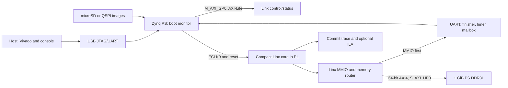

# LinxCore Zybo Z7-20 Linux Bring-up Design

**Status:** Approved in the 2026-08-01 design review  
**Target repository revision:** `294542ffb5c9a65915af34fa38abc32e2eec134f`  
**Target board:** Digilent Zybo Z7-20, `xc7z020clg400-1`  
**Primary tools:** Scala 2.13.17, Chisel 7.3.0, CIRCT, Vivado 2025.2

## 1. Objective

Build a compact, reproducible FPGA platform around the Chisel Linx core and
advance it through bare-metal smoke tests to a small Linx NOMMU Linux kernel
and BusyBox shell on a Zybo Z7-20.

The first implementation uses the Zynq processing system (PS) as the board
bootstrap and service processor. The Linx CPU remains the processor under
test and executes in programmable logic (PL). The PS initializes DDR, loads
the Linx images, configures the PL, controls reset, and forwards console data.

This design does not claim that the current Chisel core can boot Linux. It
defines the platform and the evidence gates that must close the missing core
capabilities before that claim is allowed.

## 2. Existing Evidence and Active Gaps

The current `LinxCoreBenchmarkAutonomousTop` is the closest executable Chisel
integration target. It already provides:

- a production IFU composition feeding the reduced live backend;
- a 32-entry benchmark ROB and two-wide commit observation;
- externally supplied instruction windows and load data;
- committed store observation;
- UART recognition at `0x10000000`;
- the FPGA test finisher at `0x10009000`; and
- commit, block-control, load/store, trap, and recovery visibility.

It is not a Linux-capable SoC because:

- instruction fetch is a raw window request/response rather than an AXI
  memory port;
- scalar loads consume externally injected data;
- committed stores are observed but do not perform DDR writes;
- the IFU harness refills ITLB misses with an identity translation;
- boot initialization supplies SP but not Linux boot arguments `a0` and `a1`;
- architectural privilege, CSR, timer, interrupt, precise trap, and exception
  return ownership are incomplete;
- AXI response errors cannot become precise Linx faults; and
- the benchmark top still composes reduced compatibility owners rather than
  the final production OOO ownership graph.

`CoreParams` affects the current benchmark composition. `OooParams` is an
independent contract and is not yet the complete sizing source for that top.
The FPGA work must not report an OOO parameter reduction as synthesized core
reduction until the generated hierarchy proves those parameters own the live
structures.

The current cross-repository exit contract also has two active addresses:

- the FPGA contract and benchmark tests use `0x10009000`;
- QEMU and Linux reboot use a write to `0x10000004`.

The FPGA MMIO router supports both addresses and records which one was used.
The canonical test finisher remains `0x10009000`.

## 3. Alternatives

### 3.1 Selected: PS-assisted Linx SoC

The ARM PS runs a small monitor from OCM or PS-reserved DDR. It loads Linx
images into a non-overlapping DDR arena, flushes caches, writes PL control
registers, and releases Linx. Linx accesses DDR through an AXI HP port.

This option minimizes PL logic, uses the board's strongest existing
peripherals, and keeps early failures observable.

### 3.2 ARM Linux host

An ARM Linux application loads and supervises Linx through `/dev/mem`, UIO, or
a small kernel driver. This is useful as a secondary developer workflow, but
host scheduling and cache behavior make it less deterministic than the bare
PS monitor.

### 3.3 PL-heavy self-hosted system

PL implements storage, network, UART, and most device control. This consumes
resources without removing the dependency on the PS DDR controller and is not
part of the first Linux milestone.

## 4. Platform Architecture



### 4.1 PS-to-PL control

Use `M_AXI_GP0` through an AXI-Lite interconnect. The ARM-visible control
window starts at `0x43c00000` and contains:

| Offset | Name | Access | Meaning |
| ---: | --- | --- | --- |
| `0x000` | `CONTROL` | RW | bit 0 reset, bit 1 start, bit 2 halt request, bit 3 trace enable |
| `0x004` | `STATUS` | RO | reset, running, halted, trap, pass, fail, AXI fault |
| `0x008` | `BOOT_PC_LO` | RW | boot PC bits 31:0 |
| `0x00c` | `BOOT_PC_HI` | RW | boot PC bits 63:32 |
| `0x010` | `BOOT_SP_LO` | RW | initial SP bits 31:0 |
| `0x014` | `BOOT_SP_HI` | RW | initial SP bits 63:32 |
| `0x018` | `BOOT_A0_LO` | RW | Linux hart ID low word |
| `0x01c` | `BOOT_A0_HI` | RW | Linux hart ID high word |
| `0x020` | `BOOT_A1_LO` | RW | DTB address low word |
| `0x024` | `BOOT_A1_HI` | RW | DTB address high word |
| `0x028` | `EXIT_CODE` | RO | last finisher or Linux exit code |
| `0x02c` | `FAULT_CODE` | RO | platform AXI or protocol fault |
| `0x030` | `UART_TX` | RO | next Linx byte plus valid flag |
| `0x034` | `UART_RX` | WO | byte for the Linx receive FIFO |
| `0x038` | `TRACE_STATUS` | RO | commit-trace occupancy and overflow |
| `0x03c` | `BUILD_ID` | RO | generated platform-manifest checksum |

Start and reset are edge-qualified commands. Configuration registers are
sampled only while Linx is reset or halted. A new start clears stale UART,
finisher, fault, and trace state.

### 4.2 Linx-to-DDR transport

Use `S_AXI_HP0` as a 64-bit AXI4 path into PS DDR:

- 64-byte cache lines become eight 64-bit AXI beats;
- one read or write transaction may be outstanding in the first profile;
- burst addresses must not cross a 4 KiB boundary;
- AXI `SLVERR` and `DECERR` are retained until the core accepts a precise
  access fault;
- instruction and data requests use one arbiter initially, with demand data
  taking priority over refill traffic only when that does not deadlock IFU
  progress; and
- a debug counter records request, beat, stall, and error counts.

The first path is deliberately non-coherent. Before starting Linx, the ARM
monitor cleans the Linx DDR arena to the point of coherency and invalidates any
lines it will inspect after Linx stops. ACP evaluation is a later performance
experiment, not an early correctness dependency.

### 4.3 Clock and reset

The primary core clock is PS `FCLK_CLK0`, not the board's Ethernet-derived
125 MHz signal. Profiles are:

| Profile | FCLK | Acceptance |
| --- | ---: | --- |
| `safe-50` | 50 MHz | first synthesis, hardware smoke, first Linux boot |
| `balanced-75` | 75 MHz | post-smoke optimization target |
| `stretch-100` | 100 MHz | accepted only with timing and boot evidence |

`proc_sys_reset` generates the PL interconnect and peripheral resets. A small
synchronous reset sequencer holds the Linx core in reset for at least 16 core
cycles after the AXI fabric becomes ready.

## 5. Memory and Boot Contract

### 5.1 Linx physical map

| Range | Owner | Notes |
| --- | --- | --- |
| `0x00000000..0x0fffffff` | Linx RAM | first 256 MiB of PS DDR |
| `0x10000000` | virtual UART data | byte TX/RX |
| `0x10000004` | UART status or Linux exit | read=status, write=exit |
| `0x10009000` | FPGA test finisher | canonical smoke pass/fail |
| `0x30001000..0x300017ff` | optional virtio-mmio proxies | four 0x200-byte slots |
| all other addresses | fault | unless a later manifest revision assigns them |

MMIO decode precedes DDR forwarding. The DTB exposes only the 256 MiB Linx RAM
region for the first Linux milestone, so the MMIO hole cannot become normal
memory. The ARM monitor and its buffers live outside this arena after Linx is
released.

### 5.2 Boot profiles

| Field | Smoke | Linux NOMMU |
| --- | ---: | ---: |
| PC | `0x00010000` | `0x00010000` |
| SP | `0x0003ff00` | `0x0ffef000` |
| `a0` | `0` | `0`, hart ID |
| `a1` | `0` | `0x0f000000`, DTB |
| initramfs | absent | starts at `0x08000000` |
| Linx RAM | small payload range | `0x00000000..0x0fffffff` |

The Linux DTB `/chosen` node records the initramfs range and console. The PS
monitor rejects overlapping kernel, DTB, initramfs, monitor, and MMIO ranges.

### 5.3 PS monitor sequence

1. Initialize clocks, DDR, UART, and the PL bitstream.
2. Hold Linx reset through the AXI-Lite control window.
3. Load kernel or smoke ELF segments, DTB, and initramfs into the Linx arena.
4. Validate each artifact size and CRC32 against the boot manifest.
5. Clean the Linx arena from the ARM data cache.
6. Program PC, SP, `a0`, and `a1`.
7. Clear UART, trace, finisher, and fault state.
8. Release Linx reset and issue start.
9. Relay Linx UART bytes to the PS UART and accept host input for Linx RX.
10. On pass, fail, trap, or timeout, capture status, trace tail, and counters.

Development boot supports an XSCT/Vitis monitor and an ARM-Linux host tool.
Deployment boot packages FSBL, bitstream, and the monitor into `BOOT.BIN` on
microSD. QSPI packaging is accepted only after the microSD path is repeatable.

## 6. Compact Chisel Profiles

### 6.1 `CoreParams`

| Parameter | `zybo-smoke` and `zybo-linux-min` |
| --- | ---: |
| `robEntries` | 32 |
| `commitWidth` | 2 |
| `gprPhysRegs` | 64 |
| `gprMapQDepth` | 64 |
| `gprWritePorts` | 2 |
| `gprReadPorts` | 3 |
| `scalarIssueBanks` | 2 |
| `stqEntries` | 8 |
| `commitQueueEntries` | 8 |
| `commitIssueWidth` | 1 |
| `scbEntries` | 4 |
| `scbResponseBufferDepth` | 2 |
| `liqEntries` | 8 |
| `loadMissQueueEntries` | 2 |
| `loadRefillQueueEntries` | 2 |
| `resolveQueueEntries` | 4 |
| MDB SSIT/command/output | 4 / 4 / 4 |
| MDB wait/recovery | 2 / 2 |
| load return queue/pipes | 1 / 1 |
| L1D sets/ways/line | 32 / 2 / 64 B |
| address/PC/data widths | 32 / 64 / 64 |
| scalar LSU MapQ | 16 |
| STIDs | 1 |

The L1D data capacity is 4 KiB. The first IFU profile uses 64 direct-mapped
64-byte lines, a 16-entry ITLB, two miss entries, two joins, an eight-group
instruction buffer, and two line-bridge entries. NOMMU mode may bypass address
translation, but the interface remains present for MMU development.

### 6.2 `OooParams`

The first physically reduced OOO target uses:

- one STID;
- decode width 2, decoded-uop width 4, rename width 2, dispatch width 2,
  retirement width 2;
- 16 ROB groups, four ROB banks, one subbank, and two-group scans;
- 32 BROB entries;
- 64 P physical registers, two P banks, four staging entries per bank, and a
  64-entry P MapQ;
- 16 T and 16 U physical registers, 16-entry T/U MapQs, and 64-entry retire
  source storage;
- 16 PC entries, two banks, two write ports, two read ports, and one replica;
- eight IQ classes, two banks, eight entries per bank, and one write port;
- a four-entry ROB completion buffer and 16-entry store commit buffer; and
- one terminal lane, one load-cancel port, and reduced but nonzero wakeup,
  bypass, and P/T/U RF ports.

Every constructor constraint must elaborate before this profile is promoted.
Generated RTL hierarchy and synthesis utilization must prove that the reduced
values reach live owners.

### 6.3 Architectural invariants

Sizing changes must preserve:

- BSTART/BSTOP block safety and marker-only blocking targets;
- CARG lifetime and call-header adjacency;
- standalone FENTRY, FEXIT, and FRET behavior;
- full 32-bit LSID ordering;
- precise trap and committed-store side-effect ordering;
- retained recovery reports until accepted by the owning cleanup path; and
- commit trace containing PC, instruction, register and memory effects, trap,
  branch type, CARG, condition, and target.

## 7. Chisel Platform Components

The platform package is `linxcore.fpga.zybo` and contains focused units:

- `ZyboZ720PlatformParams`: board, memory, clock, and core profiles;
- `LinxPlatformMemory`: typed line, scalar load, and committed-store traffic;
- `LinxMmioRouter`: MMIO-first routing and dual exit compatibility;
- `LinxAxi4Master`: AXI4 burst transport with retained response errors;
- `LinxControlStatus`: AXI-Lite control/status and boot registers;
- `LinxBootRegisterInit`: atomic PC/SP/`a0`/`a1` initialization;
- `LinxPlatformTimer`: monotonic time, compare, pending, and EOI boundary;
- `LinxUartMailbox`: TX/RX FIFOs and status registers;
- `LinxCoreZyboTop`: reset sequencing, compact core, router, AXI, and trace;
- `EmitLinxCoreZyboTop`: deterministic SystemVerilog emission.

No platform wrapper may fabricate a successful response for an unsupported
core operation. Unsupported privilege, system, memory, or trap behavior must
halt with a classified fault.

## 8. Vivado Design

The flow pins part `xc7z020clg400-1`. It accepts a Digilent Zybo Z7-20 board
part only when the exact board definition is available; otherwise preflight
fails with installation instructions. It must not silently continue after PS
board automation fails.

The block design contains:

- Zynq7 Processing System using the Zybo Z7-20 preset;
- PS DDR and fixed IO;
- `FCLK_CLK0` at 50 MHz;
- Processor System Reset;
- GP0 AXI interconnect to Linx AXI-Lite control/status;
- HP0 AXI interconnect and data-width conversion only if required;
- Linx Chisel-generated RTL module;
- optional AXI GPIO for switches, buttons, and LEDs;
- optional ILA in the debug build only; and
- concatenated PL-to-PS interrupt inputs for platform status.

All project and block-design creation is Tcl-driven. A build result is valid
only when it records:

- Git revision and dirty state;
- platform-manifest checksum;
- Vivado version and board-part revision;
- synthesis and implementation strategy;
- utilization report;
- timing summary;
- DRC report; and
- bitstream SHA256.

## 9. Board Feature Utilization

| Board capability | Bring-up use |
| --- | --- |
| Dual Cortex-A9 PS | DDR initialization, image loading, reset/control, console relay, diagnostics |
| 1 GiB DDR3L | 256 MiB Linx arena first; PS monitor and staging outside it |
| microSD | primary reproducible `BOOT.BIN` and Linx image transport |
| 16 MiB QSPI | later standalone boot after microSD stability |
| USB JTAG/UART | Vivado programming and primary host console |
| Gigabit Ethernet | PS-backed TFTP/NFS or shared-memory network service after initramfs boot |
| USB OTG | PS-side mass-storage or console service; not a first-stage PL controller |
| LEDs | reset, running, heartbeat, trap, pass, and fail indications |
| Buttons and switches | start, halt, trace trigger, and boot-profile selection |
| Pmods | secondary UART, trace triggers, GPIO, and external logic-analyzer probes |
| XADC | voltage and temperature telemetry captured with run evidence |
| HDMI input/output | later AXI HP bandwidth and cache-coherency stress |
| Pcam connector | later DMA and memory-pressure source |
| Audio codec | later interrupt, DMA, and streaming validation |
| Fan connector | optional over-temperature control |

Multimedia peripherals are validation workloads, not dependencies of the
first Linux boot. Ethernet and USB remain PS-owned until a Linx-visible proxy
has a tested shared-memory and interrupt contract.

## 10. Repository Framework

```text
docs/superpowers/specs/2026-08-01-linxcore-zybo-linux-design.md
docs/superpowers/plans/2026-08-01-linxcore-zybo-linux.md
docs/fpga/zybo-z7-20-linux-bringup.md
.agents/skills/linxcore-zybo-linux/
chisel/src/main/scala/linxcore/fpga/zybo/
chisel/src/test/scala/linxcore/fpga/zybo/
tools/fpga/zybo_z7_20/
```

`tools/fpga/zybo_z7_20/platform.json` is the source of truth for addresses,
resource budgets, clocks, AXI geometry, boot profiles, and board identifiers.
A generator produces checked Scala, Tcl, C header, and DTS fragments. A
validation command fails if generated files differ from the manifest.

The repository-local skill is created with the standard skill scaffolder,
contains references to the platform contract and milestone gates, and is
validated by `quick_validate.py`. Project-specific mechanical checks live in
scripts rather than prose.

## 11. Verification Ladder

| Gate | Required evidence |
| --- | --- |
| Z0 source contract | clean manifest validation and address consistency |
| Z1 parameter contract | focused Scala tests and successful constructor checks |
| Z2 unit RTL | MMIO, boot registers, AXI, UART, timer, and reset tests |
| Z3 integration RTL | compact top tests including stalls, errors, and trace |
| Z4 emitted RTL | CIRCT emission and Verilator lint |
| Z5 synthesis | utilization within budgets |
| Z6 implementation | 50 MHz timing, DRC, and bitstream |
| Z7 board shell | reset, LEDs, UART mailbox, and AXI control repeatability |
| Z8 DDR | ARM/Linx read-write, byte mask, burst, and coherency checks |
| Z9 bare metal | UART hello, memory, control-flow, load/store, and finisher tests |
| Z10 architectural OS floor | precise traps, timer interrupt, EOI, and return |
| Z11 Linux entry | `_start`, valid DTB magic, memory discovery, early UART |
| Z12 Linux userspace | NOMMU initramfs and BusyBox shell |
| Z13 repeatability | ten cold boots with archived logs and manifests |
| Z14 MMU expansion | PTW/TLB/page faults after NOMMU stability |

Each gate stops on its first failed prerequisite. Linux boot evidence cannot
waive an earlier architectural or RTL failure.

## 12. Acceptance Criteria

The first project milestone is complete when:

1. the compact top elaborates, lints, synthesizes, and implements at 50 MHz;
2. utilization stays at or below 40,000 LUT, 80,000 FF, 100 BRAM36, and 64
   DSP48;
3. the PS monitor loads an image, supplies PC/SP/`a0`/`a1`, and controls Linx;
4. Linx performs real instruction fetches, loads, and committed stores in DDR;
5. UART and both exit contracts operate without DDR aliasing;
6. bare-metal smoke passes after ten cold starts;
7. precise traps and timer interrupts match the QEMU/Linux contract; and
8. the NOMMU kernel reaches a BusyBox shell and passes `uname -a`,
   `/proc/cpuinfo`, a memory test, and controlled poweroff.

MMU Linux, direct Linx ownership of Ethernet/storage, SMP, and multimedia
drivers are follow-on milestones and do not weaken these acceptance criteria.
